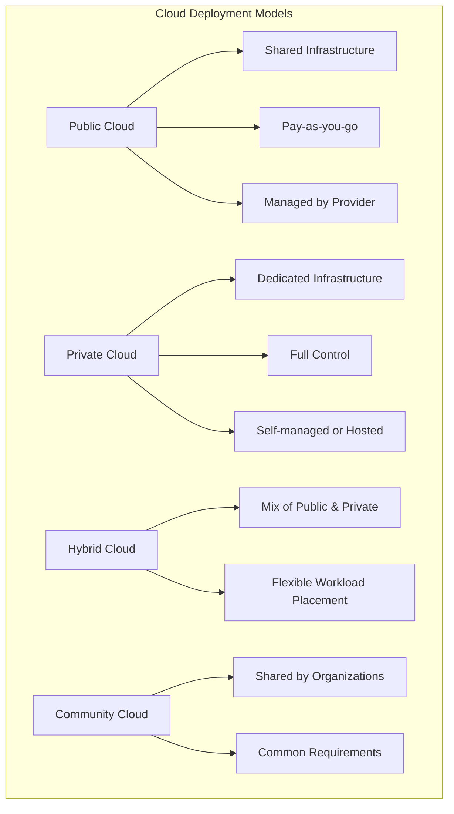
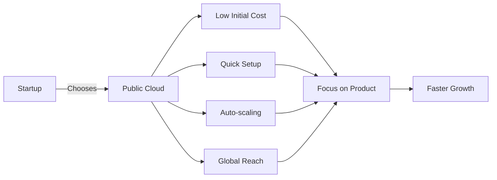

# Cloud Deployment Models: Which is the most practical for a startup?

## Introduction

Hello everyone! Today I want to talk about cloud deployment models and which one makes the most sense for a startup. When you're starting a new business, every decision matters - especially when it comes to your infrastructure.

## The Four Cloud Deployment Models

Let me break down the four main deployment models:

## Why Public Cloud is Most Practical for Startups

For most startups, **Public Cloud** is the clear winner. Let me explain why:

### 1. **Zero Upfront Investment**
Imagine you're starting a food delivery app. With public cloud (like AWS, Azure, or Google Cloud), you don't need to buy any servers. No data center. No cooling systems. Just sign up and start building!

**Example:** Airbnb started on AWS with minimal infrastructure costs. They could focus their limited budget on building their product, not managing servers.

### 2. **Pay Only for What You Use**
Think of it like your electricity bill - you pay for what you consume. If you have 10 users today and 10,000 users next month, your costs scale accordingly.

**Example:** A startup might spend $100/month initially, then scale to $1,000/month as they grow. With private cloud, you'd pay for maximum capacity upfront.

### 3. **Speed to Market**
In a startup, time is everything. Public cloud lets you:
- Launch a server in minutes, not months
- Deploy globally with a few clicks
- Test ideas quickly without long commitments

### 4. **Access to Enterprise-Grade Services**
You get access to services that would cost millions to build yourself:
- Machine Learning APIs
- Database services
- Security tools
- Analytics platforms

## When Other Models Make Sense

### Private Cloud
**Use when:** You're a healthcare startup dealing with sensitive patient data that has strict compliance requirements.

**Example:** A medical records startup might need private cloud for HIPAA compliance.

### Hybrid Cloud
**Use when:** You have some legacy systems but want cloud benefits.

**Example:** A fintech startup with existing on-premise customer data might use hybrid cloud.

### Community Cloud
**Use when:** You're in a specific industry with shared infrastructure needs.

**Example:** Multiple research institutions sharing a cloud for genomic data processing.

## Real-World Success Stories

1. **Netflix** - Started on AWS, scaled to millions of users globally
2. **Spotify** - Used Google Cloud to handle billions of songs streamed
3. **Slack** - Built entirely on AWS, grew to billions in valuation

## The Bottom Line

For 90% of startups, **Public Cloud is the most practical choice** because:

✅ Minimal upfront investment  
✅ Pay-as-you-grow model  
✅ Focus on your product, not infrastructure  
✅ Access to cutting-edge technology  
✅ Global scalability built-in  

As you grow and your needs evolve, you can always move to hybrid or private cloud. But for getting started? Public cloud is your best friend.

---

## Learning Resources

### Articles & Guides
- [AWS for Startups](https://aws.amazon.com/startups/) - Official AWS startup guide
- [Google Cloud for Startups](https://cloud.google.com/startup) - Google's startup program
- [Microsoft for Startups](https://www.microsoft.com/en-us/startups) - Azure credits and resources

### Videos
- [Cloud Deployment Models Explained](https://www.youtube.com/results?search_query=cloud+deployment+models+explained) - YouTube tutorials
- [AWS re:Invent Startup Track](https://www.youtube.com/results?search_query=aws+reinvent+startups) - Real startup stories

### Documentation
- [NIST Cloud Computing Definition](https://nvlpubs.nist.gov/nistpubs/Legacy/SP/nistspecialpublication800-145.pdf) - Official cloud definitions
- [Cloud Deployment Models - IBM](https://www.ibm.com/cloud/learn/cloud-deployment-models) - Comprehensive guide

### Case Studies
- [AWS Startup Success Stories](https://aws.amazon.com/solutions/case-studies/startups/) - Real examples
- [Google Cloud Customer Stories](https://cloud.google.com/customers#/industries=Startups) - Startup case studies

### Books
- "Cloud Native DevOps with Kubernetes" by John Arundel
- "The Phoenix Project" by Gene Kim (DevOps culture)
