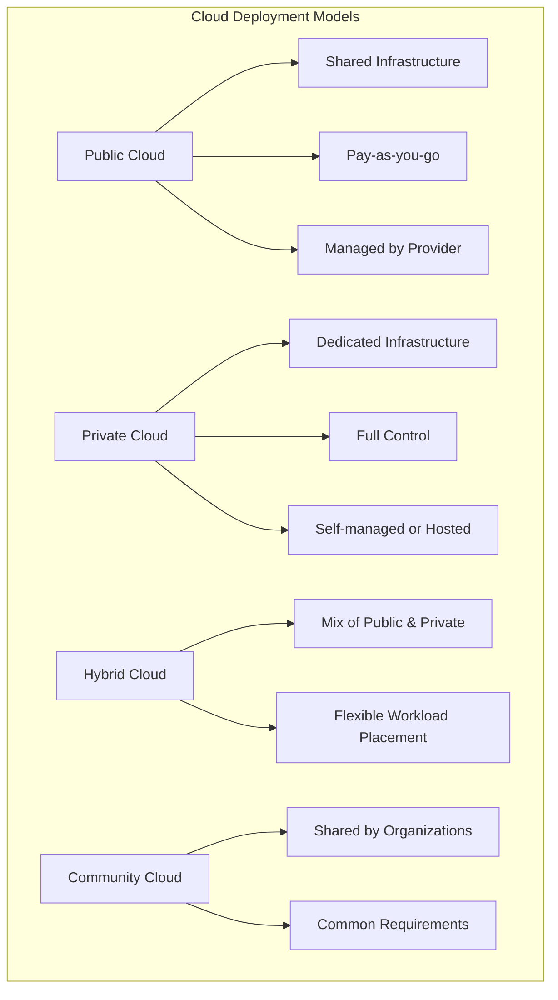
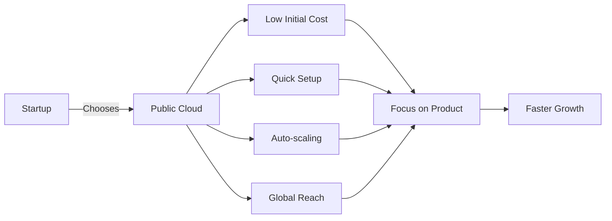

# Cloud Deployment Models: Which is the most practical for a startup?

## Introduction

Good morning everyone! Today I'm going to talk about something that every startup founder faces - choosing the right cloud deployment model. You know, when you're starting a business, you're already juggling a hundred things - building your product, finding customers, managing your team. The last thing you want is to get stuck in infrastructure decisions that drain your time and money.

So let's talk about which cloud model actually makes sense for startups.

## Understanding Cloud Deployment Models

Before we dive in, let me quickly explain what we mean by deployment models. Think of it like choosing how you want to run your business operations. Do you want to rent office space in a shared building? Build your own private building? Or maybe do both?

There are four main types:

**1. Public Cloud** - This is like renting a desk in a co-working space. You share the building with others, pay only for what you use, and someone else handles all the maintenance. Examples are AWS, Google Cloud, and Microsoft Azure.

**2. Private Cloud** - This is like having your own private office building. You have complete control, but you also have to manage everything yourself - or pay someone to do it.

**3. Hybrid Cloud** - This is a mix of both. Maybe you keep your sensitive data in your private office but use the co-working space for your growing team.

**4. Community Cloud** - Think of this as multiple companies in the same industry sharing a specialized facility. Like several hospitals sharing a medical cloud infrastructure.

*This diagram shows how the four deployment models differ in terms of infrastructure ownership and management. Public cloud is fully managed by providers, private gives you full control, hybrid combines both approaches, and community cloud is shared among similar organizations.*

## Why Public Cloud is the Smart Choice for Startups

Now, let me tell you why public cloud is the winner for most startups. I'll give you three powerful reasons.

### First: You Can Start with Almost Zero Money

Here's the reality - when you're starting out, you probably don't have much capital. Maybe you've raised some seed funding, or maybe you're bootstrapping. Either way, buying servers is not where you want to spend your money.

With public cloud, there's no upfront investment. You don't need to buy servers, you don't need to rent a data center, you don't need cooling systems or backup generators. You just create an account and start building. It's like the difference between buying a car versus using Uber - one requires thousands upfront, the other lets you pay per ride.

Let me give you a real example. When Airbnb started, they used AWS. They didn't spend money on infrastructure - they spent it on building their platform and acquiring users. That's the smart move.

### Second: Your Costs Grow With Your Success

This is beautiful - with public cloud, you pay only for what you actually use. Think of it like your mobile phone bill. If you use more data, you pay more. If you use less, you pay less.

So imagine this: You launch your app. First week, you have maybe 50 users. Your cloud bill might be just fifty or hundred dollars. Then your app goes viral - suddenly you have 10,000 users. Your infrastructure automatically scales up, and yes, your bill increases too. But here's the key - you're also making more revenue because you have more users!

Compare this to private cloud where you'd have to buy enough capacity for 10,000 users from day one, even when you only have 50. That's like buying a bus when all you need is a bicycle.

### Third: Speed is Everything in Startups

In the startup world, whoever gets to market first often wins. Public cloud gives you incredible speed. Want to launch a new feature? You can deploy it globally in minutes. Want to test if your app works in Europe? You can spin up servers there with literally a few clicks.

Without cloud, this would take weeks or months - buying hardware, shipping it, setting it up, configuring everything. By the time you're ready, your competitor has already captured the market.

Plus, you get access to advanced services that would cost millions to build yourself - machine learning capabilities, advanced databases, security tools. It's like having a whole team of experts working for you without hiring them.

*This diagram illustrates the journey of a startup choosing public cloud. The key benefits - low cost, quick setup, auto-scaling, and global reach - all lead to one outcome: the startup can focus on building their product rather than managing infrastructure, which accelerates growth.*

## What About the Other Models?

Now, you might be wondering - when would you NOT choose public cloud? Let me quickly address this.

**Private Cloud** makes sense if you're dealing with extremely sensitive data. For example, if you're building a healthcare app that stores patient medical records, you might have legal requirements that force you to use private infrastructure. But honestly, even then, most startups find compliant public cloud solutions.

**Hybrid Cloud** is usually for companies that already have existing systems. Maybe you're not exactly a startup - you have some legacy software running on old servers, but you want to build new features in the cloud. That's when hybrid makes sense.

**Community Cloud** is very niche - think of multiple hospitals sharing specialized healthcare infrastructure, or universities sharing research computing resources.

But here's what I want you to remember: these other models are usually for special cases. They're not where most startups should start.

## Real Success Stories

Let me share some inspiring examples. Netflix - yes, the Netflix we all use to binge-watch shows - they run entirely on AWS. They started there and scaled to serve hundreds of millions of users worldwide.

Spotify streams billions of songs using Google Cloud. Slack, the communication tool millions of companies use, was built on AWS from day one and grew to be worth billions of dollars.

These companies didn't waste time building their own data centers. They focused on what made them unique - great user experiences - and let the cloud handle the infrastructure.

## My Final Advice

Here's the bottom line: For ninety percent of startups, public cloud is the obvious choice. Why?

You need minimal money to start. Your costs grow only when your business grows. You can focus all your energy on building a great product instead of managing servers. You get access to world-class technology that would otherwise cost millions. And you can scale globally from day one.

Can you move to other models later if needed? Absolutely! But when you're starting out, when every day counts and every dollar matters, public cloud is your best friend. It removes all the infrastructure headaches and lets you focus on what really matters - building something people love.

That's why I strongly believe public cloud is the most practical choice for startups. Thank you!

---

## Learning Resources

### Articles & Guides
- [AWS for Startups](https://aws.amazon.com/startups/) - Official AWS startup guide
- [Google Cloud for Startups](https://cloud.google.com/startup) - Google's startup program
- [Microsoft for Startups](https://www.microsoft.com/en-us/startups) - Azure credits and resources

### Videos
- [Cloud Deployment Models Explained](https://www.youtube.com/results?search_query=cloud+deployment+models+explained) - YouTube tutorials
- [AWS re:Invent Startup Track](https://www.youtube.com/results?search_query=aws+reinvent+startups) - Real startup stories

### Documentation
- [NIST Cloud Computing Definition](https://nvlpubs.nist.gov/nistpubs/Legacy/SP/nistspecialpublication800-145.pdf) - Official cloud definitions
- [Cloud Deployment Models - IBM](https://www.ibm.com/cloud/learn/cloud-deployment-models) - Comprehensive guide

### Case Studies
- [AWS Startup Success Stories](https://aws.amazon.com/solutions/case-studies/startups/) - Real examples
- [Google Cloud Customer Stories](https://cloud.google.com/customers#/industries=Startups) - Startup case studies

### Books
- "Cloud Native DevOps with Kubernetes" by John Arundel
- "The Phoenix Project" by Gene Kim (DevOps culture)
