# Cloud Security is a Shared Responsibility: Who is truly accountable for a data breach?

## Introduction

When a data breach happens in the cloud, fingers start pointing. "It's the cloud provider's fault!" or "No, the customer didn't secure their data!" The truth? It's complicated. Let's break down the **Shared Responsibility Model**.

## The Shared Responsibility Model

Think of it like renting an apartment:

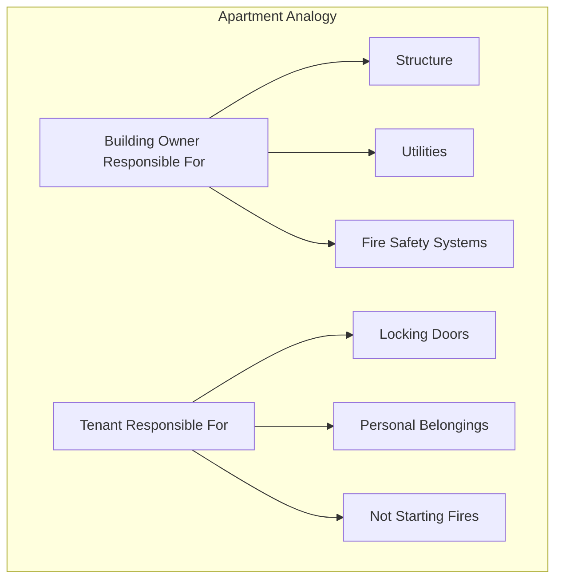

Similarly, in cloud security:

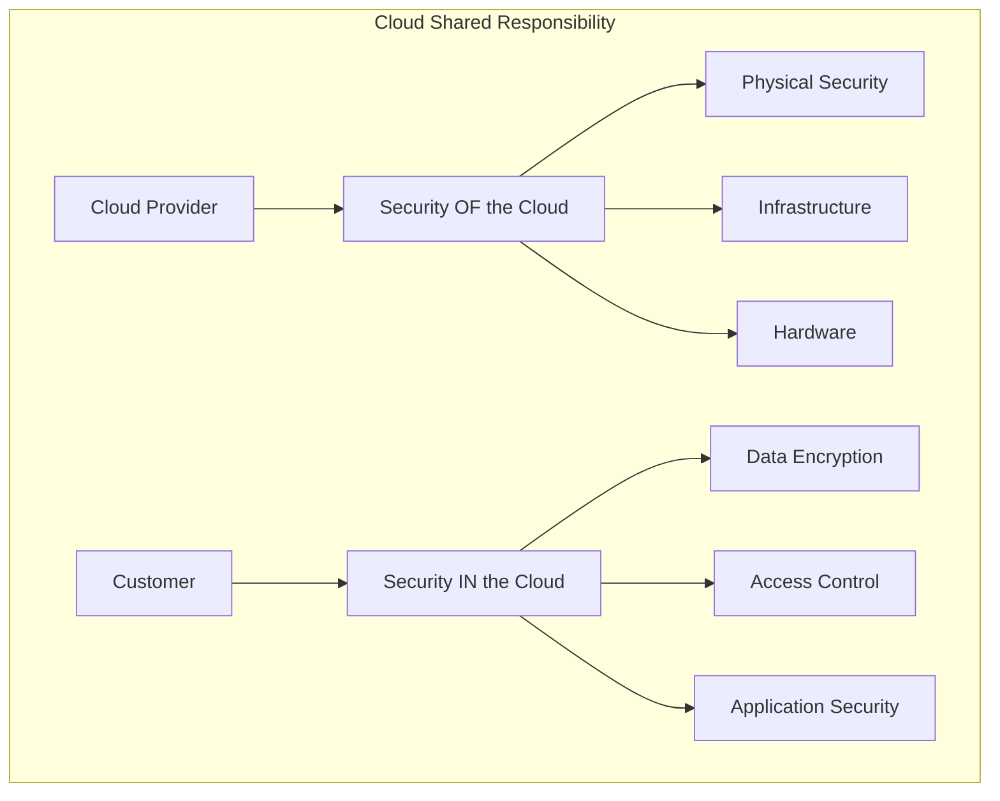

## Security OF the Cloud (Provider's Responsibility)

### What AWS/Azure/GCP Manages:

**1. Physical Security**
- Data center access control
- Security cameras, guards
- Biometric authentication
- Fire suppression systems

**2. Infrastructure Security**
- Server hardware
- Network infrastructure
- Hypervisor layer
- Power and cooling

**3. Service Availability**
- Uptime guarantees
- Redundancy
- Disaster recovery infrastructure
- DDoS protection at infrastructure level

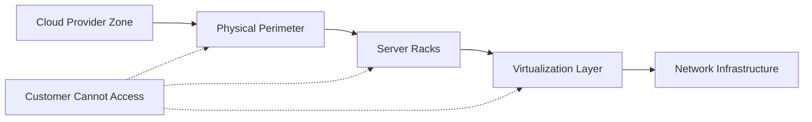

**Example:** AWS manages the security of EC2 hypervisors. If there's a vulnerability in the virtualization layer, AWS patches it. You don't need to do anything.

## Security IN the Cloud (Customer's Responsibility)

### What YOU Must Manage:

**1. Data Protection**
- Encrypting data at rest
- Encrypting data in transit
- Data classification
- Backup and recovery

**2. Access Control**
- IAM policies
- User permissions
- Password policies
- Multi-factor authentication (MFA)

**3. Application Security**
- Code vulnerabilities
- Security patches for OS
- Application updates
- Secure configurations

**4. Network Security**
- Firewall rules
- Security groups
- Network ACLs
- VPN configurations

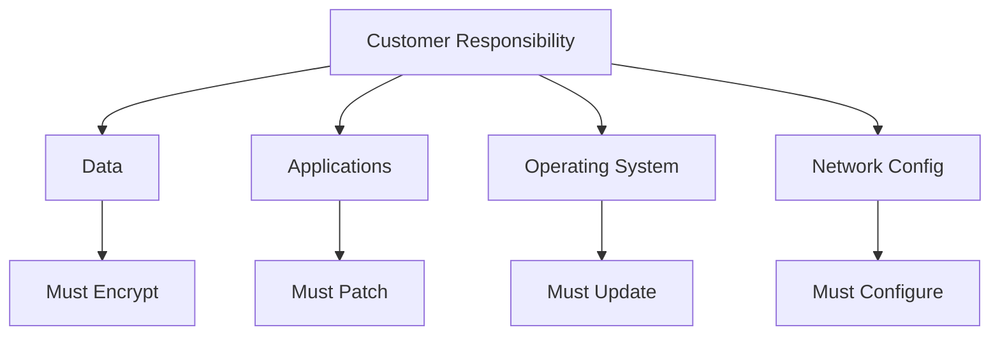

## The Spectrum: IaaS vs PaaS vs SaaS

The level of responsibility changes based on service type:

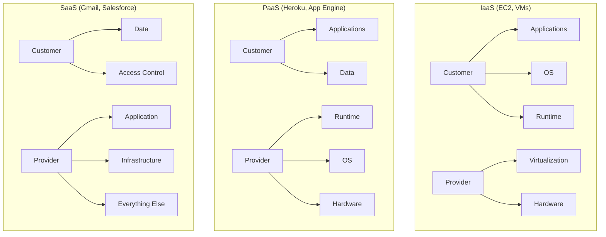

### Responsibility by Service Type:

| Layer | IaaS | PaaS | SaaS |
|-------|------|------|------|
| **Data** | Customer | Customer | Customer |
| **Applications** | Customer | Customer | Provider |
| **Runtime** | Customer | Provider | Provider |
| **OS** | Customer | Provider | Provider |
| **Virtualization** | Provider | Provider | Provider |
| **Hardware** | Provider | Provider | Provider |

## Real-World Breach Examples

### Case 1: Capital One Breach (2019)

**What Happened:** 100 million customer records stolen

**Who Was at Fault?**

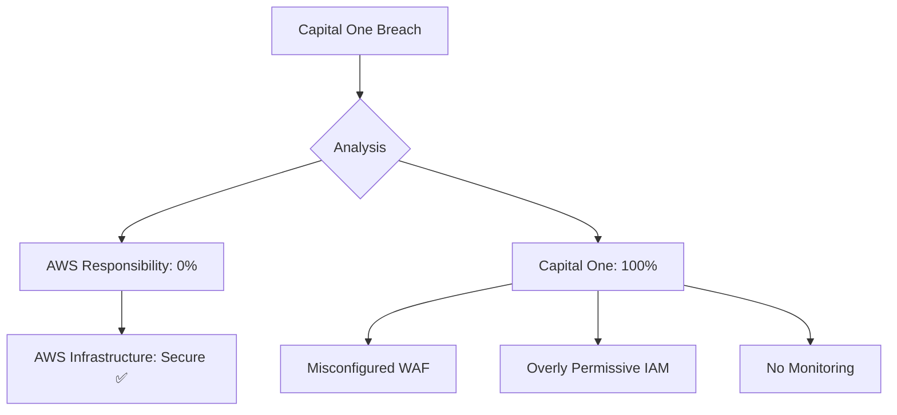

**Verdict:** Capital One's fault!
- ❌ Misconfigured firewall (WAF)
- ❌ EC2 instance had excessive IAM permissions
- ❌ No proper monitoring/alerting
- ✅ AWS infrastructure was secure

**Accountability:** Capital One paid $80M fine + $190M in settlements

### Case 2: S3 Bucket Leaks

**Common Scenario:** Company stores data in S3 with public access

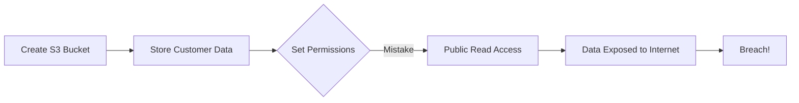

**Who's Fault?**
- ❌ Customer set bucket to public
- ❌ Customer didn't use encryption
- ❌ Customer didn't monitor access
- ✅ AWS provided security features
- ✅ AWS warned about public buckets

**Real Examples:**
- **Accenture** - exposed 137GB of data (public S3)
- **Verizon** - 14M customer records (public S3)
- **Uber** - 57M records (stolen AWS credentials)

**Verdict:** 100% customer responsibility!

### Case 3: Cloud Provider Outage

**Scenario:** AWS us-east-1 goes down

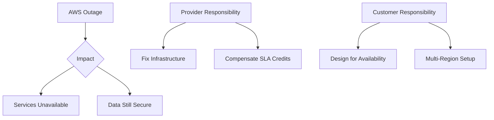

**Accountability:**
- ✅ AWS responsible for fixing infrastructure
- ✅ AWS provides SLA credits for downtime
- ❌ Customer responsible for high-availability design
- ❌ Should have multi-region architecture

## Who Is Accountable for Different Breach Types?

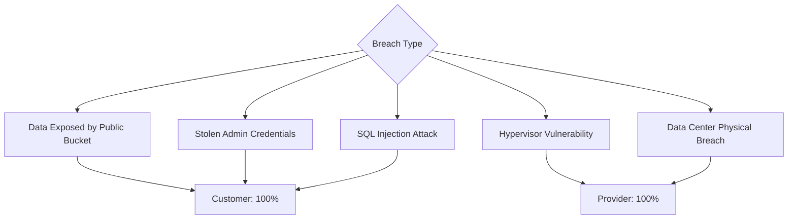

### Customer's Fault (90% of Breaches):

✅ Misconfigured security groups  
✅ Public S3 buckets  
✅ Weak passwords, no MFA  
✅ Stolen/exposed credentials  
✅ Unpatched software  
✅ SQL injection vulnerabilities  
✅ No encryption enabled  
✅ Poor access controls  

### Provider's Fault (10% of Breaches):

✅ Physical data center breach  
✅ Hypervisor vulnerabilities  
✅ Infrastructure-level attacks  
✅ Insider threat from cloud employees  

### The Reality:

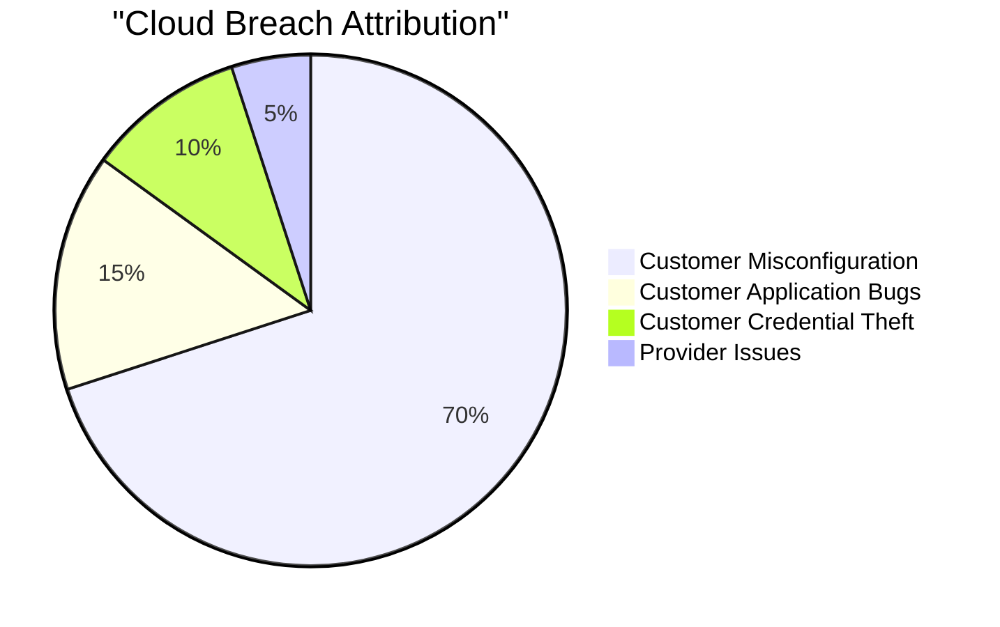

**95% of cloud breaches are customer's fault!**

## The Legal Reality

### Who Gets Sued?

When a breach happens:

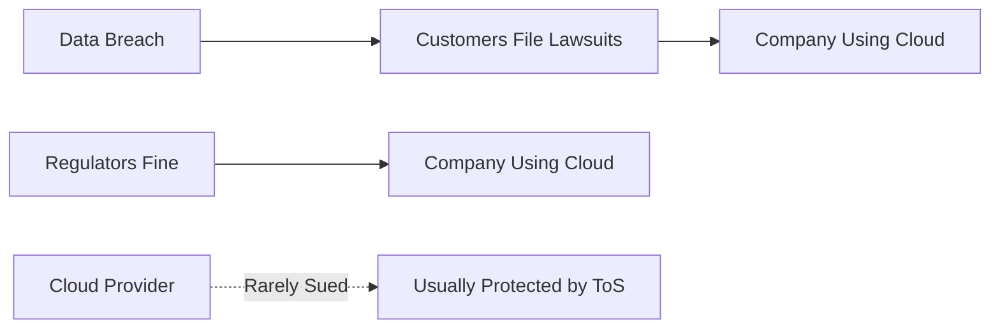

**Legal Accountability:**
- 🎯 **Company is accountable** to customers/regulators
- 🎯 Provider may help investigate, but not liable
- 🎯 Terms of Service protect providers

**Example:** In Capital One breach:
- Capital One paid fines
- AWS was not fined
- Customers sued Capital One, not AWS

## How to Protect Yourself

### Customer Checklist:

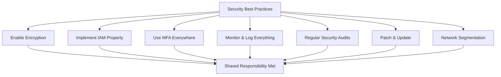

**Essential Steps:**

1. **Encryption**
   - Enable S3 bucket encryption
   - Use RDS encryption
   - Encrypt EBS volumes
   - Use HTTPS/TLS

2. **Access Control**
   - Implement least privilege
   - Enable MFA for all users
   - Regular IAM audits
   - No hardcoded credentials

3. **Monitoring**
   - Enable CloudTrail
   - Use GuardDuty
   - Set up alerts
   - Regular log reviews

4. **Compliance**
   - Use AWS Config
   - Run security assessments
   - Follow compliance frameworks
   - Regular penetration testing

## Provider's Responsibilities

What you CAN rely on cloud providers for:

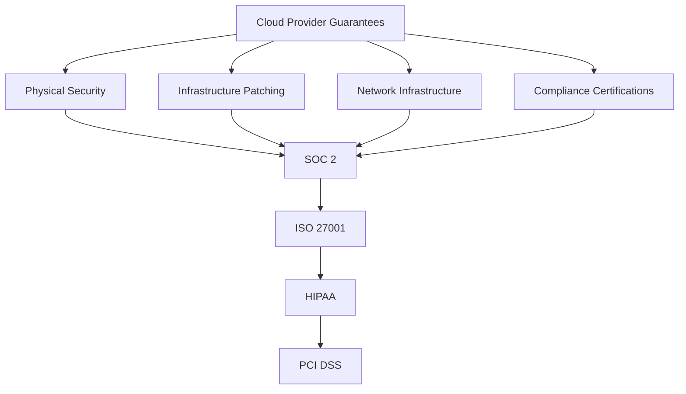

**Certifications prove:**
- ✅ Proper physical security
- ✅ Infrastructure is maintained
- ✅ Regular security audits
- ✅ Incident response procedures

## The Verdict: Who Is Truly Accountable?

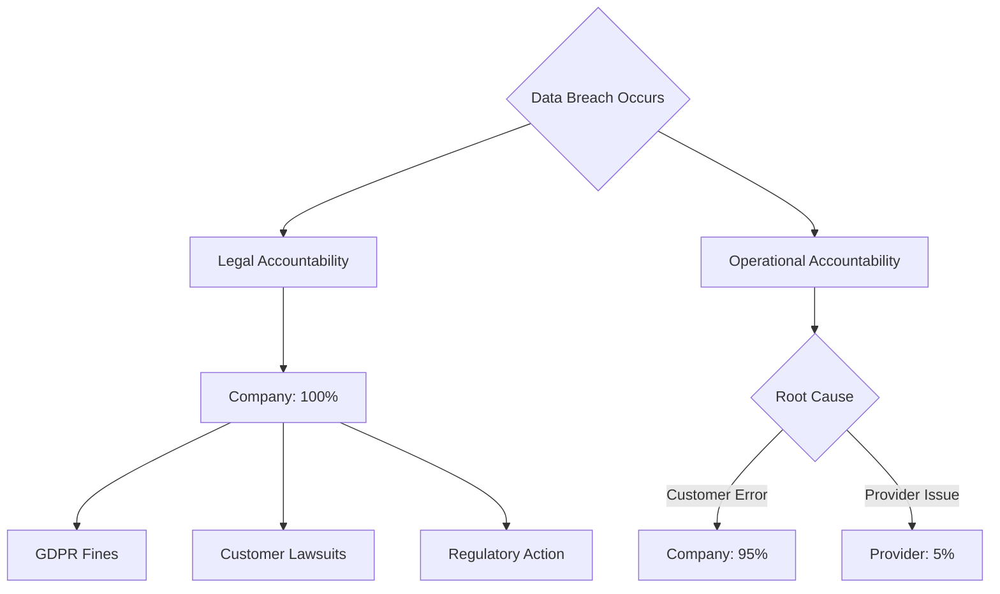

**The Truth:**

🎯 **Legally:** The company using the cloud is ALWAYS accountable

🎯 **Operationally:** 95% of breaches are due to customer misconfigurations

🎯 **Financially:** The company pays fines, lawsuits, remediation

**Bottom Line:**
Even if the cloud provider has a vulnerability, YOU are accountable to your customers, regulators, and stakeholders. The buck stops with you!

## Best Practice: Assume You're Responsible for Everything

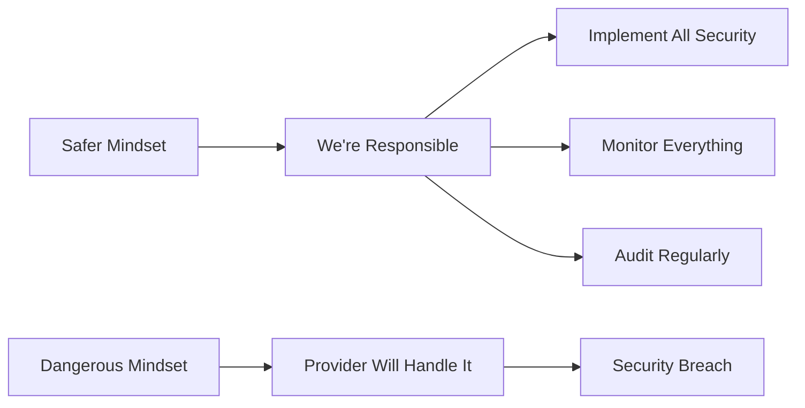

**Treat cloud security as if:**
- You're responsible for EVERYTHING
- Provider security is a bonus, not a guarantee
- Your reputation is on the line (because it is!)

---

## Learning Resources

### Shared Responsibility Model
- [AWS Shared Responsibility Model](https://aws.amazon.com/compliance/shared-responsibility-model/) - Official AWS guide
- [Azure Shared Responsibility](https://docs.microsoft.com/en-us/azure/security/fundamentals/shared-responsibility) - Microsoft documentation
- [Google Cloud Shared Responsibility](https://cloud.google.com/architecture/framework/security/shared-responsibility-shared-fate) - GCP model

### Security Best Practices
- [AWS Security Best Practices](https://aws.amazon.com/architecture/security-identity-compliance/) - Official guide
- [CIS AWS Foundations Benchmark](https://www.cisecurity.org/benchmark/amazon_web_services) - Security baseline
- [Cloud Security Alliance](https://cloudsecurityalliance.org/) - Industry standards

### Case Studies & Breach Reports
- [Capital One Breach Analysis](https://krebsonsecurity.com/2019/07/capital-one-data-theft-impacts-106m-people/) - Detailed breakdown
- [Verizon Data Breach Investigations Report](https://www.verizon.com/business/resources/reports/dbir/) - Annual report
- [Cloud Security Breaches Database](https://www.cloudbreaches.com/) - Breach tracking

### Compliance & Regulations
- [GDPR Cloud Compliance](https://gdpr.eu/what-is-gdpr/) - Data protection regulation
- [HIPAA Cloud Requirements](https://aws.amazon.com/compliance/hipaa-compliance/) - Healthcare compliance
- [PCI DSS Cloud](https://www.pcisecuritystandards.org/pci_security/cloud) - Payment card security

### Security Tools
- [AWS Security Hub](https://aws.amazon.com/security-hub/) - Centralized security
- [AWS GuardDuty](https://aws.amazon.com/guardduty/) - Threat detection
- [AWS Config](https://aws.amazon.com/config/) - Configuration monitoring
- [Prowler](https://github.com/prowler-cloud/prowler) - Open-source security tool

### Training & Certifications
- [AWS Security Specialty](https://aws.amazon.com/certification/certified-security-specialty/) - Security certification
- [Cloud Security Knowledge (CCSK)](https://cloudsecurityalliance.org/education/ccsk/) - CSA certification
- [SANS Cloud Security](https://www.sans.org/cloud-security/) - Security training

### Videos & Webinars
- [AWS re:Inforce](https://www.youtube.com/results?search_query=aws+reinforce) - Security conference
- [Shared Responsibility Explained](https://www.youtube.com/results?search_query=cloud+shared+responsibility+model) - Video tutorials
- [Cloud Breach Case Studies](https://www.youtube.com/results?search_query=cloud+security+breach+analysis) - Real examples

### Books
- "Cloud Security and Privacy" by Tim Mather
- "AWS Security" by Dylan Shields
- "Practical Cloud Security" by Chris Dotson

### Security Frameworks
- [NIST Cybersecurity Framework](https://www.nist.gov/cyberframework) - Security framework
- [ISO 27001](https://www.iso.org/isoiec-27001-information-security.html) - Information security standard
- [SOC 2](https://www.aicpa.org/interestareas/frc/assuranceadvisoryservices/sorhome) - Audit standard

### News & Updates
- [AWS Security Blog](https://aws.amazon.com/blogs/security/) - Latest updates
- [The Hacker News - Cloud](https://thehackernews.com/search/label/Cloud%20Security) - Security news
- [Krebs on Security](https://krebsonsecurity.com/) - Breach analysis

### Communities
- [r/cloudsecurity](https://www.reddit.com/r/cloudsecurity/) - Reddit community
- [Cloud Security Alliance Community](https://cloudsecurityalliance.org/community/) - Professional network
- [AWS Security Forum](https://repost.aws/topics/security) - Official forum
