# GDPR and HIPAA: The impact of global compliance on cloud architecture

## Introduction

Compliance regulations like GDPR and HIPAA aren't just legal checkboxes - they fundamentally change how you architect cloud systems! Let's explore how these regulations shape cloud infrastructure.

## Understanding the Regulations

### GDPR (General Data Protection Regulation)

**What:** EU regulation protecting personal data of EU citizens

**Applies to:** ANY company processing EU citizen data (even if you're in USA!)

**Key Principle:** "Data protection by design and by default"

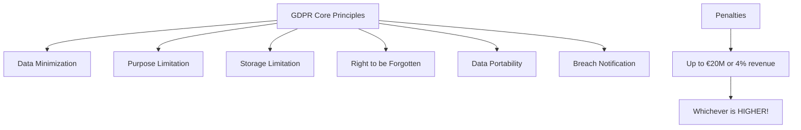

### HIPAA (Health Insurance Portability and Accountability Act)

**What:** US regulation protecting health information

**Applies to:** Healthcare providers, insurers, and their business associates

**Key Principle:** "Protect patient health information (PHI)"

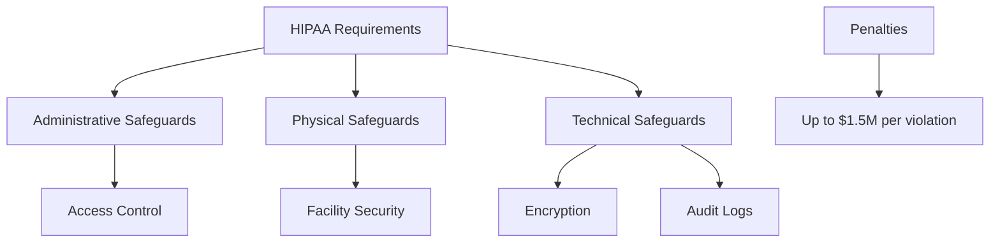

## Impact on Cloud Architecture

### 1. Data Residency Requirements

**GDPR Impact:** EU data MUST stay in EU (with exceptions)

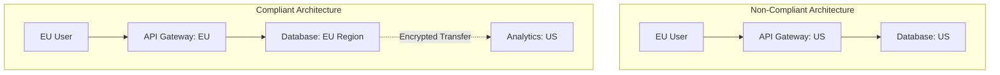

**Architectural Changes Required:**

**Before GDPR:**
```
Single global database in us-east-1
All users' data mixed together
Process anywhere
```

**After GDPR:**
```
EU database in eu-west-1
US database in us-east-1
Geo-routing based on user location
Data never crosses regions without consent
```

**Real Example: Airbnb Architecture**

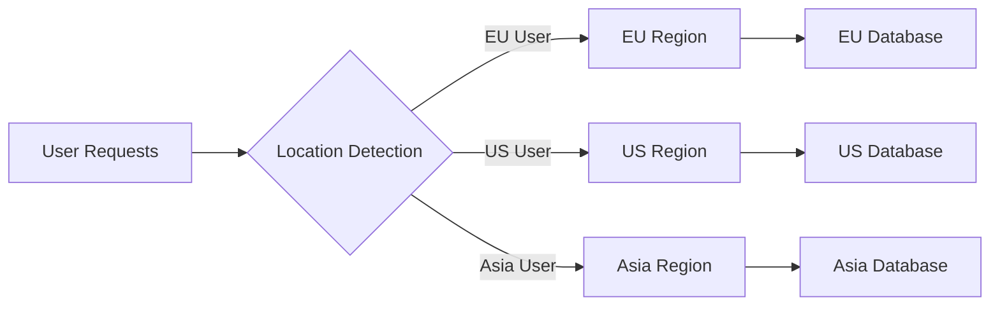

### 2. Data Encryption Requirements

**Both GDPR & HIPAA:** Encryption at rest and in transit

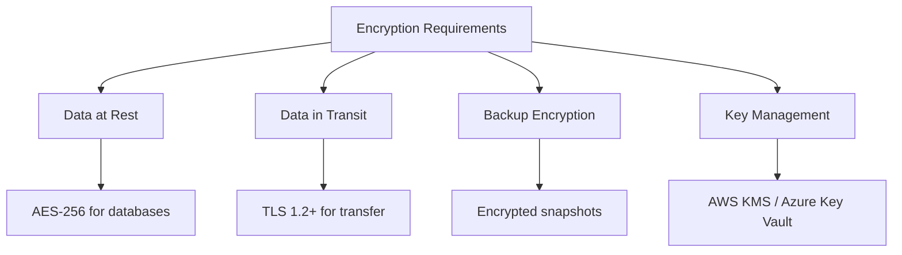

**Architecture Impact:**

```yaml
# Non-Compliant RDS Setup
Type: AWS::RDS::DBInstance
Properties:
  Engine: postgres
  StorageEncrypted: false  # ❌ Not compliant!

# Compliant RDS Setup
Type: AWS::RDS::DBInstance
Properties:
  Engine: postgres
  StorageEncrypted: true   # ✅ GDPR/HIPAA compliant
  KmsKeyId: !Ref MyKMSKey
  # Automated backups encrypted automatically
```

### 3. Access Control & Audit Logging

**HIPAA Requirement:** Track WHO accessed WHAT patient data, WHEN

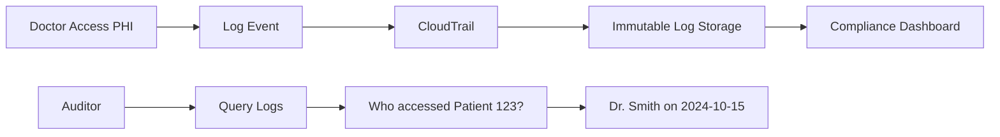

**Architecture Components:**

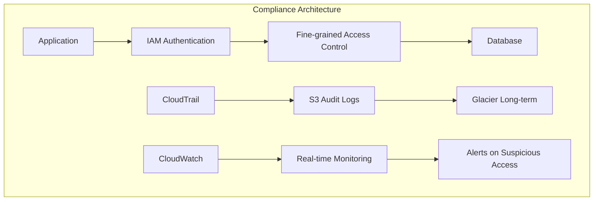

**Retention Requirements:**
- HIPAA: 6 years
- GDPR: Varies, but often 3-5 years
- Solution: Use S3 Lifecycle policies

```json
{
  "Rules": [{
    "Id": "ComplianceLogs",
    "Status": "Enabled",
    "Transitions": [
      {
        "Days": 90,
        "StorageClass": "GLACIER"
      }
    ],
    "Expiration": {
      "Days": 2190  // 6 years for HIPAA
    }
  }]
}
```

### 4. Right to be Forgotten (GDPR)

**Impact:** Users can request complete data deletion

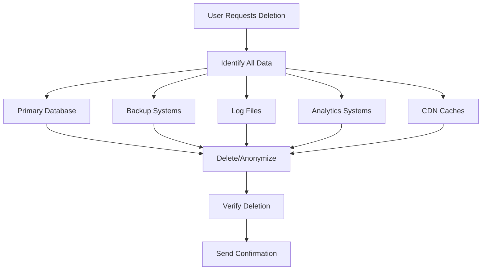

**Architectural Challenge:**

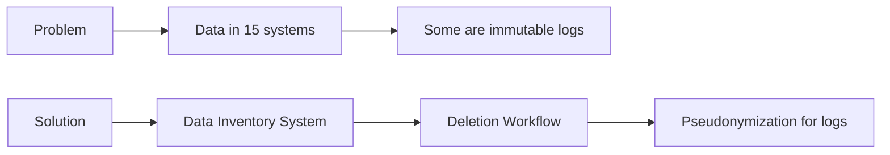

**Implementation Example:**

```python
# User deletion workflow
def delete_user_gdpr(user_id):
    # 1. Mark for deletion
    user.status = 'pending_deletion'
    
    # 2. Remove from active systems
    database.delete_user(user_id)
    cache.delete_user(user_id)
    search_index.remove(user_id)
    
    # 3. Anonymize in logs (can't delete immutable logs)
    logs.pseudonymize(user_id, 'DELETED_USER_12345')
    
    # 4. Delete from backups (next backup cycle)
    backup_system.schedule_deletion(user_id)
    
    # 5. Verify and confirm
    send_deletion_confirmation(user.email)
```

### 5. Breach Notification Requirements

**GDPR:** Report breach within 72 hours  
**HIPAA:** Report breach within 60 days

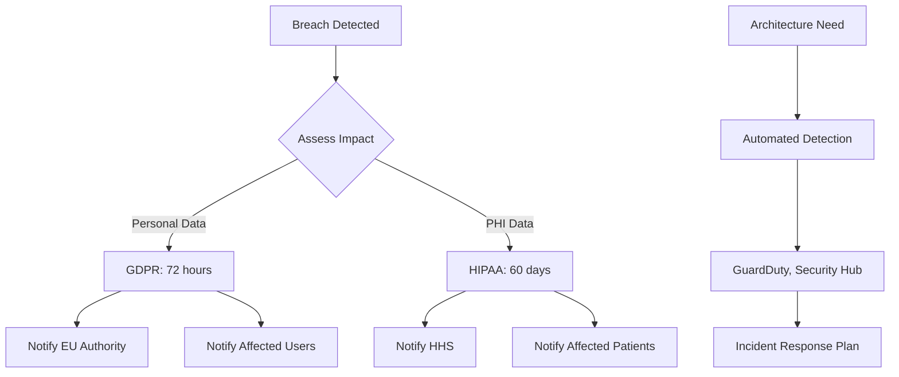

**Architecture for Breach Detection:**

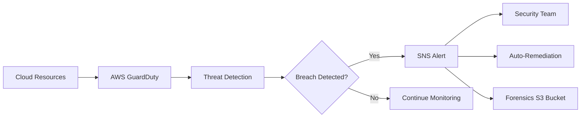

### 6. Data Processing Agreements (DPAs)

**Requirement:** Legal agreement between you and cloud provider

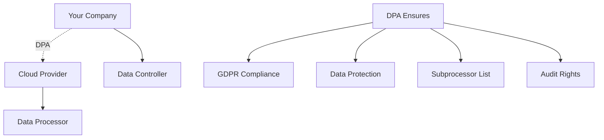

**What Cloud Providers Offer:**
- ✅ AWS: GDPR-compliant DPA
- ✅ Azure: GDPR Data Protection Addendum
- ✅ Google Cloud: Cloud Data Processing Addendum

## Reference Architecture: HIPAA-Compliant Healthcare App

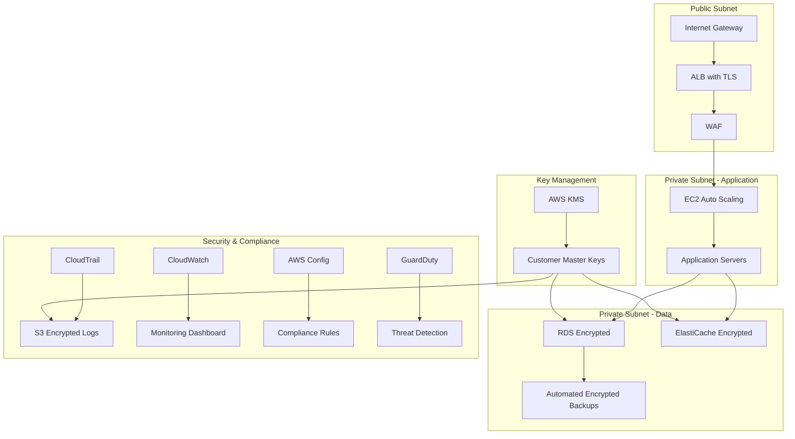

**Key Features:**
1. ✅ All data encrypted (RDS, EBS, S3)
2. ✅ Network isolation (VPC, private subnets)
3. ✅ Access logging (CloudTrail)
4. ✅ Monitoring (CloudWatch)
5. ✅ Compliance validation (AWS Config)
6. ✅ Threat detection (GuardDuty)

## Reference Architecture: GDPR-Compliant Global App

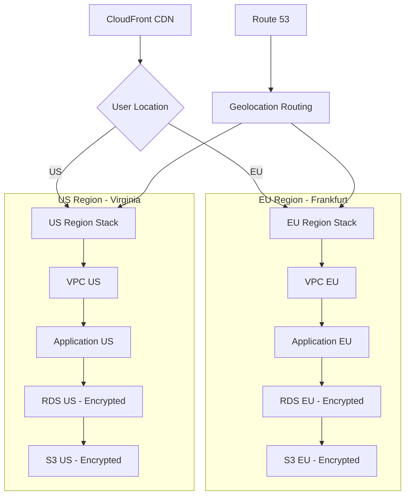

**GDPR Features:**
1. ✅ Data residency (EU data stays in EU)
2. ✅ Geo-routing (Route 53)
3. ✅ Regional isolation
4. ✅ Encryption everywhere
5. ✅ Right to deletion workflow
6. ✅ Consent management system

## Cost Impact of Compliance

### Additional Costs:

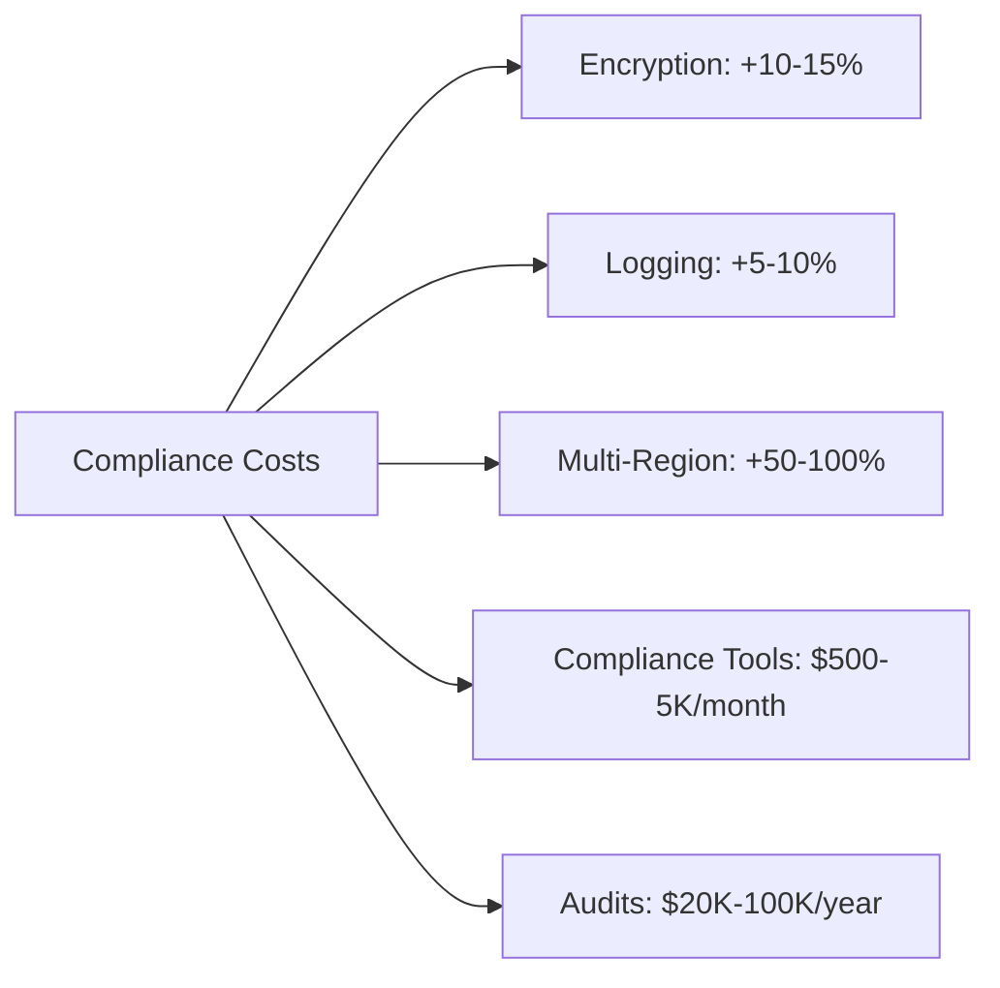

**Example Monthly Costs:**

| Component | Non-Compliant | HIPAA/GDPR | Increase |
|-----------|---------------|------------|----------|
| Database | $500 | $600 | 20% (encryption) |
| Storage | $200 | $250 | 25% (encrypted backups) |
| Logging | $50 | $200 | 300% (audit logs) |
| Regions | $1000 (1 region) | $2000 (2 regions) | 100% |
| Compliance Tools | $0 | $1000 | - |
| **Total** | **$1750** | **$4050** | **130%** |

**BUT:** Non-compliance costs MORE!
- GDPR fine: €20M or 4% revenue
- HIPAA fine: $1.5M per violation
- Reputation damage: Priceless (negative!)

## Compliance Tools & Services

### AWS:

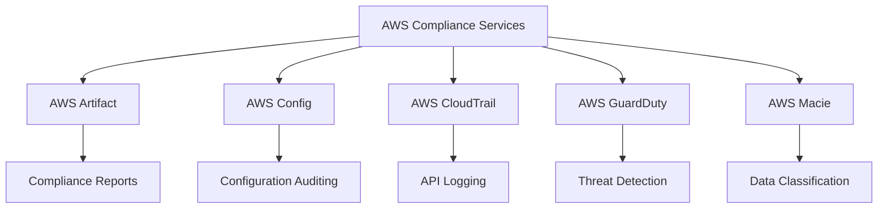

**AWS Compliance Programs:**
- ✅ HIPAA eligible services
- ✅ GDPR compliant infrastructure
- ✅ BAA (Business Associate Agreement) for HIPAA
- ✅ DPA (Data Processing Addendum) for GDPR

### Azure:

- Azure Security Center
- Azure Compliance Manager
- Azure Information Protection
- Azure Policy for compliance

### Google Cloud:

- Security Command Center
- Cloud Data Loss Prevention (DLP)
- Access Transparency
- VPC Service Controls

## Best Practices

### 1. Compliance by Design

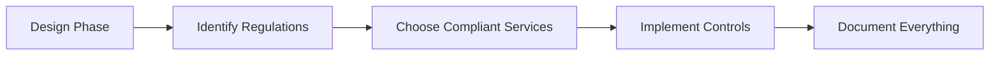

Don't retrofit compliance - build it in from day one!

### 2. Shared Responsibility Model

```
Cloud Provider: Infrastructure compliance (SOC 2, ISO 27001)
You: Application compliance (GDPR, HIPAA)
```

### 3. Regular Audits

```
Monthly: Automated compliance checks (AWS Config)
Quarterly: Internal security reviews
Annually: External audit (HIPAA requires this)
```

### 4. Documentation

```
Required Documents:
✅ Data flow diagrams
✅ Risk assessments
✅ Incident response plan
✅ Backup/recovery procedures
✅ Access control policies
✅ Encryption procedures
```

## Real-World Impact Examples

### Example 1: Healthcare Startup

**Before HIPAA:**
- Simple app on Heroku
- Cost: $500/month
- 2 engineers

**After HIPAA:**
- Moved to AWS
- Implemented encryption, logging, backups
- Cost: $3000/month
- Hired compliance officer
- External audit: $25K

**Total impact:** 6x cost increase, but legal to operate!

### Example 2: E-commerce Company

**GDPR Impact:**
- Had to split database by region (EU/US)
- Implemented consent management
- Created data deletion workflow
- Migration cost: $100K
- Ongoing cost: +30%

**Result:** Avoided potential €20M fine!

## Compliance Checklist

### GDPR:
- [ ] Data Processing Agreement with cloud provider
- [ ] Data residency in appropriate regions
- [ ] Encryption at rest and in transit
- [ ] User consent management
- [ ] Right to access implementation
- [ ] Right to deletion implementation
- [ ] Breach notification process
- [ ] Privacy policy updated
- [ ] Cookie consent
- [ ] Data Protection Officer appointed

### HIPAA:
- [ ] Business Associate Agreement (BAA) with AWS/Azure/GCP
- [ ] Use only HIPAA-eligible services
- [ ] Encryption enabled (all data)
- [ ] Access controls (IAM, MFA)
- [ ] Audit logging (6 years retention)
- [ ] Monitoring and alerting
- [ ] Incident response plan
- [ ] Regular risk assessments
- [ ] Staff training
- [ ] External audit annually

---

## Learning Resources

### GDPR Resources
- [Official GDPR Text](https://gdpr.eu/tag/gdpr/) - Complete regulation
- [GDPR.eu](https://gdpr.eu/) - Plain language guide
- [AWS GDPR Center](https://aws.amazon.com/compliance/gdpr-center/) - AWS compliance
- [Azure GDPR](https://docs.microsoft.com/en-us/compliance/regulatory/gdpr) - Microsoft guide
- [Google Cloud GDPR](https://cloud.google.com/privacy/gdpr) - GCP resources

### HIPAA Resources
- [HHS HIPAA](https://www.hhs.gov/hipaa/index.html) - Official HHS site
- [AWS HIPAA](https://aws.amazon.com/compliance/hipaa-compliance/) - AWS compliance
- [Azure HIPAA](https://docs.microsoft.com/en-us/azure/compliance/offerings/offering-hipaa-us) - Microsoft guide
- [HIPAA Journal](https://www.hipaajournal.com/) - News and guides

### Architecture Guides
- [AWS HIPAA Reference Architecture](https://aws.amazon.com/quickstart/architecture/compliance-hipaa/) - Ready-to-deploy
- [GDPR on AWS](https://d1.awsstatic.com/whitepapers/compliance/GDPR_Compliance_on_AWS.pdf) - Whitepaper
- [Azure Compliance Blueprints](https://docs.microsoft.com/en-us/azure/governance/blueprints/) - Reference architectures

### Compliance Tools
- [AWS Config](https://aws.amazon.com/config/) - Compliance automation
- [AWS Artifact](https://aws.amazon.com/artifact/) - Compliance reports
- [Vanta](https://www.vanta.com/) - Continuous compliance
- [Drata](https://drata.com/) - Compliance automation
- [Tugboat Logic](https://www.tugboatlogic.com/) - Compliance management

### Training & Certification
- [IAPP GDPR Training](https://iapp.org/certify/cigp/) - GDPR certification
- [AHIMA HIPAA Training](https://www.ahima.org/) - HIPAA education
- [AWS Security Specialty](https://aws.amazon.com/certification/certified-security-specialty/) - Includes compliance

### Legal & Advisory
- [DLA Piper GDPR Fines](https://www.dlapiperdatabreaches.com/) - Track fines
- [OCR HIPAA Breach Portal](https://ocrportal.hhs.gov/ocr/breach/breach_report.jsf) - Breach database
- [Privacy Shield Framework](https://www.privacyshield.gov/) - EU-US data transfer

### Case Studies
- [British Airways GDPR Fine](https://www.bbc.com/news/technology-54013527) - £20M fine
- [HIPAA Breach Examples](https://www.hipaajournal.com/largest-healthcare-data-breaches-of-2023/) - Real breaches
- [AWS Compliance Stories](https://aws.amazon.com/compliance/customer-success/) - Success stories

### Books
- "The GDPR Challenge" by Paul Voigt
- "HIPAA Compliance Handbook" by Elsevier
- "Data Protection in the Cloud" by Dimitra Kamarinou

### Communities
- [r/gdpr](https://www.reddit.com/r/gdpr/) - GDPR discussions
- [IAPP Community](https://iapp.org/resources/topics/community/) - Privacy professionals
- [HIMSS](https://www.himss.org/) - Healthcare IT community
