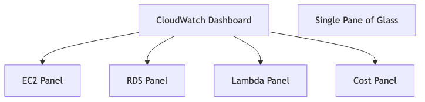

# GDPR and HIPAA: The impact of global compliance on cloud architecture

## Introduction

Good morning everyone! Today I want to talk about something that might sound boring - compliance regulations - but actually changes everything about how we build systems in the cloud. GDPR and HIPAA aren't just legal checkboxes you tick and forget. They fundamentally reshape your entire cloud architecture. Let me explain why.

## The Two Giants of Compliance

First, let me introduce you to the two regulations that keep cloud architects awake at night: GDPR and HIPAA.

GDPR stands for General Data Protection Regulation. It's the European Union's way of protecting personal data. Here's the shocking part: even if your company is in America or India, if you process data from EU citizens, GDPR applies to you. There's no escaping it. And the penalties? Up to twenty million euros OR four percent of your global revenue - whichever is higher. That's not a typo. They will take whichever number hurts more.

HIPAA is the American health data protection law. If you handle patient health information in any way - as a hospital, insurance company, or even as a cloud service provider helping them - HIPAA applies. The penalties go up to one and a half million dollars per violation.


*This diagram shows GDPR's core principles: you can only collect what you need, use it for specific purposes, keep it for limited time, let users delete it, allow users to export it, and notify breaches within 72 hours. At the bottom, you see the massive penalties that enforce these principles.*


*HIPAA requires three types of safeguards: administrative controls like access policies, physical security of facilities, and technical protections like encryption and audit logs. The penalties at the bottom enforce compliance.*

## Impact on Cloud Architecture

### 1. Data Residency Requirements

**GDPR Impact:** EU data MUST stay in EU (with exceptions)


**Architectural Changes Required:**

**Before GDPR:**
```
Single global database in us-east-1
All users' data mixed together
Process anywhere
```

**After GDPR:**
```
EU database in eu-west-1
US database in us-east-1
Geo-routing based on user location
Data never crosses regions without consent
```

**Real Example: Airbnb Architecture**


### 2. Data Encryption Requirements

**Both GDPR & HIPAA:** Encryption at rest and in transit


**Architecture Impact:**

```yaml
# Non-Compliant RDS Setup
Type: AWS::RDS::DBInstance
Properties:
  Engine: postgres
  StorageEncrypted: false  # ❌ Not compliant!

# Compliant RDS Setup
Type: AWS::RDS::DBInstance
Properties:
  Engine: postgres
  StorageEncrypted: true   # ✅ GDPR/HIPAA compliant
  KmsKeyId: !Ref MyKMSKey
  # Automated backups encrypted automatically
```

### 3. Access Control & Audit Logging

**HIPAA Requirement:** Track WHO accessed WHAT patient data, WHEN


**Architecture Components:**


**Retention Requirements:**
- HIPAA: 6 years
- GDPR: Varies, but often 3-5 years
- Solution: Use S3 Lifecycle policies

```json
{
  "Rules": [{
    "Id": "ComplianceLogs",
    "Status": "Enabled",
    "Transitions": [
      {
        "Days": 90,
        "StorageClass": "GLACIER"
      }
    ],
    "Expiration": {
      "Days": 2190  // 6 years for HIPAA
    }
  }]
}
```

### 4. Right to be Forgotten (GDPR)

**Impact:** Users can request complete data deletion

```mermaid
graph TB
    A[User Requests Deletion] --> B[Identify All Data]
    B --> C[Primary Database]
    B --> D[Backup Systems]
    B --> E[Log Files]
    B --> F[Analytics Systems]
    B --> G[CDN Caches]

## How Compliance Changes Cloud Architecture

Now let me show you three massive architectural changes these regulations force you to make.

**First: Data Residency.** GDPR says European user data must stay in Europe. Sounds simple, right? But think about what this means for your architecture. Before GDPR, companies would just put everything in one region - usually US-East because it's cheapest. One database, everyone's data mixed together, process it anywhere you want. Simple.

After GDPR? You need separate databases in different regions. European users' data goes to EU-West, American users to US-East, Asian users to an Asian region. You need geo-routing to detect where users are from and send them to the right region. And that data cannot cross regions without explicit consent. Companies like Airbnb completely redesigned their architecture around this requirement.

```mermaid
graph LR
    A[User Requests] --> B{Location Detection}
    B -->|EU User| C[EU Region]
    B -->|US User| D[US Region]
    B -->|Asia User| E[Asia Region]
    
    C --> F[EU Database]
    D --> G[US Database]
    E --> H[Asia Database]
```

*This diagram shows geo-routing: user requests are analyzed for location, then routed to the appropriate regional database. EU users hit EU databases, US users hit US databases, keeping data within proper jurisdictions.*

**Second: Encryption Everywhere.** Both GDPR and HIPAA demand encryption - at rest and in transit. This sounds obvious but changes your entire infrastructure. Every database must be encrypted. Every backup must be encrypted. Every data transfer must use modern TLS encryption. You need key management systems like AWS KMS to handle encryption keys properly. And all of this adds complexity and cost.

**Third: Audit Logging.** HIPAA particularly requires tracking who accessed what patient data and when. Imagine a hospital database - you need to log every single access. Doctor Smith viewed Patient 123's record at this exact time. Nurse Jones updated medication at that time. And you must keep these logs for six years! That's an enormous amount of data. You need CloudTrail for API logging, CloudWatch for monitoring, and massive storage for retention.



*This shows the audit trail: when a doctor accesses patient health information, it's logged in CloudTrail, stored immutably, and can be queried later by auditors to prove compliance and track access patterns.*

## The Right to be Forgotten

Here's my favorite complication: GDPR's "Right to be Forgotten." Any EU citizen can request complete deletion of their data. Sounds fair, right? But imagine the technical nightmare. That user's data is in your production database, your cache, your search indexes, your analytics warehouse, your logs, your backups - fifteen different systems!

You need a data inventory system that knows everywhere this person's data lives. Then you need a deletion workflow that removes them from active systems and anonymizes them in logs - because you can't delete immutable audit logs, but you can replace real names with pseudonyms. Even your backups need to eventually purge this data. The complexity is massive.

## The Bottom Line

Here's what compliance really means for cloud architecture: You'll spend more money on encryption, multi-region deployments, logging systems, and compliance tools. Your architecture becomes more complex. But you know what? It also becomes more secure, more transparent, and more respectful of user privacy.

## My Final Advice

If you're building anything in the cloud that touches user data, assume GDPR applies. Assume HIPAA applies if there's any health information. Design for compliance from day one - retrofitting is ten times harder and more expensive. Enable encryption everywhere, implement proper access controls, set up comprehensive logging, and have a data deletion workflow ready.

Compliance isn't optional anymore. It's the foundation of modern cloud architecture. Thank you!

---

## Learning Resources

### Official Documentation
- [Official GDPR Text](https://gdpr.eu/) - Complete regulation and guide
- [HHS HIPAA](https://www.hhs.gov/hipaa/index.html) - Official HHS site
- [AWS GDPR Center](https://aws.amazon.com/compliance/gdpr-center/) - AWS compliance
- [AWS HIPAA](https://aws.amazon.com/compliance/hipaa-compliance/) - AWS healthcare compliance

### Architecture Guides
- [AWS HIPAA Reference Architecture](https://aws.amazon.com/quickstart/architecture/compliance-hipaa/) - Ready-to-deploy
- [GDPR on AWS Whitepaper](https://d1.awsstatic.com/whitepapers/compliance/GDPR_Compliance_on_AWS.pdf) - Implementation guide
- [Azure Compliance Blueprints](https://docs.microsoft.com/en-us/azure/governance/blueprints/) - Reference architectures

### Tools & Services
- [AWS Config](https://aws.amazon.com/config/) - Compliance automation
- [AWS Artifact](https://aws.amazon.com/artifact/) - Compliance reports
- [Vanta](https://www.vanta.com/) - Continuous compliance monitoring

### Training & Certification
- [IAPP GDPR Training](https://iapp.org/certify/cigp/) - GDPR certification
- [AWS Security Specialty](https://aws.amazon.com/certification/certified-security-specialty/) - Includes compliance

### Case Studies
- [DLA Piper GDPR Fines Tracker](https://www.dlapiperdatabreaches.com/) - Track fines
- [HIPAA Breach Examples](https://www.hipaajournal.com/) - Real breaches and lessons

### Books
- "The GDPR Challenge" by Paul Voigt
- "HIPAA Compliance Handbook" by Elsevier
- "Data Protection in the Cloud" by Dimitra Kamarinou
