# Kubernetes: Why has it become the operating system of the cloud?

## Introduction

Good morning! Today I want to talk about why people are calling Kubernetes "the operating system of the cloud." That's a bold claim, right? An operating system? Let me explain why it's actually accurate.

## What is Kubernetes Really?

Think of Kubernetes as the conductor of an orchestra. The conductor doesn't play any instruments - doesn't play the violin or trumpet. But the conductor ensures all the musicians play together perfectly, start at the right time, and create beautiful music. That's exactly what Kubernetes does for containers.

Kubernetes schedules where containers run, scales applications automatically when traffic increases, handles failures by restarting crashed containers, manages networking between services, and handles updates and rollbacks. It's orchestrating everything behind the scenes.

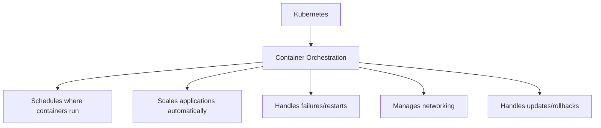

*This diagram shows Kubernetes as the central orchestrator managing all container operations: scheduling workloads, auto-scaling, self-healing failed containers, networking between services, and deployment management.*

## Why the Operating System Analogy?

Here's why people call it the operating system of the cloud: Think about what Windows or Linux does on your computer. It manages processes, allocates memory, handles storage, manages networking. You don't manually tell your operating system which CPU core to run each program on - it figures that out.

Kubernetes does the exact same thing, but for the cloud. It manages containers instead of processes. It manages compute resources across hundreds of servers instead of one computer's CPU. It manages cloud storage volumes instead of a single hard drive. The analogy is perfect.

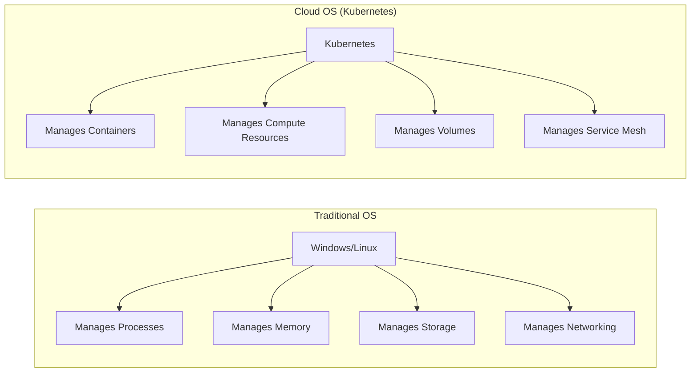

*On the left, traditional operating systems manage processes, memory, storage, and networking on a single computer. On the right, Kubernetes manages containers, compute across clusters, volumes, and service meshes across entire data centers - the same abstraction at cloud scale.*

## Why Kubernetes Won

### 1. Born at Google, Proven at Scale

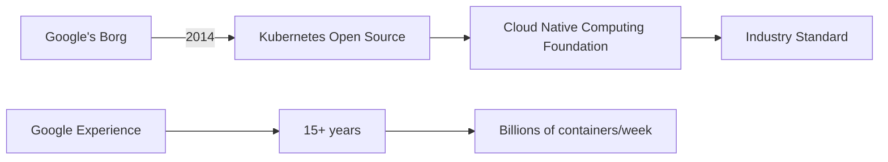

**Google's credibility:**
- Runs Gmail, YouTube, Search on containers
- Manages 2+ billion containers/week
- Kubernetes is Borg for everyone else

### 2. Solves Real Problems

**Before Kubernetes:**

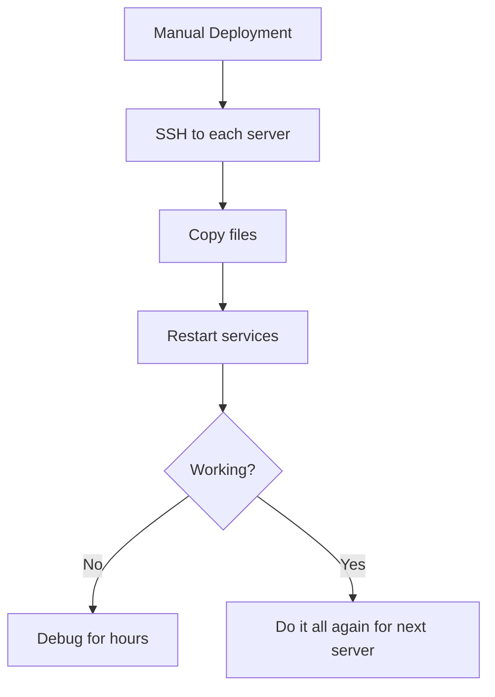

**With Kubernetes:**

```bash
kubectl apply -f deployment.yaml
# Done! K8s handles everything
```

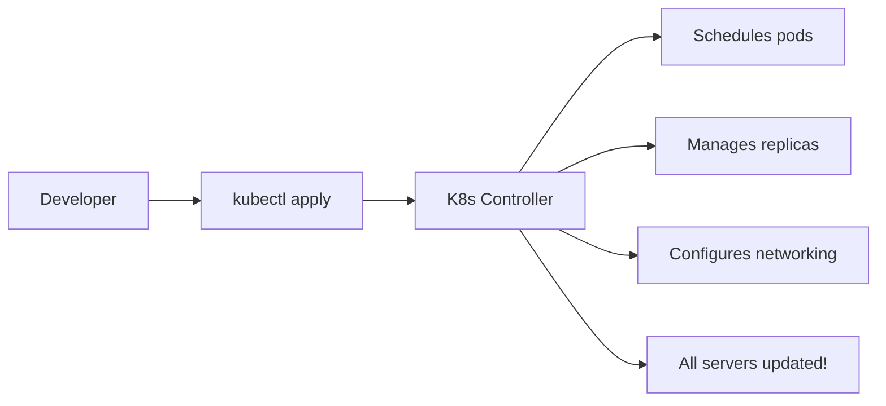

### 3. Cloud-Agnostic (Avoid Vendor Lock-in)

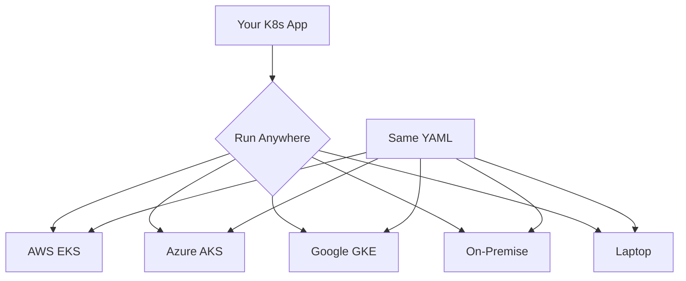

**The Promise:**
```yaml
# This deployment.yaml works EVERYWHERE
apiVersion: apps/v1
kind: Deployment
metadata:
  name: my-app
spec:
  replicas: 3
  template:
    spec:
      containers:
      - name: app
        image: my-app:v1
```

**Real Example:** Spotify migrated from on-premise to Google Cloud using Kubernetes - same manifests, different infrastructure!

### 4. Declarative Configuration

**Imperative (Old Way):**
```bash
# Tell HOW to do it
ssh server1
docker run my-app
ssh server2
docker run my-app
# etc...
```

**Declarative (K8s Way):**
```yaml
# Tell WHAT you want
replicas: 10
# K8s figures out HOW
```

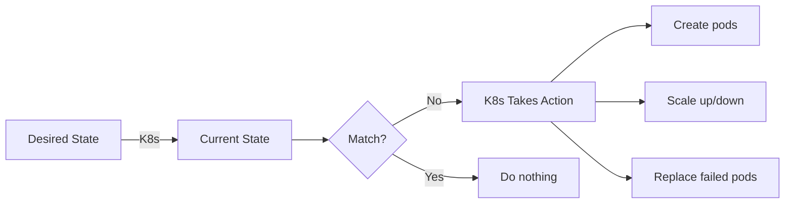

### 5. Massive Ecosystem

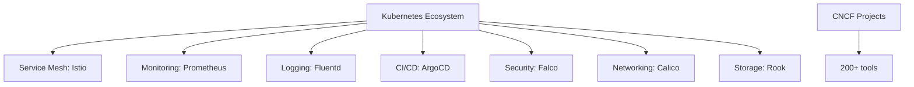

**Everything integrates with K8s!**

## Kubernetes as the Cloud OS

### 1. Abstraction Layer

```mermaid
graph TB
    subgraph "Application Layer"
        A[Your Microservices]
    end
    
    subgraph "Kubernetes API"
        B[Deployments]
        C[Services]
        D[Ingress]
        E[ConfigMaps]
        F[Secrets]
    end

## Why Kubernetes Won

Now let me tell you why Kubernetes became the dominant standard. There are five key reasons.

**First: It was born at Google.** Kubernetes is based on Google's internal system called Borg, which they used for over fifteen years to run services like Gmail, YouTube, and Google Search. Google runs over two billion containers per week! When they open-sourced Kubernetes in 2014, it came with that credibility - this isn't some startup's experiment, this is battle-tested technology running the world's largest services.

**Second: It solves real problems.** Before Kubernetes, deploying applications meant manually SSH-ing into each server, copying files, restarting services, and praying everything works. If it doesn't, you debug for hours and then repeat the whole process for the next server. With Kubernetes, you just run one command - kubectl apply - and Kubernetes handles everything: schedules pods across servers, manages replicas, configures networking. Done.

```mermaid
graph LR
    A[Developer] --> B[kubectl apply]
    B --> C[K8s Controller]
    C --> D[Schedules pods]
    C --> E[Manages replicas]
    C --> F[Configures networking]
    C --> G[All servers updated!]
```

*This flow shows the simplicity: developer applies a configuration, Kubernetes controller reads it, then automatically schedules pods, manages replicas, configures networking, and updates all servers - all from one command.*

**Third: It's cloud-agnostic.** This is huge. You can write your Kubernetes deployment files once and run them anywhere - AWS, Azure, Google Cloud, your own data center, even your laptop. Same YAML files everywhere. Companies like Spotify successfully migrated from on-premise to Google Cloud using Kubernetes with the same manifests. No vendor lock-in.

**Fourth: Declarative configuration.** The old way was imperative - you tell the system HOW to do something step by step. Kubernetes is declarative - you tell it WHAT you want, and it figures out HOW. You say "I want 10 replicas" and Kubernetes continuously works to maintain that state. If pods crash, it creates new ones. If you scale down, it removes them. You describe the desired state, and Kubernetes makes it reality.


*Kubernetes continuously compares desired state to current state. If they don't match, it takes action - creating pods, scaling, or replacing failures. If they match, it does nothing. This self-healing loop runs constantly.*

**Fifth: Massive ecosystem.** There are over two hundred tools built for Kubernetes - Prometheus for monitoring, Istio for service mesh, Fluentd for logging, ArgoCD for deployments. Everything integrates with Kubernetes because it's the standard. This ecosystem makes it incredibly powerful.

## The Bottom Line

Here's why Kubernetes really is the operating system of the cloud: It abstracts infrastructure complexity, provides consistent APIs for applications, manages resource allocation automatically, ensures high availability through self-healing, and works everywhere. Just like you don't think about managing CPU cores when using Windows, with Kubernetes you don't think about managing individual servers.

## My Final Advice

Should you use Kubernetes? If you're running microservices, need auto-scaling, want cloud portability, or plan to grow significantly - yes, absolutely. Kubernetes is worth the learning curve. But if you're running a simple application with two servers, it's overkill. Use the right tool for the job.

The reason Kubernetes became the operating system of the cloud is simple: it solved the hardest problems of distributed computing and made them accessible to everyone. That's why eighty-seven percent of organizations using containers have chosen Kubernetes. Thank you!

---

## Learning Resources
```

**Reality Check:**
- Takes 6-12 months to become proficient
- Requires dedicated DevOps team
- Not worth it for simple apps

### 2. Overkill for Small Apps

```
Simple blog with 100 users?
❌ Kubernetes (too complex)
✅ Heroku or managed service
```

### 3. Resource Overhead

```
Kubernetes itself needs:
- Master nodes (3 for HA)
- etcd cluster
- Monitoring/logging
- Ingress controllers

Minimum: 4-6 servers just for K8s!
```

### 4. Operational Complexity

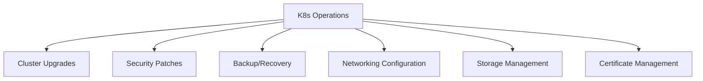

**Solution:** Managed Kubernetes (EKS, AKS, GKE)
- Provider handles control plane
- You focus on apps
- Still complex, but easier!

## When to Use Kubernetes

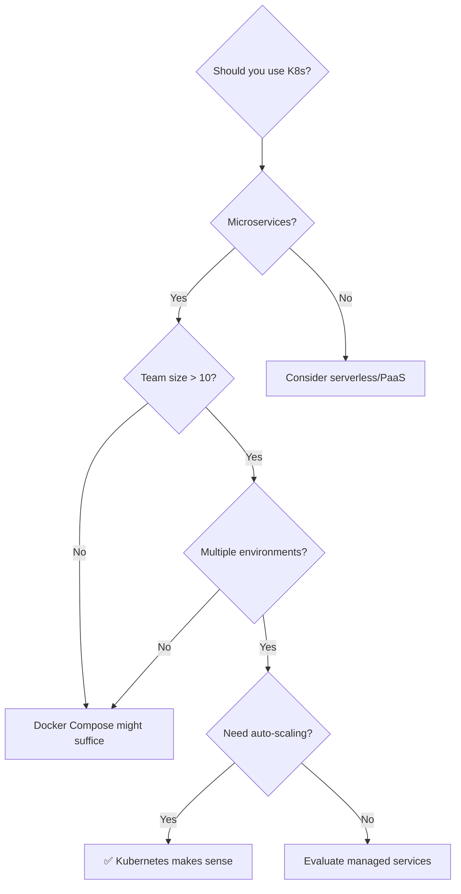

**Use Kubernetes if:**
- ✅ Running microservices (10+ services)
- ✅ Need auto-scaling
- ✅ Multiple environments (dev, staging, prod)
- ✅ Team has K8s expertise
- ✅ High availability requirements
- ✅ Want cloud portability

**Skip Kubernetes if:**
- ❌ Simple monolithic app
- ❌ Small team (< 5 people)
- ❌ Low traffic predictable workload
- ❌ No DevOps expertise
- ❌ Speed to market is critical

## The Future: Kubernetes Everywhere

```mermaid
graph TB
    A[Kubernetes Expanding] --> B[Edge Computing]
    A --> C[IoT Devices]
    A --> D[AI/ML Workflows]
    A --> E[Serverless (Knative)]
    A --> F[Databases (Operators)]
    
    G[Becoming Universal] --> H[Like Linux]
    H --> I[Standard everywhere]
```

**Emerging Trends:**
- **K8s on Edge:** Run K8s on edge locations (5G towers, factories)
- **AI/ML:** Kubeflow for ML pipelines
- **Serverless:** Knative runs functions on K8s
- **GitOps:** ArgoCD, Flux for declarative deployments

## Conclusion: Why K8s is the Cloud OS

**It provides what every OS provides:**

1. **Abstraction:** Hide infrastructure complexity
2. **Resource Management:** CPU, memory, storage allocation
3. **Process Management:** Run, stop, restart applications
4. **Networking:** Service discovery, load balancing
5. **Security:** RBAC, network policies, secrets
6. **APIs:** Standard interface for applications
7. **Extensibility:** Plugins and operators

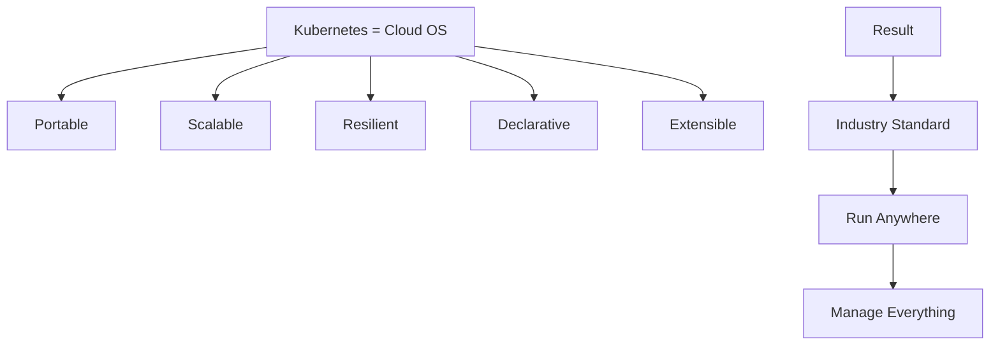

**The verdict:** Kubernetes has become the cloud OS because it provides a **universal API** for managing distributed applications, regardless of where they run!

---

## Learning Resources

### Getting Started
- [Kubernetes Official Docs](https://kubernetes.io/docs/home/) - Complete documentation
- [Kubernetes Basics Tutorial](https://kubernetes.io/docs/tutorials/kubernetes-basics/) - Interactive learning
- [Play with Kubernetes](https://labs.play-with-k8s.com/) - Free online playground
- [Kubernetes the Hard Way](https://github.com/kelseyhightower/kubernetes-the-hard-way) - Deep understanding

### Video Courses
- [Kubernetes for Beginners](https://www.youtube.com/results?search_query=kubernetes+tutorial+for+beginners) - YouTube tutorials
- [CNCF YouTube Channel](https://www.youtube.com/c/cloudnativefdn) - Official videos
- [TechWorld with Nana](https://www.youtube.com/c/TechWorldwithNana) - Excellent K8s playlist

### Hands-On Practice
- [Katacoda Kubernetes](https://www.katacoda.com/courses/kubernetes) - Interactive scenarios
- [KodeKloud](https://kodekloud.com/courses/kubernetes-for-beginners/) - Practice labs
- [Kubernetes Bootcamp](https://kubernetesbootcamp.github.io/kubernetes-bootcamp/) - Step-by-step exercises

### Books
- "Kubernetes: Up and Running" by Kelsey Hightower
- "The Kubernetes Book" by Nigel Poulton
- "Kubernetes in Action" by Marko Lukša
- "Cloud Native DevOps with Kubernetes" by John Arundel

### Certifications
- [CKA: Certified Kubernetes Administrator](https://www.cncf.io/certification/cka/) - Admin certification
- [CKAD: Certified Kubernetes Application Developer](https://www.cncf.io/certification/ckad/) - Developer cert
- [CKS: Certified Kubernetes Security Specialist](https://www.cncf.io/certification/cks/) - Security cert

### Managed Kubernetes
- [AWS EKS Documentation](https://docs.aws.amazon.com/eks/) - Amazon K8s service
- [Azure AKS Documentation](https://docs.microsoft.com/en-us/azure/aks/) - Microsoft K8s
- [Google GKE Documentation](https://cloud.google.com/kubernetes-engine/docs) - Google K8s

### Tools & Ecosystem
- [Helm](https://helm.sh/) - Package manager for K8s
- [Istio](https://istio.io/) - Service mesh
- [Prometheus](https://prometheus.io/) - Monitoring
- [ArgoCD](https://argo-cd.readthedocs.io/) - GitOps continuous delivery
- [Lens](https://k8slens.dev/) - Kubernetes IDE

### Architecture & Patterns
- [Kubernetes Patterns](https://www.redhat.com/en/resources/oreilly-kubernetes-patterns-cloud-native-apps) - Design patterns
- [CNCF Cloud Native Landscape](https://landscape.cncf.io/) - Ecosystem map
- [12 Factor App](https://12factor.net/) - Cloud-native principles

### Community & News
- [r/kubernetes](https://www.reddit.com/r/kubernetes/) - Reddit community
- [Kubernetes Slack](https://slack.k8s.io/) - Official Slack
- [KubeCon](https://www.cncf.io/kubecon-cloudnativecon-events/) - Annual conference
- [Kubernetes Blog](https://kubernetes.io/blog/) - Official blog

### Troubleshooting & Best Practices
- [Kubernetes Best Practices](https://kubernetes.io/docs/concepts/configuration/overview/) - Official guide
- [Production Best Practices](https://learnk8s.io/production-best-practices) - Comprehensive checklist
- [Troubleshooting Guide](https://kubernetes.io/docs/tasks/debug/) - Debug applications

### Security
- [Kubernetes Security Best Practices](https://kubernetes.io/docs/concepts/security/) - Security guide
- [RBAC Documentation](https://kubernetes.io/docs/reference/access-authn-authz/rbac/) - Access control
- [Pod Security Standards](https://kubernetes.io/docs/concepts/security/pod-security-standards/) - Pod security

### Case Studies
- [Kubernetes Case Studies](https://kubernetes.io/case-studies/) - Official success stories
- [CNCF Case Studies](https://www.cncf.io/case-studies/) - Real-world examples
- [Spotify K8s Journey](https://engineering.atspotify.com/2018/02/spotifys-event-delivery-the-road-to-the-cloud-part-i/) - Detailed migration story
