# Kubernetes: Why has it become the operating system of the cloud?

## Introduction

People call Kubernetes "the operating system of the cloud" - but what does that even mean? Let's explore why K8s has become so dominant and essential!

## What is Kubernetes?

Think of Kubernetes as **the conductor of an orchestra**. It doesn't play instruments (run apps), but it ensures all musicians (containers) play together perfectly!

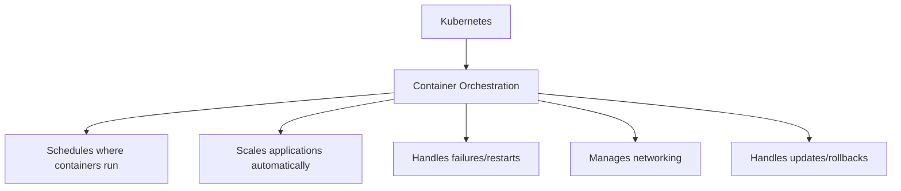

### The OS Analogy

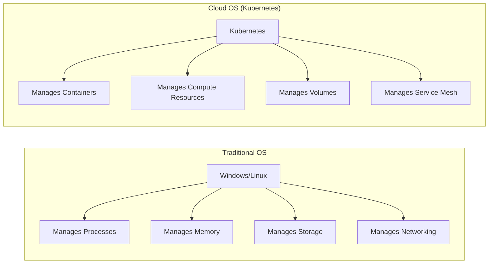

**Just like an OS:**
- Abstracts hardware details
- Provides APIs for applications
- Manages resource allocation
- Ensures high availability
- Handles scheduling

## Why Kubernetes Won

### 1. Born at Google, Proven at Scale

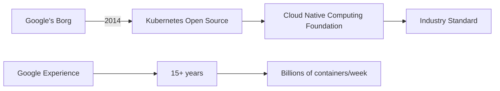

**Google's credibility:**
- Runs Gmail, YouTube, Search on containers
- Manages 2+ billion containers/week
- Kubernetes is Borg for everyone else

### 2. Solves Real Problems

**Before Kubernetes:**

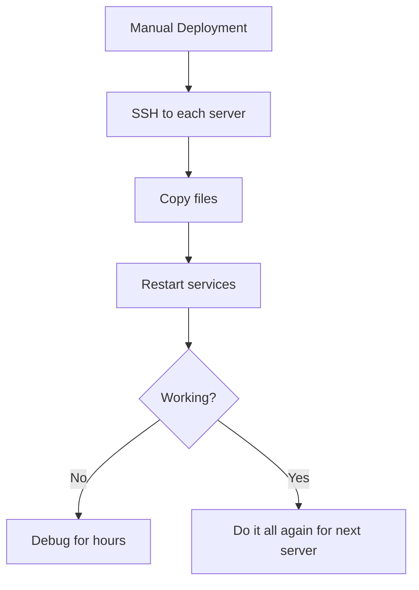

**With Kubernetes:**

```bash
kubectl apply -f deployment.yaml
# Done! K8s handles everything
```

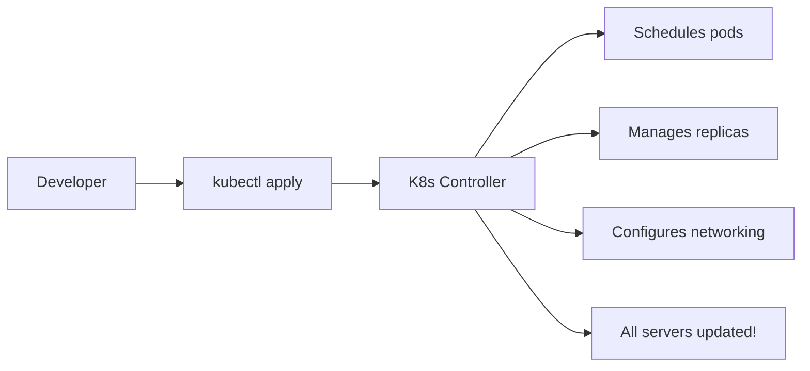

### 3. Cloud-Agnostic (Avoid Vendor Lock-in)

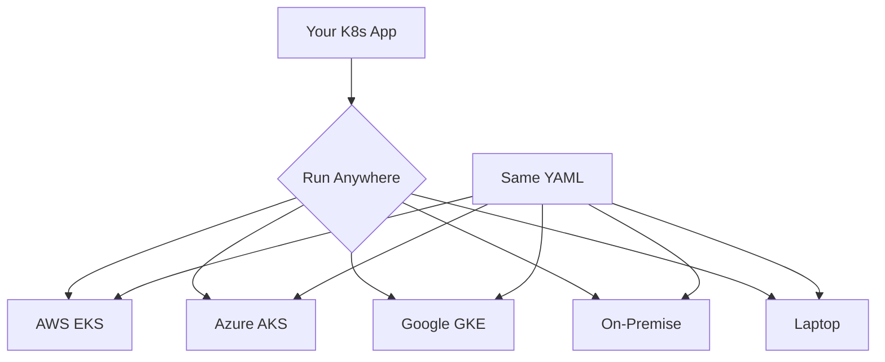

**The Promise:**
```yaml
# This deployment.yaml works EVERYWHERE
apiVersion: apps/v1
kind: Deployment
metadata:
  name: my-app
spec:
  replicas: 3
  template:
    spec:
      containers:
      - name: app
        image: my-app:v1
```

**Real Example:** Spotify migrated from on-premise to Google Cloud using Kubernetes - same manifests, different infrastructure!

### 4. Declarative Configuration

**Imperative (Old Way):**
```bash
# Tell HOW to do it
ssh server1
docker run my-app
ssh server2
docker run my-app
# etc...
```

**Declarative (K8s Way):**
```yaml
# Tell WHAT you want
replicas: 10
# K8s figures out HOW
```

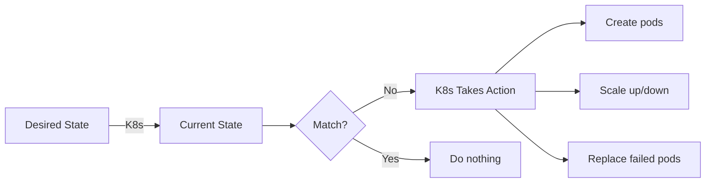

### 5. Massive Ecosystem

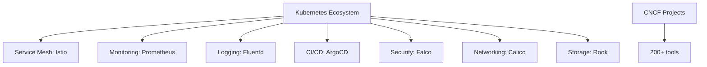

**Everything integrates with K8s!**

## Kubernetes as the Cloud OS

### 1. Abstraction Layer

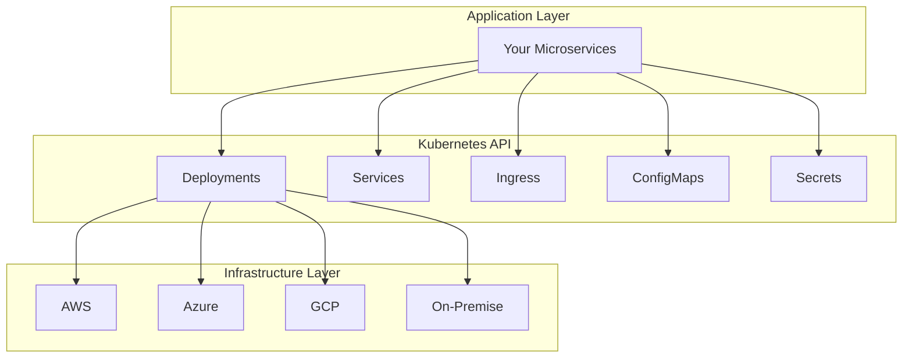

**Just like OS abstracts CPU/RAM/Disk:**
- K8s abstracts compute/storage/networking
- Apps don't know (or care) about underlying infrastructure

### 2. Resource Management

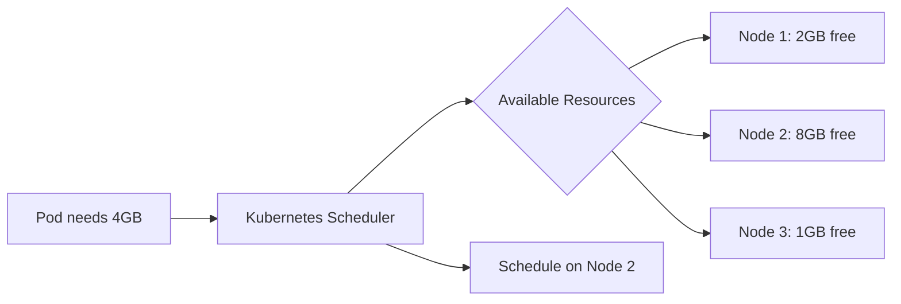

**Resource Requests & Limits:**
```yaml
resources:
  requests:
    memory: "256Mi"
    cpu: "500m"
  limits:
    memory: "512Mi"
    cpu: "1000m"
```

**K8s ensures:**
- ✅ Pods get resources they need
- ✅ No node is overloaded
- ✅ Auto-scaling based on usage

### 3. Service Discovery & Networking

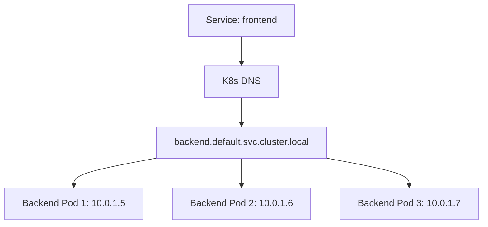

**No hardcoded IPs!**
```yaml
# Frontend just calls
http://backend:8080/api
# K8s load balances automatically
```

### 4. Self-Healing

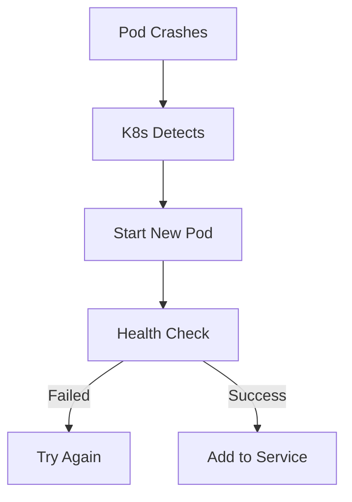

**Types of Health Checks:**
```yaml
livenessProbe:
  httpGet:
    path: /health
    port: 8080
  initialDelaySeconds: 30
  periodSeconds: 10

readinessProbe:
  httpGet:
    path: /ready
    port: 8080
  periodSeconds: 5
```

### 5. Rolling Updates & Rollbacks

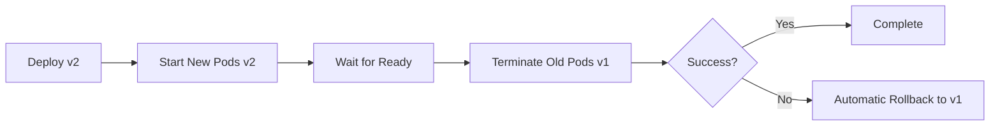

**Zero-downtime deployments:**
```bash
kubectl set image deployment/app app=app:v2
# K8s gradually replaces pods

# Rollback if needed
kubectl rollout undo deployment/app
```

## Real-World Architecture Example

### E-commerce Platform on Kubernetes

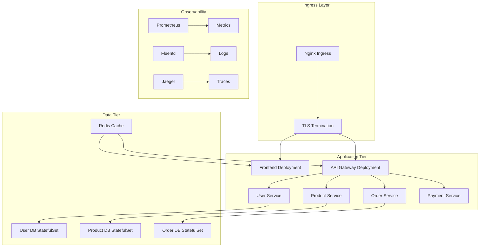

**Kubernetes Advantages:**
1. **Auto-scaling:** Black Friday? Scale from 10 to 1000 pods automatically
2. **High availability:** Pods spread across availability zones
3. **Easy updates:** Deploy new features without downtime
4. **Resource efficiency:** Pack more services on fewer servers
5. **Disaster recovery:** Entire cluster can be recreated from YAML files

## Why Companies Are Moving to Kubernetes

### Success Stories

**1. Spotify**
- **Before:** Monolithic app, manual deploys
- **After:** 200+ microservices on K8s
- **Result:** Deploy 1000+ times/week

**2. Airbnb**
- **Before:** AWS EC2 manual management
- **After:** Kubernetes on AWS (EKS)
- **Result:** 2.5x infrastructure efficiency

**3. Shopify**
- **Before:** Ruby monolith
- **After:** Containerized on K8s
- **Result:** Handle Black Friday (10x normal traffic)

### The Numbers

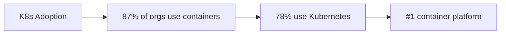

## The Challenges (Why NOT Everyone Uses It)

### 1. Complexity

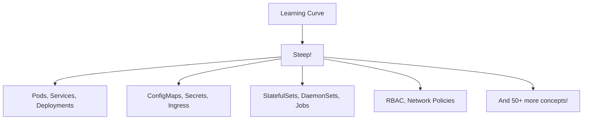

**Reality Check:**
- Takes 6-12 months to become proficient
- Requires dedicated DevOps team
- Not worth it for simple apps

### 2. Overkill for Small Apps

```
Simple blog with 100 users?
❌ Kubernetes (too complex)
✅ Heroku or managed service
```

### 3. Resource Overhead

```
Kubernetes itself needs:
- Master nodes (3 for HA)
- etcd cluster
- Monitoring/logging
- Ingress controllers

Minimum: 4-6 servers just for K8s!
```

### 4. Operational Complexity

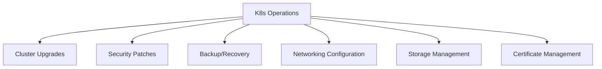

**Solution:** Managed Kubernetes (EKS, AKS, GKE)
- Provider handles control plane
- You focus on apps
- Still complex, but easier!

## When to Use Kubernetes

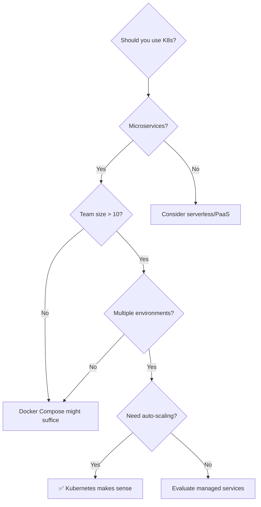

**Use Kubernetes if:**
- ✅ Running microservices (10+ services)
- ✅ Need auto-scaling
- ✅ Multiple environments (dev, staging, prod)
- ✅ Team has K8s expertise
- ✅ High availability requirements
- ✅ Want cloud portability

**Skip Kubernetes if:**
- ❌ Simple monolithic app
- ❌ Small team (< 5 people)
- ❌ Low traffic predictable workload
- ❌ No DevOps expertise
- ❌ Speed to market is critical

## The Future: Kubernetes Everywhere

```mermaid
graph TB
    A[Kubernetes Expanding] --> B[Edge Computing]
    A --> C[IoT Devices]
    A --> D[AI/ML Workflows]
    A --> E[Serverless (Knative)]
    A --> F[Databases (Operators)]
    
    G[Becoming Universal] --> H[Like Linux]
    H --> I[Standard everywhere]
```

**Emerging Trends:**
- **K8s on Edge:** Run K8s on edge locations (5G towers, factories)
- **AI/ML:** Kubeflow for ML pipelines
- **Serverless:** Knative runs functions on K8s
- **GitOps:** ArgoCD, Flux for declarative deployments

## Conclusion: Why K8s is the Cloud OS

**It provides what every OS provides:**

1. **Abstraction:** Hide infrastructure complexity
2. **Resource Management:** CPU, memory, storage allocation
3. **Process Management:** Run, stop, restart applications
4. **Networking:** Service discovery, load balancing
5. **Security:** RBAC, network policies, secrets
6. **APIs:** Standard interface for applications
7. **Extensibility:** Plugins and operators

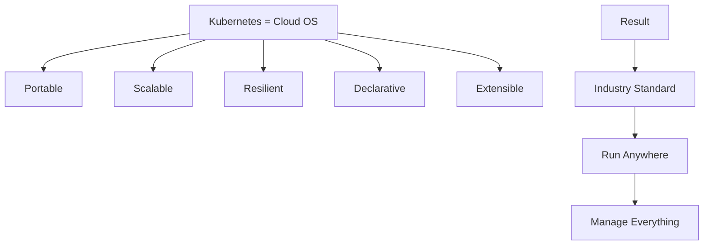

**The verdict:** Kubernetes has become the cloud OS because it provides a **universal API** for managing distributed applications, regardless of where they run!

---

## Learning Resources

### Getting Started
- [Kubernetes Official Docs](https://kubernetes.io/docs/home/) - Complete documentation
- [Kubernetes Basics Tutorial](https://kubernetes.io/docs/tutorials/kubernetes-basics/) - Interactive learning
- [Play with Kubernetes](https://labs.play-with-k8s.com/) - Free online playground
- [Kubernetes the Hard Way](https://github.com/kelseyhightower/kubernetes-the-hard-way) - Deep understanding

### Video Courses
- [Kubernetes for Beginners](https://www.youtube.com/results?search_query=kubernetes+tutorial+for+beginners) - YouTube tutorials
- [CNCF YouTube Channel](https://www.youtube.com/c/cloudnativefdn) - Official videos
- [TechWorld with Nana](https://www.youtube.com/c/TechWorldwithNana) - Excellent K8s playlist

### Hands-On Practice
- [Katacoda Kubernetes](https://www.katacoda.com/courses/kubernetes) - Interactive scenarios
- [KodeKloud](https://kodekloud.com/courses/kubernetes-for-beginners/) - Practice labs
- [Kubernetes Bootcamp](https://kubernetesbootcamp.github.io/kubernetes-bootcamp/) - Step-by-step exercises

### Books
- "Kubernetes: Up and Running" by Kelsey Hightower
- "The Kubernetes Book" by Nigel Poulton
- "Kubernetes in Action" by Marko Lukša
- "Cloud Native DevOps with Kubernetes" by John Arundel

### Certifications
- [CKA: Certified Kubernetes Administrator](https://www.cncf.io/certification/cka/) - Admin certification
- [CKAD: Certified Kubernetes Application Developer](https://www.cncf.io/certification/ckad/) - Developer cert
- [CKS: Certified Kubernetes Security Specialist](https://www.cncf.io/certification/cks/) - Security cert

### Managed Kubernetes
- [AWS EKS Documentation](https://docs.aws.amazon.com/eks/) - Amazon K8s service
- [Azure AKS Documentation](https://docs.microsoft.com/en-us/azure/aks/) - Microsoft K8s
- [Google GKE Documentation](https://cloud.google.com/kubernetes-engine/docs) - Google K8s

### Tools & Ecosystem
- [Helm](https://helm.sh/) - Package manager for K8s
- [Istio](https://istio.io/) - Service mesh
- [Prometheus](https://prometheus.io/) - Monitoring
- [ArgoCD](https://argo-cd.readthedocs.io/) - GitOps continuous delivery
- [Lens](https://k8slens.dev/) - Kubernetes IDE

### Architecture & Patterns
- [Kubernetes Patterns](https://www.redhat.com/en/resources/oreilly-kubernetes-patterns-cloud-native-apps) - Design patterns
- [CNCF Cloud Native Landscape](https://landscape.cncf.io/) - Ecosystem map
- [12 Factor App](https://12factor.net/) - Cloud-native principles

### Community & News
- [r/kubernetes](https://www.reddit.com/r/kubernetes/) - Reddit community
- [Kubernetes Slack](https://slack.k8s.io/) - Official Slack
- [KubeCon](https://www.cncf.io/kubecon-cloudnativecon-events/) - Annual conference
- [Kubernetes Blog](https://kubernetes.io/blog/) - Official blog

### Troubleshooting & Best Practices
- [Kubernetes Best Practices](https://kubernetes.io/docs/concepts/configuration/overview/) - Official guide
- [Production Best Practices](https://learnk8s.io/production-best-practices) - Comprehensive checklist
- [Troubleshooting Guide](https://kubernetes.io/docs/tasks/debug/) - Debug applications

### Security
- [Kubernetes Security Best Practices](https://kubernetes.io/docs/concepts/security/) - Security guide
- [RBAC Documentation](https://kubernetes.io/docs/reference/access-authn-authz/rbac/) - Access control
- [Pod Security Standards](https://kubernetes.io/docs/concepts/security/pod-security-standards/) - Pod security

### Case Studies
- [Kubernetes Case Studies](https://kubernetes.io/case-studies/) - Official success stories
- [CNCF Case Studies](https://www.cncf.io/case-studies/) - Real-world examples
- [Spotify K8s Journey](https://engineering.atspotify.com/2018/02/spotifys-event-delivery-the-road-to-the-cloud-part-i/) - Detailed migration story
