# AI/ML in the Cloud: Democratizing intelligence for every business

## Introduction

AI and Machine Learning used to be reserved for tech giants with massive budgets. Now, thanks to the cloud, a solo developer can build intelligent apps! Let's explore how cloud has democratized AI/ML.

## What Does "Democratizing AI" Mean?

**Before Cloud (2000-2015):**
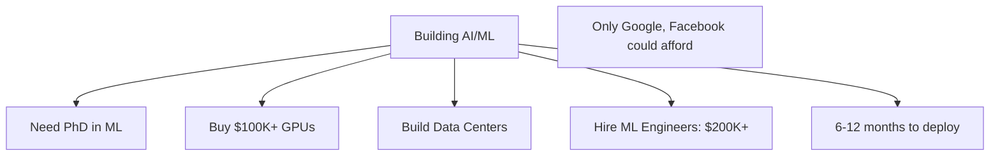

**After Cloud (2015-Present):**
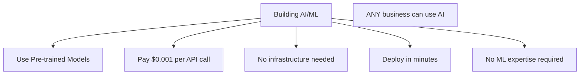

## Cloud AI/ML Services Landscape

### Level 1: Pre-built AI Services (No ML Knowledge Needed)

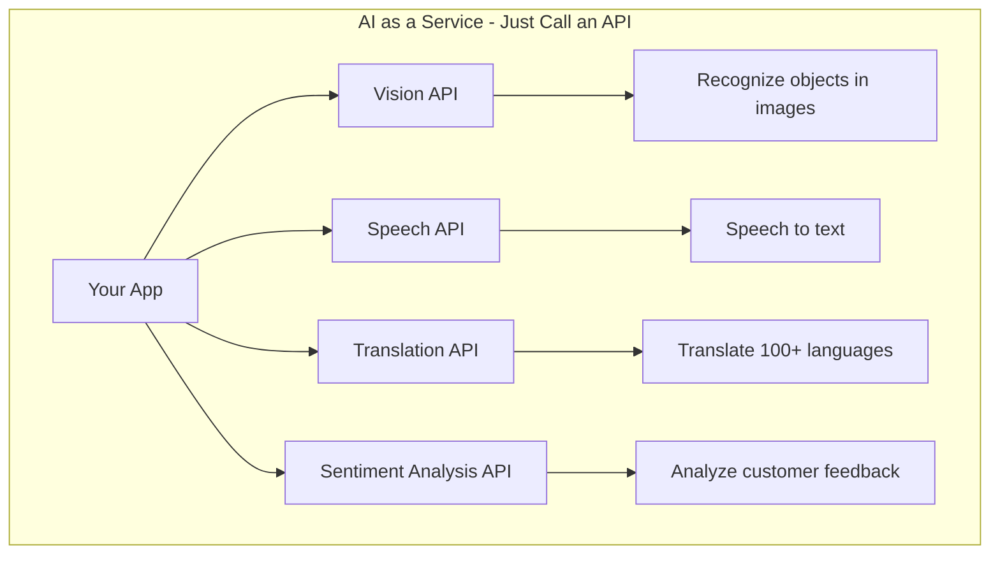

**Examples:**

**AWS:**
- Amazon Rekognition (image/video analysis)
- Amazon Polly (text to speech)
- Amazon Transcribe (speech to text)
- Amazon Comprehend (natural language)

**Google Cloud:**
- Vision API
- Speech-to-Text API
- Translation API
- Natural Language API

**Azure:**
- Computer Vision
- Speech Services
- Translator
- Text Analytics

**Real-World Use Case:**

```python
# Image moderation with just 5 lines of code!
import boto3

rekognition = boto3.client('rekognition')
response = rekognition.detect_labels(
    Image={'S3Object': {'Bucket': 'my-bucket', 'Name': 'photo.jpg'}},
    MaxLabels=10
)

# Returns: ["Cat", "Pet", "Animal", "Furniture"]
```

**Without cloud:** Would take months and ML expertise!

### Level 2: AutoML (Minimal ML Knowledge)


**Services:**
- **AWS SageMaker Autopilot**
- **Google Cloud AutoML**
- **Azure Machine Learning**

**Example: Building Custom Image Classifier**

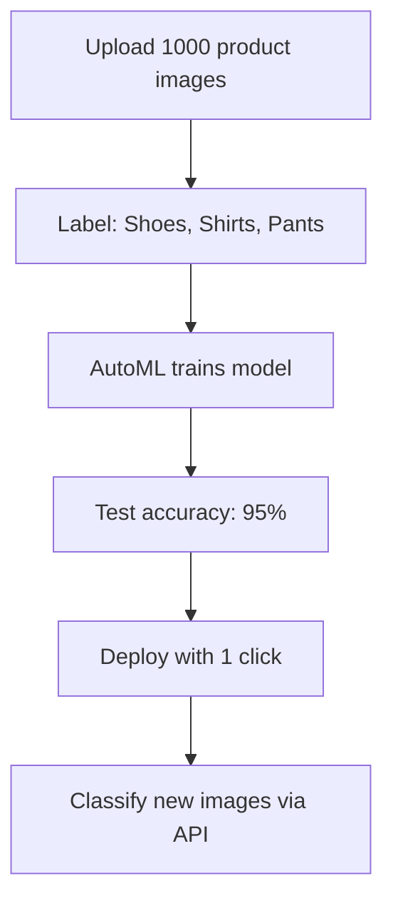

**Time:** 2-3 hours vs. weeks manually!

### Level 3: Custom ML Platforms (For ML Engineers)

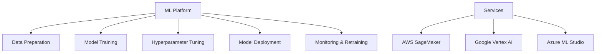

**Full ML Workflow:**

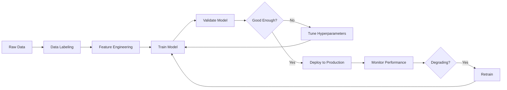

## Real-World Democratization Examples

### Example 1: Small E-commerce Store

**Problem:** Want to moderate user-uploaded product reviews

**Before Cloud AI:**
```
- Hire moderators: $50K/year
- Manual review of each submission
- Slow, expensive, not scalable
```

**With Cloud AI:**
```python
# AWS Comprehend - Sentiment Analysis
comprehend = boto3.client('comprehend')

review = "This product is terrible and broke immediately!"
result = comprehend.detect_sentiment(Text=review, LanguageCode='en')

# Result: {"Sentiment": "NEGATIVE", "Score": 0.98}
# Auto-flag for review

# Cost: $0.0001 per request
# Monthly: 10,000 reviews = $1
```

**Result:** $1/month vs $50K/year!

### Example 2: Local Restaurant Chain

**Problem:** Want voice ordering system

**Before Cloud AI:**
```
- Need speech recognition system
- Development cost: $500K
- 12 months development
- Require ML team
```

**With Cloud AI:**
```python
# Google Speech-to-Text
from google.cloud import speech

client = speech.SpeechClient()

audio = speech.RecognitionAudio(uri="gs://bucket/order.wav")
config = speech.RecognitionConfig(
    language_code="en-US"
)

response = client.recognize(config=config, audio=audio)
# "I'd like a large pepperoni pizza with extra cheese"

# Cost: $0.024 per minute of audio
```

**Result:** $50/month vs. $500K project!

### Example 3: Healthcare Clinic

**Problem:** Extract medical information from doctor's notes

**Before Cloud AI:**
```
- Manual data entry
- Prone to errors
- Time-consuming
```

**With Cloud AI:**
```python
# AWS Comprehend Medical
comprehend_medical = boto3.client('comprehendmedical')

text = "Patient has hypertension and diabetes, prescribed metformin"
result = comprehend_medical.detect_entities_v2(Text=text)

# Extracts:
# - Conditions: ["hypertension", "diabetes"]
# - Medications: ["metformin"]
# - Structured data ready for EMR system

# Cost: $0.01 per 100 characters
```

## Why Cloud Makes AI/ML Accessible

### 1. No Infrastructure Investment

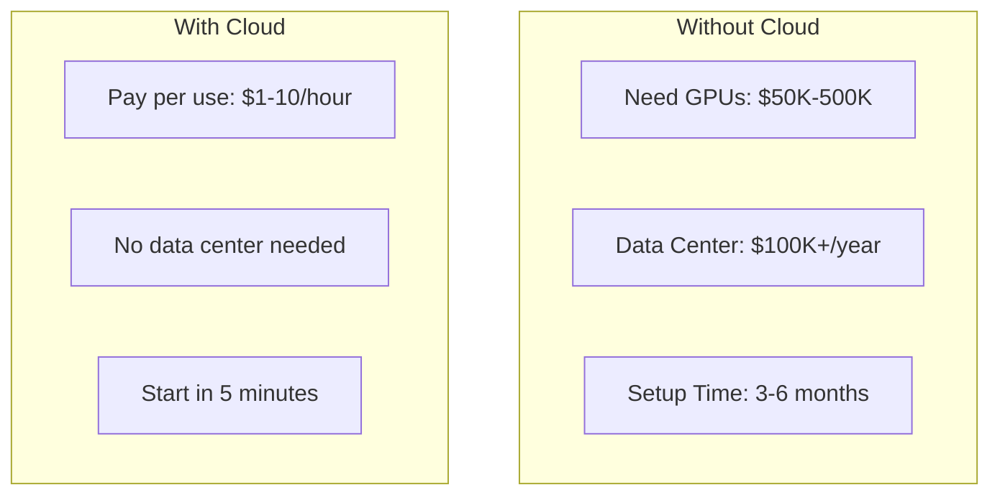

**GPU Comparison:**

| Option | Cost | Time to Start |
|--------|------|---------------|
| Buy NVIDIA A100 | $15,000 | 2-3 months |
| AWS p3.2xlarge (V100) | $3/hour | 5 minutes |
| Use only when needed | $3 × 10 hours = $30 | Instant |

### 2. Pre-trained Models

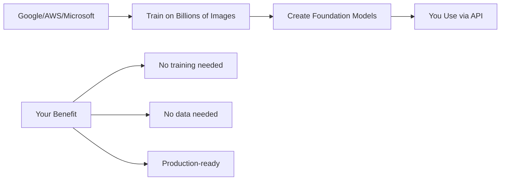

**Example: GPT, BERT, ResNet**
- Trained on petabytes of data
- Took months and millions of dollars
- You use for pennies per request!

### 3. Auto-scaling

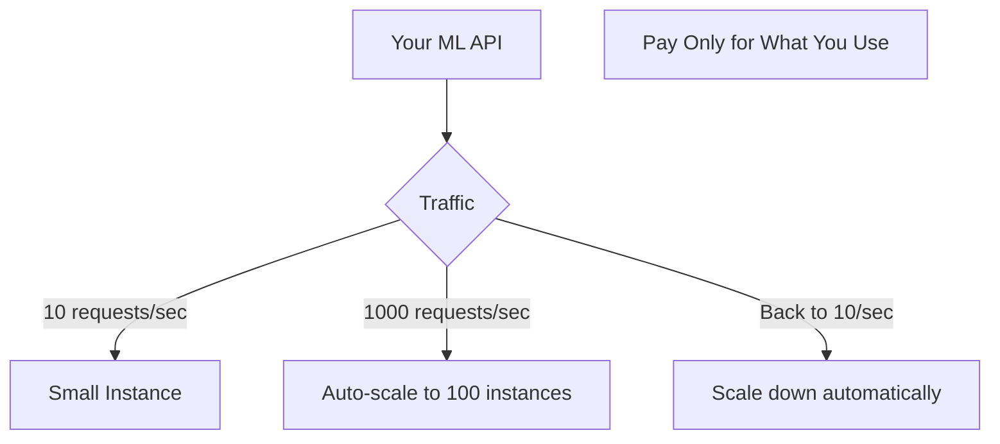

**Traditional:** Size for peak load, waste 90% of capacity  
**Cloud:** Scale up/down automatically, optimize costs

### 4. Managed Services

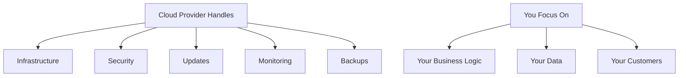

## Complete AI/ML Stack in the Cloud

### Example: Image Recognition App

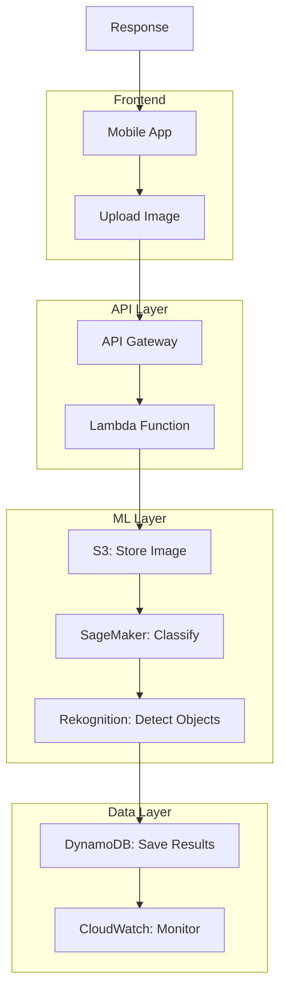

**Cost Breakdown (10,000 images/month):**
- API Gateway: $3.50
- Lambda: $0.20
- S3: $0.23
- Rekognition: $10.00
- DynamoDB: $1.25
- **Total: ~$15/month**

**To build yourself:** $100K+ and 6 months!

## Advanced: Custom ML Workflow

### Training Custom Models in the Cloud

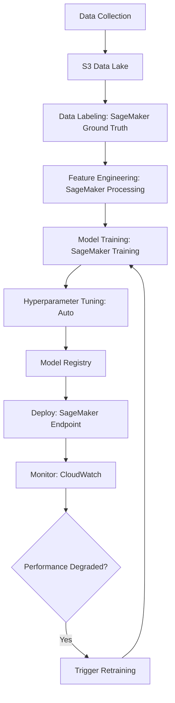

**What Cloud Provides:**
1. **Managed Jupyter Notebooks** - Development environment
2. **Distributed Training** - Train on multiple GPUs
3. **Automatic Scaling** - Handle any workload
4. **Model Versioning** - Track experiments
5. **A/B Testing** - Test model variants
6. **Monitoring** - Track accuracy over time

## AI/ML Use Cases Enabled by Cloud

### 1. Computer Vision

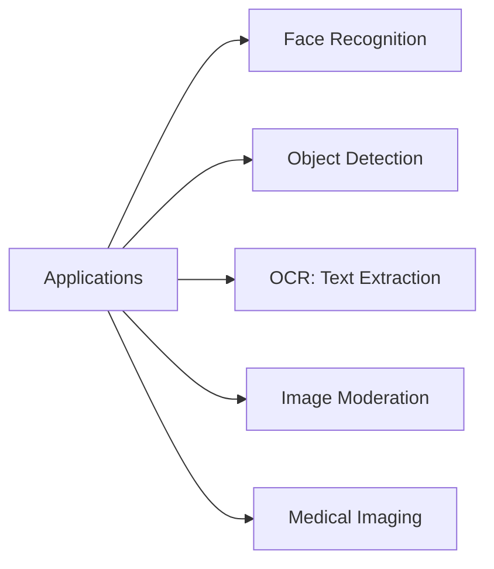

**Examples:**
- **Retail:** Automated checkout (Amazon Go)
- **Security:** Facial recognition access control
- **Insurance:** Damage assessment from photos
- **Healthcare:** X-ray analysis

### 2. Natural Language Processing

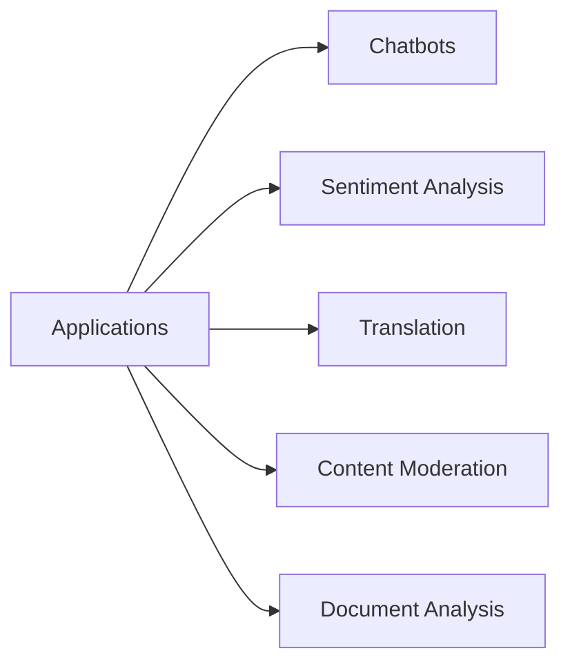

**Examples:**
- **Customer Service:** AI chatbots (24/7 support)
- **E-commerce:** Review sentiment analysis
- **Legal:** Contract analysis
- **Media:** Content moderation

### 3. Speech & Audio

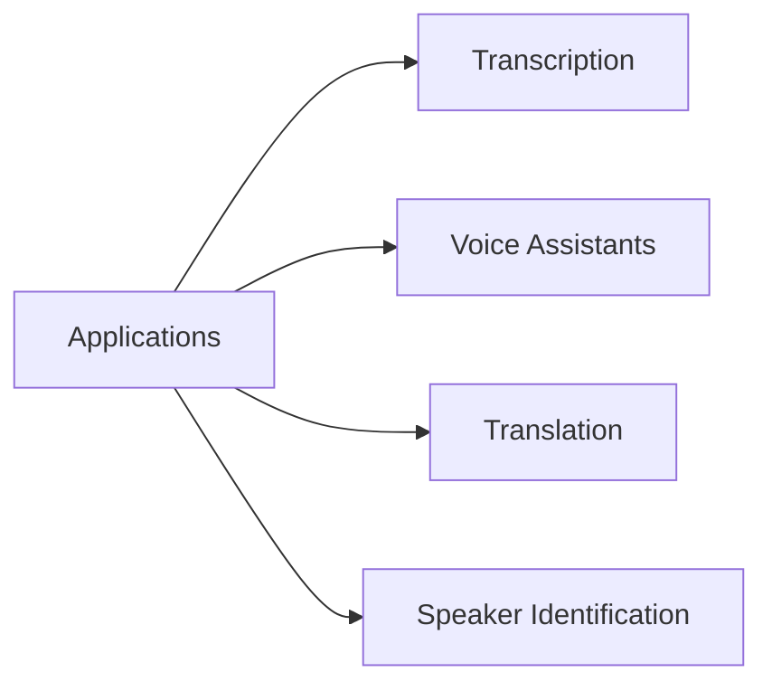

**Examples:**
- **Call Centers:** Transcribe calls for quality assurance
- **Accessibility:** Live captions for deaf/hard of hearing
- **Podcasts:** Automatic transcription
- **Voice Commands:** Smart home devices

### 4. Predictive Analytics

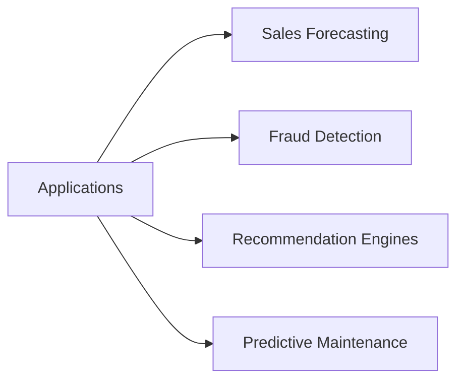

**Examples:**
- **E-commerce:** Product recommendations (Amazon, Netflix)
- **Finance:** Credit risk assessment
- **Manufacturing:** Predict equipment failures
- **Retail:** Demand forecasting

## Cost Comparison: Cloud AI vs. In-House

### Scenario: Image Classification Service

**Option 1: Build In-House**
```
GPUs: $50,000
Data Center: $10,000/year
ML Engineers (2): $300,000/year
DevOps (1): $120,000/year
Development Time: 6 months
Total Year 1: $495,000
```

**Option 2: Cloud AI (AWS Rekognition)**
```
1M images/month analysis
Cost: $1 per 1,000 images
Monthly: $1,000
Yearly: $12,000
Development Time: 1 week
```

**Savings: $483,000 (97%!)**

## Challenges & Considerations

### 1. Vendor Lock-in

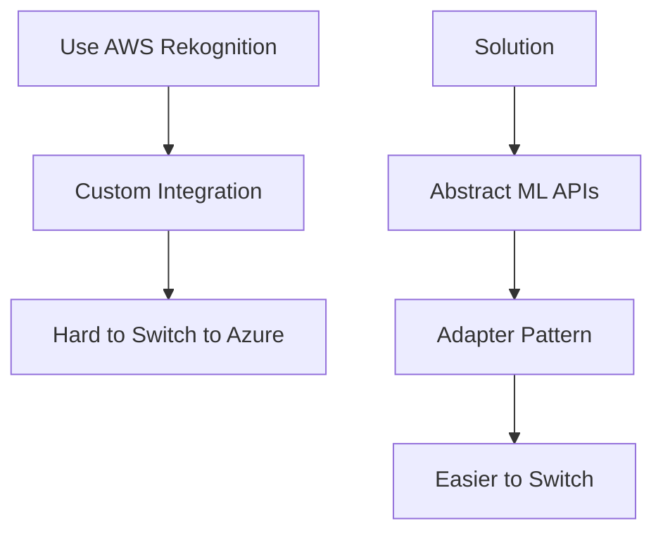

### 2. Data Privacy

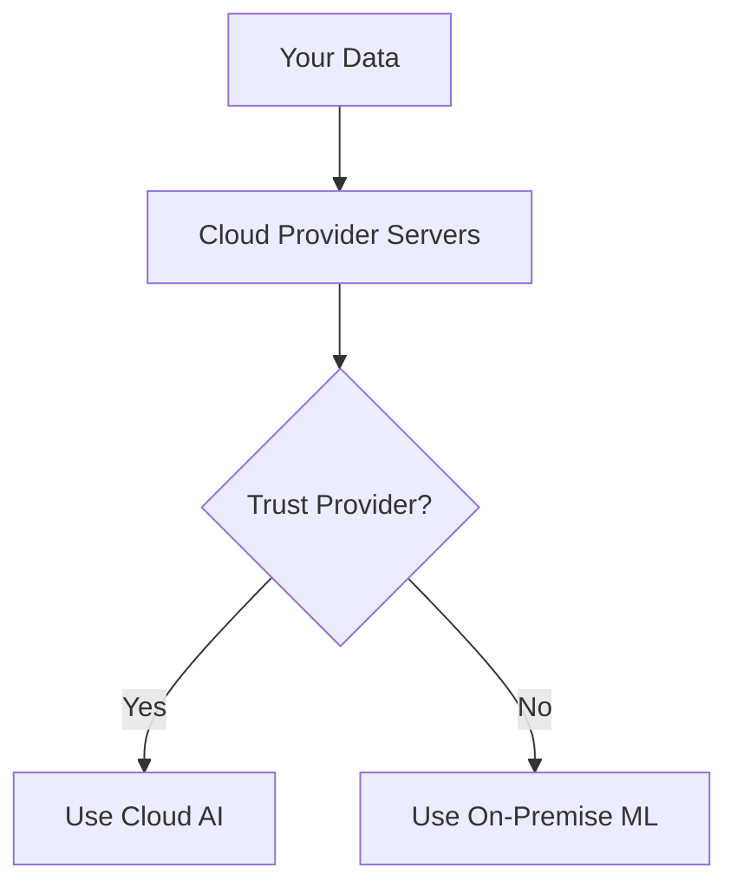

**Considerations:**
- Who owns the data?
- Is data used to improve models?
- Compliance (GDPR, HIPAA)?

### 3. Cost at Scale

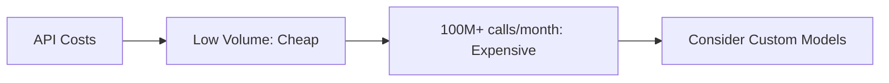

**Break-even analysis:**
- < 1M calls/month: Cloud AI cheaper
- 1M-10M: Depends on use case
- > 10M: Custom models may be cheaper

### 4. Accuracy Limitations

```
Pre-built models: 80-90% accuracy
Custom models: 90-99% accuracy (with good data)

For critical applications, may need custom training!
```

## The Future: AI Everywhere

```mermaid
graph TB
    A[Future of AI/ML] --> B[Edge AI]
    A --> C[Federated Learning]
    A --> D[AI for Code Generation]
    A --> E[Multimodal Models]
    
    B --> F[Run ML on devices]
    C --> G[Train without sharing data]
    D --> H[GitHub Copilot, etc.]
    E --> I[Understand text, image, audio together]
```

**Emerging Trends:**
- **AI as Code:** Infrastructure for ML as YAML
- **MLOps:** DevOps for Machine Learning
- **Responsible AI:** Bias detection, explainability
- **Tiny ML:** ML on microcontrollers

## Getting Started with Cloud AI/ML

### Beginner Path:

```mermaid
graph LR
    A[Week 1] --> B[Try Pre-built APIs]
    B --> C[Week 2-4: Build Simple Apps]
    C --> D[Month 2: AutoML]
    D --> E[Month 3+: Custom Models]
```

**First Project Ideas:**
1. **Image Classifier:** Upload photo, identify object
2. **Sentiment Analyzer:** Analyze tweet sentiment
3. **Voice Transcriber:** Convert audio to text
4. **Chatbot:** Simple Q&A bot

### Resources to Start:

**Free Tiers:**
- AWS: 5,000 images/month free (Rekognition)
- Google Cloud: $300 credit
- Azure: 5,000 transactions/month free

**Tutorials:**
- AWS ML tutorials (step-by-step)
- Google Colab (free Jupyter notebooks with GPUs!)
- Azure AI Fundamentals

## Conclusion

**Cloud has democratized AI/ML by:**

1. ✅ Removing infrastructure barriers
2. ✅ Providing pre-trained models
3. ✅ Making it affordable (pay-per-use)
4. ✅ Enabling rapid experimentation
5. ✅ Offering managed services
6. ✅ Scaling automatically

**Result:** Any developer, any business, any budget can now build intelligent applications!

```mermaid
graph LR
    A[AI/ML in Cloud] --> B[Accessibility]
    A --> C[Affordability]
    A --> D[Scalability]
    B --> E[Every Business]
    C --> E
    D --> E
    E --> F[Innovation Everywhere!]
```

---

## Learning Resources

### Getting Started
- [AWS Machine Learning Training](https://aws.amazon.com/training/learn-about/machine-learning/) - Free ML courses
- [Google ML Crash Course](https://developers.google.com/machine-learning/crash-course) - Beginner friendly
- [Azure AI Fundamentals](https://docs.microsoft.com/en-us/learn/paths/get-started-with-artificial-intelligence-on-azure/) - Microsoft Learn
- [Fast.ai](https://www.fast.ai/) - Practical deep learning

### Pre-built AI Services
- [AWS AI Services](https://aws.amazon.com/machine-learning/ai-services/) - Complete catalog
- [Google Cloud AI](https://cloud.google.com/products/ai) - Vision, Speech, NLP
- [Azure Cognitive Services](https://azure.microsoft.com/en-us/services/cognitive-services/) - Ready-to-use APIs

### AutoML Platforms
- [AWS SageMaker Autopilot](https://docs.aws.amazon.com/sagemaker/latest/dg/autopilot-automate-model-development.html) - Automated ML
- [Google Cloud AutoML](https://cloud.google.com/automl) - Custom models without code
- [Azure Machine Learning](https://azure.microsoft.com/en-us/services/machine-learning/) - End-to-end platform

### Hands-On Tutorials
- [AWS ML Tutorials](https://aws.amazon.com/getting-started/hands-on/?getting-started-all.sort-by=item.additionalFields.sortOrder&getting-started-all.sort-order=asc&awsf.getting-started-category=category%23machine-learning) - Step-by-step guides
- [Google Colab](https://colab.research.google.com/) - Free Jupyter with GPUs
- [Kaggle](https://www.kaggle.com/learn) - Practical ML courses
- [Hugging Face](https://huggingface.co/course) - NLP course

### Books
- "Hands-On Machine Learning" by Aurélien Géron
- "Building Machine Learning Powered Applications" by Emmanuel Ameisen
- "AI and Machine Learning for Coders" by Laurence Moroney
- "Machine Learning Design Patterns" by Lakshmanan, Robinson, Munn

### Courses & Certifications
- [AWS Certified Machine Learning](https://aws.amazon.com/certification/certified-machine-learning-specialty/) - ML specialty cert
- [Google Cloud ML Engineer](https://cloud.google.com/certification/machine-learning-engineer) - Professional cert
- [Coursera ML Specialization](https://www.coursera.org/specializations/machine-learning-introduction) - Andrew Ng
- [Deep Learning Specialization](https://www.deeplearning.ai/program/deep-learning-specialization/) - deeplearning.ai

### Tools & Frameworks
- [TensorFlow](https://www.tensorflow.org/) - Google's ML framework
- [PyTorch](https://pytorch.org/) - Facebook's ML framework
- [Scikit-learn](https://scikit-learn.org/) - Traditional ML library
- [MLflow](https://mlflow.org/) - ML lifecycle platform

### Communities
- [r/MachineLearning](https://www.reddit.com/r/MachineLearning/) - ML community
- [Kaggle Forums](https://www.kaggle.com/discussion) - Data science discussions
- [AI Stack Exchange](https://ai.stackexchange.com/) - Q&A
- [Papers with Code](https://paperswithcode.com/) - Latest research

### YouTube Channels
- [3Blue1Brown](https://www.youtube.com/c/3blue1brown) - Math intuition
- [StatQuest](https://www.youtube.com/c/joshstarmer) - ML concepts explained
- [Two Minute Papers](https://www.youtube.com/c/K%C3%A1rolyZsolnai) - Latest AI research
- [Sentdex](https://www.youtube.com/c/sentdex) - Python ML tutorials

### Datasets
- [AWS Open Data](https://registry.opendata.aws/) - Public datasets
- [Google Dataset Search](https://datasetsearch.research.google.com/) - Find datasets
- [Kaggle Datasets](https://www.kaggle.com/datasets) - Community datasets
- [UCI ML Repository](https://archive.ics.uci.edu/ml/index.php) - Classic datasets

### News & Blogs
- [AWS Machine Learning Blog](https://aws.amazon.com/blogs/machine-learning/) - Latest updates
- [Google AI Blog](https://ai.googleblog.com/) - Research and products
- [Towards Data Science](https://towardsdatascience.com/) - Community blog
- [Papers with Code](https://paperswithcode.com/) - Latest research

### Ethics & Responsible AI
- [Google AI Principles](https://ai.google/principles/) - Ethical AI
- [Microsoft Responsible AI](https://www.microsoft.com/en-us/ai/responsible-ai) - AI guidelines
- [AI Ethics Guidelines](https://www.unesco.org/en/artificial-intelligence/recommendation-ethics) - UNESCO recommendations
