```mermaid
graph TD
    A[Car Sensor Detects Obstacle] --> B{Processing Location}
    
    B -->|Cloud| C[Send to Cloud: 50ms]
    C --> D[Process: 100ms]
    D --> E[Response: 50ms]
    E --> F[Total: 200ms]
    F --> G[CRASH! 💥]
    
    B -->|Edge| H[Process Locally: 5ms]
    H --> I[Apply Brakes Immediately]
    I --> J[SAFE! ✅]
```

# The Rise of Edge Computing: Is it a threat or a complement to the traditional cloud?

## Introduction

Edge computing is bringing computation closer to where data is generated. Is this the end of cloud computing, or the beginning of something better? Let's explore!

## What is Edge Computing?

Think of edge computing as having **mini data centers everywhere** instead of one giant data center far away.


**Key Difference:**
- **Cloud:** Process data thousands of miles away
- **Edge:** Process data at or near the source

## Why Edge Computing is Rising

### 1. Latency Requirements


**Real-World Example: Autonomous Vehicles**



**Verdict:** Some applications CANNOT tolerate cloud latency!

### 2. Bandwidth Costs


**Savings:** 99.9%! ($71,928/month)

### 3. Privacy & Compliance

```mermaid
graph LR
    A[Hospital Patient Data] --> B{Where to Process?}
    
    B -->|Cloud| C[Send to Cloud]
    C --> D[Privacy Risk]
    C --> E[Compliance Issues]
    C --> F[Data Breach Risk]
    
    B -->|Edge| G[Process Locally]
    G --> H[Data Never Leaves Hospital]
    H --> I[HIPAA Compliant ✅]
```



**Example:** Healthcare imaging analysis at hospital edge servers

### 4. Reliability (Offline Operation)

```mermaid
graph TB
    A[Internet Outage] --> B{System Response}
    
    C[Cloud-Only] --> D[Complete Failure ❌]
    
    E[Edge Computing] --> F[Continue Operating ✅]
    F --> G[Sync When Back Online]
```



**Real Example:** Oil rigs in the ocean - internet is unreliable!

## Edge vs. Cloud: The Comparison


| Factor | Cloud | Edge | Winner |
|--------|-------|------|--------|
| **Latency** | 50-500ms | 1-10ms | Edge |
| **Scalability** | Unlimited | Limited | Cloud |
| **Bandwidth Cost** | High (send all data) | Low (process locally) | Edge |
| **Management** | Easy (centralized) | Complex (distributed) | Cloud |
| **Offline Operation** | No | Yes | Edge |
| **Compute Power** | Massive | Limited | Cloud |
| **Cost (per location)** | Low | Higher | Cloud |

## Is Edge a Threat to Cloud?

### The Threat Perspective ⚠️


**Arguments:**
- Edge processes data locally → less cloud workload
- Edge reduces bandwidth → less cloud data transfer fees
- Edge enables offline → less cloud dependency

### The Reality: It's a Complement! 🤝


**The Truth:** Edge and Cloud work TOGETHER!

## The Cloud-Edge Continuum


**Each layer has a purpose:**

**Edge (Milliseconds):**
- Immediate decision making
- Real-time filtering
- Privacy-sensitive processing
- Offline operation

**Regional Cloud (Seconds):**
- Aggregation from multiple edges
- Regional analytics
- Load balancing
- Content caching

**Central Cloud (Minutes/Hours):**
- Global analytics
- ML model training
- Long-term storage
- Business intelligence

## Real-World Architectures

### Example 1: Smart Retail Store


**Flow:**
1. **Edge:** Real-time customer tracking, instant checkout
2. **Regional:** Aggregate 50 stores, regional insights
3. **Central:** Train better ML models, global strategy

### Example 2: Autonomous Vehicle Fleet


**Why Each Layer:**
- **Vehicle Edge:** Safety-critical, can't wait for network
- **Cellular Edge:** Near-real-time coordination
- **Cloud:** Long-term learning and optimization

### Example 3: Industrial IoT (Smart Factory)


**Data Flow:**
- **1000 sensors → Edge:** 1 GB/sec
- **Edge → Factory Cloud:** 1 MB/sec (filtered)
- **Factory → Central:** 1 KB/sec (alerts only)

**Bandwidth reduction:** 99.9999%!

## Cloud Providers' Edge Strategies

### AWS Edge Services


**Example: AWS Outposts**
- AWS hardware in YOUR data center
- Run AWS services locally
- Consistent experience with cloud

### Azure Edge Services


### Google Edge Services


**Observation:** ALL major cloud providers are INVESTING in edge!

**This proves:** Edge complements, doesn't replace cloud!

## The Hybrid Edge-Cloud Model


**Real-World Pattern:**
1. **Collect** at edge
2. **Filter** at edge
3. **Process** immediate needs at edge
4. **Send** insights to cloud
5. **Train** ML models in cloud
6. **Deploy** updated models to edge
7. **Repeat**

## Use Cases: When to Use What?

### Use Edge When:

✅ Latency < 50ms required  
✅ Large data volume (reduce bandwidth)  
✅ Privacy/compliance demands local processing  
✅ Offline operation needed  
✅ Real-time critical decisions  

**Examples:**
- Autonomous vehicles
- Industrial automation
- AR/VR applications
- Smart cities
- Healthcare devices

### Use Cloud When:

✅ Need unlimited scale  
✅ Complex ML training  
✅ Global data aggregation  
✅ Cost-effective compute  
✅ Centralized management  

**Examples:**
- Web applications
- Big data analytics
- ML model training
- Global SaaS platforms
- Backup and archival

### Use Both When:

✅ IoT at scale  
✅ Real-time + analytics  
✅ Edge AI with cloud training  
✅ Distributed applications  

**Examples:**
- Smart manufacturing
- Connected vehicles
- Retail analytics
- Smart buildings
- Healthcare systems

## The Future: Edge + Cloud Together


**Emerging Trends:**

**1. 5G + Edge**
- Telecom providers offer edge compute
- <10ms latency for mobile apps
- New use cases: Remote surgery, cloud gaming

**2. Edge AI**
- ML inference at edge
- Privacy-preserving ML
- Offline intelligence

**3. Kubernetes Everywhere**
- Same orchestration edge to cloud
- Workload mobility
- Consistent operations

**4. WebAssembly at Edge**
- Lightweight edge apps
- Language-agnostic
- Portable across edge platforms

## Cost Considerations

### Edge Computing Costs:

```
Initial: Higher per location
- Edge hardware: $5K-50K per site
- Installation: $2K-10K
- Ongoing: $500-2K/month per site

For 100 locations: $500K initial + $100K/month
```

### Cloud Computing Costs:

```
Initial: Low
- No hardware purchase
- Start immediately

Ongoing: Variable
- Compute: Pay per use
- Bandwidth: High with large data
- Storage: $0.023/GB/month

For same workload: $50K/month (mostly bandwidth!)
```

### Break-even Analysis:


**When Edge Makes Financial Sense:**
- High bandwidth usage (TB/day)
- Many distributed locations
- Long-term deployment (>1 year)

## Challenges of Edge Computing


**Challenges:**
1. ❌ Managing 1000s of edge locations
2. ❌ Securing distributed devices
3. ❌ Physical hardware failures
4. ❌ Limited compute/storage at edge
5. ❌ Network connectivity issues

**Solutions:**
1. ✅ Centralized management platforms
2. ✅ Zero-trust security models
3. ✅ Remote monitoring and updates
4. ✅ Hybrid edge-cloud architecture
5. ✅ Offline-first design patterns

## The Verdict: Complement, Not Threat!

```mermaid
graph TB
    A[Edge Computing] --> B[Extends Cloud]
    A --> C[Enables New Use Cases]
    A --> D[Increases Cloud Value]
    
    E[Together] --> F[Better Than Either Alone]
    
    G[Cloud] --> H[Provides Intelligence]
    G --> I[Manages Edge]
    G --> J[Stores Long-term Data]
    
    K[Edge] --> L[Provides Low Latency]
    K --> M[Reduces Bandwidth]
    K --> N[Enables Privacy]
```

**The Future is Distributed Computing:**
- Edge for immediacy
- Cloud for intelligence
- Together for innovation

**Proof:** Cloud revenue is GROWING despite edge adoption!
- AWS: $80B+ (growing 20%/year)
- Azure: $60B+ (growing 30%/year)
- GCP: $26B+ (growing 35%/year)

Edge isn't taking from cloud - it's **creating NEW markets** and **expanding the cloud ecosystem**!

---

## Learning Resources

### Edge Computing Fundamentals
- [What is Edge Computing?](https://www.cloudflare.com/learning/serverless/glossary/what-is-edge-computing/) - Cloudflare guide
- [Edge Computing Consortium](https://www.ecconsortium.net/) - Industry standards
- [Linux Foundation Edge](https://www.lfedge.org/) - Open source edge projects

### Cloud Provider Edge Solutions
- [AWS Edge Services](https://aws.amazon.com/edge/) - Complete AWS edge stack
- [Azure Edge](https://azure.microsoft.com/en-us/solutions/edge-computing/) - Microsoft edge solutions
- [Google Distributed Cloud](https://cloud.google.com/distributed-cloud) - GCP edge offerings

### 5G and Edge
- [5G Edge Computing](https://www.gsma.com/futurenetworks/technology/edge-computing/) - GSMA guide
- [AWS Wavelength](https://aws.amazon.com/wavelength/) - 5G edge compute
- [Azure Edge Zones](https://azure.microsoft.com/en-us/services/edge-zones/) - 5G integration

### IoT and Edge
- [AWS IoT Greengrass](https://aws.amazon.com/greengrass/) - Edge runtime for IoT
- [Azure IoT Edge](https://azure.microsoft.com/en-us/services/iot-edge/) - IoT edge computing
- [Google Cloud IoT Edge](https://cloud.google.com/solutions/iot) - GCP IoT edge

### Edge AI
- [Edge AI Overview](https://www.youtube.com/results?search_query=edge+ai+explained) - Video tutorials
- [TensorFlow Lite](https://www.tensorflow.org/lite) - ML for edge devices
- [NVIDIA Edge AI](https://www.nvidia.com/en-us/autonomous-machines/embedded-systems/) - Jetson platform

### Use Cases & Case Studies
- [Edge Computing Use Cases](https://stlpartners.com/research/edge-computing-use-cases/) - Industry examples
- [AWS Edge Case Studies](https://aws.amazon.com/edge/case-studies/) - Real implementations
- [Smart Factory Edge](https://www.siemens.com/global/en/products/automation/topic-areas/edge-computing.html) - Industrial IoT

### Architecture Patterns
- [Edge Architecture Patterns](https://docs.microsoft.com/en-us/azure/architecture/guide/edge/edge-patterns) - Microsoft guide
- [Hybrid Cloud-Edge Design](https://aws.amazon.com/architecture/) - AWS patterns
- [Kubernetes at Edge](https://kubernetes.io/docs/setup/production-environment/turnkey/kubernetes-at-edge/) - K8s edge deployments

### Books
- "Edge Computing: Models, Technologies and Applications" by Rajkumar Buyya
- "Edge and Fog Computing: Principles and Paradigms" by Buyya & Srirama
- "Building Edge Applications with AWS" by various AWS authors

### Research & Whitepapers
- [OpenFog Reference Architecture](https://www.iiconsortium.org/pdf/OpenFog_Reference_Architecture_2_09_17.pdf) - Industry standard
- [Edge Computing Research](https://ieeexplore.ieee.org/Xplore/home.jsp) - Academic papers
- [Gartner Edge Computing Reports](https://www.gartner.com/en/information-technology/glossary/edge-computing) - Market analysis

### Tools & Platforms
- [K3s](https://k3s.io/) - Lightweight Kubernetes for edge
- [EdgeX Foundry](https://www.edgexfoundry.org/) - Open source edge platform
- [Apache Edgent](https://edgent.apache.org/) - Stream processing at edge

### Communities
- [r/edgecomputing](https://www.reddit.com/r/edgecomputing/) - Reddit discussions
- [Edge Computing World](https://www.edgecomputingworld.com/) - Industry events
- [LF Edge Community](https://wiki.lfedge.org/) - Linux Foundation edge

### Courses
- [Edge Computing Fundamentals](https://www.coursera.org/learn/edge-computing) - Coursera
- [AWS IoT Training](https://aws.amazon.com/training/learn-about/iot/) - Free courses
- [Azure IoT Learning Path](https://docs.microsoft.com/en-us/learn/paths/introduction-to-azure-iot/) - Microsoft Learn

### News & Blogs
- [Edge Computing News](https://www.edgecomputingnews.com/) - Industry news
- [AWS IoT Blog](https://aws.amazon.com/blogs/iot/) - Edge updates
- [The New Stack - Edge](https://thenewstack.io/category/edge-iot/) - Technical articles
