# The Rise of Edge Computing: Is it a threat or a complement to the traditional cloud?

## Introduction

Good morning! Today I want to address a question that's causing debate in the tech industry: Is edge computing a threat to traditional cloud computing, or is it actually a complement? The answer might surprise you. Let me explain.

## What is Edge Computing?

Edge computing is simple: instead of having one giant data center thousands of miles away, you put mini data centers everywhere - close to where data is being generated. Think of it like this: the traditional cloud is like having one massive grocery warehouse in the center of the country. Edge computing is like having convenience stores in every neighborhood. Different purposes, different advantages.

The key difference is latency. With traditional cloud, your IoT device sends data across the internet to a data center far away, which takes one hundred to five hundred milliseconds. With edge computing, you process data right there locally, taking only one to ten milliseconds. For some applications, that difference is life or death - literally.


*On the left, traditional cloud means data travels long distances to centralized data centers with 100-500ms latency. On the right, edge computing processes locally with just 1-10ms latency - crucial for real-time applications.*

## Why Edge Computing is Rising

Let me explain four reasons edge computing is becoming critical.

**First: Latency Requirements.** For email, one second latency is perfectly fine. For video streaming, one hundred milliseconds works. For online gaming, fifty milliseconds is critical. But for autonomous vehicles? You need under ten milliseconds or people die. Imagine a car detecting an obstacle. If it sends the image to a cloud data center, waits for processing, and waits for a response, that's two hundred milliseconds. In that time, at highway speeds, you've already crashed. But process it at the edge in five milliseconds, and you brake immediately and survive. Some applications simply cannot tolerate cloud latency.

```mermaid
graph TD
    A[Car Sensor Detects Obstacle] --> B{Processing Location}
    
    B -->|Cloud| C[Send to Cloud: 50ms]
    C --> D[Process: 100ms]
    D --> E[Response: 50ms]
    E --> F[Total: 200ms]
    F --> G[CRASH! 💥]
    
    B -->|Edge| H[Process Locally: 5ms]
    H --> I[Apply Brakes Immediately]
    I --> J[SAFE! ✅]
```



*This diagram shows why autonomous vehicles need edge computing: cloud processing takes 200ms total - too slow to avoid accidents. Edge processing takes 5ms, allowing immediate braking to avoid crashes.*

### 2. Bandwidth Costs


**Savings:** 99.9%! ($71,928/month)

### 3. Privacy & Compliance

```mermaid
graph LR
    A[Hospital Patient Data] --> B{Where to Process?}
    
    B -->|Cloud| C[Send to Cloud]
    C --> D[Privacy Risk]
    C --> E[Compliance Issues]
    C --> F[Data Breach Risk]
    
    B -->|Edge| G[Process Locally]
    G --> H[Data Never Leaves Hospital]
    H --> I[HIPAA Compliant ✅]
```



**Example:** Healthcare imaging analysis at hospital edge servers

### 4. Reliability (Offline Operation)

```mermaid
graph TB
    A[Internet Outage] --> B{System Response}
    
    C[Cloud-Only] --> D[Complete Failure ❌]

**Second: Bandwidth Costs.** Imagine a factory with a thousand cameras monitoring production. If you send all that video to the cloud, you're transmitting a thousand gigabytes per hour. That's seven hundred twenty thousand gigabytes per month. At typical cloud data transfer rates, that costs seventy-two thousand dollars monthly! But if you process the video at the edge and only send alerts when something's wrong, you're sending maybe one gigabyte per hour. That's only seventy-two dollars per month. The savings are ninety-nine point nine percent. Edge computing isn't just faster - it's dramatically cheaper for high-volume data.

```mermaid
graph TB
    A[Factory with 1000 Cameras] --> B{Send All to Cloud?}
    
    B --> C[Video Data: 1000 GB/hour]
    C --> D[Monthly Data: 720,000 GB]
    D --> E[Cost: $72,000/month!]
    
    B --> F[Process at Edge]
    F --> G[Send Only Alerts: 1 GB/hour]
    G --> H[Monthly Data: 720 GB]
    H --> I[Cost: $72/month!]
```

*This comparison shows the massive cost difference: sending raw video to the cloud costs $72,000 monthly, but edge processing with alert-only uploads costs just $72 monthly - a 99.9% savings.*

**Third: Privacy and Compliance.** Consider hospital patient data. Healthcare regulations like HIPAA require strict data protection. If you process patient data at the edge - right there in the hospital - the data never leaves the building. It stays compliant, private, and secure. But send it to the cloud? Now you have privacy risks, compliance complications, and potential data breach liability. For sensitive data, edge computing isn't optional - it's required.

**Fourth: Reliability.** What happens when internet goes down? If you're cloud-only, everything stops completely. But with edge computing, you continue operating locally and sync when connectivity returns. Think about oil rigs in the middle of the ocean where internet is unreliable, or factories in remote locations, or even retail stores during internet outages. Edge computing keeps them running.

## Edge vs. Cloud: Complement, Not Threat

Now here's the truth that surprises people: Edge computing is not replacing cloud computing - they work together. Let me explain the modern architecture.

You have three layers: The edge handles immediate, real-time processing - things that need millisecond responses. The regional cloud does aggregation from multiple edge locations and runs regional services. The central cloud does the heavy lifting - training machine learning models, long-term storage, global analytics, business intelligence.

Each layer has a purpose. Think about a fleet of autonomous vehicles. The vehicle's onboard computer - the edge - handles obstacle detection in under five milliseconds because that's safety-critical and cannot wait for network communication. The cellular edge handles traffic updates and fleet coordination in under fifty milliseconds. The central cloud handles route optimization, trains better AI models, and generates analytics. None of these layers can replace the others - they complement each other.


*The cloud-edge continuum: devices connect to edge in milliseconds for immediate response, edge connects to regional cloud in seconds for real-time processing, regional connects to central cloud in minutes for analytics and ML training. Each layer serves distinct purposes.*

## The Bottom Line

Here's what you need to understand: Edge computing isn't a threat to cloud providers - in fact, AWS, Microsoft, and Google are the ones building edge infrastructure! They offer AWS Wavelength, Azure Stack Edge, and Google Distributed Cloud because they understand the future is distributed computing across the entire continuum from device to edge to cloud.

Edge computing handles what it's best at: ultra-low latency, bandwidth efficiency, privacy, offline operation. Cloud computing handles what it's best at: unlimited scale, centralized management, massive compute power, easy updates. Together, they create better architectures than either could alone.

## My Final Advice

If you're designing systems today, don't think "edge OR cloud" - think "edge AND cloud." Put immediate processing at the edge where it needs to be fast. Put heavy computation in the cloud where you have unlimited resources. Use the cloud to train models, deploy them to the edge for inference. This complementary approach is the future of distributed computing.

Edge computing isn't killing the cloud - it's extending it. Thank you!

---

## Learning Resources


**Observation:** ALL major cloud providers are INVESTING in edge!

**This proves:** Edge complements, doesn't replace cloud!

## The Hybrid Edge-Cloud Model


**Real-World Pattern:**
1. **Collect** at edge
2. **Filter** at edge
3. **Process** immediate needs at edge
4. **Send** insights to cloud
5. **Train** ML models in cloud
6. **Deploy** updated models to edge
7. **Repeat**

## Use Cases: When to Use What?

### Use Edge When:

✅ Latency < 50ms required  
✅ Large data volume (reduce bandwidth)  
✅ Privacy/compliance demands local processing  
✅ Offline operation needed  
✅ Real-time critical decisions  

**Examples:**
- Autonomous vehicles
- Industrial automation
- AR/VR applications
- Smart cities
- Healthcare devices

### Use Cloud When:

✅ Need unlimited scale  
✅ Complex ML training  
✅ Global data aggregation  
✅ Cost-effective compute  
✅ Centralized management  

**Examples:**
- Web applications
- Big data analytics
- ML model training
- Global SaaS platforms
- Backup and archival

### Use Both When:

✅ IoT at scale  
✅ Real-time + analytics  
✅ Edge AI with cloud training  
✅ Distributed applications  

**Examples:**
- Smart manufacturing
- Connected vehicles
- Retail analytics
- Smart buildings
- Healthcare systems

## The Future: Edge + Cloud Together


**Emerging Trends:**

**1. 5G + Edge**
- Telecom providers offer edge compute
- <10ms latency for mobile apps
- New use cases: Remote surgery, cloud gaming

**2. Edge AI**
- ML inference at edge
- Privacy-preserving ML
- Offline intelligence

**3. Kubernetes Everywhere**
- Same orchestration edge to cloud
- Workload mobility
- Consistent operations

**4. WebAssembly at Edge**
- Lightweight edge apps
- Language-agnostic
- Portable across edge platforms

## Cost Considerations

### Edge Computing Costs:

```
Initial: Higher per location
- Edge hardware: $5K-50K per site
- Installation: $2K-10K
- Ongoing: $500-2K/month per site

For 100 locations: $500K initial + $100K/month
```

### Cloud Computing Costs:

```
Initial: Low
- No hardware purchase
- Start immediately

Ongoing: Variable
- Compute: Pay per use
- Bandwidth: High with large data
- Storage: $0.023/GB/month

For same workload: $50K/month (mostly bandwidth!)
```

### Break-even Analysis:


**When Edge Makes Financial Sense:**
- High bandwidth usage (TB/day)
- Many distributed locations
- Long-term deployment (>1 year)

## Challenges of Edge Computing


**Challenges:**
1. ❌ Managing 1000s of edge locations
2. ❌ Securing distributed devices
3. ❌ Physical hardware failures
4. ❌ Limited compute/storage at edge
5. ❌ Network connectivity issues

**Solutions:**
1. ✅ Centralized management platforms
2. ✅ Zero-trust security models
3. ✅ Remote monitoring and updates
4. ✅ Hybrid edge-cloud architecture
5. ✅ Offline-first design patterns

## The Verdict: Complement, Not Threat!


**The Future is Distributed Computing:**
- Edge for immediacy
- Cloud for intelligence
- Together for innovation

**Proof:** Cloud revenue is GROWING despite edge adoption!
- AWS: $80B+ (growing 20%/year)
- Azure: $60B+ (growing 30%/year)
- GCP: $26B+ (growing 35%/year)

Edge isn't taking from cloud - it's **creating NEW markets** and **expanding the cloud ecosystem**!

---

## Learning Resources

### Edge Computing Fundamentals
- [What is Edge Computing?](https://www.cloudflare.com/learning/serverless/glossary/what-is-edge-computing/) - Cloudflare guide
- [Edge Computing Consortium](https://www.ecconsortium.net/) - Industry standards
- [Linux Foundation Edge](https://www.lfedge.org/) - Open source edge projects

### Cloud Provider Edge Solutions
- [AWS Edge Services](https://aws.amazon.com/edge/) - Complete AWS edge stack
- [Azure Edge](https://azure.microsoft.com/en-us/solutions/edge-computing/) - Microsoft edge solutions
- [Google Distributed Cloud](https://cloud.google.com/distributed-cloud) - GCP edge offerings

### 5G and Edge
- [5G Edge Computing](https://www.gsma.com/futurenetworks/technology/edge-computing/) - GSMA guide
- [AWS Wavelength](https://aws.amazon.com/wavelength/) - 5G edge compute
- [Azure Edge Zones](https://azure.microsoft.com/en-us/services/edge-zones/) - 5G integration

### IoT and Edge
- [AWS IoT Greengrass](https://aws.amazon.com/greengrass/) - Edge runtime for IoT
- [Azure IoT Edge](https://azure.microsoft.com/en-us/services/iot-edge/) - IoT edge computing
- [Google Cloud IoT Edge](https://cloud.google.com/solutions/iot) - GCP IoT edge

### Edge AI
- [Edge AI Overview](https://www.youtube.com/results?search_query=edge+ai+explained) - Video tutorials
- [TensorFlow Lite](https://www.tensorflow.org/lite) - ML for edge devices
- [NVIDIA Edge AI](https://www.nvidia.com/en-us/autonomous-machines/embedded-systems/) - Jetson platform

### Use Cases & Case Studies
- [Edge Computing Use Cases](https://stlpartners.com/research/edge-computing-use-cases/) - Industry examples
- [AWS Edge Case Studies](https://aws.amazon.com/edge/case-studies/) - Real implementations
- [Smart Factory Edge](https://www.siemens.com/global/en/products/automation/topic-areas/edge-computing.html) - Industrial IoT

### Architecture Patterns
- [Edge Architecture Patterns](https://docs.microsoft.com/en-us/azure/architecture/guide/edge/edge-patterns) - Microsoft guide
- [Hybrid Cloud-Edge Design](https://aws.amazon.com/architecture/) - AWS patterns
- [Kubernetes at Edge](https://kubernetes.io/docs/setup/production-environment/turnkey/kubernetes-at-edge/) - K8s edge deployments

### Books
- "Edge Computing: Models, Technologies and Applications" by Rajkumar Buyya
- "Edge and Fog Computing: Principles and Paradigms" by Buyya & Srirama
- "Building Edge Applications with AWS" by various AWS authors

### Research & Whitepapers
- [OpenFog Reference Architecture](https://www.iiconsortium.org/pdf/OpenFog_Reference_Architecture_2_09_17.pdf) - Industry standard
- [Edge Computing Research](https://ieeexplore.ieee.org/Xplore/home.jsp) - Academic papers
- [Gartner Edge Computing Reports](https://www.gartner.com/en/information-technology/glossary/edge-computing) - Market analysis

### Tools & Platforms
- [K3s](https://k3s.io/) - Lightweight Kubernetes for edge
- [EdgeX Foundry](https://www.edgexfoundry.org/) - Open source edge platform
- [Apache Edgent](https://edgent.apache.org/) - Stream processing at edge

### Communities
- [r/edgecomputing](https://www.reddit.com/r/edgecomputing/) - Reddit discussions
- [Edge Computing World](https://www.edgecomputingworld.com/) - Industry events
- [LF Edge Community](https://wiki.lfedge.org/) - Linux Foundation edge

### Courses
- [Edge Computing Fundamentals](https://www.coursera.org/learn/edge-computing) - Coursera
- [AWS IoT Training](https://aws.amazon.com/training/learn-about/iot/) - Free courses
- [Azure IoT Learning Path](https://docs.microsoft.com/en-us/learn/paths/introduction-to-azure-iot/) - Microsoft Learn

### News & Blogs
- [Edge Computing News](https://www.edgecomputingnews.com/) - Industry news
- [AWS IoT Blog](https://aws.amazon.com/blogs/iot/) - Edge updates
- [The New Stack - Edge](https://thenewstack.io/category/edge-iot/) - Technical articles
