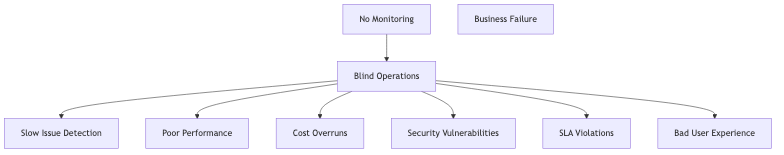
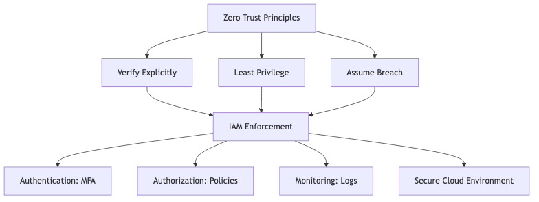

# Bare-Metal vs. Hosted Hypervisors (Type 1 vs. Type 2): When does the extra overhead of a Hosted Hypervisor become a benefit rather than a drawback?

## Introduction

Hypervisors come in two flavors: Type 1 (bare-metal) and Type 2 (hosted). Everyone says Type 1 is "better" for production, but when does Type 2's "overhead" actually become an ADVANTAGE? Let's find out!

## Understanding Hypervisors

### What is a Hypervisor?

A hypervisor (or Virtual Machine Monitor) is software that creates and runs virtual machines.


Think of it as the **landlord of an apartment building**, managing multiple tenants (VMs) in one building (physical server).

## Type 1: Bare-Metal Hypervisor

### Architecture


**Key Characteristic:** Runs DIRECTLY on hardware, no underlying OS!

### Examples:
- **VMware ESXi** (most popular)
- **Microsoft Hyper-V** (enterprise)
- **Citrix XenServer**
- **KVM** (Linux kernel-based)
- **Oracle VM Server**

### Typical Use:
- Data centers
- Enterprise servers
- Cloud providers (AWS, Azure use Type 1)
- Production environments

### Pros & Cons

**Pros:**
- 🟢 **Maximum Performance** - No OS overhead
- 🟢 **Better Resource Utilization** - Direct hardware access
- 🟢 **Enhanced Security** - Smaller attack surface
- 🟢 **Stability** - Minimal dependencies
- 🟢 **Can Run Multiple OS Types** - Windows, Linux, etc.

**Cons:**
- 🔴 **Dedicated Hardware Required** - Can't use for other purposes
- 🔴 **Complex Management** - Requires specialized knowledge
- 🔴 **Expensive Licensing** - VMware ESXi costs $$$$
- 🔴 **Hardware Compatibility** - Limited driver support

## Type 2: Hosted Hypervisor

### Architecture


**Key Characteristic:** Runs ON TOP of a regular operating system!

### Examples:
- **VMware Workstation** (Windows/Linux)
- **VMware Fusion** (macOS)
- **Oracle VirtualBox** (free, cross-platform)
- **Parallels Desktop** (macOS)
- **QEMU** (open source)

### Typical Use:
- Developer machines
- Testing environments
- Training/education
- Desktop virtualization
- Personal use

### Pros & Cons

**Pros:**
- 🟢 **Easy to Install** - Install like any app
- 🟢 **Use Existing Hardware** - Runs on your laptop/desktop
- 🟢 **Familiar Interface** - Works with host OS
- 🟢 **Device Support** - Use host OS drivers
- 🟢 **Cost-Effective** - VirtualBox is free!

**Cons:**
- 🔴 **Performance Overhead** - Extra OS layer
- 🔴 **Resource Sharing** - Competes with host OS
- 🔴 **Stability Issues** - Host OS crash = VM crash
- 🔴 **Less Efficient** - More memory/CPU usage

## The Traditional View: Type 1 is Better

### Performance Comparison


**Typical Benchmark:**

| Task | Type 1 (ESXi) | Type 2 (VirtualBox) | Difference |
|------|---------------|---------------------|------------|
| CPU | 98% | 92% | 6% slower |
| Memory | 99% | 90% | 9% slower |
| Disk I/O | 95% | 80% | 15% slower |
| Network | 97% | 88% | 9% slower |

**Conclusion:** Type 2 is 5-15% slower due to host OS overhead.

## When Type 2's "Overhead" Becomes a BENEFIT

### 1. Development & Testing

**Scenario:** Developer needs to test app on multiple OS versions


**Why Type 2 Wins:**
- ✅ **Easy File Sharing** - Drag & drop between host and VM
- ✅ **Quick Snapshots** - Test, break, rollback instantly
- ✅ **Use Host Tools** - IDE, browser, git on host OS
- ✅ **No Dedicated Hardware** - Use existing laptop
- ✅ **Cost:** Free (VirtualBox) vs. $$$$ (additional server)

**Real Example:**
```
Web developer on macOS:
- Host: VS Code, Chrome DevTools
- VM 1: Test on Windows Edge browser
- VM 2: Test on Linux Firefox
- VM 3: Test backend on Ubuntu server

Type 2 overhead (10%) doesn't matter - convenience matters!
```

### 2. Education & Training

**Scenario:** Teaching cloud computing to 30 students


**Why Type 2 Wins:**
- ✅ **Zero Infrastructure Cost** - Use existing computers
- ✅ **Easy Distribution** - Share VM images via USB/download
- ✅ **Familiar Environment** - Students use own OS
- ✅ **Portable** - Take VMs home
- ✅ **Safe Experimentation** - Break things without consequences

**The "overhead" doesn't matter** when the alternative is $50K!

### 3. Demo & Sales Environments

**Scenario:** Sales engineer demonstrating software at client site


**Why Type 2 Wins:**
- ✅ **Offline Demos** - Works without internet
- ✅ **Predictable Performance** - No cloud latency surprises
- ✅ **Quick Setup** - Start VM in seconds
- ✅ **Multiple Scenarios** - Different VMs for different demos
- ✅ **No Monthly Costs** - Unlike cloud VMs

**The "overhead"** is irrelevant when the alternative is "demo failed due to bad WiFi"!

### 4. Legacy Software Testing

**Scenario:** Need to run old software on Windows XP (security risk on bare metal)


**Why Type 2 Wins:**
- ✅ **Security Isolation** - Old OS can't harm host
- ✅ **Snapshots** - Rollback if infected
- ✅ **Use When Needed** - Not running 24/7
- ✅ **Host OS Protection** - Modern security features
- ✅ **Easy Backup** - Copy VM file

**The "overhead"** is a small price for security!

### 5. Home Lab & Personal Projects

**Scenario:** Learning Kubernetes on home computer


**Why Type 2 Wins:**
- ✅ **Multi-Purpose Hardware** - Same PC for everything
- ✅ **Free Software** - VirtualBox costs $0
- ✅ **Learn Anytime** - Start/stop VMs as needed
- ✅ **No Additional Costs** - No cloud bills
- ✅ **Pause VMs** - Free up resources for gaming

**Alternative:** Buy dedicated server ($2000) + monthly costs  
**Type 2 Solution:** $0 using existing hardware!

### 6. Troubleshooting & Forensics

**Scenario:** Analyzing malware sample safely


**Why Type 2 Wins:**
- ✅ **Host OS Protected** - Malware can't escape VM
- ✅ **Quick Reset** - Restore snapshot after analysis
- ✅ **Network Isolation** - Disconnect VM from network
- ✅ **Use Host Tools** - Wireshark, debuggers on host
- ✅ **Multiple Samples** - Different VMs for different malware

**The "overhead"** is irrelevant for security research!

### 7. Desktop Application Development

**Scenario:** Developing desktop app for multiple platforms

```mermaid
graph LR
    A[Developer on Windows] --> B[Host: Windows 11]
    B --> C[VMware Workstation]
    C --> D[VM: macOS (Hackintosh)]
    C --> E[VM: Linux]
    
    F[Test on All Platforms] --> G[One Machine]
```

**Why Type 2 Wins:**
- ✅ **Unified Workspace** - One keyboard, one monitor
- ✅ **Shared Codebase** - Access from all VMs
- ✅ **Quick Testing** - Switch between OS in seconds
- ✅ **Integrated Workflow** - Copy/paste between systems
- ✅ **Cost Savings** - No need for Mac + PC + Linux box

### 8. Device Driver Development

**Scenario:** Developing Windows device driver


**Why Type 2 Wins:**
- ✅ **Crash Isolation** - Driver crash won't kill host
- ✅ **Quick Recovery** - Restart VM, not entire machine
- ✅ **Debugging Tools on Host** - Professional tools available
- ✅ **Multiple Test VMs** - Different Windows versions
- ✅ **Snapshots** - Quick rollback after crashes

**Real Story:** Kernel developer saves 2 hours/day not rebooting!

## When The "Extra Layer" is Actually PROTECTION


**Type 2 Benefits:**
- ✅ Use host OS backup software
- ✅ Use host OS antivirus/security
- ✅ Use host OS performance monitoring
- ✅ Use host OS networking tools
- ✅ Access VM files directly from host

## Performance: When It Doesn't Matter



**Performance matters when:**
- Serving real users 24/7
- Running at scale (100+ VMs)
- High I/O workloads
- Cost optimization critical

**Performance doesn't matter when:**
- Learning/experimenting
- Short-term testing
- Occasional use
- Convenience > speed

## Cost Analysis: The Hidden Benefit

### Scenario: Dev Team of 10 People

**Option 1: Type 1 (ESXi Server)**
```
Server Hardware: $10,000
VMware vSphere License: $5,000
Setup Time: 2 weeks
Management: $500/month
Total Year 1: $21,000
```

**Option 2: Type 2 (VirtualBox on Laptops)**
```
Software Cost: $0 (free)
Hardware: Use existing laptops
Setup Time: 1 hour
Management: Minimal
Total Year 1: $0
```

**Savings: $21,000!**

The "overhead" costs nothing. The alternative costs $21K!

## The Verdict: When Type 2 Wins


**Type 2 is better when:**
- ✅ **Convenience** matters more than performance
- ✅ **Cost** matters more than efficiency
- ✅ **Flexibility** matters more than speed
- ✅ **Portability** matters (laptop vs server)
- ✅ **Quick setup** needed
- ✅ **Temporary** use cases
- ✅ **Learning** environment
- ✅ **Using existing hardware**

## Modern Developments: Gap is Closing!



**Technology Improvements:**
- Intel VT-x / AMD-V: Hardware virtualization
- Paravirtualization: Guest OS optimizations
- Better memory management
- GPU passthrough support

**Modern Type 2 is 90-95% of Type 1 performance!**

## Conclusion

**The "overhead" of Type 2 becomes a BENEFIT when:**

1. **The alternative is buying more hardware** ($$$)
2. **Convenience matters more than 5-10% performance**
3. **Using existing resources** (laptop, desktop)
4. **Need host OS features** (tools, debugging, backups)
5. **Temporary or occasional use**
6. **Learning, testing, development**
7. **Quick setup time is critical**
8. **Cost is constrained** (students, small teams, home labs)


**Remember:** The "best" hypervisor is the one that **solves your problem** most effectively, not necessarily the "fastest" one!

---

## Learning Resources

### Hypervisor Fundamentals
- [What is a Hypervisor?](https://www.vmware.com/topics/glossary/content/hypervisor.html) - VMware guide
- [Type 1 vs Type 2 Hypervisors](https://www.youtube.com/results?search_query=type+1+vs+type+2+hypervisor) - Video explanations
- [Virtualization Basics](https://www.redhat.com/en/topics/virtualization/what-is-virtualization) - RedHat guide

### Type 1 (Bare-Metal) Hypervisors
- [VMware vSphere/ESXi](https://www.vmware.com/products/vsphere.html) - Industry leader
- [Microsoft Hyper-V](https://docs.microsoft.com/en-us/virtualization/hyper-v-on-windows/) - Windows hypervisor
- [KVM Documentation](https://www.linux-kvm.org/page/Documents) - Linux kernel virtualization
- [Citrix Hypervisor](https://www.citrix.com/products/citrix-hypervisor/) - XenServer

### Type 2 (Hosted) Hypervisors
- [Oracle VirtualBox](https://www.virtualbox.org/) - Free, cross-platform
- [VMware Workstation](https://www.vmware.com/products/workstation-pro.html) - Professional tool
- [Parallels Desktop](https://www.parallels.com/) - macOS favorite
- [QEMU Documentation](https://www.qemu.org/documentation/) - Open source

### Hands-On Tutorials
- [VirtualBox Tutorial](https://www.virtualbox.org/manual/UserManual.html) - Official manual
- [VMware Hands-on Labs](https://labs.hol.vmware.com/) - Free online labs
- [Set Up VMs for Development](https://www.youtube.com/results?search_query=virtualbox+development+environment) - Practical guides

### Performance Comparisons
- [Hypervisor Benchmark Studies](https://www.vmware.com/content/dam/digitalmarketing/vmware/en/pdf/techpaper/performance/vsphere-esxi-vcenter-server-67-performance-best-practices.pdf) - VMware whitepaper
- [Type 1 vs Type 2 Performance](https://www.researchgate.net/publication/virtualization-performance) - Academic research

### Use Case Guides
- [Developers Guide to VirtualBox](https://www.virtualbox.org/wiki/Developer_FAQ) - Development setup
- [VMware for Developers](https://www.vmware.com/solutions/developer.html) - Dev environments
- [Home Lab Setup Guide](https://www.reddit.com/r/homelab/) - Community examples

### Books
- "Mastering VMware vSphere" by Nick Marshall
- "VirtualBox Documentation" - Free online manual
- "Virtualization Essentials" by Matthew Portnoy

### Communities
- [r/virtualization](https://www.reddit.com/r/virtualization/) - General virtualization
- [r/homelab](https://www.reddit.com/r/homelab/) - Home lab enthusiasts
- [VMware Community](https://communities.vmware.com/) - Official forum
- [VirtualBox Forums](https://forums.virtualbox.org/) - VirtualBox help

### Certifications
- [VMware VCP](https://www.vmware.com/learning/certification/vcp.html) - VMware Certified Professional
- [Microsoft Azure Administrator](https://docs.microsoft.com/en-us/learn/certifications/azure-administrator/) - Includes Hyper-V
- [Red Hat Certified Virtualization Administrator](https://www.redhat.com/en/services/certification/rhcva) - KVM certification

### Advanced Topics
- [GPU Passthrough](https://wiki.archlinux.org/title/PCI_passthrough_via_OVMF) - Gaming in VMs
- [Nested Virtualization](https://docs.microsoft.com/en-us/virtualization/hyper-v-on-windows/user-guide/nested-virtualization) - VMs in VMs
- [Container vs VM](https://www.docker.com/resources/what-container/) - Modern comparison
