# Para-virtualization: An Ethical Compromise? Discuss the trade-offs of modifying the Guest OS kernel for better performance.

## Introduction

Good morning everyone! Today I want to talk about something really interesting - para-virtualization. Now, this is a technique where we actually **modify the guest operating system** to make it aware that it's running in a virtual environment. But here's the big question - is it ethical to change the OS kernel just for better performance? Let me walk you through this fascinating debate.


## Understanding the Two Approaches

Let me first explain the difference between traditional virtualization and para-virtualization.

**Full Virtualization - The Traditional Way:**
Think of this like lying to your guest OS. The guest operating system thinks it's running directly on hardware, but it's not. The hypervisor has to translate every hardware request, which is slow but the guest OS doesn't need any modifications. It's completely unaware it's being virtualized.

**Para-virtualization - The Honest Approach:**
Here, we modify the guest OS to make it "virtualization-aware." It knows it's running in a virtual environment, so instead of trying to access hardware directly, it asks the hypervisor nicely through special calls called "hypercalls." This is much faster because there's no translation needed.

Think of it like this: Full virtualization is like visiting a foreign country and having a translator for every conversation. Para-virtualization is like learning the local language before you go - much faster, but requires effort upfront.

## How Para-virtualization Actually Works

Let me give you a practical example. In traditional virtualization, when a guest OS wants to read from a disk, it issues a privileged instruction. The hypervisor has to trap this instruction, translate it, emulate it, and then access the real disk. That's five to ten steps!

With para-virtualization, the modified guest OS simply makes a hypercall saying "I need to read from disk." The hypervisor gets this request directly and processes it. That's just two to three steps. Much more efficient!

The modification involves changing things like:
- How the OS handles privileged operations
- How it manages memory
- How it deals with interrupts
- How it performs I/O operations

## Real-World Examples

Let me share some actual implementations:

**First, Xen - the pioneer of para-virtualization.** Xen required you to modify your Linux kernel to run efficiently. The performance was amazing - only 2-10% overhead compared to 20-30% with full virtualization. That's a huge difference! But the catch was you needed to modify the OS.

**Second, VMware Guest Tools.** While not pure para-virtualization, VMware uses a similar concept. You install special drivers that make the guest OS communicate more efficiently with the hypervisor. Better graphics, faster disk I/O, improved network - all because of these para-virtualized drivers.

**Third, KVM with VirtIO.** This is the modern approach. VirtIO provides standardized para-virtualized device drivers. You load these drivers into your guest OS, and suddenly you get near-native performance without modifying the core kernel.

## The Benefits - Why Para-virtualization is Great

Let me tell you why this approach is so popular:

**First benefit: Outstanding performance.** We're talking 8x faster disk I/O, 18x faster networking in some cases. For database servers or file servers, this is game-changing. You get 95% of native performance instead of just 70%.

**Second benefit: Better resource utilization.** Because there's less overhead, you can run more virtual machines on the same hardware. Instead of 5 VMs, you might run 8. That's 60% more capacity! For companies, this means significant cost savings.

**Third benefit: Lower costs.** More VMs per server means you need fewer physical servers. Fewer servers means less power consumption, less cooling, lower electricity bills. We're talking real money here - potentially saving $40,000 or more in infrastructure costs.

## The Drawbacks - Why It's Not Perfect

Now, let me be honest about the challenges:

**First problem: You need to modify the OS.** This is fine for open-source systems like Linux where you can change the code. But what about proprietary systems? Old Windows versions? Legacy applications? You simply can't para-virtualize them. This limits where you can use this approach.

**Second problem: Maintenance headaches.** Every time there's an OS update, you might need to re-apply your modifications. Test everything again. Make sure nothing broke. This is ongoing work that requires dedicated staff.

**Third problem: Portability issues.** If you modify your Linux for Xen, it might not work well with VMware or Hyper-V. You're essentially locked into that specific hypervisor. Moving to a different platform becomes difficult.

**Fourth problem: Security concerns.** When you modify the kernel, you're creating new interfaces - the hypercalls. These are potential entry points for attackers. If not properly secured, they could become vulnerabilities.

## Is It Ethical? The Debate

Now, here's the philosophical question - is modifying the OS kernel ethical?

**Arguments that it IS ethical:**

Think about it - if you're using open-source software like Linux, the license explicitly allows modifications. That's the whole point of open source! You have the freedom to modify and improve the code. 

Plus, is optimization really a compromise? When you tune a car engine, are you "compromising" the car? No, you're making it better! The same logic applies here.

And consider the environmental benefit - better performance means fewer servers, which means less power consumption and lower carbon footprint. That's actually good for the planet!

Look at industry adoption - Amazon EC2, Google Cloud, Rackspace - all these major companies use para-virtualization. If it were unethical, would they all be using it?

**Arguments that it MIGHT be problematic:**

Some people argue that when you modify the kernel, is it still the same operating system? If you change Linux to work with Xen, is it still "Linux" or is it something different?

There's also the dependency issue - the modified OS can't run on bare metal anymore. It depends on the hypervisor. You've lost independence.

And what about transparency? Users expect "Linux" but they're getting "Linux modified for Xen." Should they be explicitly informed about these differences?

## The Modern Solution

Here's where it gets interesting - the industry has evolved. We now use a hybrid approach.

Modern systems combine hardware-assisted virtualization (Intel VT-x, AMD-V) with para-virtualized drivers. For example, KVM uses hardware support for CPU virtualization but uses VirtIO drivers for I/O operations.

This is brilliant because:
- The guest OS kernel remains untouched
- You just load drivers like any other driver
- You can remove the drivers and run on bare metal
- You still get the performance benefits
- Most ethical concerns are resolved

Look at Amazon EC2's evolution - they started with pure Xen para-virtualization in 2006, but by 2017, they moved to a hybrid approach using standard kernels with hardware virtualization plus para-virtualized drivers.

## My Final Verdict

So, is para-virtualization an ethical compromise? My answer is **NO** - it's not a compromise when done right!

Para-virtualization is ethical IF:
- You're transparent about the modifications
- You use open-source software that permits changes
- The modifications are well-documented and tested
- Users have the choice to use unmodified versions
- Changes are contributed back to the community

It becomes problematic only if:
- Modifications are hidden from users
- You force it without alternatives
- Changes are closed-source
- It creates vendor lock-in without escape routes

The truth is, pure para-virtualization is fading away. The modern hybrid approach gives us the best of both worlds - excellent performance AND compatibility. We get the speed benefits without the ethical concerns.

Para-virtualization was a brilliant solution for its time. It showed us that cooperation between the guest OS and hypervisor leads to better performance. Today's hybrid approaches build on that insight while addressing the limitations. That's progress, not compromise!

Thank you!

## What is Para-virtualization?

Think of it like this:

**Full Virtualization (Lying to the Guest):**


**Para-virtualization (Honest Communication):**


### Real-World Analogy:

**Full Virtualization:** 
- You visit a foreign country, speak your language
- A translator (hypervisor) converts everything
- Slower but you don't need to change

**Para-virtualization:**
- You learn the local language before visiting
- Direct communication with locals
- Faster but requires learning (modification)

## How Para-virtualization Works

### Traditional (Full) Virtualization:

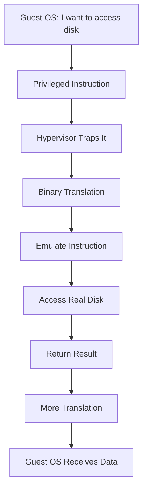

**Overhead:** 5-10 translation steps!

### Para-virtualization:

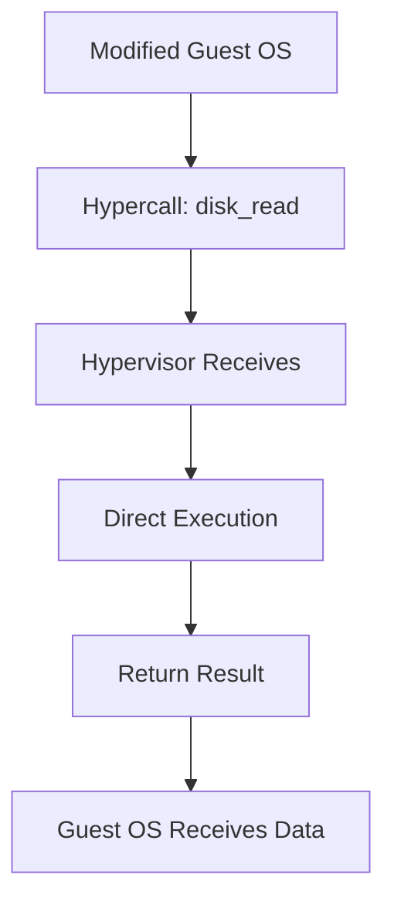

**Overhead:** 2-3 steps! **Much faster!**

## The Modification: What Changes?

### Original Linux Kernel:
```c
// Traditional privileged operation
void read_disk(block) {
    outb(DISK_PORT, block);  // Direct hardware access
    wait_for_interrupt();
}
```

### Para-virtualized Linux Kernel:
```c
// Modified for para-virtualization
void read_disk(block) {
    hypercall(DISK_READ, block);  // Ask hypervisor
    // Hypervisor handles it efficiently
}
```

**What's Changed:**
- Replace privileged instructions with hypercalls
- Modify interrupt handling
- Change memory management
- Adapt I/O operations

## Examples of Para-virtualization

### Xen (Pioneer of Para-virtualization)

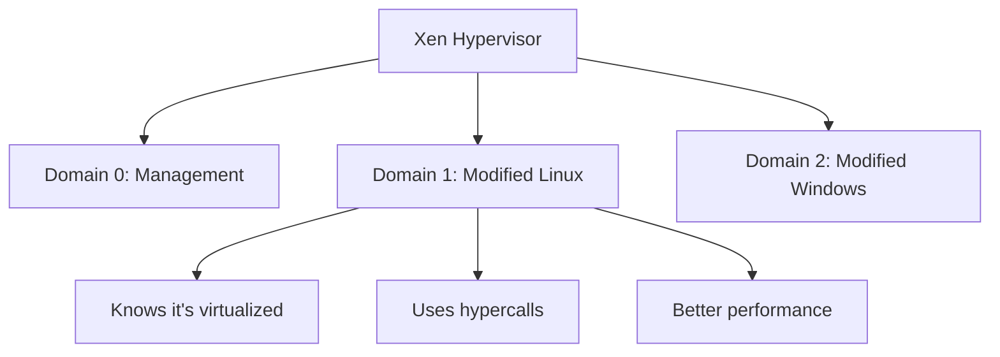

**Performance:** 2-10% overhead vs 20-30% with full virtualization!

### VMware Guest Tools

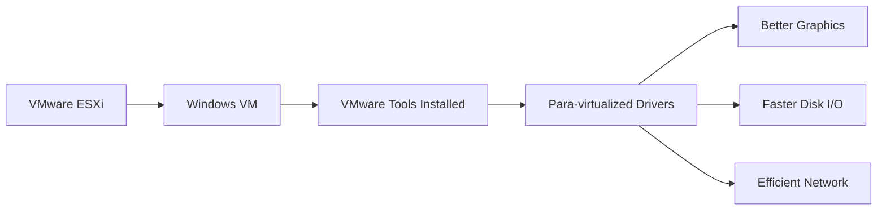

Not full para-virtualization, but similar concept!

### KVM with VirtIO

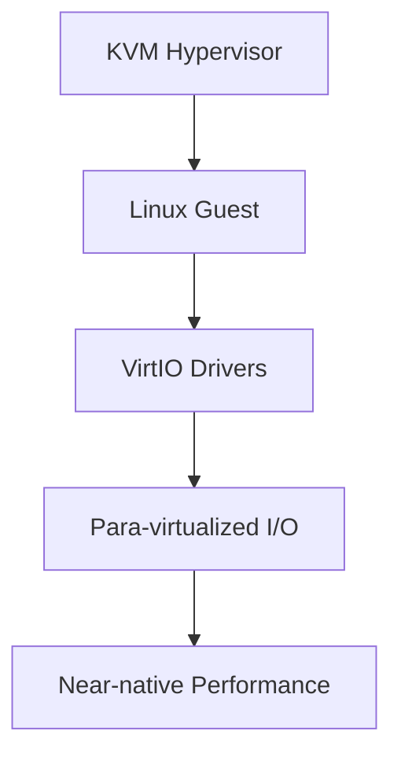

**VirtIO:** Standard para-virtualized device interface

## The Trade-offs

### ✅ Benefits of Para-virtualization

#### 1. **Significant Performance Improvement**

**Benchmarks:**

| Operation | Full Virtualization | Para-virtualization | Improvement |
|-----------|---------------------|---------------------|-------------|
| Disk I/O | 100 MB/s | 800 MB/s | 8x faster |
| Network | 500 Mbps | 9 Gbps | 18x faster |
| CPU | 70% of native | 95% of native | 25% boost |

#### 2. **Lower Resource Overhead**


#### 3. **Better Scalability**

More VMs per host = Lower costs!

```
Cost Example:
Full Virtualization: 10 servers needed
Para-virtualization: 6 servers needed
Savings: $40,000 + reduced power/cooling
```

#### 4. **Improved I/O Performance**

Critical for:
- Database servers
- File servers
- Network-intensive apps
- Storage systems

### ❌ Drawbacks of Para-virtualization

#### 1. **OS Modification Required**

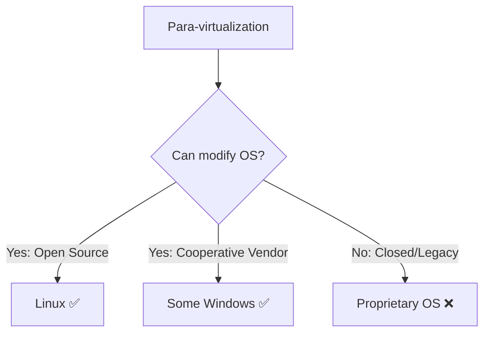

**Problem:** Can't para-virtualize:
- Old Windows versions (pre-Vista)
- Proprietary Unix systems
- Legacy applications
- Closed-source OS

#### 2. **Maintenance Burden**


**Reality:** Every OS update might break modifications!

#### 3. **Portability Loss**

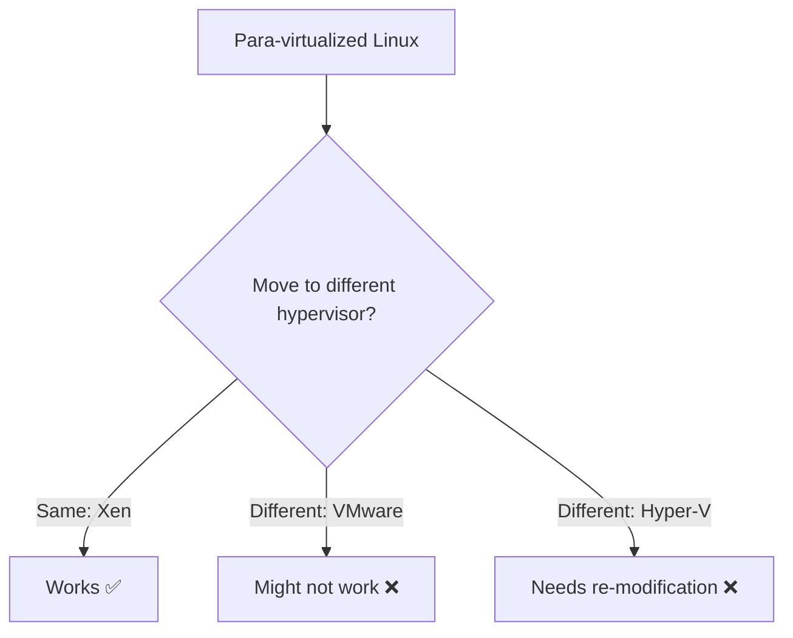

**Vendor Lock-in:** Modified OS tied to specific hypervisor!

#### 4. **Security Concerns**

```mermaid
graph TD
    A[Modified Kernel] --> B[Larger Attack Surface?}
    B --> C[Hypercalls = New Interface]
    C --> D[Potential Vulnerabilities]
    D --> E{Proper Security Review?}
    E -->|Yes| F[Secure]
    E -->|No| G[Risk!]
```

## Is It "Ethical"?

### Arguments FOR Para-virtualization (Ethical):

#### 1. **Open Source Spirit**


**Linux's GPL License:** Explicitly allows modifications!

**Ethical Stance:**
- ✅ You own the code (open source)
- ✅ Modifications shared with community
- ✅ Improves efficiency = less resource waste
- ✅ Full transparency

#### 2. **Pragmatic Optimization**

**Question:** Is it unethical to optimize code?

**Analogy:** 
- Is tuning a car engine "compromising" the car?
- Or is it making it more efficient?

**Answer:** Optimization ≠ Compromise, it's improvement!

#### 3. **Environmental Benefits**


**Ethical Win:** Better for the planet!

#### 4. **Industry Adoption**

Major companies use it:
- ✅ Amazon (Xen-based EC2)
- ✅ Google (KVM with VirtIO)
- ✅ Rackspace (Xen)

**If unethical, would they all use it?**

### Arguments AGAINST Para-virtualization (Concerns):

#### 1. **Integrity Compromise**

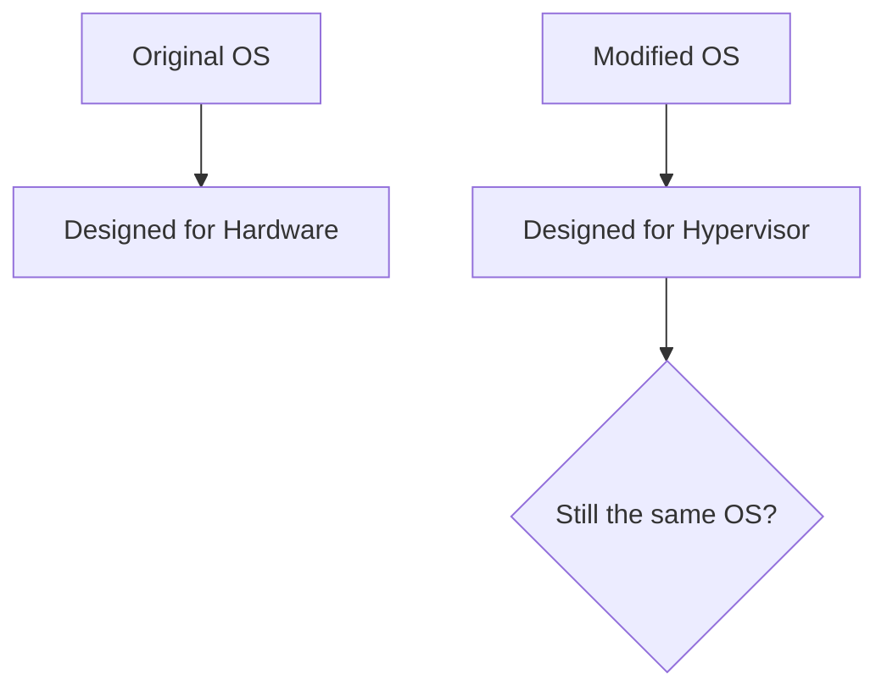

**Philosophical Question:** 
- If you change the kernel, is it still "Linux"?
- Or a different distribution?

#### 2. **Hidden Dependencies**


**Concern:** OS can't run on bare metal anymore!

#### 3. **User Transparency**

```
User expects: "Linux"
User gets: "Linux modified for Xen"
Are they informed of differences?
```

**Ethical Issue:** Users should know what they're running!

#### 4. **Support Complexity**

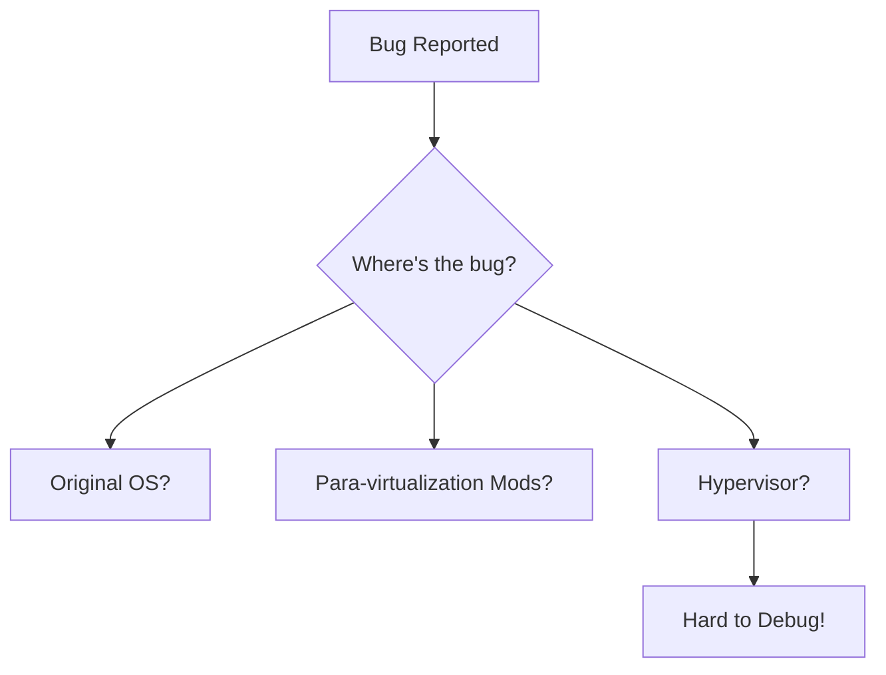

## Modern Solution: Hybrid Approach

### Hardware-Assisted Virtualization + Para-virtualization

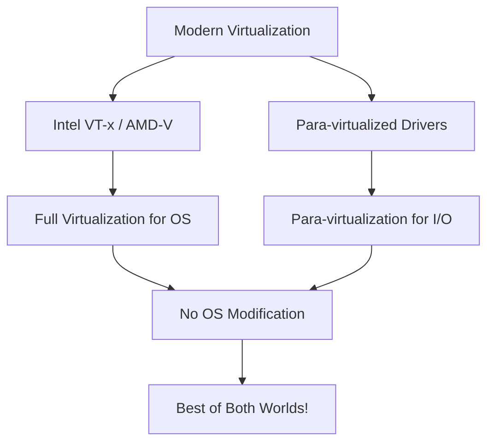

**Example: KVM + VirtIO**

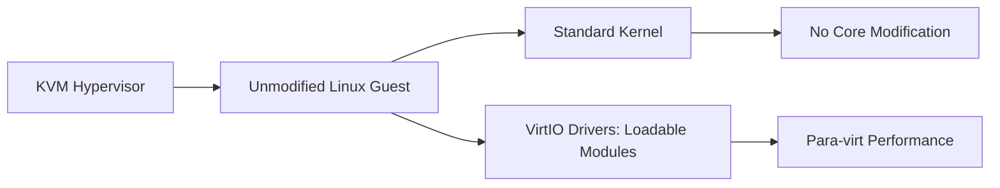

**Benefits:**
- ✅ Guest OS kernel untouched
- ✅ VirtIO drivers loaded like any driver
- ✅ Can remove drivers = runs on bare metal
- ✅ Performance boost retained
- ✅ Ethical concerns minimized

## Real-World Impact

### Amazon EC2 Evolution:


**Lesson:** Industry moved away from pure para-virtualization toward hybrid!

### Performance Comparison (Modern):

| Approach | Performance | Compatibility | Maintenance |
|----------|-------------|---------------|-------------|
| **Full Virtualization** | 85% | ⭐⭐⭐⭐⭐ | ⭐⭐⭐⭐⭐ |
| **Pure Para-virtualization** | 98% | ⭐⭐ | ⭐⭐ |
| **Hybrid (HW + Para drivers)** | 95% | ⭐⭐⭐⭐ | ⭐⭐⭐⭐ |

**Winner:** Hybrid approach!

## My Verdict

**Is para-virtualization an "ethical compromise"?**

🎯 **NO - It's a pragmatic optimization with proper safeguards:**

**Ethical IF:**
1. ✅ Open source (can inspect changes)
2. ✅ Users informed of modifications
3. ✅ Changes contributed back to community
4. ✅ Reversible (can use unmodified OS)
5. ✅ Well-documented and tested

**Unethical IF:**
1. ❌ Hidden modifications
2. ❌ Forced on users without consent
3. ❌ Closed-source changes
4. ❌ Vendor lock-in without alternatives
5. ❌ Security through obscurity

**Modern Reality:**
- Pure para-virtualization is fading
- Hybrid approaches dominate
- Performance gap narrowed with hardware assist
- Ethical concerns largely resolved

**Bottom Line:**
Para-virtualization was a brilliant solution for its time. It's not an "ethical compromise" when done openly and transparently. Today's hybrid approaches give us the best of both worlds - performance AND compatibility!

---

## Learning Resources

### Core Concepts
- [Xen Project](https://xenproject.org/) - Para-virtualization pioneer
- [VirtIO Documentation](https://docs.oasis-open.org/virtio/virtio/v1.1/virtio-v1.1.html) - Standard interface
- [KVM Paravirtualization](https://www.linux-kvm.org/page/Virtio) - Modern implementation

### Research & Analysis
- [Xen and the Art of Virtualization](https://www.cl.cam.ac.uk/research/srg/netos/papers/2003-xensosp.pdf) - Original paper
- [Para-virtualization vs Full Virtualization](https://www.youtube.com/results?search_query=paravirtualization+explained) - Video guides

### Books
- "The Definitive Guide to the Xen Hypervisor" by David Chisnall
- "Linux Kernel Development" by Robert Love
