# Para-virtualization: An Ethical Compromise? Discuss the trade-offs of modifying the Guest OS kernel for better performance.

## Introduction

Para-virtualization is a fascinating concept where we **modify the guest operating system** to make it "virtualization-aware." But is it ethical to change the OS kernel? Let's explore this controversial approach and its trade-offs.

## Understanding Virtualization Types


## What is Para-virtualization?

Think of it like this:

**Full Virtualization (Lying to the Guest):**


**Para-virtualization (Honest Communication):**


### Real-World Analogy:

**Full Virtualization:** 
- You visit a foreign country, speak your language
- A translator (hypervisor) converts everything
- Slower but you don't need to change

**Para-virtualization:**
- You learn the local language before visiting
- Direct communication with locals
- Faster but requires learning (modification)

## How Para-virtualization Works

### Traditional (Full) Virtualization:

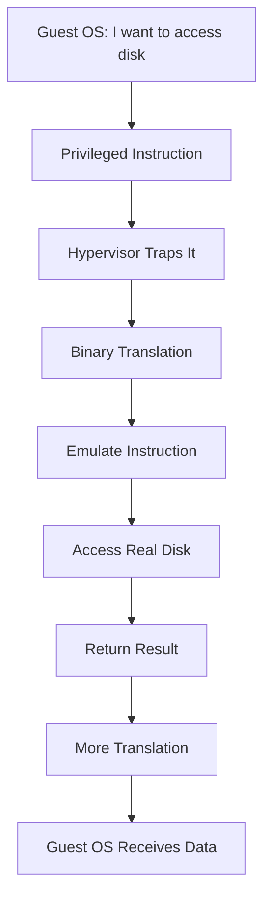

**Overhead:** 5-10 translation steps!

### Para-virtualization:

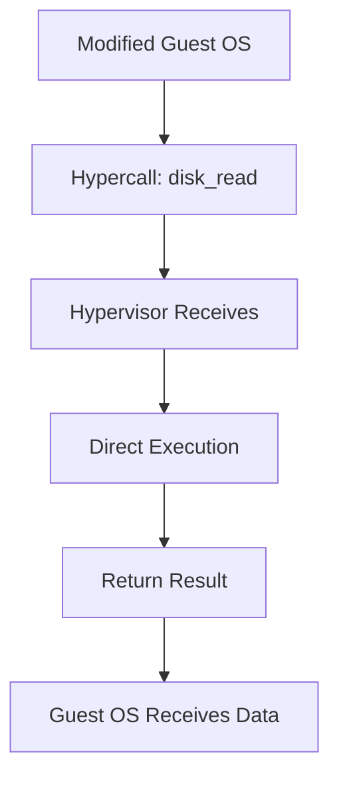

**Overhead:** 2-3 steps! **Much faster!**

## The Modification: What Changes?

### Original Linux Kernel:
```c
// Traditional privileged operation
void read_disk(block) {
    outb(DISK_PORT, block);  // Direct hardware access
    wait_for_interrupt();
}
```

### Para-virtualized Linux Kernel:
```c
// Modified for para-virtualization
void read_disk(block) {
    hypercall(DISK_READ, block);  // Ask hypervisor
    // Hypervisor handles it efficiently
}
```

**What's Changed:**
- Replace privileged instructions with hypercalls
- Modify interrupt handling
- Change memory management
- Adapt I/O operations

## Examples of Para-virtualization

### Xen (Pioneer of Para-virtualization)

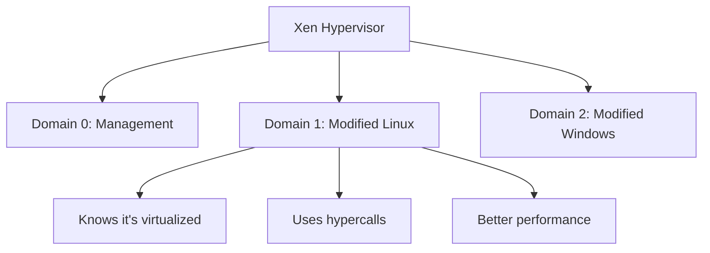

**Performance:** 2-10% overhead vs 20-30% with full virtualization!

### VMware Guest Tools

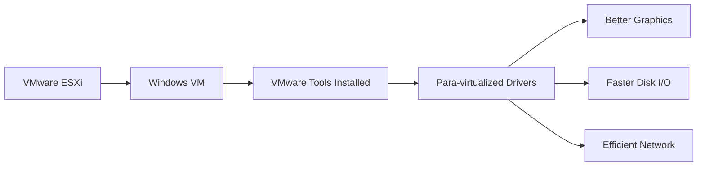

Not full para-virtualization, but similar concept!

### KVM with VirtIO

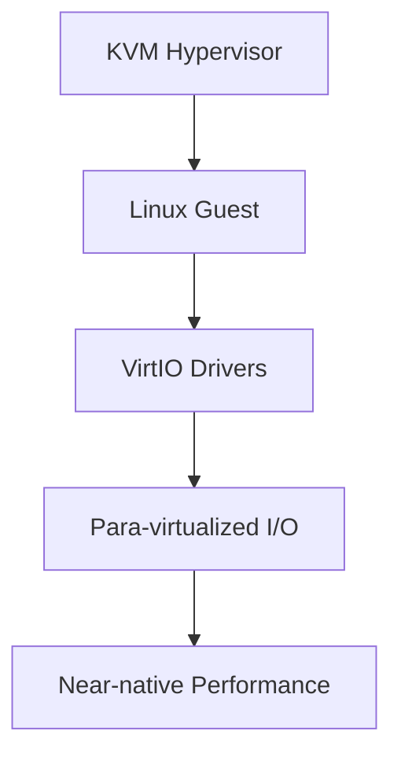

**VirtIO:** Standard para-virtualized device interface

## The Trade-offs

### ✅ Benefits of Para-virtualization

#### 1. **Significant Performance Improvement**

**Benchmarks:**

| Operation | Full Virtualization | Para-virtualization | Improvement |
|-----------|---------------------|---------------------|-------------|
| Disk I/O | 100 MB/s | 800 MB/s | 8x faster |
| Network | 500 Mbps | 9 Gbps | 18x faster |
| CPU | 70% of native | 95% of native | 25% boost |

#### 2. **Lower Resource Overhead**


#### 3. **Better Scalability**

More VMs per host = Lower costs!

```
Cost Example:
Full Virtualization: 10 servers needed
Para-virtualization: 6 servers needed
Savings: $40,000 + reduced power/cooling
```

#### 4. **Improved I/O Performance**

Critical for:
- Database servers
- File servers
- Network-intensive apps
- Storage systems

### ❌ Drawbacks of Para-virtualization

#### 1. **OS Modification Required**

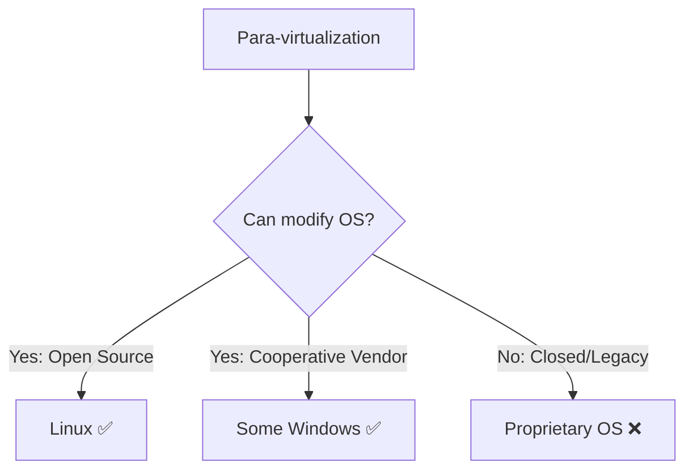

**Problem:** Can't para-virtualize:
- Old Windows versions (pre-Vista)
- Proprietary Unix systems
- Legacy applications
- Closed-source OS

#### 2. **Maintenance Burden**


**Reality:** Every OS update might break modifications!

#### 3. **Portability Loss**

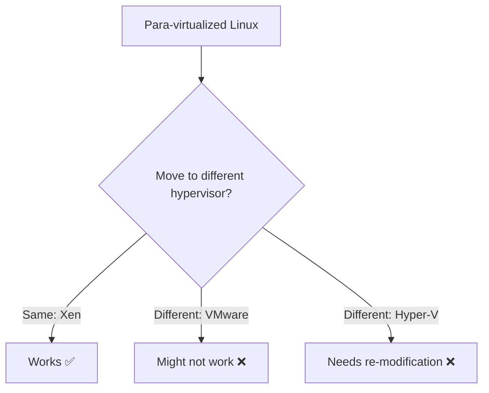

**Vendor Lock-in:** Modified OS tied to specific hypervisor!

#### 4. **Security Concerns**

```mermaid
graph TD
    A[Modified Kernel] --> B[Larger Attack Surface?}
    B --> C[Hypercalls = New Interface]
    C --> D[Potential Vulnerabilities]
    D --> E{Proper Security Review?}
    E -->|Yes| F[Secure]
    E -->|No| G[Risk!]
```

## Is It "Ethical"?

### Arguments FOR Para-virtualization (Ethical):

#### 1. **Open Source Spirit**


**Linux's GPL License:** Explicitly allows modifications!

**Ethical Stance:**
- ✅ You own the code (open source)
- ✅ Modifications shared with community
- ✅ Improves efficiency = less resource waste
- ✅ Full transparency

#### 2. **Pragmatic Optimization**

**Question:** Is it unethical to optimize code?

**Analogy:** 
- Is tuning a car engine "compromising" the car?
- Or is it making it more efficient?

**Answer:** Optimization ≠ Compromise, it's improvement!

#### 3. **Environmental Benefits**


**Ethical Win:** Better for the planet!

#### 4. **Industry Adoption**

Major companies use it:
- ✅ Amazon (Xen-based EC2)
- ✅ Google (KVM with VirtIO)
- ✅ Rackspace (Xen)

**If unethical, would they all use it?**

### Arguments AGAINST Para-virtualization (Concerns):

#### 1. **Integrity Compromise**

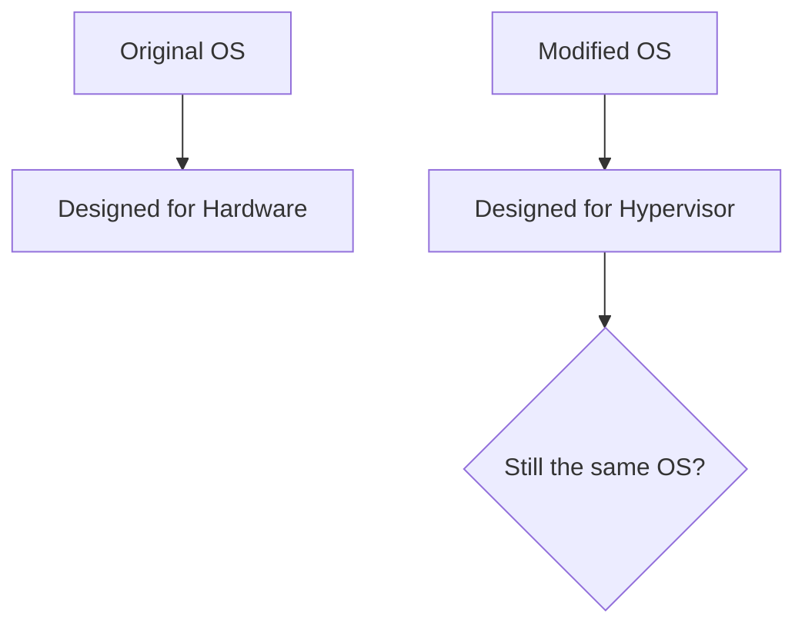

**Philosophical Question:** 
- If you change the kernel, is it still "Linux"?
- Or a different distribution?

#### 2. **Hidden Dependencies**


**Concern:** OS can't run on bare metal anymore!

#### 3. **User Transparency**

```
User expects: "Linux"
User gets: "Linux modified for Xen"
Are they informed of differences?
```

**Ethical Issue:** Users should know what they're running!

#### 4. **Support Complexity**

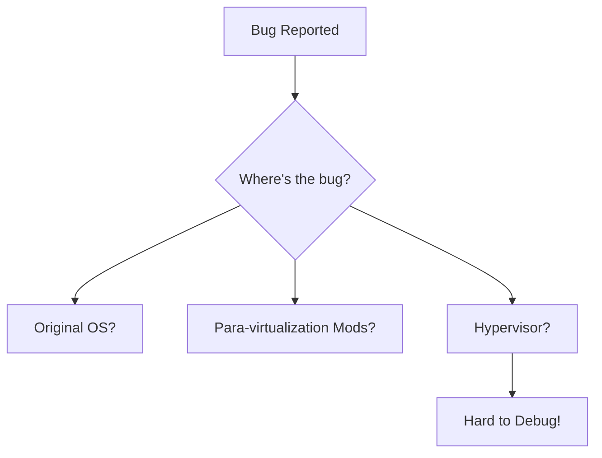

## Modern Solution: Hybrid Approach

### Hardware-Assisted Virtualization + Para-virtualization

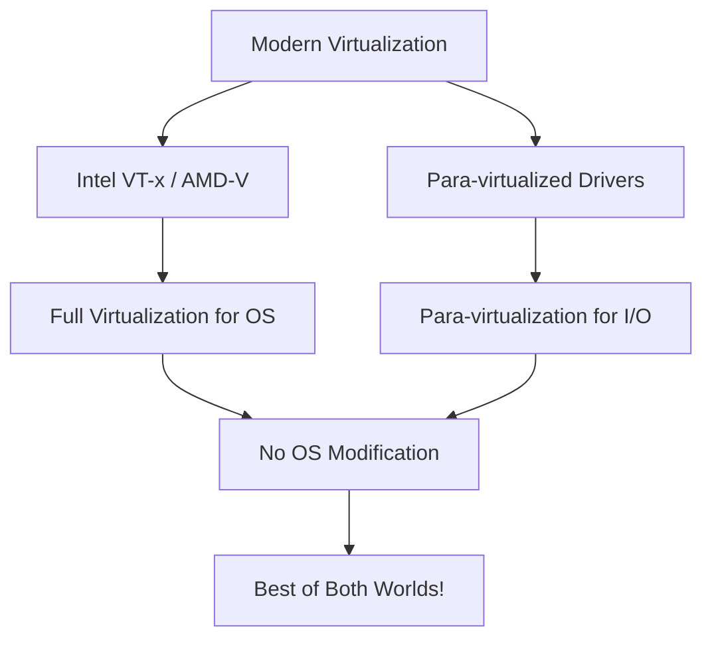

**Example: KVM + VirtIO**

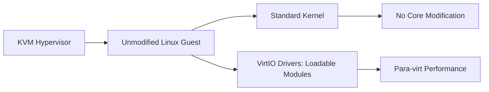

**Benefits:**
- ✅ Guest OS kernel untouched
- ✅ VirtIO drivers loaded like any driver
- ✅ Can remove drivers = runs on bare metal
- ✅ Performance boost retained
- ✅ Ethical concerns minimized

## Real-World Impact

### Amazon EC2 Evolution:

```mermaid
graph LR
    A[2006: EC2 Launch] --> B[Xen Para-virtualization]
    B --> C[Required Modified Kernels]
    C --> D[2017: Nitro System]
    D --> E[Hardware Virtualization]
    E --> F[Standard Kernels]
```

**Lesson:** Industry moved away from pure para-virtualization toward hybrid!

### Performance Comparison (Modern):

| Approach | Performance | Compatibility | Maintenance |
|----------|-------------|---------------|-------------|
| **Full Virtualization** | 85% | ⭐⭐⭐⭐⭐ | ⭐⭐⭐⭐⭐ |
| **Pure Para-virtualization** | 98% | ⭐⭐ | ⭐⭐ |
| **Hybrid (HW + Para drivers)** | 95% | ⭐⭐⭐⭐ | ⭐⭐⭐⭐ |

**Winner:** Hybrid approach!

## My Verdict

**Is para-virtualization an "ethical compromise"?**

🎯 **NO - It's a pragmatic optimization with proper safeguards:**

**Ethical IF:**
1. ✅ Open source (can inspect changes)
2. ✅ Users informed of modifications
3. ✅ Changes contributed back to community
4. ✅ Reversible (can use unmodified OS)
5. ✅ Well-documented and tested

**Unethical IF:**
1. ❌ Hidden modifications
2. ❌ Forced on users without consent
3. ❌ Closed-source changes
4. ❌ Vendor lock-in without alternatives
5. ❌ Security through obscurity

**Modern Reality:**
- Pure para-virtualization is fading
- Hybrid approaches dominate
- Performance gap narrowed with hardware assist
- Ethical concerns largely resolved

**Bottom Line:**
Para-virtualization was a brilliant solution for its time. It's not an "ethical compromise" when done openly and transparently. Today's hybrid approaches give us the best of both worlds - performance AND compatibility!

---

## Learning Resources

### Para-virtualization Fundamentals
- [Xen Project](https://xenproject.org/developers/teams/xen-hypervisor/) - Original para-virtualization pioneer
- [Para-virtualization Explained](https://www.youtube.com/results?search_query=paravirtualization+explained) - Video tutorials
- [IBM Para-virtualization Guide](https://www.ibm.com/cloud/learn/paravirtualization) - Comprehensive overview

### Technical Deep Dives
- [Xen and the Art of Virtualization](https://www.cl.cam.ac.uk/research/srg/netos/papers/2003-xensosp.pdf) - Original research paper
- [VirtIO Specification](https://docs.oasis-open.org/virtio/virtio/v1.1/virtio-v1.1.html) - Standard para-virt I/O
- [KVM Paravirtualization](https://www.linux-kvm.org/page/Virtio) - Linux implementation

### Performance Studies
- [Virtualization Performance Comparison](https://www.vmware.com/content/dam/digitalmarketing/vmware/en/pdf/techpaper/performance/Perf_ESX_Intel-Xeon-E5v3.pdf) - Benchmarks
- [Para-virtualization vs Full Virtualization](https://www.usenix.org/legacy/events/osdi02/tech/full_papers/barham/barham.pdf) - Research
- [VirtIO Performance Analysis](https://www.youtube.com/results?search_query=virtio+performance) - Case studies

### Hands-On Practice
- [Xen Installation Guide](https://wiki.xenproject.org/wiki/Xen_Project_Beginners_Guide) - Try para-virtualization
- [KVM with VirtIO](https://www.linux-kvm.org/page/Tuning_KVM) - Modern approach
- [QEMU Guest Agent](https://wiki.qemu.org/Features/GuestAgent) - Para-virt tools

### OS Kernel Modification
- [Linux Kernel Development](https://kernelnewbies.org/) - Learn kernel programming
- [Xen Linux Patches](https://git.kernel.org/pub/scm/linux/kernel/git/xen/tip.git/) - See actual modifications
- [Para-virt Ops in Linux](https://lwn.net/Articles/194993/) - Linux implementation

### Hardware-Assisted Virtualization
- [Intel VT-x](https://www.intel.com/content/www/us/en/virtualization/virtualization-technology/intel-virtualization-technology.html) - Hardware support
- [AMD-V](https://www.amd.com/en/technologies/virtualization) - AMD virtualization
- [Hardware vs Para-virtualization](https://www.youtube.com/results?search_query=hardware+assisted+virtualization) - Comparison

### Ethical Discussions
- [Open Source Philosophy](https://opensource.org/osd) - Freedom to modify
- [GPL License](https://www.gnu.org/licenses/gpl-3.0.en.html) - Legal framework
- [Software Freedom](https://www.fsf.org/) - Free Software Foundation

### Books
- "The Definitive Guide to the Xen Hypervisor" by David Chisnall
- "Linux Kernel Development" by Robert Love
- "Virtualization Essentials" by Matthew Portnoy
- "Understanding the Linux Kernel" by Daniel P. Bovet

### Research Papers
- [Xen Original Paper (SOSP 2003)](https://www.cl.cam.ac.uk/research/srg/netos/papers/2003-xensosp.pdf) - Groundbreaking
- [Para-virtualization Overhead](https://www.usenix.org/legacy/publications/library/proceedings/osdi02/tech/barham.html) - Analysis
- [KVM Architecture](https://www.kernel.org/doc/Documentation/virtual/kvm/api.txt) - Modern approach

### Communities
- [Xen Mailing Lists](https://lists.xenproject.org/) - Para-virt community
- [KVM Forum](https://www.linux-kvm.org/page/KVM_Forum) - Modern virtualization
- [r/linux](https://www.reddit.com/r/linux/) - Kernel discussions
- [LKML](https://lkml.org/) - Linux Kernel Mailing List

### Tools & Drivers
- [VirtIO Drivers](https://docs.fedoraproject.org/en-US/quick-docs/creating-windows-virtual-machines-using-virtio-drivers/) - Para-virt I/O
- [Xen Tools](https://wiki.xenproject.org/wiki/Xen_Project_Software_Overview) - Management tools
- [QEMU](https://www.qemu.org/) - Emulator with para-virt support

### Videos
- [Xen Project YouTube](https://www.youtube.com/user/XenProject) - Official channel
- [KVM Virtualization](https://www.youtube.com/results?search_query=kvm+virtualization+tutorial) - Tutorials
- [Kernel Development](https://www.youtube.com/results?search_query=linux+kernel+development) - Deep dives

### Blogs & Articles
- [Xen Project Blog](https://xenproject.org/category/blog/) - Updates and insights
- [KVM Blog](https://www.linux-kvm.org/page/Blog) - Virtualization news
- [LWN Virtualization](https://lwn.net/Kernel/Index/#Virtualization) - Technical articles
