# Virtualization is the Foundation of Cloud Computing: Is it possible to have a successful public cloud without hypervisors, and what would that look like?

## Introduction

Good morning everyone! Today I want to challenge a common assumption. Everyone thinks cloud computing absolutely needs hypervisors, right? Virtual machines, VMware, all that stuff. But here's the surprising truth - we can absolutely have a successful public cloud WITHOUT traditional hypervisors! In fact, it's already happening. Let me show you how.

## The Traditional Cloud Model

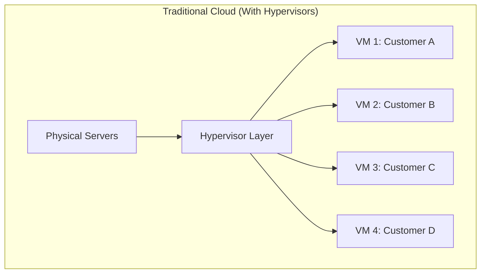

**The Assumption:** Hypervisors are essential for:
- ✅ Multi-tenancy (isolation)
- ✅ Resource sharing
- ✅ Flexibility
- ✅ Security

**But what if we challenge this?**

## Alternative 1: Containers (Without Full Virtualization)

### How It Works

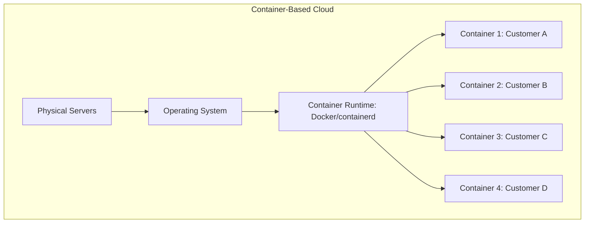

**Key Difference:** 
- ❌ No hypervisor
- ✅ Shared OS kernel
- ✅ Process-level isolation

### Real-World Example: Google Cloud Run


**How Google Cloud Run Works:**
1. You provide container
2. Google runs it directly on their infrastructure
3. No VMs, no hypervisors
4. Just containers!

**Benefits:**
- 🟢 Faster startup (milliseconds vs minutes)
- 🟢 Higher density (more containers per server)
- 🟢 Lower overhead (no hypervisor layer)
- 🟢 Simpler architecture

**Challenges:**
- 🔴 Same OS kernel (security concerns)
- 🔴 Less isolation than VMs
- 🔴 Can't run different OS types

### Success Story: Heroku

Heroku is essentially a container-based cloud (before Docker was popular!):

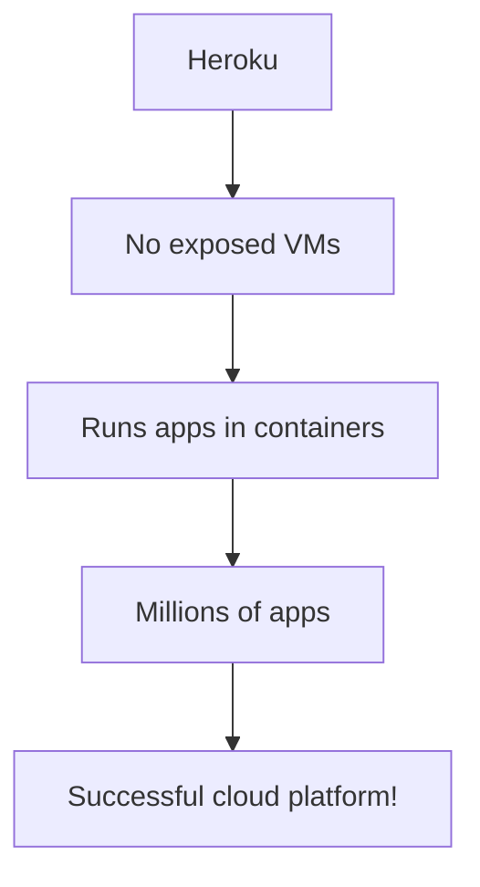

**Proof:** Multi-billion dollar platform without traditional hypervisors!

## Alternative 2: Serverless (Functions)

### How It Works

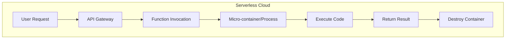

**Key Difference:**
- ❌ No persistent VMs
- ❌ No visible servers
- ✅ On-demand execution
- ✅ Micro-containers or processes

### Real-World Example: AWS Lambda


**AWS Firecracker:**
- Ultra-lightweight "micro-VMs"
- Not traditional hypervisors
- KVM-based but minimal overhead
- Purpose-built for serverless

**Benefits:**
- 🟢 No server management
- 🟢 Infinite scale
- 🟢 Pay per execution
- 🟢 No idle resources

**Success Metrics:**
- AWS Lambda: 10+ trillion requests/month
- Billions in revenue
- No traditional VMs!

## Alternative 3: Bare-Metal Cloud

### How It Works

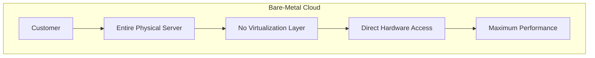

**Key Difference:**
- ❌ No hypervisor
- ❌ No sharing
- ✅ Dedicated hardware
- ✅ Full control

### Real-World Example: Packet.io (now Equinix Metal)

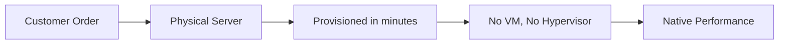

**Use Cases:**
- High-performance computing
- Databases requiring maximum I/O
- Legacy applications
- Compliance requirements

**Success:** $200M acquisition by Equinix!

## Alternative 4: Unikernels

### What Are Unikernels?

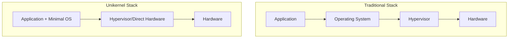

**Concept:** 
- Compile app + only needed OS functions
- Single-purpose lightweight "kernel"
- Tiny footprint (KBs, not GBs)

### Example: MirageOS


**Benefits:**
- 🟢 Tiny size (few MBs)
- 🟢 Fast boot (milliseconds)
- 🟢 Better security (minimal attack surface)
- 🟢 Efficient resource usage

**Challenge:** Still immature, limited ecosystem

## Alternative 5: WebAssembly (Wasm) on the Edge

### The Future Vision

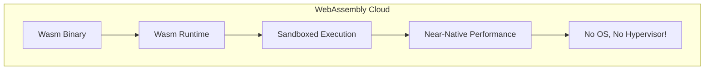

**How It Works:**
- Code compiled to WebAssembly
- Runs in lightweight runtime
- Process-level isolation
- Cross-platform by design

### Real-World: Cloudflare Workers


**Performance:**
- Cold start: <1ms (vs 100ms+ for Lambda)
- Overhead: Minimal
- Isolation: V8 sandboxing

**Success:** 
- Billions of requests/day
- Thousands of paying customers
- Growing rapidly!

## Comparison Matrix

| Approach | Isolation | Startup | Overhead | Multi-tenancy | Success? |
|----------|-----------|---------|----------|---------------|----------|
| **Traditional VMs** | ⭐⭐⭐⭐⭐ | Minutes | 5-10% | ✅ | ✅✅✅ |
| **Containers** | ⭐⭐⭐ | Seconds | 2-5% | ✅ | ✅✅✅ |
| **Serverless** | ⭐⭐⭐⭐ | <100ms | 1-3% | ✅ | ✅✅✅ |
| **Bare-Metal** | ⭐⭐⭐⭐⭐ | Minutes | 0% | ❌ | ✅✅ |
| **Unikernels** | ⭐⭐⭐⭐ | <1s | 1% | ✅ | ✅ (niche) |
| **WebAssembly** | ⭐⭐⭐⭐ | <1ms | <1% | ✅ | ✅✅ (growing) |

## What Would a Hypervisor-Free Cloud Look Like?

### Architecture Vision

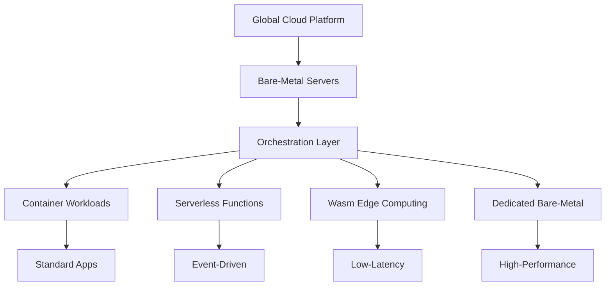

### Key Components:

**1. Kubernetes-Based Orchestration**
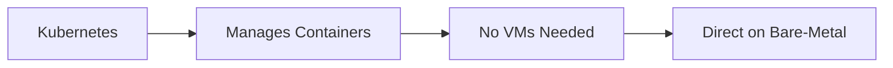

**2. Firecracker-Style MicroVMs**
```
Not full hypervisors, but:
- Lightweight isolation
- Fast startup
- Minimal overhead
- Purpose-built
```

**3. Hardware-Based Isolation**
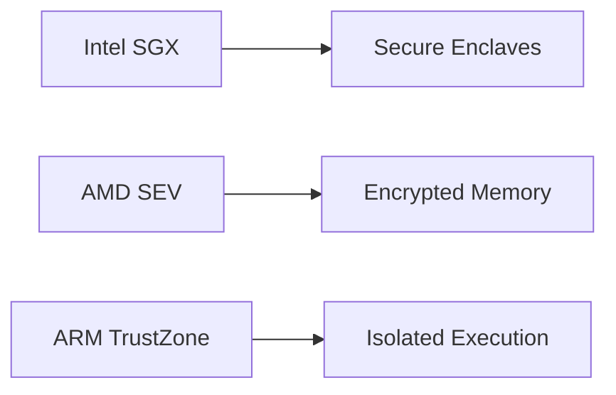

**4. Network-Level Isolation**
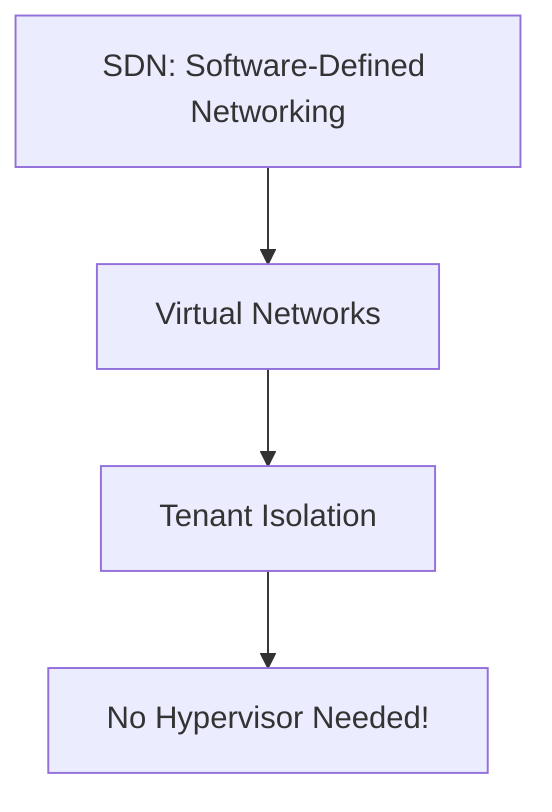

## Real-World Examples

### 1. Cloudflare Workers

**Success Metrics:**
- Millions of deployments
- 200+ cities worldwide
- No traditional VMs!

**Technology:**
- V8 isolates (JavaScript engine)
- WebAssembly support
- Ultra-low latency

### 2. Fly.io

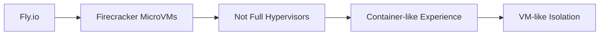

**Approach:** Best of both worlds without traditional hypervisors!

### 3. Google Cloud Run

**Model:**
- Fully managed containers
- No VM configuration
- Automatic scaling
- Pay per request

**Backend:** Likely uses gVisor (container runtime) or similar, not full VMs!

### 4. Vercel / Netlify

**Edge Functions:**
- Distributed globally
- Serverless execution
- No VMs involved
- Built on V8/Deno/Node.js

## Advantages of Hypervisor-Free Cloud

### 1. **Higher Efficiency**

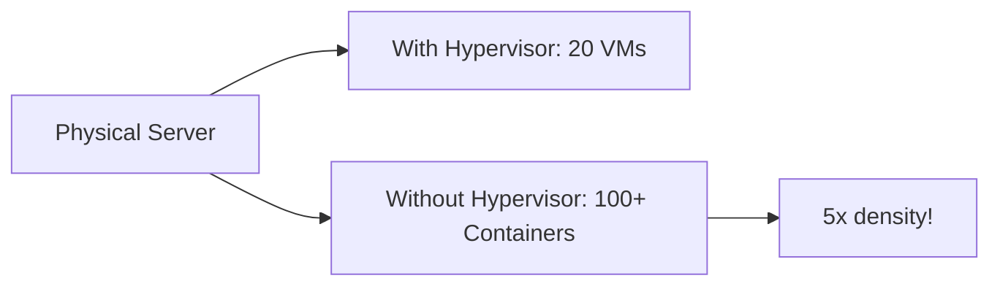

### 2. **Lower Costs**

```
Cost Breakdown:
Traditional Cloud:
- Hardware: $10,000
- Hypervisor licenses: $2,000/year
- Management overhead: $3,000/year

Hypervisor-Free:
- Hardware: $10,000
- Container runtime: $0 (open-source)
- Management: $1,000/year (simpler)

Savings: $4,000/year per server!
```

### 3. **Better Performance**

```
Benchmark:
With Hypervisor: 95% of bare-metal
Without Hypervisor: 99% of bare-metal

For I/O intensive workloads:
With Hypervisor: 80% efficiency
Without Hypervisor: 95% efficiency
```

### 4. **Faster Innovation**


## Challenges & Solutions

### Challenge 1: Security & Isolation

**Problem:** Hypervisors provide strong isolation

**Solutions:**
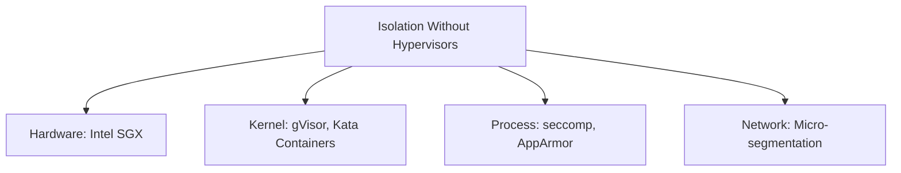

### Challenge 2: Multi-Tenancy

**Problem:** How to safely share hardware?

**Solutions:**
- Containers with strong namespacing
- Hardware-based isolation (SGX, SEV)
- Network isolation (VPCs without VMs)
- Resource limits (cgroups)

### Challenge 3: Live Migration

**Problem:** Hypervisors enable VM migration

**Solutions:**
- Container orchestration (Kubernetes)
- Stateless architectures
- Fast restart instead of migration
- Persistent storage separation

## The Future: Hybrid Approach

**Reality:** Most successful clouds will use BOTH!

```mermaid
graph TB
    A[Modern Cloud Platform] --> B[Legacy: VMs with Hypervisors]
    A --> C[Modern: Containers]
    A --> D[Edge: Serverless/Wasm]
    A --> E[Special: Bare-Metal]
    
    B --> F[20% of Workloads]
    C --> G[50% of Workloads]
    D --> H[25% of Workloads]
    E --> I[5% of Workloads]
```

**Why Hybrid?**
- Different workloads need different solutions
- Legacy support requires VMs
- Innovation happens in containers/serverless
- Flexibility is key

## My Verdict

**Is it possible to have a successful public cloud without hypervisors?**

🎯 **YES - And it's already happening!**

**Evidence:**
1. ✅ Cloudflare Workers (billions of requests, no VMs)
2. ✅ Google Cloud Run (massive scale, containers)
3. ✅ Heroku (successful for 15+ years, containers)
4. ✅ Vercel/Netlify (multi-billion dollar valuations)
5. ✅ Fly.io (microVMs, not traditional hypervisors)

**What It Looks Like:**
```mermaid
graph TB
    A[Hypervisor-Free Cloud] --> B[Container Orchestration]
    A --> C[Serverless Functions]
    A --> D[Edge Computing]
    A --> E[Bare-Metal Options]
    
    B --> F[Kubernetes/Docker]
    C --> G[Lambda/Cloud Functions]
    D --> H[Workers/Edge Functions]
    E --> I[Dedicated Servers]
    
    F --> J[Multi-tenant Success]
    G --> J
    H --> J
    I --> J
```

**Bottom Line:**
- Hypervisors are NOT essential for cloud computing
- They're just ONE way to achieve isolation and multi-tenancy
- Modern alternatives (containers, serverless, Wasm) are proving successful
- The future is diverse - different solutions for different needs

**Virtualization ≠ Hypervisors**

Virtualization is about abstraction and isolation. Hypervisors are just one implementation. The cloud is evolving beyond them!

---

## Learning Resources

### Container & Serverless Platforms
- [Docker Documentation](https://docs.docker.com/) - Container fundamentals
- [Kubernetes](https://kubernetes.io/docs/home/) - Container orchestration
- [AWS Lambda](https://docs.aws.amazon.com/lambda/) - Serverless functions
- [Cloudflare Workers](https://developers.cloudflare.com/workers/) - Edge computing

### Alternative Technologies
- [Firecracker](https://firecracker-microvm.github.io/) - Lightweight virtualization
- [gVisor](https://gvisor.dev/) - Container runtime sandbox
- [WebAssembly](https://webassembly.org/) - Edge computing future

### Books & Research
- "Kubernetes Up & Running" by Kelsey Hightower
- "Docker Deep Dive" by Nigel Poulton
- [Firecracker Research Paper](https://www.usenix.org/system/files/nsdi20-paper-agache.pdf) - AWS innovation
