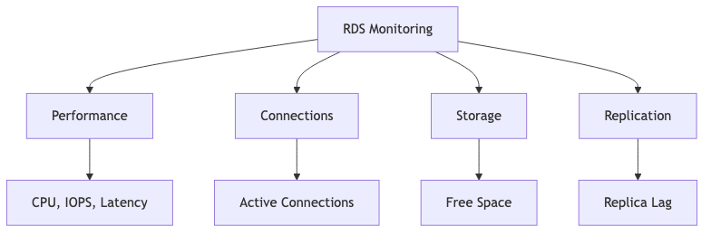
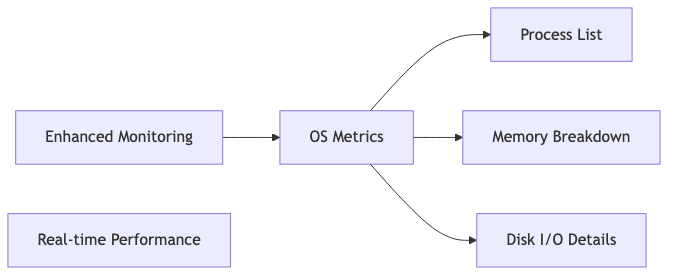

# Virtual Desktop Infrastructure (VDI): The future of corporate IT or an expensive niche solution?

## Introduction

Imagine logging into your work computer from anywhere - home, cafe, even your phone - and getting the EXACT same desktop experience. That's VDI! But is it the future of work, or just an expensive solution for specific cases? Let's find out!

## What is VDI?

**Virtual Desktop Infrastructure** means your desktop runs on a server in a datacenter, not on your local machine.


**Think of it like:**
- Netflix for your desktop
- You stream the desktop, not movies
- Everything runs remotely
- Your device is just a window

## How VDI Works


### Key Components:

**1. Thin Client / End Device**
- Cheap device ($200 vs $1000 PC)
- Or any device: laptop, tablet, phone
- Just needs browser/VDI client

**2. VDI Broker (Connection Broker)**
- Manages user sessions
- Assigns virtual desktops
- Load balancing

**3. Hypervisor**
- Runs multiple virtual desktops
- VMware Horizon, Citrix, Windows Virtual Desktop

**4. Desktop Images**
- Pre-configured desktop environments
- Centrally managed
- Can be persistent or non-persistent

## Types of VDI

### 1. Persistent VDI


**Like:** Your own dedicated apartment
- Same desktop every time
- Your files persist
- Your settings saved
- Personal experience

**Use Case:** Developers, designers, executives

### 2. Non-Persistent VDI


**Like:** Hotel room - clean for each stay
- Random desktop each time
- Reset after logout
- No personal data stored
- Cheaper to manage

**Use Case:** Call centers, shift workers, students

## VDI Providers

### 1. VMware Horizon



**Pros:** Mature, comprehensive
**Cons:** High cost, complex

### 2. Citrix Virtual Apps and Desktops

**Pros:** Great performance, flexibility
**Cons:** Licensing complexity

### 3. Microsoft Azure Virtual Desktop (AVD)

**Pros:** Cloud-native, Windows 10/11 multi-session
**Cons:** Azure-only

### 4. Amazon WorkSpaces



**Pros:** Easy, scalable
**Cons:** Less customization

## The Case FOR VDI (Future of Corporate IT)

### 1. **Work From Anywhere**


**COVID-19 Proof:**
- Pandemic forced remote work
- VDI enabled instant transition
- No VPN bottlenecks
- Full desktop access

**Example:** Insurance company with 10,000 employees went 100% remote overnight using VDI!

### 2. **Ultimate Security**


**Security Wins:**
- ✅ Data never leaves datacenter
- ✅ Lost/stolen devices = no breach
- ✅ Centralized patching
- ✅ No USB data theft
- ✅ Complete monitoring

**Example:** Government agencies use VDI to prevent classified data leaks.

### 3. **Simplified IT Management**


**Traditional IT:**
```
Update 10,000 PCs:
- Send techs to each desk
- 2 weeks of work
- Lots of issues
```

**With VDI:**
```
Update 10,000 desktops:
- Update master image
- Push to all users
- Done in 1 day
```

### 4. **Bring Your Own Device (BYOD)**


**Benefits:**
- Employees use preferred devices
- Company saves on hardware
- Better employee satisfaction
- Still secure!

### 5. **Disaster Recovery**


**Example:** Hurricane hits office, everyone works from home seamlessly!

### 6. **Global Workforce**


**Benefits:**
- Hire globally
- Same experience everywhere
- No shipping hardware internationally
- Easy onboarding

## The Case AGAINST VDI (Expensive Niche)

### 1. **High Initial Cost**


**Comparison:**

| Cost Item | Traditional PC | VDI |
|-----------|----------------|-----|
| Initial | $1,000/user | $1,500-2,000/user |
| Annual | $100/user | $500/user |
| 5-year Total | $1,500/user | $4,000/user |

**Ouch!** VDI is 2-3x more expensive!

### 2. **Performance Issues**


**Problems:**
- 🔴 Video editing: Laggy
- 🔴 CAD software: Poor experience
- 🔴 Gaming: Impossible
- 🔴 4K video: Bandwidth hungry
- 🔴 Multimedia: Stuttering

**Example:** Graphic designer trying to use Photoshop on VDI = Frustration!

### 3. **Network Dependency**


**Risk:**
- No internet = No work
- Slow internet = Poor performance
- ISP outage = Company paralyzed

**Traditional PC:** Still works offline!

### 4. **Complexity**


**Reality:**
- Need specialized IT staff
- 24/7 monitoring required
- Complex troubleshooting
- Single point of failure risks

### 5. **User Resistance**


**Psychology:** People prefer physical PCs they "own"

### 6. **Limited Use Cases**


**Reality:** Only ~30% of workers suit VDI!

## Real-World Examples

### Success: Ericsson

**Deployment:**
- 95,000 employees on VDI
- Global workforce
- Work from anywhere

**Results:**
- ✅ $10M annual savings
- ✅ 95% user satisfaction
- ✅ Reduced security incidents

### Failure: NHS (UK Healthcare)

**Attempt:**
- Nationwide VDI rollout
- £200 million investment

**Results:**
- ❌ Performance issues
- ❌ Doctor complaints
- ❌ Partially abandoned
- ❌ Massive waste

**Lesson:** VDI isn't one-size-fits-all!

## The Hybrid Reality

Most companies use **BOTH**:


**Smart Approach:**
- VDI where it makes sense
- PCs for power users
- SaaS for simple tasks

## The Modern Alternative: DaaS (Desktop as a Service)


**Examples:**
- Amazon WorkSpaces
- Microsoft Azure Virtual Desktop
- Citrix Managed Desktops

**Benefits vs Traditional VDI:**
- ✅ Lower upfront cost
- ✅ Provider manages infrastructure
- ✅ Faster deployment
- ✅ Pay-as-you-go

**Making VDI More Accessible!**

## My Verdict

**Is VDI the future of corporate IT or expensive niche?**

🎯 **BOTH - It depends on your use case!**

### VDI is the FUTURE for:

✅ **Companies with:**
- Large remote workforce
- High security requirements
- Compliance needs (finance, healthcare)
- Global operations
- Contractor workforce
- Call centers / shift workers

**Example Industries:**
- Banking & Finance
- Healthcare (patient data)
- Government
- Legal firms
- Contact centers

### VDI is a NICHE for:

❌ **Companies with:**
- Creative teams (design, video)
- Engineering teams (CAD, simulation)
- Developers (local environments)
- Small businesses (<100 employees)
- Poor internet infrastructure
- Limited budget

**Better Alternatives:**
- Traditional PCs
- Cloud applications (SaaS)
- Laptops with VPN

## The Future: Evolved VDI


**Emerging Trends:**
1. **GPU-powered VDI** - For creative work
2. **Browser-based** - No client install
3. **AI optimization** - Better user experience
4. **5G connectivity** - Lower latency
5. **Hybrid work models** - Mix of VDI & PCs

**Prediction:** VDI will grow to ~40% of corporate desktops by 2030, but never replace PCs entirely.

---

## Learning Resources

### VDI Fundamentals
- [What is VDI?](https://www.vmware.com/topics/glossary/content/virtual-desktop-infrastructure-vdi.html) - VMware guide
- [VDI Explained](https://www.youtube.com/results?search_query=vdi+explained) - Video tutorials
- [Citrix VDI Guide](https://www.citrix.com/glossary/vdi.html) - Comprehensive overview

### Major Platforms
- [VMware Horizon](https://www.vmware.com/products/horizon.html) - Enterprise VDI
- [Citrix Virtual Desktops](https://www.citrix.com/products/citrix-virtual-apps-and-desktops/) - Market leader
- [Microsoft Azure Virtual Desktop](https://azure.microsoft.com/en-us/services/virtual-desktop/) - Cloud VDI
- [Amazon WorkSpaces](https://aws.amazon.com/workspaces/) - AWS VDI

### Implementation Guides
- [VDI Design Guide](https://docs.vmware.com/en/VMware-Horizon/index.html) - VMware documentation
- [Azure VDI Quickstart](https://docs.microsoft.com/en-us/azure/virtual-desktop/) - Microsoft guide
- [VDI Best Practices](https://www.citrix.com/content/dam/citrix/en_us/documents/white-paper/citrix-vdi-best-practices.pdf) - Citrix whitepaper

### Cost Analysis
- [VDI ROI Calculator](https://www.vmware.com/products/horizon/pricing.html) - Cost estimation
- [TCO Comparison](https://www.gartner.com/en/documents/3970163) - VDI vs PC costs
- [VDI Cost Guide](https://www.brianmadden.com/opinion/VDI-Cost-What-it-Really-Costs-to-Deploy-VDI) - Realistic pricing

### Performance Optimization
- [VDI Performance Tuning](https://docs.vmware.com/en/VMware-Horizon/index.html) - Optimization guide
- [GPU Acceleration for VDI](https://www.nvidia.com/en-us/design-visualization/solutions/virtual-gpu-vdi/) - NVIDIA vGPU
- [VDI Monitoring Tools](https://www.controlup.com/) - Performance monitoring

### Case Studies
- [VDI Success Stories](https://www.vmware.com/customers.html) - Real implementations
- [Healthcare VDI](https://www.citrix.com/solutions/healthcare.html) - Medical use cases
- [Financial Services VDI](https://aws.amazon.com/financial-services/banking/) - Banking examples

### Comparison & Analysis
- [VDI vs VPN](https://www.youtube.com/results?search_query=vdi+vs+vpn) - When to use what
- [VDI vs Physical Desktop](https://www.gartner.com/en/information-technology/insights/virtualization) - Pros/cons
- [DaaS vs On-Premise VDI](https://www.zdnet.com/article/daas-vs-vdi-whats-the-difference/) - Cloud vs traditional

### Hands-On Labs
- [VMware HOL VDI](https://labs.hol.vmware.com/) - Free VDI labs
- [Azure VDI Trial](https://azure.microsoft.com/en-us/free/) - Try Azure Virtual Desktop
- [Amazon WorkSpaces Free Tier](https://aws.amazon.com/workspaces/pricing/) - AWS VDI trial

### Books
- "Mastering VMware Horizon" by Peter von Oven
- "VDI Design Guide" by Ruben Spruijt
- "Citrix Virtual Apps and Desktops Guide" by Citrix

### Videos & Webinars
- [VMware Horizon Tutorial](https://www.youtube.com/results?search_query=vmware+horizon+tutorial) - Complete courses
- [VDI Architecture](https://www.youtube.com/results?search_query=vdi+architecture) - Design patterns
- [Remote Work with VDI](https://www.youtube.com/results?search_query=remote+work+vdi) - Use cases

### Communities
- [r/Citrix](https://www.reddit.com/r/Citrix/) - VDI discussions
- [VMTN VDI](https://communities.vmware.com/) - VMware community
- [VDI Guys Podcast](https://www.youtube.com/c/VDIguys) - Industry insights

### Security & Compliance
- [VDI Security Best Practices](https://www.cisecurity.org/) - CIS guidelines
- [HIPAA VDI Guide](https://www.hhs.gov/hipaa/for-professionals/security/index.html) - Healthcare compliance
- [PCI DSS VDI](https://www.pcisecuritystandards.org/) - Payment card compliance

### Monitoring & Management
- [Lakeside SysTrack](https://www.lakesidesoftware.com/) - VDI monitoring
- [ControlUp](https://www.controlup.com/) - Performance management
- [Liquidware](https://www.liquidware.com/) - VDI optimization

### Alternative Solutions
- [Microsoft 365](https://www.microsoft.com/en-us/microsoft-365) - Cloud apps alternative
- [Google Workspace](https://workspace.google.com/) - Browser-based work
- [Remote Desktop Services](https://docs.microsoft.com/en-us/windows-server/remote/remote-desktop-services/welcome-to-rds) - RDS vs VDI
