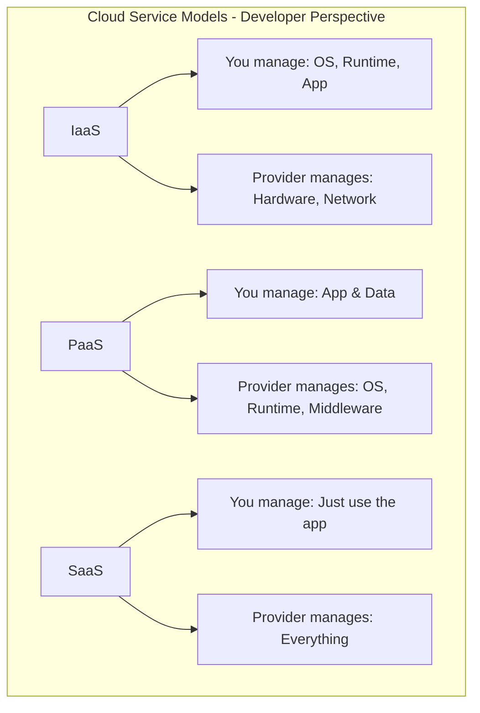
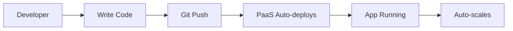
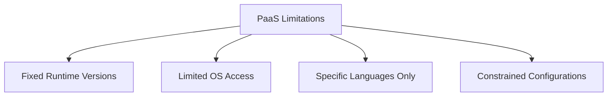
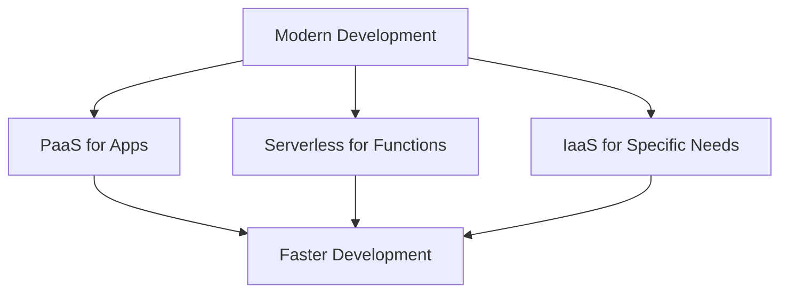

# The Future is PaaS: Is this the ideal service model for application developers?

## Introduction

Great question! Let's talk about Platform as a Service (PaaS) and whether it's truly the ideal choice for developers. Spoiler alert: It depends on what you're building!

## Understanding the Cloud Service Models



## What is PaaS?

Think of PaaS like a fully-equipped kitchen in a restaurant. You bring your recipe (code), and everything else is ready - the stove, oven, utensils, and even the ingredients are available. You just cook!

**Popular PaaS Examples:**
- Heroku
- Google App Engine
- Azure App Service
- AWS Elastic Beanstalk

## Why Developers LOVE PaaS

### 1. **Focus on Code, Not Infrastructure**



**Example:** With Heroku, you literally just do:
```bash
git push heroku main
```
And your app is live! No server setup, no deployment scripts.

### 2. **Built-in DevOps**
PaaS gives you:
- ✅ Automatic scaling
- ✅ Load balancing
- ✅ Database backups
- ✅ Monitoring
- ✅ SSL certificates

**Example:** Your app suddenly gets viral traffic? PaaS automatically spins up more instances. You don't wake up at 3 AM to fix crashed servers!

### 3. **Faster Time to Market**

**Without PaaS:**
- Week 1: Setup servers
- Week 2: Configure networking
- Week 3: Setup databases
- Week 4: Configure auto-scaling
- Week 5: Finally deploy app

**With PaaS:**
- Day 1: Deploy app ✅

## The Other Side: When PaaS is NOT Ideal

### 1. **Vendor Lock-in**
Once you build on Heroku's add-ons or Google App Engine's specific APIs, moving to another platform is painful.

**Example:** Instagram started on AWS directly (IaaS) because they knew they'd need custom infrastructure later.

### 2. **Cost at Scale**
PaaS is great when you're small, but expensive when you're huge.

**Example:** A startup might pay $50/month on Heroku. At scale, the same workload could cost $5,000/month on PaaS vs $1,500/month on IaaS.

### 3. **Limited Control**
Can't customize everything. It's like renting an apartment - you can't knock down walls!



## The Verdict: Is PaaS the Future?

**For Most Developers? YES!**

PaaS is ideal when:
- ✅ Building web applications
- ✅ Rapid prototyping
- ✅ Small to medium teams
- ✅ Standard tech stacks (Node.js, Python, Ruby, Java)
- ✅ You want to focus on features, not infrastructure

**But NOT for everyone:**

❌ High-performance computing  
❌ Custom infrastructure needs  
❌ Cost-sensitive at massive scale  
❌ Specific compliance requirements  

## Real-World Examples

### Success with PaaS:
- **Duolingo** - Uses Google App Engine, serves 500M+ users
- **Mailchimp** - Built on AWS Elastic Beanstalk initially
- **Craftsy** - Scaled to millions on Heroku

### Moved Away from PaaS:
- **Dropbox** - Moved from AWS to own data centers for cost
- **Twitter** - Started on Rails/Heroku, moved to custom infrastructure for scale

## The Modern Approach: Hybrid Strategy



Many companies use:
- **PaaS** for web apps
- **Serverless** for background jobs
- **IaaS** for databases and special requirements

## My Recommendation

**Start with PaaS!** Here's why:

1. **Learn fast** - Focus on coding skills, not DevOps
2. **Ship quickly** - Get your product to users
3. **Iterate rapidly** - Test ideas without infrastructure friction
4. **Scale when needed** - Move to IaaS later if required

Think of it as learning to drive with an automatic car before learning manual transmission. PaaS lets you focus on the journey (building great apps) before worrying about the engine (infrastructure).

---

## Learning Resources

### Official Documentation
- [Heroku Dev Center](https://devcenter.heroku.com/) - Best PaaS documentation
- [Google App Engine Docs](https://cloud.google.com/appengine/docs) - Google's PaaS guide
- [Azure App Service](https://docs.microsoft.com/en-us/azure/app-service/) - Microsoft PaaS

### Tutorials & Courses
- [The Ultimate Guide to PaaS](https://www.youtube.com/results?search_query=paas+tutorial) - Video tutorials
- [Heroku in 100 Seconds](https://www.youtube.com/watch?v=Qhey_Zu65kA) - Quick overview
- [Cloud Service Models Explained](https://www.cloudflare.com/learning/cloud/what-is-paas/) - Cloudflare guide

### Comparison Articles
- [IaaS vs PaaS vs SaaS](https://www.bmc.com/blogs/saas-vs-paas-vs-iaas-whats-the-difference-and-how-to-choose/) - Detailed comparison
- [When to Use PaaS](https://www.redhat.com/en/topics/cloud-computing/what-is-paas) - RedHat guide

### Case Studies
- [Heroku Customer Stories](https://www.heroku.com/customers) - Real success stories
- [Google App Engine Case Studies](https://cloud.google.com/customers#/products=App_Engine) - Production examples

### Books
- "Cloud Native Patterns" by Cornelia Davis
- "Building Microservices" by Sam Newman
- "The DevOps Handbook" by Gene Kim

### Free Trials
- [Heroku Free Tier](https://www.heroku.com/free) - Try it yourself
- [Google Cloud Free Tier](https://cloud.google.com/free) - App Engine credits
- [Azure Free Account](https://azure.microsoft.com/free/) - App Service trial
