# The Containerization Challenge: Are Docker and Kubernetes making traditional Virtual Machines obsolete for microservices, or do VMs still hold a critical security advantage?

## Introduction

This is the BIG question in modern infrastructure! Are containers killing VMs? Or do VMs still have a crucial role? The answer is more nuanced than you might think!

## Understanding the Battlefield

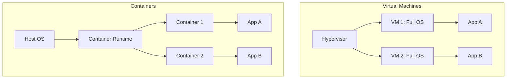

## The Case for Containers (VMs Are Obsolete!)

### 1. **Lightweight & Fast**

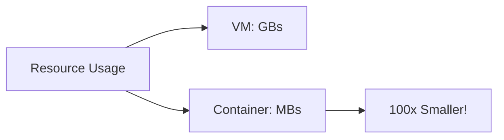

**Real Numbers:**

| Metric | Virtual Machine | Container |
|--------|----------------|-----------|
| **Size** | 1-10 GB | 10-500 MB |
| **Startup Time** | 1-5 minutes | 1-5 seconds |
| **Memory** | 512 MB - 8 GB | 10-200 MB |
| **Density** | 10-20 per host | 100-1000 per host |

**Impact:** Run 50x more applications on the same hardware!

### 2. **Perfect for Microservices**

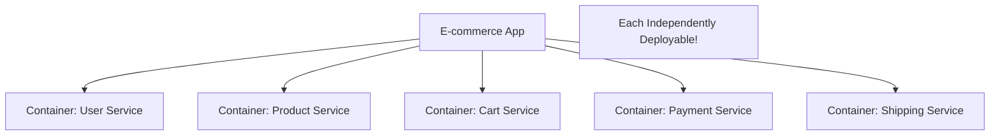

**Why Containers Win:**
- ✅ Each microservice in own container
- ✅ Deploy independently
- ✅ Scale individually
- ✅ Fast iteration

**With VMs:**
- ❌ Each microservice needs full VM
- ❌ Huge resource waste
- ❌ Slow to start/stop

### 3. **"Works on My Machine" → Solved!**

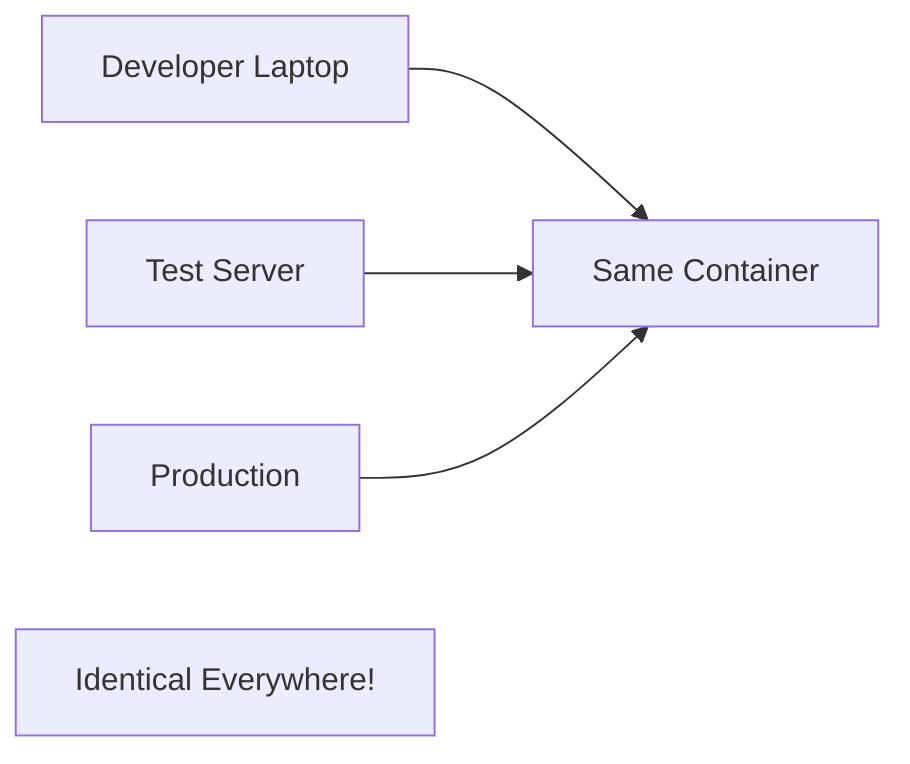

**The Problem (VMs):**
```
Developer: "It works on my VM!"
Production: "Doesn't work here!"
Reason: Different configurations, versions, libraries
```

**The Solution (Containers):**
```dockerfile
FROM node:16
COPY . /app
RUN npm install
CMD ["node", "server.js"]
```

**Result:** Exact same environment everywhere!

### 4. **DevOps Dream**

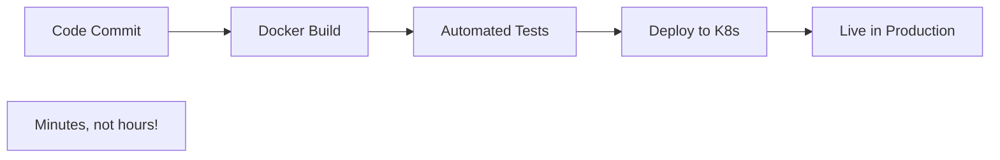

**CI/CD Pipeline:**
```yaml
# Automated deployment with containers
1. Git push
2. Build container: 30 seconds
3. Run tests: 1 minute
4. Deploy to Kubernetes: 30 seconds
Total: 2 minutes!
```

**With VMs:**
```
1. Git push
2. Build VM image: 10 minutes
3. Deploy VM: 5 minutes
4. Start VM: 2 minutes
Total: 17 minutes!
```

### 5. **Kubernetes Orchestration**

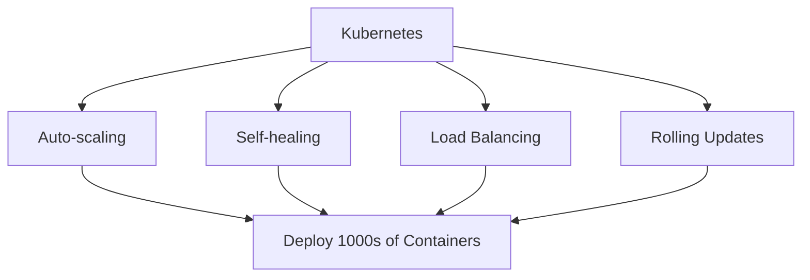

**Example: Black Friday Traffic**
```
Normal: 100 containers
Black Friday: Auto-scale to 1,000 containers
After sale: Scale back to 100
Automatic, no human intervention!
```

**With VMs:** Manual scaling, slow, expensive!

### 6. **Cost Savings**

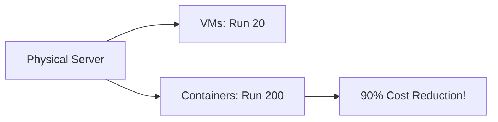

**Real Example:**
```
Company: 1,000 microservices
VMs: Need 1,000 VMs = 100 physical servers = $500K
Containers: Run on 10 physical servers = $50K
Savings: $450,000!
```

### 7. **Industry Adoption**

**Who's Using Containers:**
- Netflix: 1,000+ microservices
- Spotify: Entire platform
- Uber: 4,000+ microservices
- Google: 2+ billion containers/week!

**Evidence:** Industry has spoken - containers for microservices!

## The Case for VMs (Security Advantage!)

### 1. **Stronger Isolation**

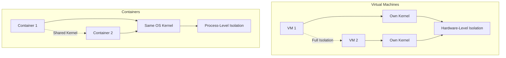

**The Problem with Containers:**

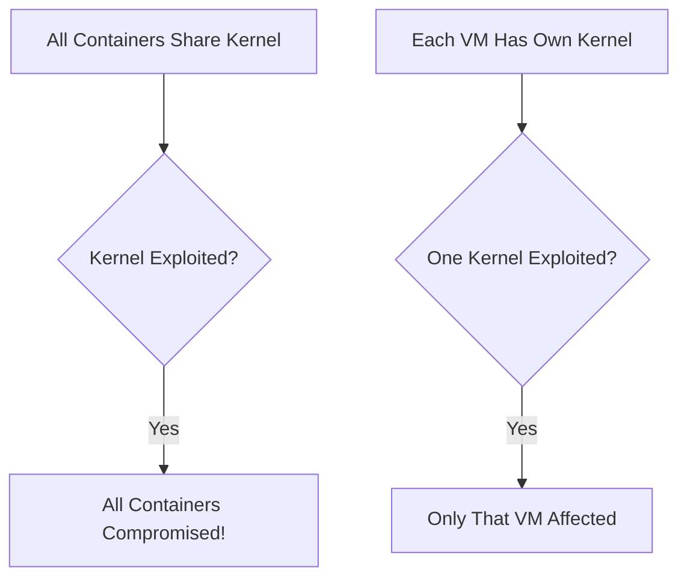

**Real Attack:** If attacker escapes container, they have kernel access = **game over!**

### 2. **Real-World Security Incidents**

#### Case 1: runC Vulnerability (CVE-2019-5736)

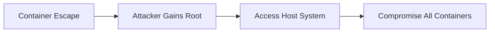

**What Happened:**
- Bug in Docker/runC
- Container could escape to host
- Full system compromise
- **Millions of systems vulnerable!**

**With VMs:** Hypervisor escape is MUCH harder!

#### Case 2: Dirty COW (Kernel Exploit)

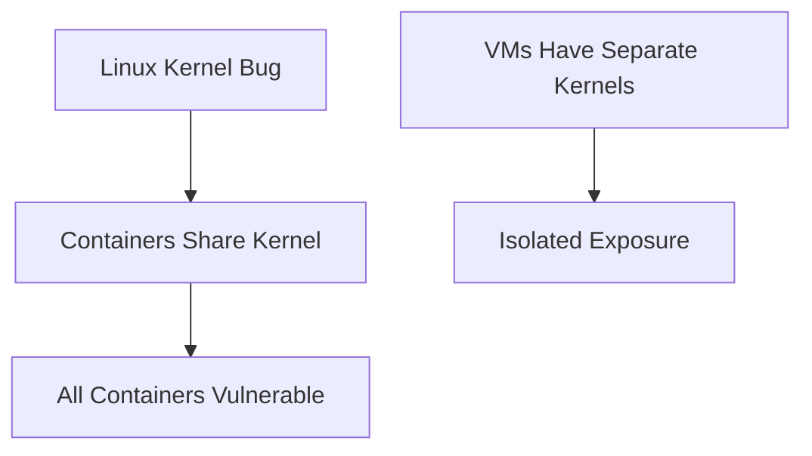

**Impact:**
- Containers: All affected
- VMs: Each VM can run different kernel versions

### 3. **Multi-Tenancy Security**

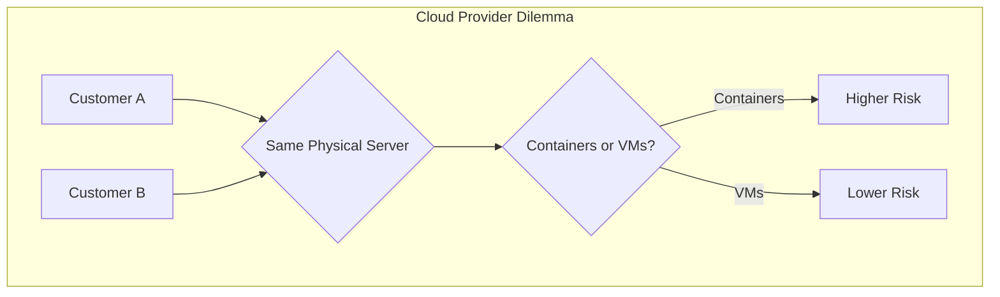

**Why Cloud Providers Use VMs:**

**AWS, Azure, GCP:**
- Customer isolation = VMs
- Each customer gets VM(s)
- Hypervisor prevents cross-customer access

**Why not containers directly?**
- ❌ Kernel sharing too risky
- ❌ One customer could affect others
- ❌ Compliance issues

### 4. **Compliance & Regulations**

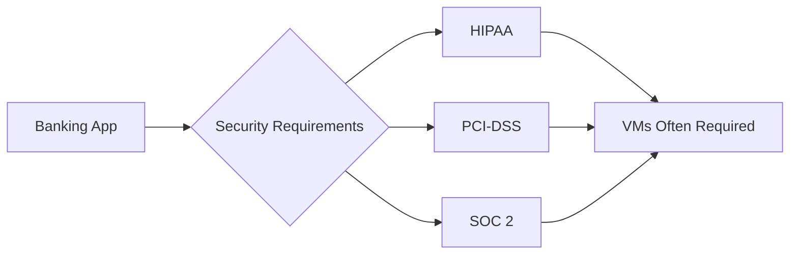

**Why Regulations Prefer VMs:**
- ✅ Proven security track record
- ✅ Stronger audit trails
- ✅ Clear boundaries
- ✅ Established best practices

**Containers:**
- ⚠️ Still proving themselves
- ⚠️ Newer, less understood by auditors

### 5. **Defense in Depth**

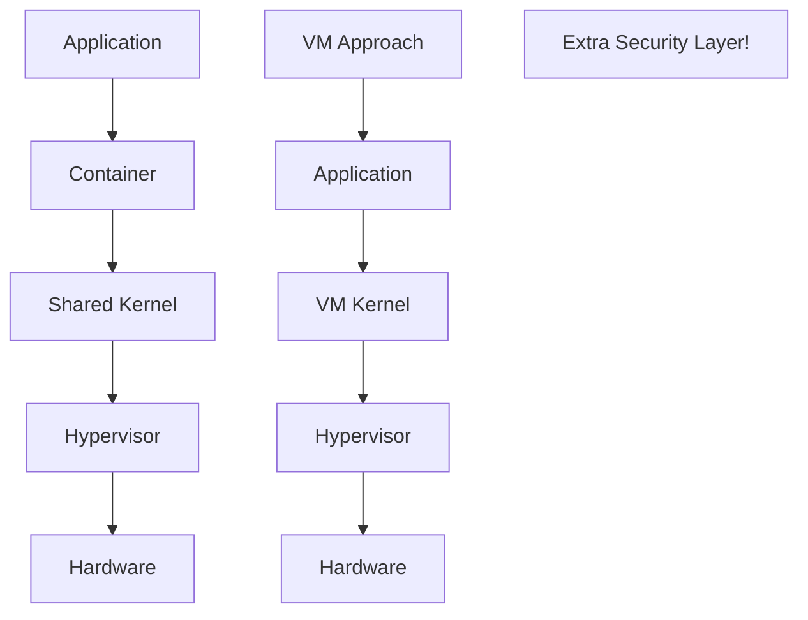

**Security Layers:**
- **Containers:** App → Namespace → Kernel
- **VMs:** App → VM OS → Hypervisor → Hardware

**VMs = One extra isolation layer!**

### 6. **Different OS Requirements**

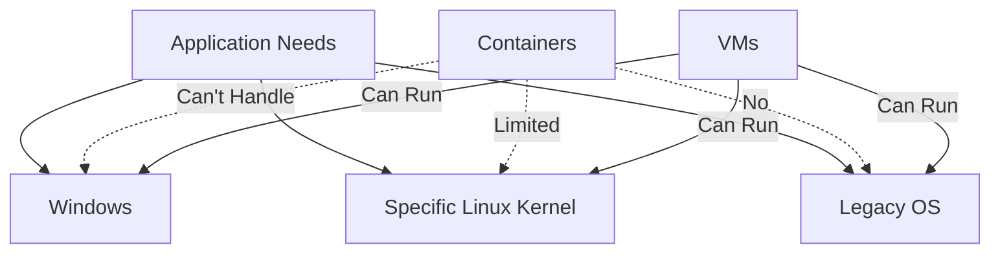

**Example:** Run Windows app + Linux app on same host?
- **VMs:** Yes, easily!
- **Containers:** Need Windows AND Linux hosts

## The Modern Reality: Hybrid Approach

### **BOTH are here to stay!**

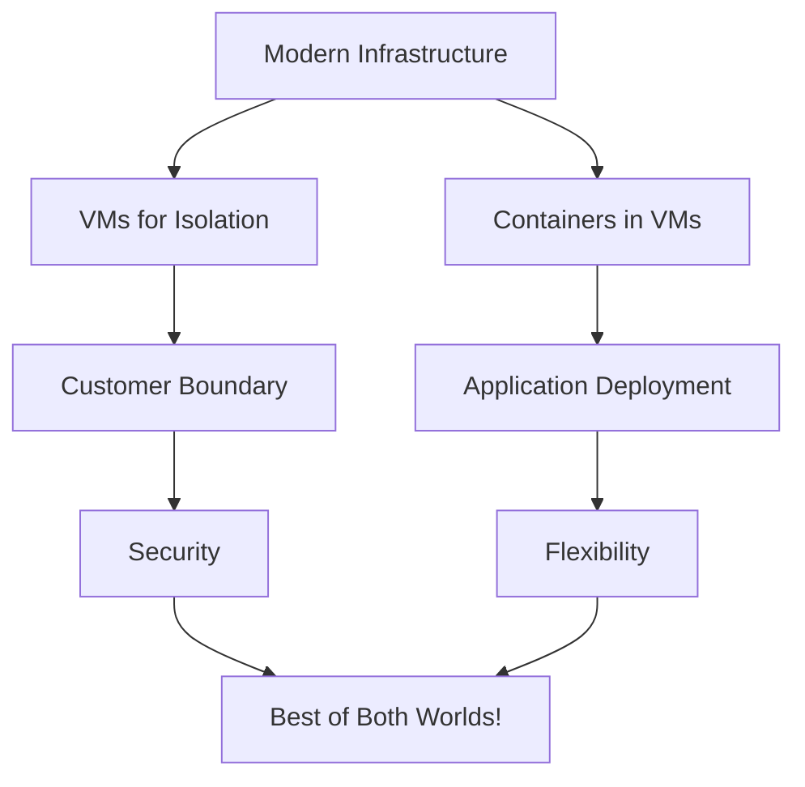

### Pattern 1: Containers Inside VMs

**What AWS/Azure/GCP Do:**

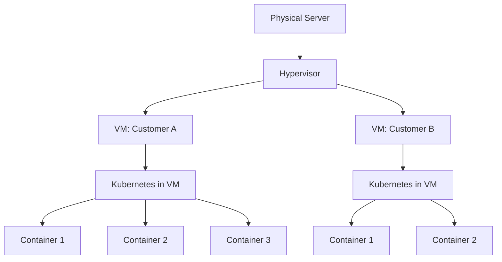

**Why This Works:**
- ✅ VM provides strong isolation between customers
- ✅ Containers provide microservice benefits
- ✅ Security + Flexibility

### Pattern 2: Kata Containers / gVisor

**Secure Containers:**

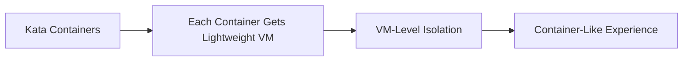

**Technologies:**
- **Kata Containers:** Lightweight VMs that feel like containers
- **gVisor:** Extra sandbox layer for containers
- **Firecracker:** AWS's micro-VM for Lambda

**Best of Both Worlds!**

## Real-World Deployments

### Netflix: Hybrid Approach

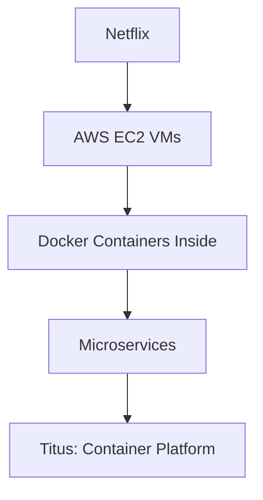

**Why:**
- VMs for customer/team isolation
- Containers for microservices
- Security + Agility

### Stripe: VMs for Security

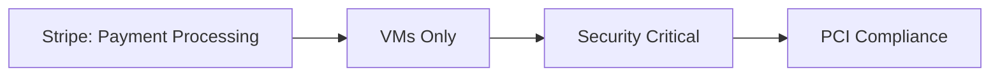

**Decision:** Security > convenience

### Google: Pure Containers

```mermaid
graph LR
    A[Google Internal] --> B[Everything in Containers]
    B --> C[2B+ containers/week]
    C --> D[But: Own Infrastructure]
```

**Why They Can:**
- Own hardware
- Not multi-tenant (internally)
- Advanced security (BeyondProd)

## Security Comparison Table

| Security Aspect | VMs | Containers | Hybrid (Containers in VMs) |
|----------------|-----|------------|----------------------------|
| **Isolation** | ⭐⭐⭐⭐⭐ | ⭐⭐⭐ | ⭐⭐⭐⭐⭐ |
| **Attack Surface** | Small | Large (shared kernel) | Small |
| **Escape Difficulty** | Very Hard | Medium | Very Hard |
| **Performance** | 90% | 99% | 95% |
| **Density** | 10-20/host | 100s/host | 50-100/host |
| **Compliance** | ⭐⭐⭐⭐⭐ | ⭐⭐⭐ | ⭐⭐⭐⭐⭐ |

## My Verdict

**Are VMs obsolete for microservices?**

🎯 **NO - But the relationship has changed!**

```mermaid
graph TD
    A[For Microservices] --> B{Your Situation}
    
    B -->|Small company, own infrastructure| C[Containers + Good security]
    B -->|Multi-tenant cloud| D[VMs + Containers hybrid]
    B -->|High security needs| E[VMs with containers inside]
    B -->|Maximum agility| C
    B -->|Compliance critical| E
```

### Use Containers When:
- ✅ Single-tenant environment (your own infrastructure)
- ✅ Speed of development critical
- ✅ Modern security practices in place
- ✅ Acceptable risk tolerance
- ✅ Want maximum density

### Use VMs When:
- ✅ Multi-tenant environment
- ✅ Different customers on same hardware
- ✅ Compliance requirements (PCI-DSS, HIPAA)
- ✅ Need different OS types
- ✅ Security is paramount

### Use Hybrid (Containers in VMs) When:
- ✅ Cloud provider (AWS, Azure, GCP)
- ✅ Want best of both worlds
- ✅ Can afford slight performance overhead
- ✅ Need security + flexibility
- ✅ Most real-world scenarios!

## The Future

```mermaid
graph LR
    A[Next 5 Years] --> B[Secure Containers Mature]
    B --> C[Kata, gVisor, Firecracker]
    C --> D[Container security → VM-level]
    D --> E[Convergence!]
```

**Prediction:**
1. **2024-2026:** Hybrid dominates (containers in VMs)
2. **2027-2029:** Secure containers mature
3. **2030+:** Containers might fully replace VMs for microservices

**But VMs won't disappear** - they'll remain for:
- Legacy applications
- Specific security needs
- Certain compliance requirements

**Bottom Line:** Containers are winning for microservices, but VMs provide a critical security layer. The smart approach? Use both!

---

## Learning Resources

### Container Security
- [Docker Security Best Practices](https://docs.docker.com/engine/security/) - Official guide
- [CIS Docker Benchmark](https://www.cisecurity.org/benchmark/docker) - Security standards
- [Container Security](https://www.youtube.com/results?search_query=container+security+best+practices) - Video tutorials
- [NIST Container Security](https://nvlpubs.nist.gov/nistpubs/SpecialPublications/NIST.SP.800-190.pdf) - Official guidelines

### VM Security
- [VM Security Best Practices](https://www.vmware.com/security/hardening-guides.html) - VMware guides
- [Hypervisor Security](https://www.nsa.gov/ia/mitigation_guidance/security_configuration_guides/hypervisors.shtml) - NSA guidelines
- [VM Isolation](https://docs.microsoft.com/en-us/virtualization/hyper-v-on-windows/user-guide/security) - Microsoft security

### Secure Container Technologies
- [Kata Containers](https://katacontainers.io/) - Lightweight VMs for containers
- [gVisor](https://gvisor.dev/) - Application kernel for containers
- [Firecracker](https://firecracker-microvm.github.io/) - AWS micro-VMs
- [Nabla Containers](https://nabla-containers.github.io/) - Minimal kernel surface

### Kubernetes Security
- [Kubernetes Security](https://kubernetes.io/docs/concepts/security/) - Official docs
- [K8s Security Best Practices](https://www.cncf.io/blog/2019/01/14/9-kubernetes-security-best-practices-everyone-must-follow/) - CNCF guide
- [Pod Security Standards](https://kubernetes.io/docs/concepts/security/pod-security-standards/) - Security policies
- [Network Policies](https://kubernetes.io/docs/concepts/services-networking/network-policies/) - Network isolation

### Vulnerability Research
- [Container Escape Techniques](https://blog.trailofbits.com/2019/07/19/understanding-docker-container-escapes/) - Trail of Bits
- [runC CVE-2019-5736](https://nvd.nist.gov/vuln/detail/CVE-2019-5736) - Container escape vulnerability
- [Docker CVE Database](https://www.cvedetails.com/product/28125/Docker-Docker.html) - Known vulnerabilities
- [Kubernetes CVEs](https://www.cvedetails.com/vulnerability-list/vendor_id-15867/product_id-34016/Kubernetes-Kubernetes.html) - K8s vulnerabilities

### Comparison Studies
- [Containers vs VMs Security](https://www.youtube.com/results?search_query=containers+vs+vms+security) - Video comparisons
- [Performance Analysis](https://www.usenix.org/system/files/conference/hotcloud14/hotcloud14-paper-morabito.pdf) - Academic research
- [Security Comparison](https://sysdig.com/blog/container-vs-vm-security/) - Industry analysis

### Compliance & Standards
- [PCI-DSS Container Guidance](https://blog.aquasec.com/pci-dss-docker-container-compliance) - Payment security
- [HIPAA Containers](https://www.hhs.gov/hipaa/for-professionals/security/laws-regulations/index.html) - Healthcare compliance
- [SOC 2 Containers](https://www.aicpa.org/interestareas/frc/assuranceadvisoryservices/aicpasoc2report.html) - Audit requirements

### Hands-On Labs
- [Docker Security Lab](https://training.play-with-docker.com/security-intro/) - Interactive security
- [Kubernetes Security Workshop](https://securek8s.dev/) - K8s hardening
- [Container Breakout Lab](https://katacoda.com/courses/docker-security) - Escape scenarios
- [gVisor Quickstart](https://gvisor.dev/docs/user_guide/quick_start/docker/) - Try secure containers

### Tools & Scanning
- [Clair](https://github.com/quay/clair) - Vulnerability scanner
- [Trivy](https://github.com/aquasecurity/trivy) - Container security
- [Falco](https://falco.org/) - Runtime security
- [Aqua Security](https://www.aquasec.com/) - Container platform security
- [Sysdig Secure](https://sysdig.com/products/secure/) - Runtime protection

### Books
- "Container Security" by Liz Rice
- "Kubernetes Security" by Liz Rice & Michael Hausenblas
- "Docker Security" by Adrian Mouat
- "Hacking Kubernetes" by Andrew Martin

### Research Papers
- [An Updated Performance Comparison of Virtual Machines and Linux Containers](https://domino.research.ibm.com/library/cyberdig.nsf/papers/0929052195DD819C85257D2300681E7B/$File/rc25482.pdf)
- [Security Analysis of Container Runtimes](https://arxiv.org/abs/1911.12950)
- [Kata Containers Architecture](https://github.com/kata-containers/documentation/blob/master/design/architecture.md)

### Communities
- [r/docker](https://www.reddit.com/r/docker/) - Container discussions
- [r/kubernetes](https://www.reddit.com/r/kubernetes/) - K8s security
- [CNCF Slack](https://slack.cncf.io/) - Cloud native security
- [Container Security Mailing List](https://groups.google.com/forum/#!forum/container-sec) - Research & discussions

### Conferences & Talks
- [KubeCon Security Talks](https://www.youtube.com/results?search_query=kubecon+security) - Latest research
- [DockerCon Security Sessions](https://www.docker.com/dockercon/) - Best practices
- [BlackHat Container Talks](https://www.blackhat.com/) - Attack research
- [OWASP Container Security](https://owasp.org/www-project-container-security/) - Vulnerability research
