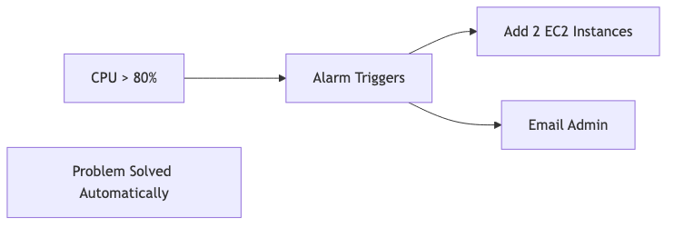

# The Containerization Challenge: Are Docker and Kubernetes making traditional Virtual Machines obsolete for microservices, or do VMs still hold a critical security advantage?

## Introduction

Good morning everyone! Today I want to tackle one of the hottest debates in cloud computing - are containers making virtual machines obsolete? You hear a lot about Docker and Kubernetes these days, and some people say VMs are dead. But is that really true? Or do VMs still have a critical advantage, especially when it comes to security? Let me share my perspective on this fascinating question.

## Understanding the Basic Difference

Before we dive into the debate, let me explain how these two technologies actually differ.

**Virtual Machines - The traditional way:**
Each VM runs a complete operating system. Think of it like having multiple separate computers, each with its own Windows or Linux. The hypervisor sits on the physical hardware and creates these virtual computers. Heavy but very isolated.

**Containers - The modern way:**
All containers share the same operating system kernel. They're just isolated processes. Think of it like apartments in a building - they all share the same foundation and utilities, but each has its own space. Light and fast.


## Why People Think Containers Are Winning

Let me tell you the compelling reasons why containers seem to be taking over:

### First: Lightweight and Lightning Fast

Here's the amazing thing about containers - they're incredibly small and start instantly! Look at these numbers:


**Real Numbers:**

| Metric | Virtual Machine | Container |
|--------|----------------|-----------|
| **Size** | 1-10 GB | 10-500 MB |
| **Startup Time** | 1-5 minutes | 1-5 seconds |
| **Memory** | 512 MB - 8 GB | 10-200 MB |
| **Density** | 10-20 per host | 100-1000 per host |

**Impact:** You can run 50 times more applications on the same hardware! Imagine having one physical server - with VMs you might run 20 applications, but with containers you could run 200. That's massive cost savings!

### Second: Perfect for Microservices Architecture

Containers and microservices are a match made in heaven. Let me show you why:


**Why Containers Win:**
- ✅ Each microservice in own container
- ✅ Deploy independently
- ✅ Scale individually
- ✅ Fast iteration

**With VMs:**
- ❌ Each microservice needs full VM - huge resource waste
- ❌ VMs take minutes to start
- ❌ Very expensive at scale

This is why Netflix, Spotify, and Uber all use containers for their microservices!

### Third: "Works on My Machine" Problem - SOLVED!

You know that famous developer excuse "but it works on my machine"? Containers completely solve this problem!



**The Problem (VMs):**
```
Developer: "It works on my VM!"
Production: "Doesn't work here!"
Reason: Different configurations, versions, libraries
```

**The Solution (Containers):**
```dockerfile
FROM node:16
COPY . /app
RUN npm install
CMD ["node", "server.js"]
```

**Result:** Exact same environment everywhere! Your laptop, test server, and production all run the identical container. No more configuration mismatches!

### Fourth: DevOps Dream Come True

Containers make continuous deployment incredibly fast and simple:


**CI/CD Pipeline:**
```yaml
# Automated deployment with containers
1. Git push
2. Build container: 30 seconds
3. Run tests: 1 minute
4. Deploy to Kubernetes: 30 seconds
Total: 2 minutes!
```

**With VMs:**
```
1. Git push
2. Build VM image: 10 minutes
3. Deploy VM: 5 minutes
4. Start VM: 2 minutes
Total: 17 minutes!
```

That's 2 minutes with containers versus 17 minutes with VMs! Imagine deploying 10 times a day - containers save you hours!

### Fifth: Kubernetes Makes It Magical

Kubernetes orchestration gives you superpowers for managing containers:


**Example: Black Friday Traffic**
```
Normal: 100 containers
Black Friday: Auto-scale to 1,000 containers
After sale: Scale back to 100
Automatic, no human intervention!
```

**With VMs:** Manual scaling, slow, expensive! You'd need to plan capacity weeks in advance.

### Sixth: Massive Cost Savings

The numbers speak for themselves:


**Real Example:**
```
Company: 1,000 microservices
VMs: Need 1,000 VMs = 100 physical servers = $500K
Containers: Run on 10 physical servers = $50K
Savings: $450,000!
```

That's 90% cost reduction! For a startup, this could mean survival versus failure.

### Seventh: Industry Has Spoken

**Who's Using Containers:**
- Netflix: 1,000+ microservices
- Spotify: Entire platform
- Uber: 4,000+ microservices
- Google: 2+ billion containers/week!

**Evidence:** Industry has spoken - containers for microservices!

So with all these advantages, VMs must be dead, right? WRONG! Let me tell you why VMs still have a critical role.

## Why VMs Still Have a Critical Security Advantage

Now here's the other side of the story - and it's all about SECURITY!

### First: Much Stronger Isolation

This is the BIG difference! VMs provide hardware-level isolation, containers only provide process-level isolation.


**The Problem with Containers:**


**Real Attack:** If an attacker escapes a container, they get access to the shared kernel - that means they can potentially access ALL other containers on that host. Game over!

With VMs, even if one VM is compromised, the others are still safe because each has its own kernel. The hypervisor provides that critical extra layer of protection.

### Second: Real-World Security Incidents Prove the Risk

Let me share actual security breaches that happened with containers:

#### Case 1: runC Vulnerability (CVE-2019-5736)


**What Happened:**
- Bug in Docker/runC
- Container could escape to host
- Full system compromise
- **Millions of systems vulnerable!**

**With VMs:** Hypervisor escape is MUCH harder! There have been very few successful hypervisor escapes in history.

**Another Example - Dirty COW:**


**Impact:**
- With containers: ALL containers affected because they share the kernel
- With VMs: Each VM can run different kernel versions, so you can patch gradually

These real incidents show why security teams prefer VMs!

### Third: Multi-Tenancy Requires Strong Isolation

Here's why cloud providers like AWS, Azure, and Google Cloud use VMs for customer isolation:


**Why Cloud Providers Use VMs:**

**AWS, Azure, GCP:**
- Customer isolation = VMs
- Each customer gets VM(s)
- Hypervisor prevents cross-customer access

**Why not containers directly?**
- ❌ Kernel sharing too risky - one customer could affect others
- ❌ If one customer's container escapes, they could access another customer's data
- ❌ Compliance and legal issues

This is why when you rent a cloud server, you're getting a VM, not a container!

### Fourth: Compliance and Regulations Love VMs


**Why Regulations Prefer VMs:**
- ✅ Proven security track record
- ✅ Stronger audit trails
- ✅ Clear boundaries
- ✅ Established best practices

**Containers:**
- ⚠️ Still proving themselves to auditors
- ⚠️ Newer technology, less understood
- ⚠️ Harder to get compliance approval

If you're building a banking app or healthcare system, auditors will be much happier if you use VMs!

### Fifth: Defense in Depth - Extra Security Layers


**Security Layers:**
- **Containers:** App → Namespace → Kernel (3 layers)
- **VMs:** App → VM OS → Hypervisor → Hardware (4 layers)

**VMs give you one extra isolation layer!** An attacker has to break through more barriers to reach your data.

### Sixth: Operating System Flexibility


**Example:** Need to run a Windows app and a Linux app on the same physical server?
- **VMs:** Yes, easily! Each VM can run a different OS
- **Containers:** You'd need separate host machines for Windows and Linux containers

VMs give you much more flexibility when you have diverse OS requirements.

## The Modern Reality: Best of Both Worlds

So here's the truth - the answer isn't "containers OR VMs" - it's "containers AND VMs"! Let me explain the hybrid approach that everyone is actually using:


### The Winning Pattern: Containers Inside VMs

This is what AWS, Azure, and Google Cloud actually do - and it's brilliant!


**Why This Works:**
- ✅ VMs provide strong isolation between customers (security!)
- ✅ Containers inside provide microservice benefits (speed and flexibility!)
- ✅ You get security AND agility

This is the best of both worlds! It's like having a secure building (VM) with flexible office spaces inside (containers).

### New Technologies: Secure Containers


**Technologies:**
- **Kata Containers:** Each container gets its own lightweight VM - VM security with container speed!
- **gVisor:** Adds an extra sandbox layer for containers - Google's solution
- **Firecracker:** AWS's micro-VM technology used in Lambda - super fast VMs

These technologies are trying to give you VM-level security with container-like speed. Pretty cool!

## Real-World Examples

Let me show you how actual companies solve this problem:

### Netflix: Hybrid Approach


**Why Netflix Does This:**
- Uses VMs for customer/team isolation and security
- Uses containers for microservices flexibility and speed
- Gets both security AND agility

They're not choosing one over the other - they're using both!

### Stripe: Pure VMs for Maximum Security


**Decision:** Security is more important than convenience when you're handling billions of dollars in transactions!

Stripe chose VMs because payment processing requires the absolute highest security. For them, the extra security layer is worth the overhead.

### Google: All-In on Containers (But With a Catch)


**Why They Can:**
- They own all the hardware (not multi-tenant like a public cloud)
- It's all internal use, not different customers
- They've built advanced security systems (BeyondProd) specifically for containers

This shows containers CAN be secure, but Google invested billions in making it work! Most companies can't do that.

## Quick Comparison Table

Let me summarize the key differences:

| Security Aspect | VMs | Containers | Hybrid (Containers in VMs) |
|----------------|-----|------------|----------------------------|
| **Isolation** | ⭐⭐⭐⭐⭐ | ⭐⭐⭐ | ⭐⭐⭐⭐⭐ |
| **Attack Surface** | Small | Large (shared kernel) | Small |
| **Escape Difficulty** | Very Hard | Medium | Very Hard |
| **Performance** | 90% | 99% | 95% |
| **Density** | 10-20/host | 100s/host | 50-100/host |
| **Compliance** | ⭐⭐⭐⭐⭐ | ⭐⭐⭐ | ⭐⭐⭐⭐⭐ |

This table shows why the hybrid approach wins - you get the best of both!

## My Final Answer

So, are containers making VMs obsolete for microservices?

**My answer: NO - VMs are NOT obsolete! But the relationship has changed.**


Here's my practical advice:


Here's my practical advice:

### Use Pure Containers When:
- ✅ You're a small company running your own infrastructure
- ✅ Speed and agility are your top priorities
- ✅ You have good security practices in place
- ✅ You need maximum resource efficiency
- ✅ All users are internal (not multi-tenant)

### Use Pure VMs When:
- ✅ You're running a multi-tenant environment (different customers)
- ✅ You need different operating systems
- ✅ Compliance requirements demand it (banking, healthcare)
- ✅ Security is absolutely paramount
- ✅ You have legacy applications that can't be containerized

### Use Hybrid (Containers in VMs) When:
- ✅ You're a cloud provider (AWS, Azure, Google Cloud)
- ✅ You want both security AND flexibility
- ✅ You can afford a slight performance overhead for better security
- ✅ You need to isolate different teams or customers
- ✅ This is the approach for MOST real-world scenarios!

## The Future Trend


**My Prediction:**
- **2024-2026:** Hybrid approach dominates (containers inside VMs) - this is where we are now
- **2027-2029:** Secure container technologies mature (Kata, gVisor, Firecracker become mainstream)
- **2030+:** Containers might fully replace VMs for microservices

**But VMs won't disappear!** They'll always be needed for:
- Legacy applications that can't be containerized
- Ultra-high security requirements
- Specific compliance needs
- Different OS requirements

## Final Thoughts

The debate isn't "containers versus VMs" - it's about using the right tool for the job!

**Key Takeaways:**
1. **Containers are amazing** for microservices - lightweight, fast, perfect for DevOps
2. **VMs provide critical security** through hardware-level isolation - can't ignore this!
3. **The winning approach is hybrid** - containers inside VMs for most scenarios
4. **New technologies** like Kata Containers are bridging the gap

**For your microservices project:**
- If you're a startup with your own servers → Use containers with good security practices
- If you're building a multi-tenant SaaS → Use the hybrid approach (containers in VMs)
- If you're in banking/healthcare → Lean heavily on VMs for compliance
- If you're on AWS/Azure/GCP → Use their managed Kubernetes (which runs containers in VMs!)

The bottom line? Containers are winning the battle for microservices, but VMs provide that critical security layer. The smartest approach is to use BOTH together. That's the reality of modern cloud infrastructure!

Thank you!
