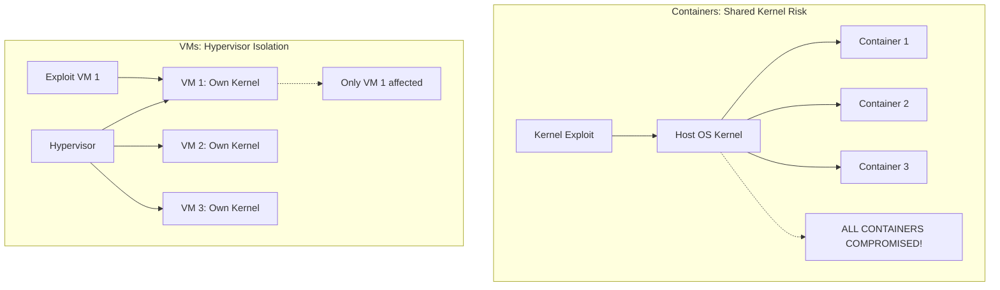
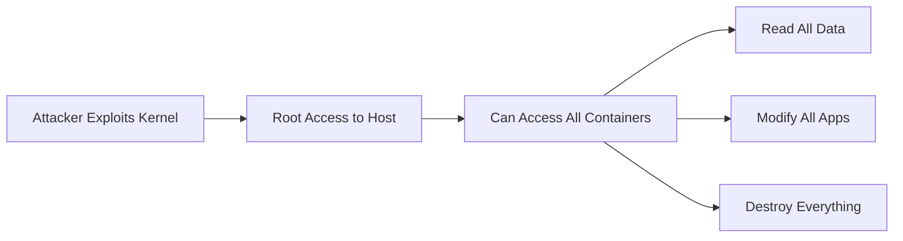
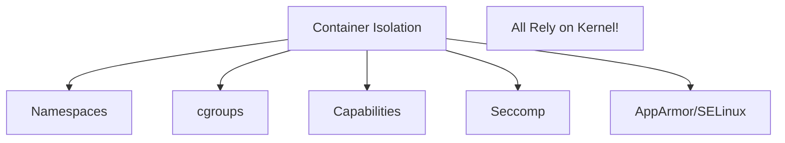
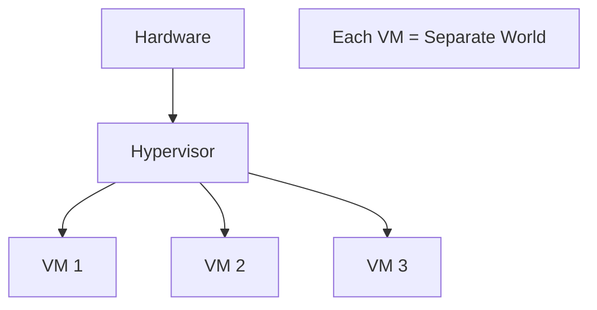
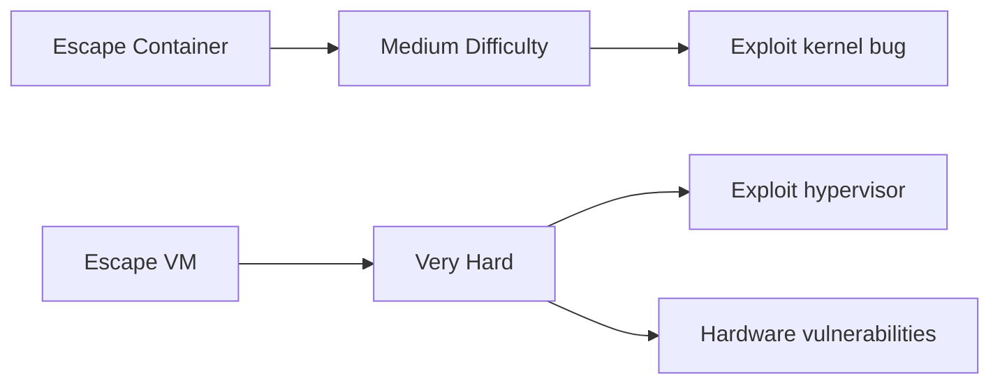
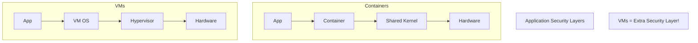
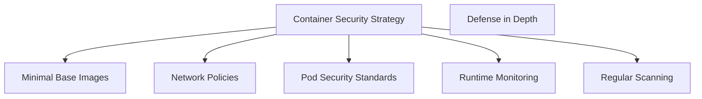
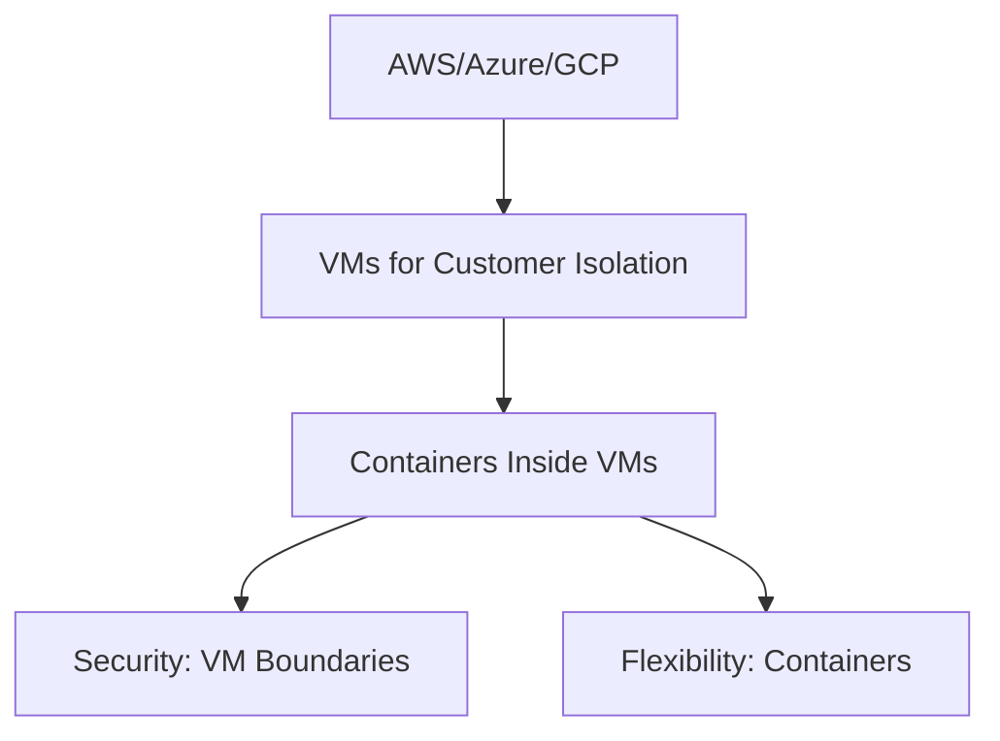

# Security Isolation: The Host OS vulnerability is a single point of failure for all containers. Is the Hypervisor's isolation layer a fundamentally more secure approach?

## Introduction

This is the million-dollar security question! If the host OS is compromised, are ALL containers doomed? Is the hypervisor's isolation truly better? Let's cut through the hype and find the truth.

## The Core Problem Visualized



## Container Security Reality

### The Single Point of Failure

**What happens when host OS is compromised:**



**Real Example - Dirty COW (2016):**
- Linux kernel vulnerability
- ALL containers on that host vulnerable
- One exploit = complete compromise
- Millions of containers at risk

### Container Isolation Mechanisms



**The Problem:** ALL these security features run IN the kernel. If kernel is compromised, they're all bypassed!

## Hypervisor Security Reality

### The Isolation Layer



**Key Difference:**
- Hypervisor runs in **privileged mode** (Ring -1)
- VMs run in **less privileged mode** (Ring 0-3)
- Hardware-enforced separation

### Why It's More Secure

**Attack Surface Comparison:**

| Attack Vector | Containers | VMs |
|---------------|------------|-----|
| **Kernel Exploit** | All containers fail | One VM fails |
| **Privilege Escalation** | Can affect all | Isolated to VM |
| **Memory Access** | Shared memory space | Isolated memory |
| **Network Stack** | Shared network | Isolated network |
| **Syscalls** | All use same kernel | Each VM own kernel |

## Real-World Security Incidents

### Container Escapes

**runC Vulnerability (CVE-2019-5736):**


**Impact:** Every Docker/Kubernetes deployment vulnerable!

**Shocker Exploit (2014):**
- Container escape to host
- Demonstrated containers not foolproof
- Required immediate patching

### Hypervisor Escapes (Much Rarer!)

**Venom (CVE-2015-3456):**
- QEMU floppy driver vulnerability
- Theoretically could escape VM
- **But:** Very difficult to exploit
- **And:** Affected old systems only

**Key Point:** Hypervisor escapes are RARE and DIFFICULT compared to container escapes!

## The Security Comparison

### Attack Difficulty



**Statistics:**
- Container escapes: **~50 major CVEs since 2014**
- Hypervisor escapes: **~10 major CVEs since 2014**
- **5x more container vulnerabilities!**

### Defense in Depth



**VMs provide one more barrier!**

## But Containers Aren't Defenseless!

### Modern Container Security

**1. Kata Containers / gVisor:**


**Result:** Best of both worlds!

**2. Security Hardening:**
```yaml
# Secure container configuration
securityContext:
  runAsNonRoot: true
  readOnlyRootFilesystem: true
  capabilities:
    drop: ["ALL"]
  seccomp: RuntimeDefault
```

**3. Runtime Security:**
- Falco: Detects abnormal behavior
- AppArmor/SELinux: Mandatory access control
- Seccomp: Syscall filtering

### Multi-Layer Defense



## The Verdict

**Is hypervisor isolation fundamentally more secure?**

🎯 **YES - But with important nuances!**

### Why Hypervisors Win on Security:

✅ **Hardware-enforced isolation**
```
VMs: CPU enforces separation
Containers: Software enforces separation
Hardware > Software for security!
```

✅ **Separate kernels**
```
One kernel compromised ≠ All systems compromised
```

✅ **Proven track record**
```
15+ years of hardening
Fewer escape vulnerabilities
Better understood by security teams
```

✅ **Compliance preference**
```
PCI-DSS, HIPAA often require VM-level isolation
```

### When Container Security Is "Good Enough":

✅ **Trusted workloads** (your own apps)
✅ **Single-tenant** (not running untrusted code)
✅ **Good security practices** (hardening, monitoring)
✅ **Modern runtimes** (Kata, gVisor)
✅ **Regular patching** (stay updated)

## The Modern Approach: Hybrid

**Cloud providers use BOTH:**



**Why it works:**
- VMs separate customers/teams
- Containers separate microservices
- Double isolation!

## Practical Recommendations

### Use VMs When:

🔒 **Multi-tenant environments** (different customers)
🔒 **Untrusted code** (running third-party apps)
🔒 **Compliance critical** (financial, healthcare)
🔒 **High-value targets** (payment processing)
🔒 **Different security zones** (DMZ separation)

### Use Containers When:

📦 **Single-tenant** (your own infrastructure)
📦 **Trusted workloads** (your applications)
📦 **Development/testing** (lower risk)
📦 **Performance critical** (need maximum density)
📦 **With hardening** (proper security measures)

### Use Containers in VMs When:

🎯 **Cloud platforms** (isolate customers)
🎯 **Best of both** (security + flexibility)
🎯 **Most real-world scenarios!**

## The Bottom Line

**Yes, hypervisors ARE fundamentally more secure** because:

1. **Hardware isolation** vs software isolation
2. **Separate kernels** prevent cascade failures
3. **Smaller attack surface** (hypervisor is minimal)
4. **Proven security** record over decades
5. **Defense in depth** provides extra layer

**But containers can be secure enough** when:
- Properly configured and hardened
- Used in appropriate contexts
- Combined with runtime security
- Run in trusted environments

**The future:** Technologies like Kata Containers that combine VM security with container convenience!

---

## Learning Resources

### Container Security
- [Docker Security](https://docs.docker.com/engine/security/) - Best practices
- [Kubernetes Security](https://kubernetes.io/docs/concepts/security/) - K8s hardening
- [CIS Benchmarks](https://www.cisecurity.org/cis-benchmarks/) - Security standards
- [Container Security by Liz Rice](https://www.oreilly.com/library/view/container-security/9781492056690/) - Book

### Hypervisor Security
- [VMware Security](https://www.vmware.com/security/hardening-guides.html) - Hardening guides
- [KVM Security](https://www.linux-kvm.org/page/Security) - Linux virtualization
- [Xen Security](https://wiki.xenproject.org/wiki/Xen_Security_Advisories) - Security advisories

### Secure Containers
- [Kata Containers](https://katacontainers.io/) - VM-like isolation
- [gVisor](https://gvisor.dev/) - Application kernel
- [Firecracker](https://firecracker-microvm.github.io/) - Micro-VMs

### Vulnerability Research
- [CVE Database](https://cve.mitre.org/) - Known vulnerabilities
- [Container Exploits](https://blog.trailofbits.com/2019/07/19/understanding-docker-container-escapes/) - Research
- [NVD](https://nvd.nist.gov/) - Vulnerability database

### Tools
- [Falco](https://falco.org/) - Runtime security
- [Trivy](https://github.com/aquasecurity/trivy) - Vulnerability scanning
- [Anchore](https://anchore.com/) - Container analysis
