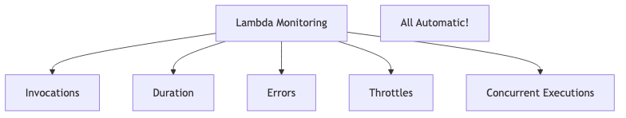

# Security Isolation: The Host OS vulnerability is a single point of failure for all containers. Is the Hypervisor's isolation layer a fundamentally more secure approach?

## Introduction

Good morning everyone! Today I want to address one of the most critical security questions in cloud computing - is the shared kernel in containers a dangerous single point of failure? If the host OS gets compromised, are ALL containers doomed? And is the hypervisor's isolation truly better? Let me walk you through this important security debate.

## Understanding the Core Security Problem

Let me first show you visually what we're dealing with - the fundamental difference in isolation:


This diagram shows the critical difference - containers share one kernel, VMs each have their own. Now let me explain why this matters.

## The Container Security Reality

### The Single Point of Failure Problem

Here's the scary truth about containers - they ALL depend on one shared kernel. Let me show you what happens when that kernel gets compromised:

**What happens when host OS is compromised:**


Think about it - if an attacker gets root access to the host kernel, they can access EVERYTHING. Every container, every application, every piece of data. It's a complete catastrophe!

**Real-World Example - Dirty COW (2016):**
This was a Linux kernel vulnerability that affected millions of systems. Here's what made it so dangerous:
- It was a bug in the Linux kernel itself
- ALL containers running on that host were vulnerable
- One successful exploit meant complete compromise
- Millions of containers were at risk simultaneously

This is exactly why security experts worry about the shared kernel model!

### How Container Isolation Actually Works


**Here's the fundamental problem:** ALL these security features - namespaces, cgroups, capabilities, seccomp, AppArmor - they all run INSIDE the kernel! 

So if the kernel itself is compromised, all these protections are bypassed. It's like having a really strong lock on your door, but the burglar walks in through the broken foundation of the building!

## The Hypervisor Security Reality

Now let me show you why hypervisors provide stronger isolation:

### The Hardware-Level Isolation Layer


**The Key Difference:**
- Hypervisors run in **privileged mode** (Ring -1) - the most privileged level
- VMs run in **less privileged mode** (Ring 0-3) - lower privileges
- The hardware itself enforces this separation!

This isn't just software saying "you can't access this" - it's the CPU physically preventing unauthorized access. That's a massive difference!

### Why Hypervisor Isolation is Stronger

Let me show you a comparison of what happens when an attacker tries to break out:

| Attack Vector | Containers | VMs |
|---------------|------------|-----|
| **Kernel Exploit** | All containers fail | One VM fails |
| **Privilege Escalation** | Can affect all | Isolated to VM |
| **Memory Access** | Shared memory space | Isolated memory |
| **Network Stack** | Shared network | Isolated network |
| **Syscalls** | All use same kernel | Each VM own kernel |

Look at this table - containers fail across the board when there's a kernel exploit. With VMs, the damage is contained to just one virtual machine!

## Real-World Security Incidents

Let me share actual security breaches that prove these points:

### Container Escape Attacks

**runC Vulnerability (CVE-2019-5736):**


**The Impact:** Every single Docker and Kubernetes deployment was vulnerable! This affected millions of production systems worldwide. If you were running containers, you needed to patch immediately or risk complete system compromise.

**Another Example - Shocker Exploit (2014):**
This was one of the first major container escape vulnerabilities discovered:
- It allowed a malicious container to escape to the host system
- It demonstrated that container isolation wasn't foolproof
- Required immediate patching across the industry

These aren't theoretical attacks - these actually happened and affected real systems!

### Hypervisor Escapes Are Much Rarer

**Venom (CVE-2015-3456):**
This was a rare hypervisor vulnerability:
- It was in QEMU's floppy driver (old legacy code)
- Theoretically could allow VM escape
- **But:** Very difficult to actually exploit in practice
- **And:** Only affected older systems with floppy drivers enabled

**Key Point:** Hypervisor escapes are EXTREMELY RARE and VERY DIFFICULT to pull off compared to container escapes!

The statistics speak for themselves - there have been roughly 5 times more container escape vulnerabilities than hypervisor escapes since 2014. That's a significant difference!

## Comparing the Security Levels

### How Difficult is an Escape?


**The Numbers Tell the Story:**
- Container escape vulnerabilities: **~50 major CVEs since 2014**
- Hypervisor escape vulnerabilities: **~10 major CVEs since 2014**
- That's **5 times more container vulnerabilities!**

This isn't just theory - the data proves that escaping containers is significantly easier than escaping VMs.

### Defense in Depth - The Layer Advantage



**VMs provide one more barrier!** Think of it like security in a building:
- Containers: App → Namespace → Kernel (3 doors to break through)
- VMs: App → VM OS → Hypervisor → Hardware (4 doors to break through)

That extra layer matters! An attacker has to work harder and break through more defenses to compromise a VM-based system.

## But Containers Can Be Made Secure!

Now, I don't want you to think containers are hopeless - they can be secured! Let me show you how:

### Modern Container Security Technologies

**1. Kata Containers and gVisor:**

These are revolutionary technologies that give you the best of both worlds!


**Result:** You get VM-level isolation with the speed and convenience of containers! Each container runs in its own lightweight VM, so if one is compromised, the others are still safe.

**2. Security Hardening Best Practices:**

You can configure containers to be much more secure:
```yaml
# Secure container configuration
securityContext:
  runAsNonRoot: true
  readOnlyRootFilesystem: true
  capabilities:
    drop: ["ALL"]
  seccomp: RuntimeDefault
```

These settings dramatically reduce the attack surface. You're running as non-root, the filesystem is read-only, you've dropped all unnecessary privileges, and you're filtering system calls. Much more secure!

**3. Runtime Security Monitoring:**

Modern tools can detect attacks in real-time:
- **Falco:** Detects abnormal container behavior
- **AppArmor/SELinux:** Provides mandatory access control
- **Seccomp:** Filters which system calls containers can make

These tools watch your containers and alert you immediately if something suspicious happens.

### Multiple Layers of Defense


A comprehensive container security strategy includes all these layers - minimal images, network isolation, security policies, continuous monitoring, and regular vulnerability scanning. Defense in depth!

## My Final Verdict

So, is the hypervisor's isolation fundamentally more secure than containers?

**My answer: YES - But with important context!**

### Why Hypervisors Win on Security:

✅ **Hardware-enforced isolation:**
The CPU itself enforces the separation between VMs. This is physical isolation, not just software saying "don't go there."

✅ **Separate kernels mean contained damage:**
If one VM's kernel is compromised, it doesn't affect other VMs. Each has its own isolated kernel.

✅ **Proven track record over 15+ years:**
Hypervisors have been hardened and tested for over a decade. They're well-understood and trusted by security teams.

✅ **Compliance requirements often mandate VMs:**
Regulations like PCI-DSS and HIPAA often require or strongly prefer VM-level isolation for sensitive workloads.

### When Container Security is Good Enough:

But containers aren't always bad! Here's when they're appropriate:

✅ **Trusted workloads** - Running your own applications, not untrusted third-party code
✅ **Single-tenant environments** - Not running different customers on the same host
✅ **Good security practices** - Proper hardening, monitoring, and regular patching
✅ **Modern runtimes** - Using Kata Containers or gVisor for enhanced isolation
✅ **Regular updates** - Staying current with security patches

## The Modern Hybrid Approach

In reality, most organizations don't choose one or the other - they use BOTH!


**Why This Works:**
- VMs provide strong boundaries between different customers or teams
- Containers inside VMs provide flexibility for microservices
- You get double isolation - VM-level AND container-level!

This is the smart approach - use VMs to create secure boundaries, then use containers within those boundaries for agility and efficiency.

## Practical Recommendations

Let me give you clear guidance on when to use what:

### Use VMs When:

🔒 **Multi-tenant environments** - Different customers sharing the same infrastructure
🔒 **Untrusted code execution** - Running third-party applications or user-submitted code
🔒 **Compliance-critical workloads** - Financial systems, healthcare data, legal documents
🔒 **High-value targets** - Payment processing, authentication systems, sensitive data
🔒 **Different security zones** - Separating DMZ from internal networks

### Use Containers When:

📦 **Single-tenant infrastructure** - All workloads belong to your organization
📦 **Trusted workloads** - Running your own developed applications
📦 **Development and testing** - Lower-risk environments
📦 **Performance-critical** - Need maximum density and efficiency
📦 **With proper hardening** - Security measures in place

### Use Containers in VMs When:

🎯 **Running cloud platforms** - AWS, Azure, Google Cloud all do this
🎯 **Need best of both worlds** - Security plus flexibility
🎯 **Most real-world production scenarios** - This is the industry standard!

## Final Thoughts

Yes, hypervisors ARE fundamentally more secure than containers because:

1. **Hardware-enforced isolation** beats software-enforced isolation
2. **Separate kernels** prevent cascade failures when one system is compromised
3. **Smaller attack surface** - hypervisors are minimal and well-tested
4. **Proven security record** - decades of hardening and very few escape vulnerabilities
5. **Defense in depth** - that extra layer of protection matters

**But containers can be secure enough when:**
- You properly configure and harden them
- You use them in appropriate contexts (trusted workloads)
- You combine them with runtime security tools
- You run them in single-tenant environments

**The future is exciting:** Technologies like Kata Containers are giving us VM-level security with container convenience!

**My recommendation:** For production systems handling sensitive data or serving multiple customers, use the hybrid approach - VMs for strong isolation, containers inside for flexibility. It's the best of both worlds!

Thank you!
