# The Cloud Workhorse: Why has AES-256 become the universal default for data-at-rest encryption across major cloud platforms?

## Introduction

Walk into any cloud datacenter - AWS, Azure, Google Cloud - and you'll find the same encryption everywhere: **AES-256**. Why? Let's uncover why this specific algorithm dominates cloud security.

## What is AES-256?

**Advanced Encryption Standard with 256-bit keys**

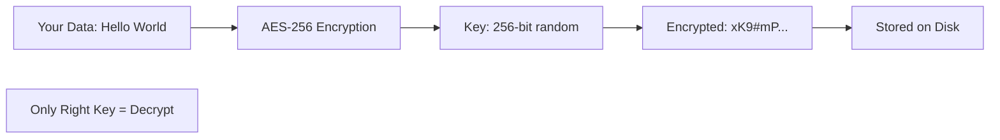

**The Numbers:**
- **AES:** Advanced Encryption Standard
- **256:** Key length in bits
- **2^256:** Possible keys = 115,792,089,237,316,195,423,570,985,008,687,907,853,269,984,665,640,564,039,457,584,007,913,129,639,936 combinations!

## Why AES? The History

### The Selection Process

**1997:** US Government needed new encryption standard

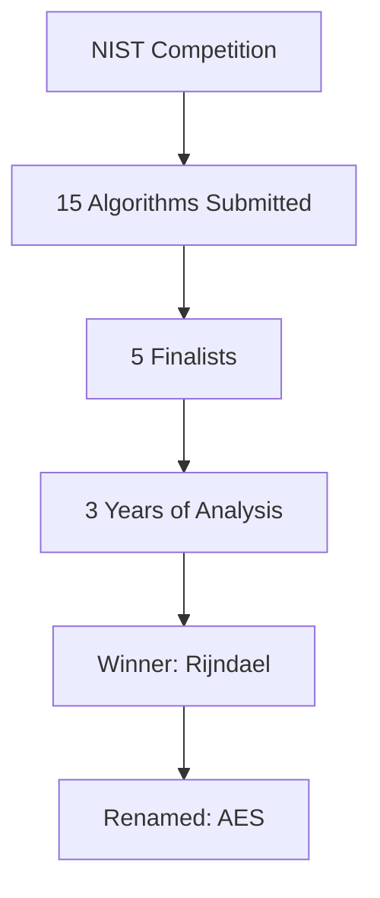

**Why Rijndael/AES Won:**
- ✅ Fast performance
- ✅ Low memory requirements
- ✅ Strong security
- ✅ No known weaknesses
- ✅ Elegant design

**2001:** Became US Federal Standard
**2024:** Global standard for encryption

## Why 256-bit Keys?

### Key Size Comparison

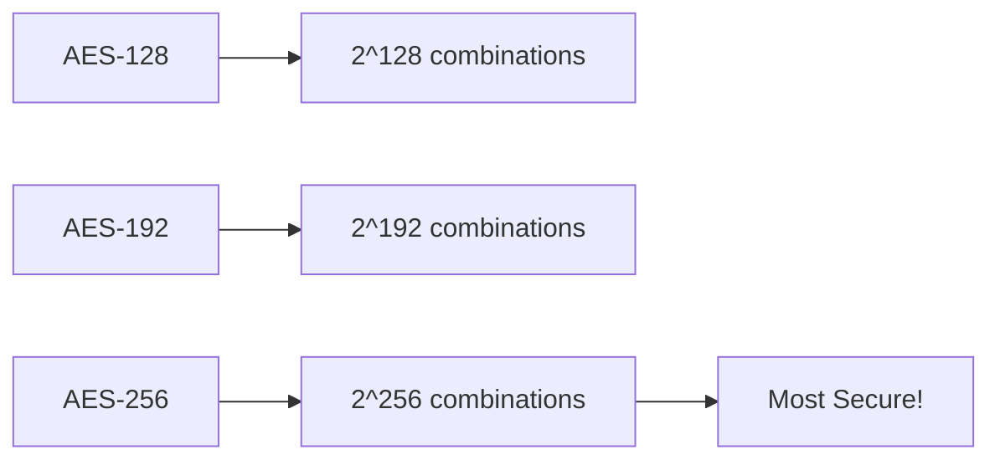

**Security Levels:**

| Algorithm | Key Size | Time to Brute Force* |
|-----------|----------|---------------------|
| **AES-128** | 128 bits | Billions of years |
| **AES-192** | 192 bits | Trillions of years |
| **AES-256** | 256 bits | More than age of universe × 10^50 |

*With all current computing power combined

## Brute-Force Attack: The Math

### How Long to Crack AES-256?

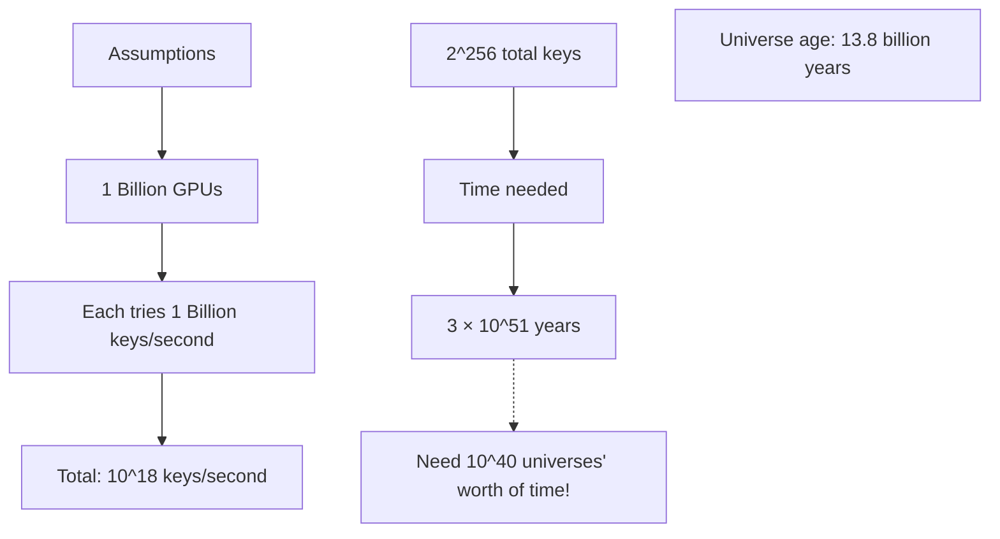

**Bottom Line:** Brute-forcing AES-256 is **mathematically impossible** with current technology.

### Quantum Computing Threat?

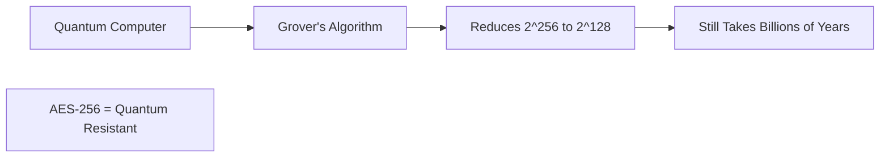

**Reality:** Even with quantum computers, AES-256 remains secure!

## Why Cloud Providers Love AES-256

### 1. Hardware Acceleration

**Modern CPUs have AES built-in:**

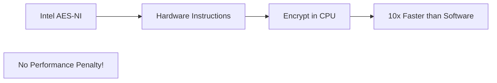

**Performance:**
- Software AES: 200 MB/s
- Hardware AES (AES-NI): 2,000+ MB/s
- **10x speed boost!**

**Real Impact:**
```
Encrypting 1TB of data:
Without AES-NI: 85 minutes
With AES-NI: 8.5 minutes
```

### 2. Government & Compliance Standards

**Required by regulations:**

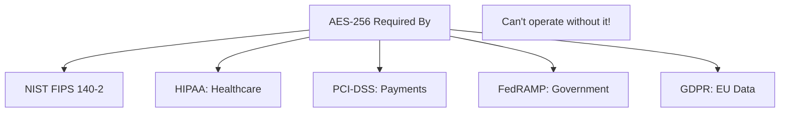

**Example:** Want to process credit cards? **Must use AES-256** (PCI-DSS requirement).

### 3. Proven Security

**20+ years without major vulnerabilities:**

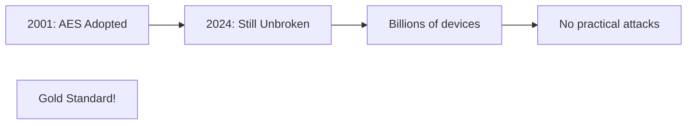

**Attack History:**
- Theoretical attacks exist (reduce key space slightly)
- **ZERO practical attacks** on full AES-256
- Used by NSA for TOP SECRET data

### 4. Low Overhead

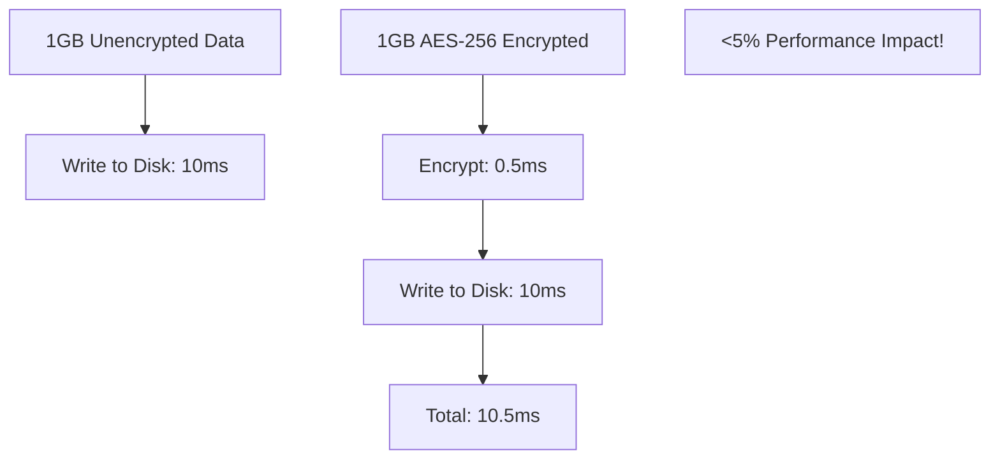

**Cloud Reality:** With AES-NI, encryption is nearly free!

## Cloud Implementation

### AWS: How It Works

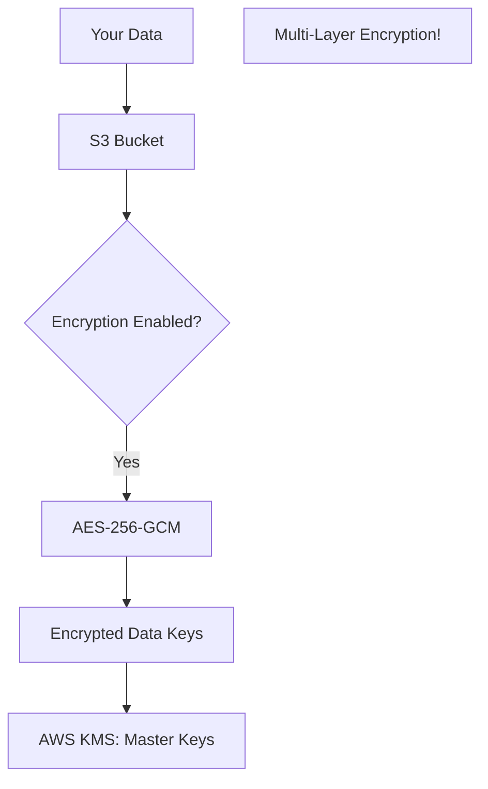

**AWS Services Using AES-256:**
- S3: Object storage
- EBS: Disk volumes
- RDS: Databases
- DynamoDB: NoSQL
- Glacier: Archives

### Azure & Google Cloud

**Same approach across all clouds:**

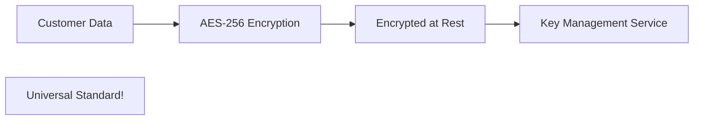

## Alternative Encryption Methods (Why Not Used?)

### AES-128

**Why not?**
```
Pros: Slightly faster
Cons: 
  - "Only" billions of years to crack
  - Compliance often requires 256-bit
  - Minimal speed difference with AES-NI
  - Marketing: 256 sounds better!
```

**Decision:** Extra security costs nothing, why not?

### ChaCha20

**Why not?**
```
Pros: 
  - Faster on mobile devices
  - Good for streaming
Cons:
  - Not hardware-accelerated on servers
  - Less compliance acceptance
  - AES is "the standard"
```

**Usage:** Mobile apps, VPNs, but not cloud storage

### Blowfish, 3DES

**Why not?**
```
Both: Old, outdated, not recommended
3DES: Being deprecated everywhere
Blowfish: 64-bit blocks (vulnerable)
```

## Real-World Security

### Encryption Performance Test

**Encrypting 100GB database backup:**

| Method | Time | CPU Usage |
|--------|------|-----------|
| **No Encryption** | 5 min | 10% |
| **AES-256 (no AES-NI)** | 45 min | 95% |
| **AES-256 (with AES-NI)** | 5.5 min | 15% |

**Conclusion:** With hardware acceleration, encryption is nearly free!

### Storage Overhead

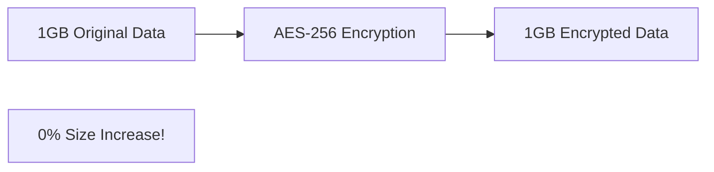

**AES doesn't increase file size!**

## The Key Management Challenge

**Problem:** Encryption is useless without proper key management!

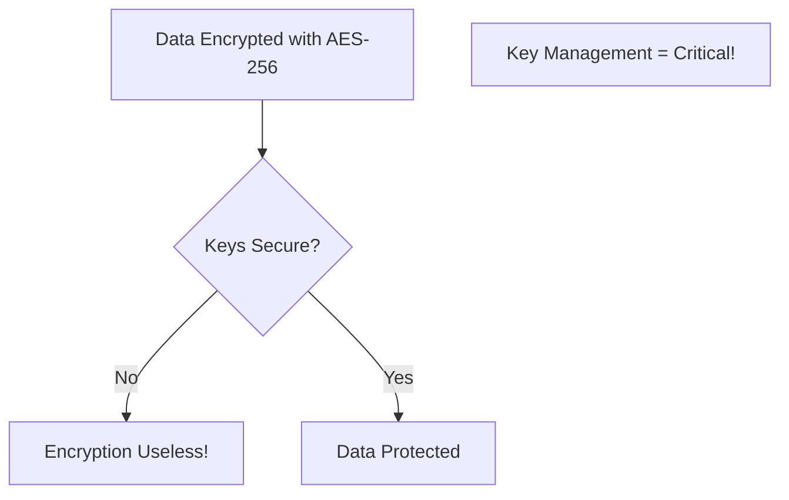

**Cloud Solutions:**
- **AWS KMS** (Key Management Service)
- **Azure Key Vault**
- **Google Cloud KMS**

**How they work:**
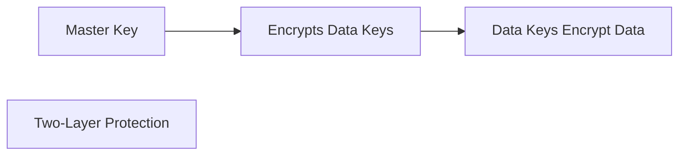

## Future-Proofing

### Post-Quantum Cryptography

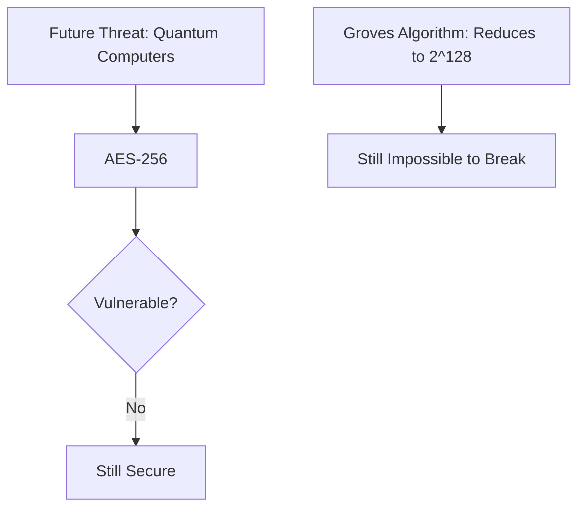

**NIST Recommendation:** AES-256 is quantum-resistant!

**Other algorithms being deprecated:**
- RSA (quantum vulnerable)
- Elliptic Curve (quantum vulnerable)
- **AES:** Still recommended post-quantum!

## The Bottom Line

**Why AES-256 is the universal cloud standard:**

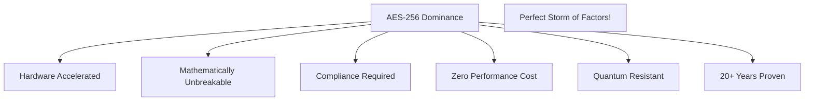

### The Perfect Encryption

✅ **Security:** Unbreakable by brute force
✅ **Performance:** Hardware-accelerated, nearly free
✅ **Compliance:** Required by regulations
✅ **Future-proof:** Quantum resistant
✅ **Proven:** 20+ years, no vulnerabilities
✅ **Universal:** All clouds use it
✅ **Cost:** No storage overhead

**Result:** No reason to use anything else for data-at-rest encryption!

---

## Learning Resources

### AES Fundamentals
- [AES Explained](https://www.youtube.com/results?search_query=aes+encryption+explained) - Video tutorials
- [NIST AES Standard](https://csrc.nist.gov/publications/detail/fips/197/final) - Official specification
- [How AES Works](https://www.khanacademy.org/computing/computer-science/cryptography/crypt/v/intro-to-aes) - Khan Academy

### Cloud Encryption
- [AWS Encryption](https://docs.aws.amazon.com/crypto/latest/userguide/awscryp-overview.html) - AWS guide
- [Azure Encryption](https://docs.microsoft.com/en-us/azure/security/fundamentals/encryption-overview) - Microsoft docs
- [Google Cloud Encryption](https://cloud.google.com/security/encryption-at-rest) - GCP security

### Key Management
- [AWS KMS](https://docs.aws.amazon.com/kms/) - Key management
- [Azure Key Vault](https://docs.microsoft.com/en-us/azure/key-vault/) - Secrets management
- [Google Cloud KMS](https://cloud.google.com/kms/docs) - Key service

### Cryptography Deep Dive
- [Cryptography Course](https://www.coursera.org/learn/crypto) - Stanford/Coursera
- [Applied Cryptography](https://www.schneier.com/books/applied-cryptography/) - Bruce Schneier book
- [Serious Cryptography](https://nostarch.com/seriouscrypto) - Modern crypto

### Performance & Benchmarks
- [AES-NI Performance](https://www.intel.com/content/www/us/en/architecture-and-technology/advanced-encryption-standard-aes/data-protection-aes-general-technology.html) - Intel guide
- [OpenSSL Benchmarks](https://www.openssl.org/docs/) - Speed tests
