# RDS vs. DynamoDB for E-commerce: Which database is optimal for a highly-scalable, global e-commerce product catalog and checkout system?

## Introduction

You're building the next Amazon or Shopify. You need a database that can handle millions of products and thousands of orders per second globally. Do you choose **RDS (relational)** or **DynamoDB (NoSQL)**? Let's settle this!

## Understanding the Contenders

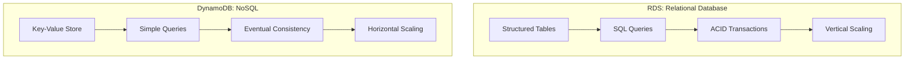

## The E-commerce Requirements

### Product Catalog Needs

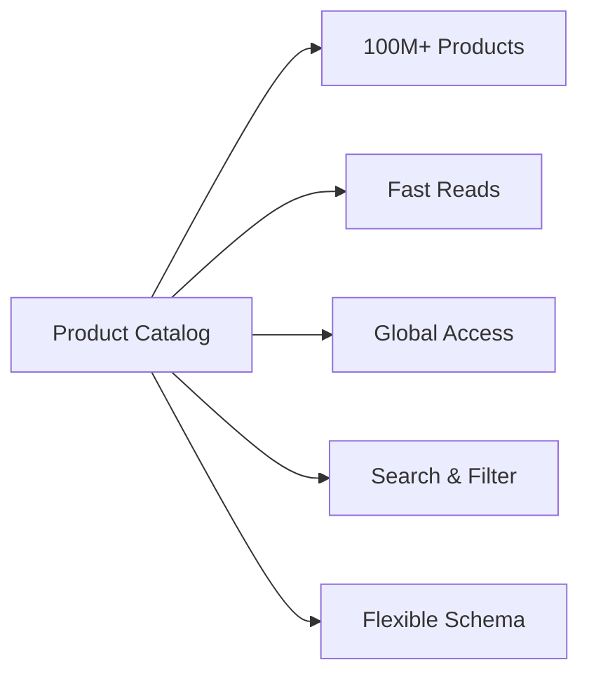

### Checkout System Needs

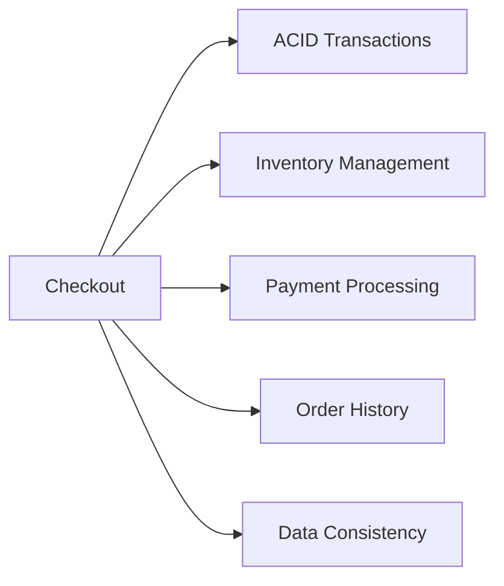

## RDS for E-commerce

### What is RDS?

**Relational Database Service** - managed SQL databases (MySQL, PostgreSQL, etc.)

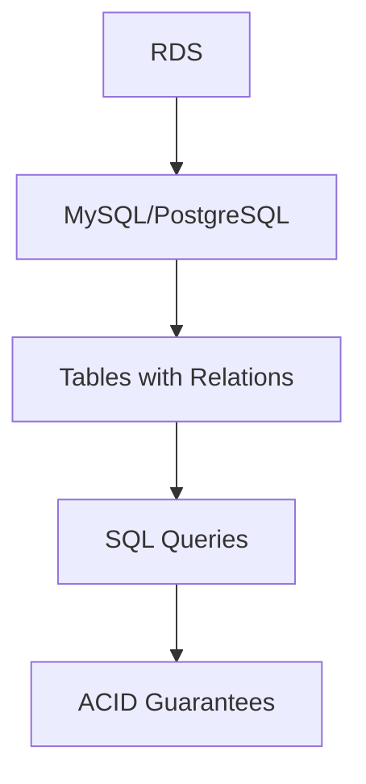

### Product Catalog with RDS

**Schema:**
```sql
-- Products table
CREATE TABLE products (
    product_id BIGINT PRIMARY KEY,
    name VARCHAR(255),
    description TEXT,
    price DECIMAL(10,2),
    category_id INT,
    stock_quantity INT,
    created_at TIMESTAMP
);

-- Categories table
CREATE TABLE categories (
    category_id INT PRIMARY KEY,
    name VARCHAR(100),
    parent_category_id INT
);

-- Complex query
SELECT p.*, c.name as category_name
FROM products p
JOIN categories c ON p.category_id = c.category_id
WHERE p.price BETWEEN 10 AND 100
  AND p.stock_quantity > 0
ORDER BY p.name
LIMIT 20;
```

### Checkout with RDS

**Transaction example:**
```sql
-- Atomic checkout transaction
BEGIN;

-- Check inventory
SELECT stock_quantity FROM products 
WHERE product_id = 123 FOR UPDATE;

-- Create order
INSERT INTO orders (user_id, total_amount) 
VALUES (456, 99.99);

-- Reduce inventory
UPDATE products 
SET stock_quantity = stock_quantity - 1 
WHERE product_id = 123;

-- Record order item
INSERT INTO order_items (order_id, product_id, quantity)
VALUES (LAST_INSERT_ID(), 123, 1);

COMMIT;  -- All or nothing!
```

### RDS Strengths for E-commerce

✅ **Complex Queries**
```sql
-- Easy analytics
SELECT 
    c.name,
    COUNT(*) as product_count,
    AVG(p.price) as avg_price
FROM products p
JOIN categories c ON p.category_id = c.category_id
GROUP BY c.name
ORDER BY product_count DESC;
```

✅ **ACID Transactions**
- Inventory can't oversell
- Orders are consistent
- Payment = Product reservation

✅ **Data Integrity**
- Foreign keys prevent orphan data
- Constraints ensure valid data
- Referential integrity

✅ **Mature Ecosystem**
- ORMs (Sequelize, TypeORM)
- Admin tools
- Reporting tools

### RDS Weaknesses for E-commerce

❌ **Scaling Limitations**
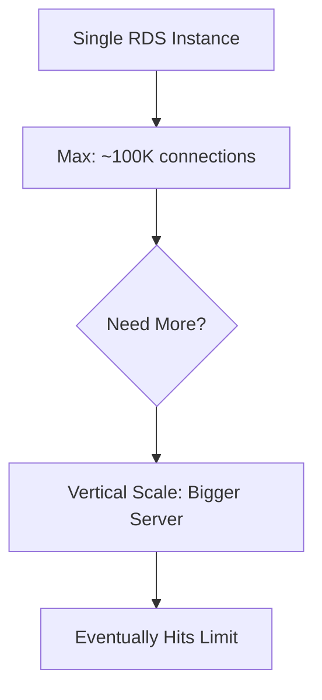

**Reality:** Can't easily scale to millions of concurrent users

❌ **Read Replicas Complex**
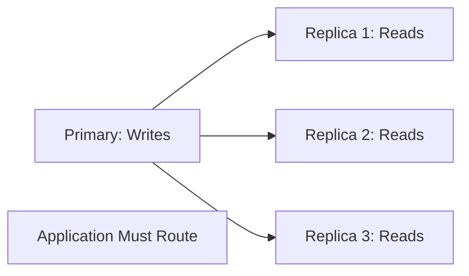

❌ **Global Distribution Hard**
- Single region by default
- Cross-region replication has lag
- Multi-region writes expensive

❌ **Schema Changes Risky**
```sql
-- Adding column to 100M row table
ALTER TABLE products ADD COLUMN new_field VARCHAR(100);
-- Could take HOURS and lock table!
```

## DynamoDB for E-commerce

### What is DynamoDB?

**AWS NoSQL Database** - Key-value and document store

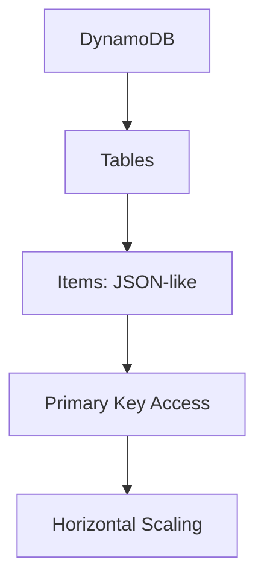

### Product Catalog with DynamoDB

**Schema:**
```json
{
  "product_id": "PROD-123",
  "name": "Wireless Mouse",
  "price": 29.99,
  "category": "Electronics",
  "subcategory": "Accessories",
  "stock": 500,
  "attributes": {
    "color": "Black",
    "wireless": true,
    "battery": "AAA"
  },
  "reviews_count": 1247,
  "rating": 4.5
}
```

**Query:**
```javascript
// Get product by ID (fast!)
await dynamodb.get({
  TableName: 'Products',
  Key: { product_id: 'PROD-123' }
});

// Query by category (with GSI)
await dynamodb.query({
  TableName: 'Products',
  IndexName: 'CategoryIndex',
  KeyConditionExpression: 'category = :cat',
  ExpressionAttributeValues: { ':cat': 'Electronics' }
});
```

### Checkout with DynamoDB

**Transaction:**
```javascript
// DynamoDB transaction
await dynamodb.transactWrite({
  TransactItems: [
    {
      Update: {
        TableName: 'Products',
        Key: { product_id: 'PROD-123' },
        UpdateExpression: 'SET stock = stock - :qty',
        ConditionExpression: 'stock >= :qty',
        ExpressionAttributeValues: { ':qty': 1 }
      }
    },
    {
      Put: {
        TableName: 'Orders',
        Item: {
          order_id: 'ORD-456',
          user_id: 'USER-789',
          total: 29.99,
          timestamp: Date.now()
        }
      }
    }
  ]
});
```

### DynamoDB Strengths for E-commerce

✅ **Unlimited Scaling**
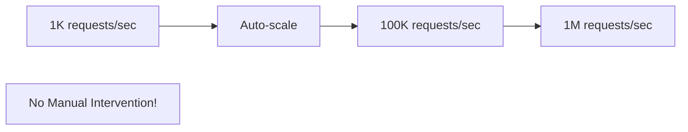

**Reality:** Amazon.com uses DynamoDB for Prime Day (100M+ requests/sec!)

✅ **Global Tables**
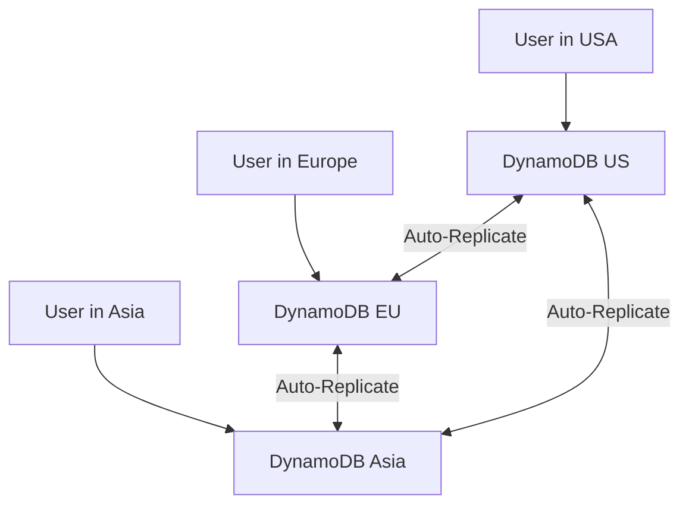

**Benefits:**
- Single-digit millisecond latency globally
- Multi-region writes
- Automatic conflict resolution

✅ **Flexible Schema**
```json
// Old products
{"product_id": "OLD-1", "name": "Item", "price": 10}

// New products with extra fields
{"product_id": "NEW-1", "name": "Item", "price": 10, 
 "warranty": "2 years", "eco_friendly": true}

// No migration needed!
```

✅ **Predictable Performance**
- Single-digit millisecond reads/writes
- Consistent at any scale
- No query optimization needed

✅ **Pay Per Request**
```
RDS: Pay for provisioned instance (always running)
DynamoDB: Pay only for actual requests
Savings: 70% for variable traffic!
```

### DynamoDB Weaknesses for E-commerce

❌ **Complex Queries Difficult**
```javascript
// Can't do this easily in DynamoDB:
// "Find all products between $10-$50 in 3 categories 
//  with rating > 4 stars, ordered by popularity"

// In SQL: Easy!
// In DynamoDB: Need multiple queries + filtering
```

❌ **No Joins**


**Impact:** Application becomes more complex

❌ **Learning Curve**
- Different mindset from SQL
- Design patterns specific to DynamoDB
- Key design critical for performance

❌ **Analytics Hard**
```
Want to analyze sales trends?
RDS: SQL query
DynamoDB: Export to data warehouse first
```

## Head-to-Head Comparison

| Feature | RDS | DynamoDB | Winner |
|---------|-----|----------|--------|
| **Scalability** | Vertical (limited) | Horizontal (unlimited) | DynamoDB |
| **Global Distribution** | Complex | Built-in | DynamoDB |
| **Complex Queries** | Excellent | Limited | RDS |
| **Transactions** | Full ACID | Limited ACID | RDS |
| **Performance** | Variable | Consistent | DynamoDB |
| **Cost (Variable Traffic)** | Higher | Lower | DynamoDB |
| **Cost (Constant Traffic)** | Lower | Higher | RDS |
| **Analytics** | Built-in | Needs export | RDS |
| **Schema Changes** | Risky | Easy | DynamoDB |
| **Developer Familiarity** | High (SQL) | Low (NoSQL) | RDS |

## The Winning Architecture

**Don't choose one - use BOTH!**

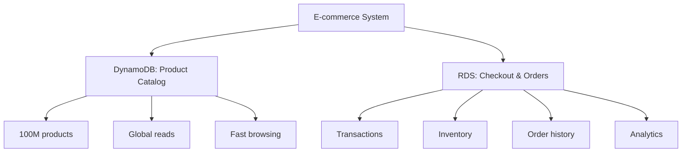

### Recommended Split

**DynamoDB for:**
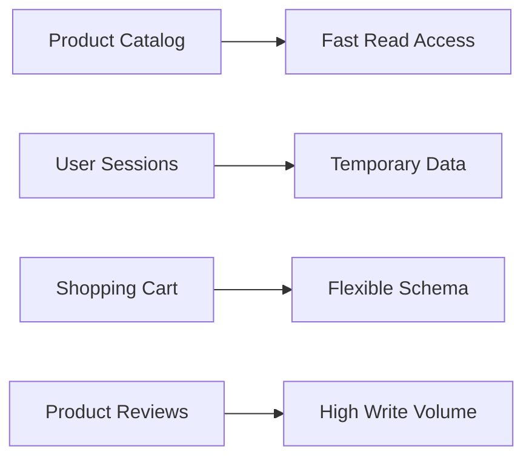

**RDS for:**
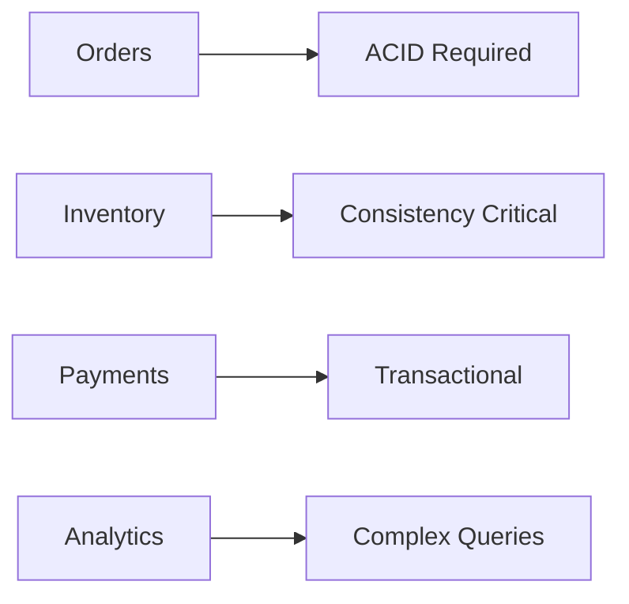

## Real-World Examples

### Amazon.com
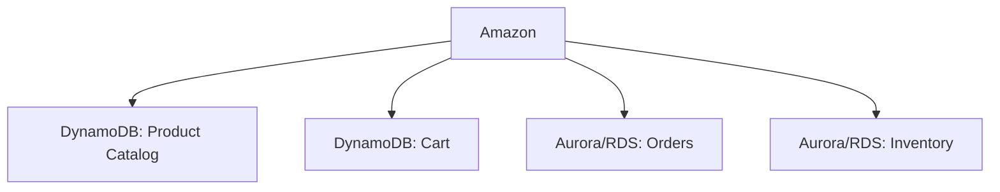

**Why:** Best of both worlds!

### Shopify
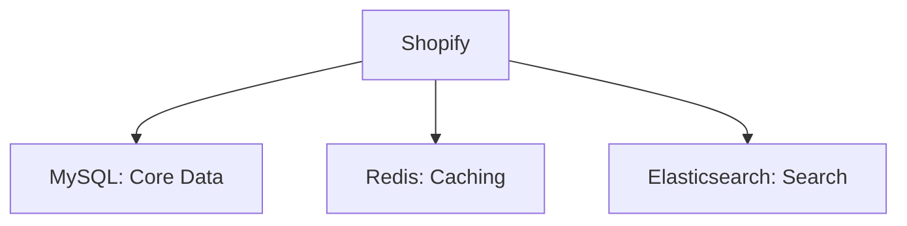

**Different approach:** Primarily RDS, but with specialized services

## My Verdict

**For Product Catalog:** 🏆 **DynamoDB Wins!**

Why:
- ✅ Millions of products
- ✅ Global access
- ✅ Fast reads
- ✅ Flexible schema (products vary)
- ✅ Infinite scale

**For Checkout System:** 🏆 **RDS Wins!**

Why:
- ✅ ACID transactions critical
- ✅ Inventory consistency
- ✅ Financial accuracy
- ✅ Complex order queries
- ✅ Mature patterns

**Optimal Solution:**

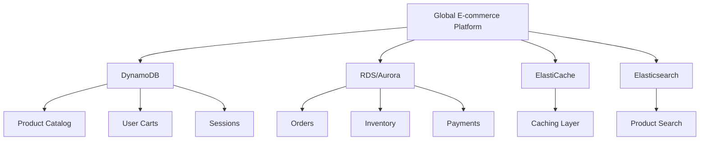

**Use the right tool for each job!**

---

## Learning Resources

### DynamoDB
- [DynamoDB Guide](https://docs.aws.amazon.com/dynamodb/) - Official docs
- [DynamoDB Book](https://www.dynamodbbook.com/) - Alex DeBrie
- [AWS re:Invent DynamoDB](https://www.youtube.com/results?search_query=aws+reinvent+dynamodb) - Deep dives

### RDS & Aurora
- [AWS RDS](https://docs.aws.amazon.com/rds/) - Documentation
- [Aurora Deep Dive](https://aws.amazon.com/rds/aurora/) - MySQL compatible
- [PostgreSQL for E-commerce](https://www.postgresql.org/docs/) - Open source

### Database Design
- [Designing Data-Intensive Applications](https://dataintensive.net/) - Martin Kleppmann
- [Database Patterns](https://www.youtube.com/results?search_query=database+design+patterns) - Videos
- [E-commerce Database Design](https://www.vertabelo.com/blog/ecommerce-database-design/) - Guides

### Comparison & Benchmarks
- [SQL vs NoSQL](https://www.mongodb.com/nosql-explained/nosql-vs-sql) - Detailed comparison
- [DynamoDB vs RDS](https://aws.amazon.com/blogs/database/) - AWS blog
