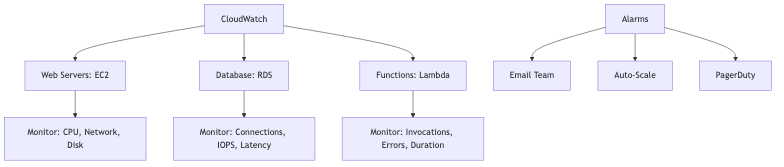
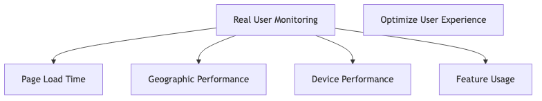
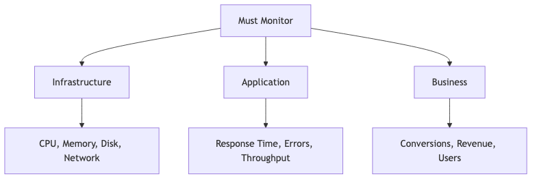

# RDS vs. DynamoDB for E-commerce: Which database is optimal for a highly-scalable, global e-commerce product catalog and checkout system?

## Introduction

Good morning everyone! Today I want to help you solve a critical decision - you're building the next Amazon or Shopify. You need a database that can handle millions of products and thousands of orders per second globally. Do you choose **RDS (relational database)** or **DynamoDB (NoSQL)**? This is one of the most important architecture decisions you'll make. Let me walk you through this!

## Understanding the Two Contenders

Before we dive in, let me show you the fundamental difference between these two approaches:


RDS gives you structured tables with powerful SQL queries and ACID transactions, but scales vertically. DynamoDB gives you flexible key-value storage with simple queries and horizontal scaling. Now let's see what an e-commerce platform actually needs.

## What Does E-commerce Actually Need?

Let me break down the requirements for both parts of an e-commerce system:

### Product Catalog Requirements


For product catalogs, you need to handle potentially 100 million+ products, serve them fast globally, support search and filtering, and accommodate products with different attributes. Think about it - a t-shirt has different attributes than a laptop!

### Checkout System Requirements


For checkout, you absolutely need ACID transactions, accurate inventory management, reliable payment processing, and consistent order history. You can't have someone paying for a product that's out of stock!

Now let's see how each database handles these requirements.

## RDS for E-commerce

### What is RDS Exactly?

**RDS = Relational Database Service** - This is AWS's managed service for SQL databases like MySQL, PostgreSQL, etc.


### Building a Product Catalog with RDS

Here's how you'd structure a product catalog in RDS using SQL:
```sql
-- Products table
CREATE TABLE products (
    product_id BIGINT PRIMARY KEY,
    name VARCHAR(255),
    description TEXT,
    price DECIMAL(10,2),
    category_id INT,
    stock_quantity INT,
    created_at TIMESTAMP
);

-- Categories table
CREATE TABLE categories (
    category_id INT PRIMARY KEY,
    name VARCHAR(100),
    parent_category_id INT
);

-- Complex query
SELECT p.*, c.name as category_name
FROM products p
JOIN categories c ON p.category_id = c.category_id
WHERE p.price BETWEEN 10 AND 100
  AND p.stock_quantity > 0
ORDER BY p.name
LIMIT 20;
```

Look at how powerful this is! With one SQL query, you can join tables, filter by price and stock, and sort results. Very elegant!

### Handling Checkout with RDS Transactions
```sql
-- Atomic checkout transaction
BEGIN;

-- Check inventory
SELECT stock_quantity FROM products 
WHERE product_id = 123 FOR UPDATE;

-- Create order
INSERT INTO orders (user_id, total_amount) 
VALUES (456, 99.99);

-- Reduce inventory
UPDATE products 
SET stock_quantity = stock_quantity - 1 
WHERE product_id = 123;

-- Record order item
INSERT INTO order_items (order_id, product_id, quantity)
VALUES (LAST_INSERT_ID(), 123, 1);

COMMIT;  -- All or nothing!
```

This is beautiful! Either ALL these operations succeed together, or NONE of them happen. You can never have a situation where money is charged but inventory isn't reduced. That's ACID transactions!

### RDS Strengths for E-commerce

Let me highlight what RDS does really well:
```sql
-- Easy analytics
SELECT 
    c.name,
    COUNT(*) as product_count,
    AVG(p.price) as avg_price
FROM products p
JOIN categories c ON p.category_id = c.category_id
GROUP BY c.name
ORDER BY product_count DESC;
```

Super easy! You can do complex analytics, reporting, and business intelligence directly with SQL.

**✅ ACID Transactions Guarantee Consistency:**
- Your inventory can never oversell
- Orders are always consistent
- Payment and product reservation happen atomically

**✅ Data Integrity with Relationships:**
- Foreign keys prevent orphan data (orders without products)
- Constraints ensure data is always valid
- Referential integrity is enforced automatically

**✅ Mature Ecosystem:**
- ORMs like Sequelize, TypeORM make development easy
- Tons of admin tools available
- Everyone knows SQL!

### RDS Weaknesses for E-commerce

But RDS has some serious limitations for global e-commerce:

❌ **Scaling Limitations**


**The Reality:** RDS can't easily scale to millions of concurrent users browsing products globally. Eventually you hit a ceiling!

**❌ Read Replicas Are Complex:**


Your application code has to be smart about routing writes to primary and reads to replicas. Added complexity!

**❌ Global Distribution Is Hard:**
- RDS is single-region by default
- Cross-region replication has significant lag
- Multi-region writes are expensive and complex

**❌ Schema Changes on Large Tables Are Risky:**
```sql
-- Adding column to 100M row table
ALTER TABLE products ADD COLUMN new_field VARCHAR(100);
-- Could take HOURS and lock table!
```

Imagine adding a column to a table with 100 million products - it could take hours and lock your entire table! Risky during business hours!

## DynamoDB for E-commerce

Now let's look at the NoSQL alternative:

### What is DynamoDB Exactly?

**DynamoDB = AWS's NoSQL Database** - It's a fully managed key-value and document store that scales infinitely.


### Building a Product Catalog with DynamoDB

Here's how a product looks in DynamoDB - it's JSON-like:
```json
{
  "product_id": "PROD-123",
  "name": "Wireless Mouse",
  "price": 29.99,
  "category": "Electronics",
  "subcategory": "Accessories",
  "stock": 500,
  "attributes": {
    "color": "Black",
    "wireless": true,
    "battery": "AAA"
  },
  "reviews_count": 1247,
  "rating": 4.5
}
```

Notice how flexible this is! You can store arbitrary attributes like color, wireless, battery - different products can have completely different fields!

**Querying Products:**
```javascript
// Get product by ID (fast!)
await dynamodb.get({
  TableName: 'Products',
  Key: { product_id: 'PROD-123' }
});

// Query by category (with GSI)
await dynamodb.query({
  TableName: 'Products',
  IndexName: 'CategoryIndex',
  KeyConditionExpression: 'category = :cat',
  ExpressionAttributeValues: { ':cat': 'Electronics' }
});
```

Pretty simple! Getting by ID is super fast, and you can query by category using a Global Secondary Index (GSI).

### Handling Checkout with DynamoDB Transactions
```javascript
// DynamoDB transaction
await dynamodb.transactWrite({
  TransactItems: [
    {
      Update: {
        TableName: 'Products',
        Key: { product_id: 'PROD-123' },
        UpdateExpression: 'SET stock = stock - :qty',
        ConditionExpression: 'stock >= :qty',
        ExpressionAttributeValues: { ':qty': 1 }
      }
    },
    {
      Put: {
        TableName: 'Orders',
        Item: {
          order_id: 'ORD-456',
          user_id: 'USER-789',
          total: 29.99,
          timestamp: Date.now()
        }
      }
    }
  ]
});
```

DynamoDB does support transactions! Both operations succeed or both fail. The condition ensures you don't oversell.

### DynamoDB Strengths for E-commerce

Let me show you where DynamoDB really shines:


**The Reality:** Amazon.com uses DynamoDB and handles over 100 MILLION requests per second during Prime Day! That's the kind of scale we're talking about. With RDS, you'd hit limits way before that.

**✅ Global Tables for Worldwide Access:**


**The Benefits:**
- Users in USA, Europe, and Asia all get single-digit millisecond latency
- Multi-region writes - write anywhere, read anywhere
- Automatic conflict resolution between regions

This is perfect for a global e-commerce platform!

**✅ Flexible Schema - Adapt As You Go:**
```json
// Old products
{"product_id": "OLD-1", "name": "Item", "price": 10}

// New products with extra fields
{"product_id": "NEW-1", "name": "Item", "price": 10, 
 "warranty": "2 years", "eco_friendly": true}

// No migration needed!
```

Different products can have completely different fields! A t-shirt has size and color, a laptop has RAM and processor. No problem with DynamoDB!

**✅ Predictable Performance:**
- Consistent single-digit millisecond response times
- Performance doesn't degrade as data grows
- No query optimization needed

**✅ Pay-Per-Request Pricing:**
```
RDS: Pay for a server running 24/7, even if traffic is low
DynamoDB: Pay only for actual read/write requests
Potential Savings: 70% for variable traffic patterns!
```

If your traffic varies (high during day, low at night), DynamoDB can save you a fortune!

### DynamoDB Weaknesses for E-commerce

But DynamoDB has its own challenges:

❌ **Complex Queries Difficult**
```javascript
// Can't do this easily in DynamoDB:
// "Find all products between $10-$50 in 3 categories 
//  with rating > 4 stars, ordered by popularity"

// In SQL: One easy query!
// In DynamoDB: Multiple queries + manual filtering in code
```

Complex searches and analytics are painful with DynamoDB. You often need to export data to a data warehouse for analysis.

**❌ No Joins - You Have to Do It in Code:**


**Impact:** Your application becomes more complex - you have to fetch data from multiple tables and join it in your code. With SQL, the database does it for you.

**❌ Steeper Learning Curve:**
- Very different mindset from SQL
- Specific design patterns needed
- Key design is critical for performance - get it wrong and you're stuck!

**❌ Analytics Are Difficult:**
```
Want to analyze sales trends across categories?
RDS: Simple SQL query
DynamoDB: Export to data warehouse first, then analyze
```

Business intelligence and reporting are much harder with DynamoDB.

## Head-to-Head Comparison

Let me put this all in a table so you can see the tradeoffs clearly:

| Feature | RDS | DynamoDB | Winner |
|---------|-----|----------|--------|
| **Scalability** | Vertical (limited) | Horizontal (unlimited) | DynamoDB |
| **Global Distribution** | Complex | Built-in | DynamoDB |
| **Complex Queries** | Excellent | Limited | RDS |
| **Transactions** | Full ACID | Limited ACID | RDS |
| **Performance** | Variable | Consistent | DynamoDB |
| **Cost (Variable Traffic)** | Higher | Lower | DynamoDB |
| **Cost (Constant Traffic)** | Lower | Higher | RDS |
| **Analytics** | Built-in | Needs export | RDS |
| **Schema Changes** | Risky | Easy | DynamoDB |
| **Developer Familiarity** | High (SQL) | Low (NoSQL) | RDS |

This table shows the fundamental tradeoff - DynamoDB wins on scale and global distribution, RDS wins on queries and analytics.

## The Winning Architecture - Use BOTH!

Here's the secret - you don't have to choose just one! The smartest approach is to use BOTH databases for different parts of your e-commerce system:



**The Strategy:**
- Use DynamoDB for browsing products (100M products, fast global reads)
- Use RDS for processing orders (ACID transactions, inventory accuracy)

Best of both worlds!

### Recommended Split - What Goes Where

**Use DynamoDB For:**


Why? These are read-heavy, need global access, and benefit from flexible schemas.

**Use RDS For:**


Why? These absolutely require ACID transactions, data consistency is critical, and you need complex queries for reporting.

## Real-World Examples

Let me show you how actual companies handle this:

### Amazon.com - The Hybrid Approach


**Why Amazon Does This:** They use each database for what it's best at! DynamoDB for massive scale browsing, relational databases for transaction integrity.

### Shopify - Different Approach


**Different Approach:** Shopify primarily uses MySQL (RDS equivalent) but adds Redis for caching and Elasticsearch for search. They've chosen to optimize RDS rather than use NoSQL.

Both approaches work - it depends on your specific needs and scale!

## My Final Verdict

So which database is optimal for e-commerce? Let me give you clear recommendations:

**For Product Catalog:** 🏆 **DynamoDB Wins!**

Why DynamoDB for products:
- ✅ Scales to millions of products effortlessly
- ✅ Global distribution with low latency everywhere
- ✅ Blazing fast reads for browsing
- ✅ Flexible schema - products have different attributes
- ✅ Handles traffic spikes (Black Friday!) automatically

**For Checkout System:** 🏆 **RDS Wins!**

Why RDS for checkout:
- ✅ ACID transactions are absolutely critical for payments
- ✅ Inventory consistency - can't oversell!
- ✅ Financial accuracy is non-negotiable
- ✅ Complex order queries and reporting needed
- ✅ Well-established patterns and best practices

**The Optimal Solution - Hybrid Architecture:**


**This is the architecture used by the biggest e-commerce platforms!**

Components:
- **DynamoDB:** Product catalog, shopping carts, user sessions
- **RDS/Aurora:** Orders, inventory, payments, customer data
- **ElastiCache:** Caching layer for even faster performance
- **Elasticsearch:** Advanced product search functionality

**Use the right tool for each job!** Don't try to force one database to do everything.

## Final Thoughts

The debate isn't "RDS vs DynamoDB" - it's about understanding what each database is good at and using them appropriately!

**Key Takeaways:**
1. **DynamoDB excels** at massive scale, global distribution, and flexible schemas
2. **RDS excels** at complex queries, transactions, and data integrity
3. **Most successful e-commerce platforms use BOTH**
4. **Product browsing** needs scale → DynamoDB
5. **Order processing** needs consistency → RDS

For your e-commerce platform, start with the hybrid approach from day one. It's what Amazon does, and they know a thing or two about e-commerce at scale!

Thank you!
