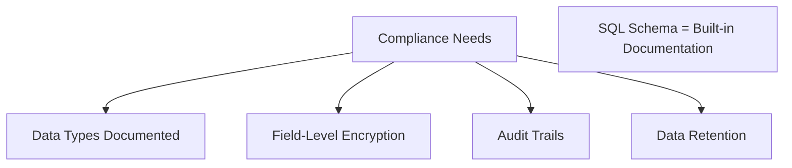
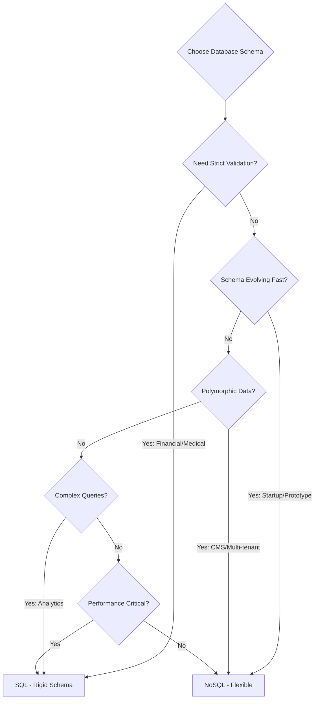

# Structured vs. Flexible Schema: When is the rigid nature of SQL a security/integrity feature, and when does NoSQL flexibility become a performance killer?

## Introduction

SQL forces you to define every field upfront. NoSQL lets you store anything. Which is better? The answer: **it depends on what you're protecting or breaking!** Let's explore both sides.

## Understanding the Difference


## When SQL's Rigidity is a Security FEATURE

### 1. Data Integrity Protection

**SQL Enforces Rules:**
```sql
CREATE TABLE users (
    user_id INT PRIMARY KEY,
    email VARCHAR(255) NOT NULL UNIQUE,
    age INT CHECK (age >= 18 AND age <= 120),
    account_balance DECIMAL(10,2) DEFAULT 0.00,
    created_at TIMESTAMP NOT NULL
);

-- Try to insert invalid data
INSERT INTO users (user_id, email, age) 
VALUES (1, 'invalid', 15);
-- ERROR: age must be >= 18

INSERT INTO users (user_id, email, age)
VALUES (2, 'duplicate@mail.com', 25);
-- ERROR: email must be unique
```

**Protection Provided:**
- ✅ Can't insert user under 18
- ✅ Can't duplicate emails
- ✅ Can't forget required fields
- ✅ Balance always has 2 decimals

**NoSQL Equivalent:**
```javascript
// MongoDB - NO automatic validation
await users.insertOne({
    userId: 1,
    email: 'invalid',
    age: 15,  // No check!
    accountBalance: '99.999',  // Wrong type!
    // created_at missing - no error!
});
// Succeeds with bad data!
```

### 2. Financial Data Protection

**Banking Example:**

```sql
-- SQL guarantees precision
CREATE TABLE accounts (
    account_id INT PRIMARY KEY,
    balance DECIMAL(15,2) NOT NULL,  -- Exact precision!
    CONSTRAINT positive_balance CHECK (balance >= 0)
);

-- Transfer money (atomic)
BEGIN TRANSACTION;
UPDATE accounts SET balance = balance - 100.00 WHERE account_id = 1;
UPDATE accounts SET balance = balance + 100.00 WHERE account_id = 2;
COMMIT;
-- Both succeed or both fail!
```

**Why This Matters:**
```
SQL: $1234.56 stays $1234.56 (DECIMAL type)
NoSQL: 1234.56 might become 1234.5599999999 (floating point!)

Lost penny × 1M transactions = $10,000 error!
```

### 3. Preventing Injection Attacks

**SQL with Constraints:**
```sql
CREATE TABLE products (
    product_id INT PRIMARY KEY,
    name VARCHAR(100) NOT NULL,
    price DECIMAL(10,2) NOT NULL CHECK (price > 0),
    category ENUM('electronics', 'clothing', 'food')
);

-- Malicious input rejected
INSERT INTO products (product_id, name, price, category)
VALUES (1, 'Test', -100, 'malicious');
-- ERROR: price must be > 0
-- ERROR: category invalid
```

**NoSQL Without Validation:**
```javascript
// Malicious data might slip through
await products.insertOne({
    productId: 1,
    name: 'Test',
    price: -100,  // Negative price accepted!
    category: '<script>alert("XSS")</script>',  // Injection!
    maliciousField: 'unexpected data'  // Extra fields allowed!
});
```

### 4. Regulatory Compliance

**GDPR, HIPAA, PCI-DSS Requirements:**



**SQL Advantage:**
```sql
-- Self-documenting and enforceable
CREATE TABLE patient_records (
    patient_id INT PRIMARY KEY,
    ssn CHAR(11) ENCRYPTED,  -- Must be encrypted
    diagnosis VARCHAR(500) NOT NULL,
    created_date DATE NOT NULL,
    -- Auditor can SEE what fields exist
    -- and what constraints are enforced
);
```

**NoSQL Challenge:**
```javascript
// What fields exist? Unknown!
// What's encrypted? Manual checking!
// Compliance nightmare!
{
    patientId: 123,
    ssn: 'plain-text-oops',  // Should be encrypted!
    someRandomField: 'data'  // What's this?
}
```

## When NoSQL Flexibility WINS

### 1. Rapid Prototyping

**Startup Speed:**
```javascript
// Day 1: MVP
const user = {
    email: 'user@example.com',
    name: 'John'
};

// Week 2: Add feature
const user = {
    email: 'user@example.com',
    name: 'John',
    preferences: {  // New field, no migration!
        theme: 'dark',
        notifications: true
    }
};

// Month 2: Add social
const user = {
    email: 'user@example.com',
    name: 'John',
    preferences: { theme: 'dark' },
    socialLinks: {  // Another new field!
        twitter: '@john',
        github: 'john-dev'
    }
};
// No ALTER TABLE commands!
```

**SQL Equivalent:**
```sql
-- Week 2
ALTER TABLE users ADD COLUMN preferences JSON;
-- Might take hours on large table!

-- Month 2
ALTER TABLE users ADD COLUMN social_links JSON;
-- Another migration, more downtime!
```

### 2. Polymorphic Data

**Content Management Example:**

```javascript
// Article
{
    type: 'article',
    title: 'My Post',
    content: 'Text...',
    publishDate: '2024-01-01'
}

// Video
{
    type: 'video',
    title: 'Tutorial',
    videoUrl: 'https://...',
    duration: 600,  // Seconds
    thumbnail: 'https://...'
}

// Gallery
{
    type: 'gallery',
    title: 'Photos',
    images: ['url1', 'url2', 'url3']
}

// All in one collection!
```

**SQL Challenge:**
```sql
-- Option 1: Sparse table (wasteful)
CREATE TABLE content (
    id INT,
    type VARCHAR(20),
    title VARCHAR(255),
    content TEXT,  -- NULL for videos
    video_url VARCHAR(500),  -- NULL for articles
    duration INT,  -- NULL for articles
    images JSON  -- NULL for non-galleries
);
-- Most fields NULL most of the time!

-- Option 2: Multiple tables (complex)
CREATE TABLE articles (...);
CREATE TABLE videos (...);
CREATE TABLE galleries (...);
-- Need UNION queries, complex!
```

### 3. User-Generated Schemas

**Multi-Tenant SaaS:**

```javascript
// Customer A: Simple CRM
{
    customerId: 'A',
    contact: {
        name: 'Alice',
        email: 'alice@example.com'
    }
}

// Customer B: Complex CRM
{
    customerId: 'B',
    contact: {
        firstName: 'Bob',
        lastName: 'Smith',
        email: 'bob@example.com',
        phone: '+1234567890',
        company: 'ACME Corp',
        customFields: {
            leadScore: 85,
            industry: 'Tech',
            budget: '$50K'
        }
    }
}

// Each customer defines their own fields!
```

**SQL Problem:**
- Can't create columns per customer
- Need EAV pattern (Entity-Attribute-Value) = performance killer!

## When NoSQL Flexibility Becomes a PERFORMANCE KILLER

### 1. Inconsistent Schema = Slow Queries

**The Problem:**
```javascript
// Historical data
{userId: 1, name: 'Alice'}

// Recent data
{userId: 2, name: {first: 'Bob', last: 'Smith'}}

// Query: Get all first names
db.users.find({}).forEach(user => {
    // Need to check structure every time!
    const firstName = typeof user.name === 'string' 
        ? user.name 
        : user.name.first;
});
// Slow! Conditional logic for every row!
```

**SQL:**
```sql
-- Always same structure, fast!
SELECT first_name FROM users;
```

### 2. Index Inefficiency

**NoSQL Problem:**
```javascript
// Some users have age, some don't
{userId: 1, age: 25}
{userId: 2}  // No age
{userId: 3, age: 30}

// Index on age
db.users.createIndex({age: 1});
// Sparse index, less efficient!
```

**SQL:**
```sql
-- Age always exists (even if NULL)
CREATE INDEX idx_age ON users(age);
-- Dense index, very efficient!
```

### 3. Data Validation Overhead

**Moving Validation to Application:**

```javascript
// Every write needs validation code
async function createUser(userData) {
    // Validate email
    if (!isValidEmail(userData.email)) {
        throw new Error('Invalid email');
    }
    
    // Validate age
    if (userData.age < 18 || userData.age > 120) {
        throw new Error('Invalid age');
    }
    
    // Check uniqueness
    const existing = await users.findOne({email: userData.email});
    if (existing) {
        throw new Error('Email exists');
    }
    
    // Finally insert
    await users.insertOne(userData);
}
// Lots of extra code + slower!
```

**SQL:**
```sql
-- Database handles it automatically
INSERT INTO users (email, age) VALUES (?, ?);
-- Constraints checked by DB, fast!
```

### 4. Join Performance

**NoSQL Denormalization:**
```javascript
// User with embedded orders
{
    userId: 1,
    name: 'Alice',
    orders: [
        {orderId: 1, total: 99.99, items: [...]},
        {orderId: 2, total: 49.99, items: [...]},
        // ... 1000 orders ...
    ]
}
// Document becomes HUGE!
// Fetching user = fetching 1000 orders too!
```

**SQL Normalization:**
```sql
-- Separate tables
SELECT * FROM users WHERE user_id = 1;  -- Fast, small!
SELECT * FROM orders WHERE user_id = 1;  -- Only when needed
```

## The Hybrid Solution

**Use SQL Schema with JSON Flexibility:**

```sql
-- PostgreSQL: Best of both worlds!
CREATE TABLE products (
    product_id INT PRIMARY KEY,
    name VARCHAR(255) NOT NULL,
    price DECIMAL(10,2) NOT NULL CHECK (price > 0),
    
    -- Structured fields above
    -- Flexible fields below
    attributes JSONB,  -- Flexible storage
    metadata JSONB
);

-- Query structured data (fast)
SELECT * FROM products WHERE price < 100;

-- Query flexible data
SELECT * FROM products 
WHERE attributes->>'color' = 'red';
```

## The Decision Framework



## Best Practices

### For SQL (When Rigid is Right):
✅ Financial transactions
✅ Healthcare records
✅ User authentication
✅ Inventory management
✅ Billing systems
✅ Audit logs

### For NoSQL (When Flexible is Right):
✅ Product catalogs (varying attributes)
✅ User profiles (different preferences)
✅ IoT sensor data (different device types)
✅ Content management (mixed content types)
✅ Session storage (temporary, flexible)
✅ Logs and events (schema changes)

### Hybrid Approach:
✅ Critical data in SQL
✅ Flexible data in NoSQL
✅ Or use PostgreSQL JSONB for both!

## Conclusion

**SQL's rigidity is a feature when:**
- 🔒 Data integrity is critical
- 🔒 Compliance required
- 🔒 Financial accuracy needed
- 🔒 Consistent performance required
- 🔒 Complex queries needed

**NoSQL's flexibility becomes a killer when:**
- ⚠️ No validation = bad data
- ⚠️ Inconsistent schema = slow queries
- ⚠️ Application validation = complex code
- ⚠️ Denormalization = huge documents

**The sweet spot:** Use the right tool for the job, or use hybrid approaches!

---

## Learning Resources

### SQL Schema Design
- [PostgreSQL Documentation](https://www.postgresql.org/docs/) - Schema design
- [MySQL Constraints](https://dev.mysql.com/doc/) - Data integrity
- [Database Design Course](https://www.coursera.org/learn/database-design) - Coursera

### NoSQL Best Practices
- [MongoDB Schema Design](https://www.mongodb.com/blog/post/6-rules-of-thumb-for-mongodb-schema-design-part-1) - Patterns
- [DynamoDB Design](https://docs.aws.amazon.com/amazondynamodb/latest/developerguide/best-practices.html) - Best practices

### Hybrid Approaches
- [PostgreSQL JSONB](https://www.postgresql.org/docs/current/datatype-json.html) - Flexible SQL
- [MySQL JSON Type](https://dev.mysql.com/doc/refman/8.0/en/json.html) - JSON in SQL
