# Cloud Monitoring Tool Advantages: What benefits do cloud monitoring tools provide for both cloud providers and consumers?

## Introduction

Imagine driving a car with no dashboard - no speedometer, no fuel gauge, no warning lights. That's running a cloud system without monitoring! Let's see how monitoring tools benefit **everyone**.

## The Two-Way Value

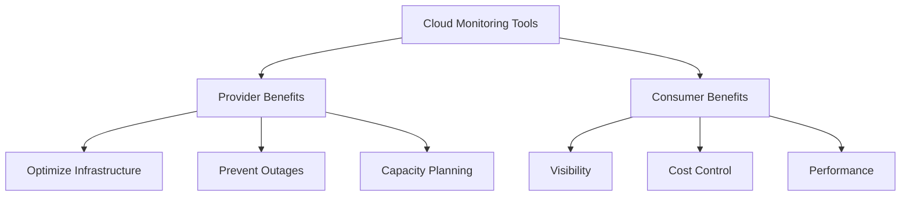

## Benefits for Cloud PROVIDERS

### 1. Infrastructure Optimization

**Real-Time Resource Utilization:**
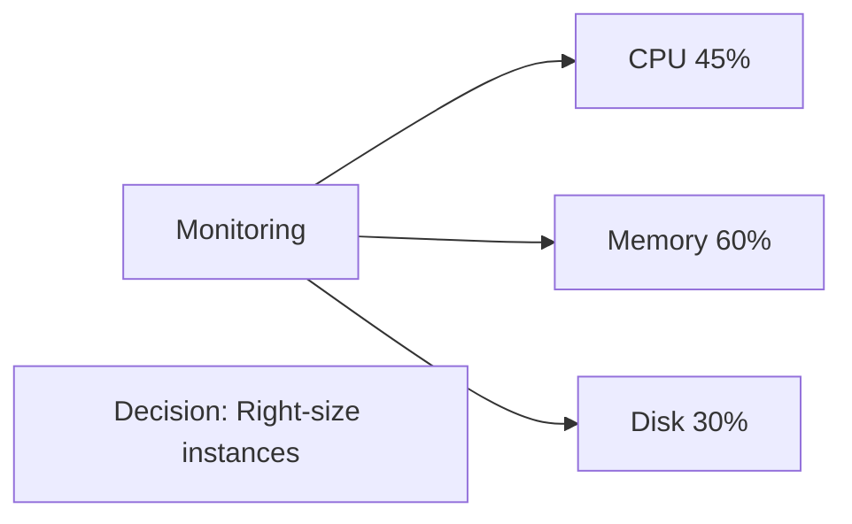

**Example:**
```
Without Monitoring:
- Provision servers at 100% capacity
- Waste: 40% unused resources
- Cost: $1M/month wasted

With Monitoring:
- Identify: Average load 60%
- Action: Scale to 70% capacity
- Savings: $400K/month
```

### 2. Proactive Issue Detection

**Catching Problems Early:**
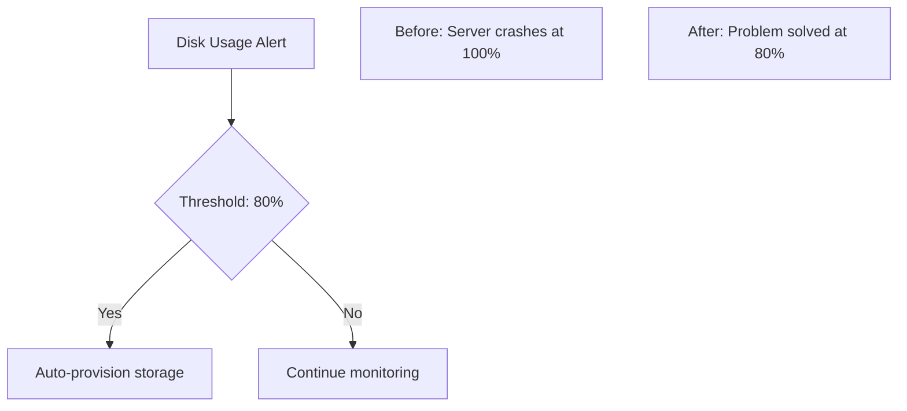

**Real Impact:**
```
AWS Example:
- Monitor EC2 instance health
- Detect: Instance failing health checks
- Action: Auto-replace unhealthy instance
- Result: 0 downtime for customer
```

### 3. Capacity Planning

**Predicting Growth:**
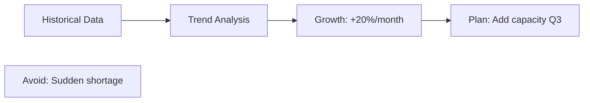

**Provider Strategy:**
```
Data Points:
- Current: 10,000 VMs in use
- Growth: +15% quarterly
- Forecast: Need 14,500 VMs next quarter

Action:
- Order hardware 2 months ahead
- Negotiate better pricing
- Avoid rush purchasing
```

### 4. SLA Compliance

**Guaranteeing Uptime:**
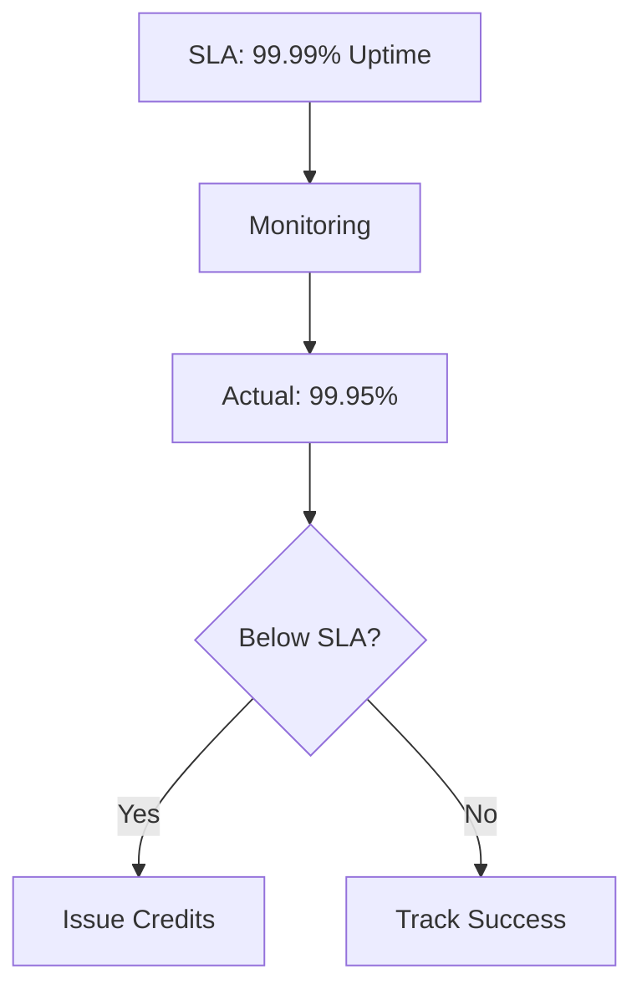

**Financial Impact:**
```
Without Monitoring:
- Unknown uptime percentage
- Customer disputes
- Reputational damage

With Monitoring:
- Prove: 99.99% uptime
- Automatic: SLA reports
- Trust: Transparent metrics
```

### 5. Security Threat Detection

**Identifying Attacks:**
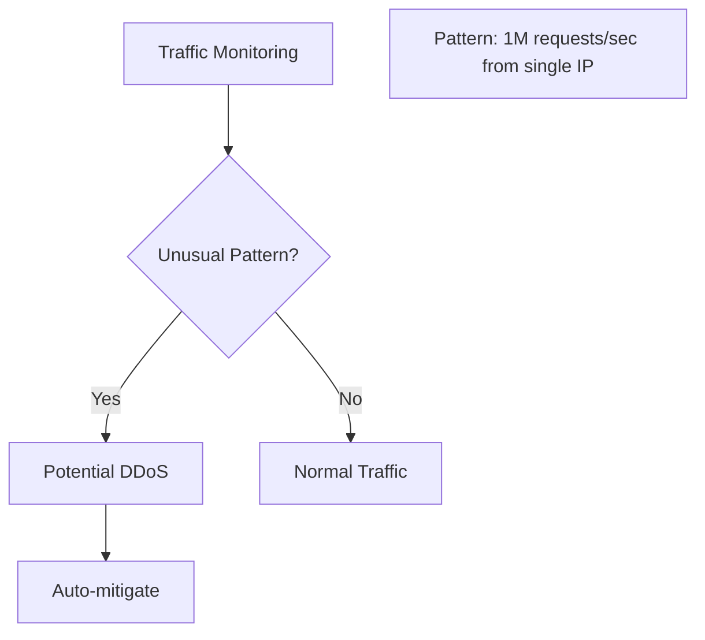

**Provider Protection:**
```
Example Attack:
- Normal: 10K requests/sec
- Spike: 1M requests/sec
- Alert: DDoS detected
- Action: Block IP, reroute traffic
- Result: Infrastructure protected
```

### 6. Cost Attribution

**Tracking Resource Usage:**
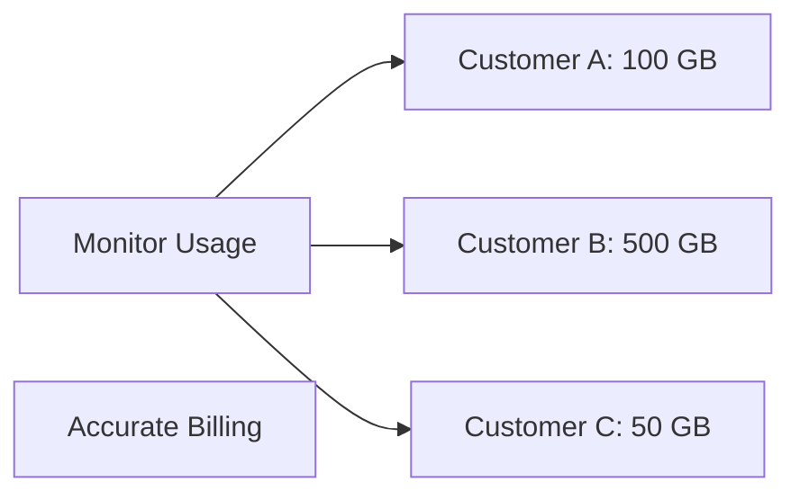

**Billing Accuracy:**
```
AWS CloudWatch Example:
- Track: Every API call
- Track: Every GB stored
- Track: Every compute hour
- Bill: Exactly what was used
```

## Benefits for Cloud CONSUMERS

### 1. Real-Time Visibility

**Knowing What's Happening:**
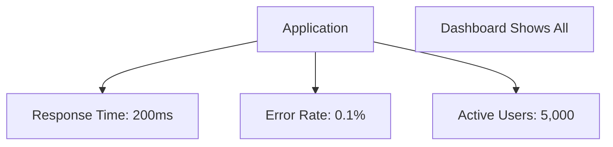

**Example:**
```javascript
// Without Monitoring
Customer complaint: "App is slow!"
Developer: "Works fine for me?" 
// Blind guessing!

// With Monitoring (CloudWatch)
Alert: API response time: 2000ms (usually 200ms)
Issue: Database query slow
Fix: Add index
Result: Back to 200ms
```

### 2. Cost Optimization

**Reducing Cloud Bills:**
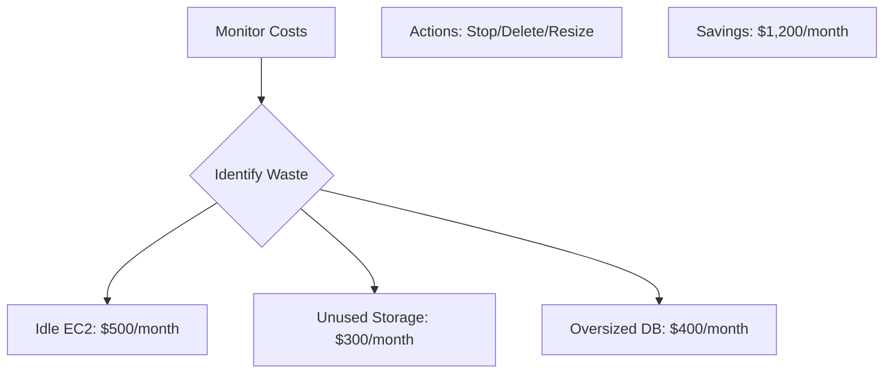

**Real Scenario:**
```
Company: E-commerce Startup

Before Monitoring:
- Monthly Bill: $5,000
- Usage: Unknown

After CloudWatch Cost Monitoring:
- Found: Dev instances running 24/7
- Found: Old snapshots (2 years!)
- Found: Data transfer to wrong region

Actions:
- Stop dev instances nights/weekends
- Delete old snapshots
- Optimize data transfer

Result: Bill down to $3,500 (-30%)
```

### 3. Performance Optimization

**Making Apps Faster:**
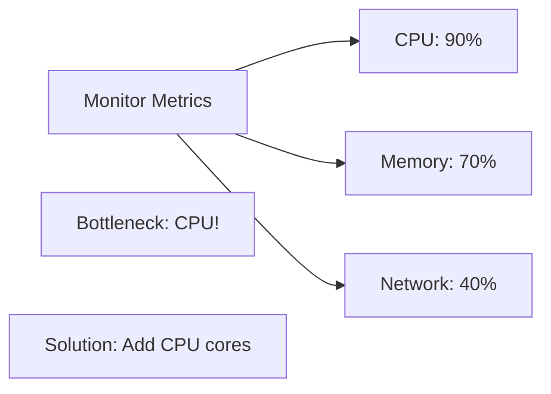

**Example:**
```
Web App Performance:
- Metric: Page load 5 seconds
- Monitoring shows: Lambda cold starts
- Solution: Keep functions warm
- Result: Page load 500ms
```

### 4. Proactive Alerting

**Fix Before Users Notice:**
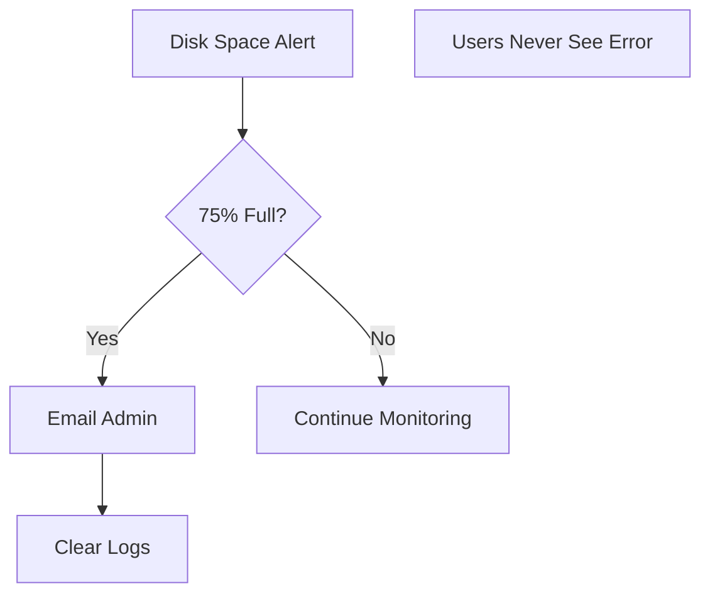

**Alert Examples:**
```yaml
# CloudWatch Alarms
- CPU > 80%: Scale up
- Error rate > 1%: Page developer
- Response time > 1s: Investigate
- Disk > 85%: Clean or expand

All before customers complain!
```

### 5. Troubleshooting & Debugging

**Finding Root Causes:**
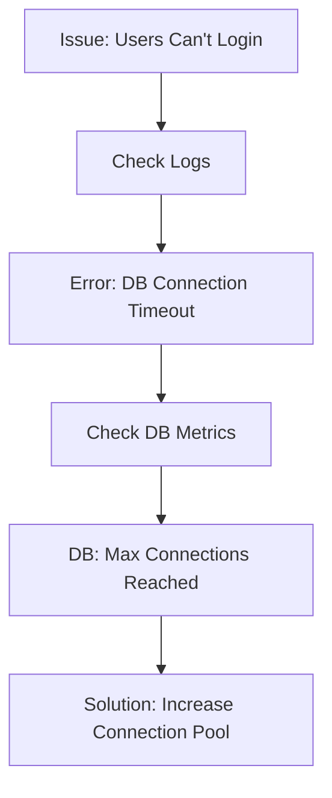

**Without Monitoring:**
```
1. User reports: "Can't log in"
2. Developer checks code: Looks fine
3. Restart server: Still broken
4. Hours of guessing...
```

**With Monitoring:**
```
1. User reports: "Can't log in"
2. Check dashboard: DB connections maxed
3. Increase limit: Fixed in 2 minutes
4. Root cause: Traffic spike
```

### 6. Compliance & Auditing

**Meeting Regulations:**
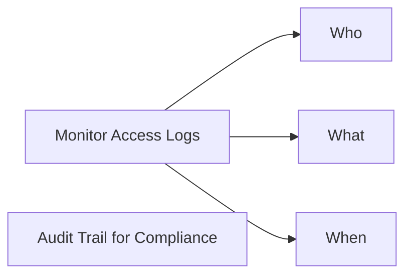

**Example:**
```
HIPAA Requirement:
- Log all access to patient data
- Retain logs 6 years
- Alert on unauthorized access

CloudWatch Solution:
- CloudTrail: Log every API call
- S3: Store logs long-term
- Alarm: Alert on suspicious access
```

### 7. Business Intelligence

**Understanding Users:**
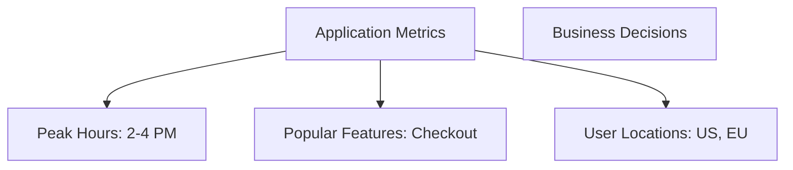

**Insights:**
```
Monitoring Data:
- Peak traffic: 2-4 PM EST
- Feature usage: Search >> Browse
- Mobile: 60% of traffic

Business Actions:
- Schedule maintenance: 2-4 AM EST
- Invest in search improvements
- Optimize mobile experience
```

## Comparison Table

| Benefit | Provider Impact | Consumer Impact |
|---------|----------------|-----------------|
| **Resource Optimization** | Lower costs, better margins | Lower bills, better performance |
| **Proactive Alerts** | Prevent infrastructure failures | Prevent app downtime |
| **Capacity Planning** | Smooth scaling, no shortage | Reliable service |
| **Security** | Protect multi-tenant infrastructure | Protect customer data |
| **Cost Tracking** | Accurate billing | Understand spending |
| **Performance** | Efficient resource use | Fast applications |
| **Compliance** | Meet regulations | Pass audits |

## Popular Monitoring Tools

### For AWS
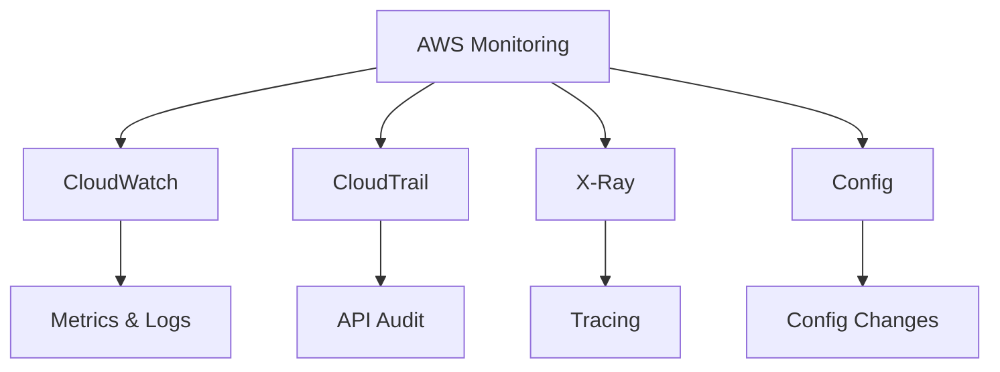

### For Azure
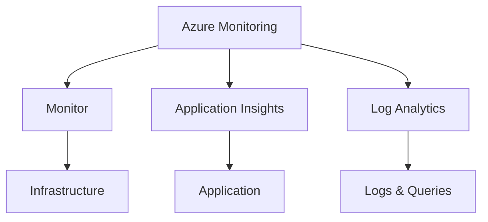

### For Google Cloud
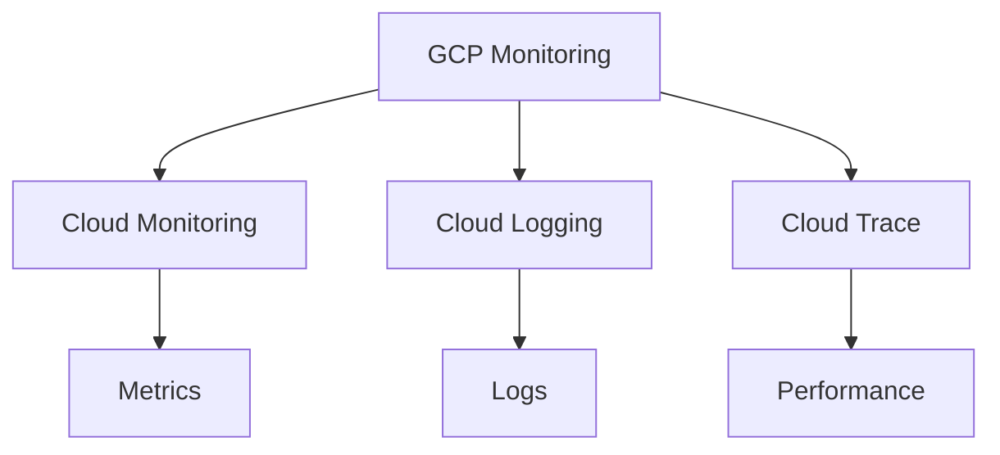

### Third-Party (Multi-Cloud)
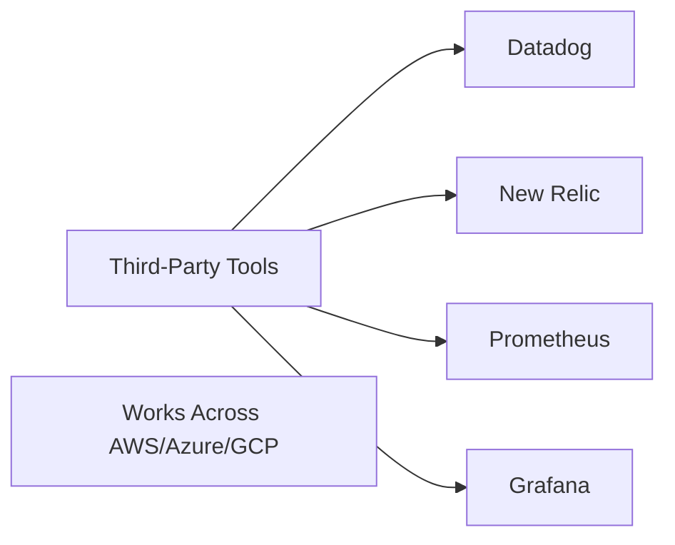

## Win-Win Scenario

**Provider Success:**
- Efficient infrastructure
- Happy customers
- Higher profits
- Competitive advantage

**Consumer Success:**
- Reliable applications
- Lower costs
- Better performance
- Peace of mind

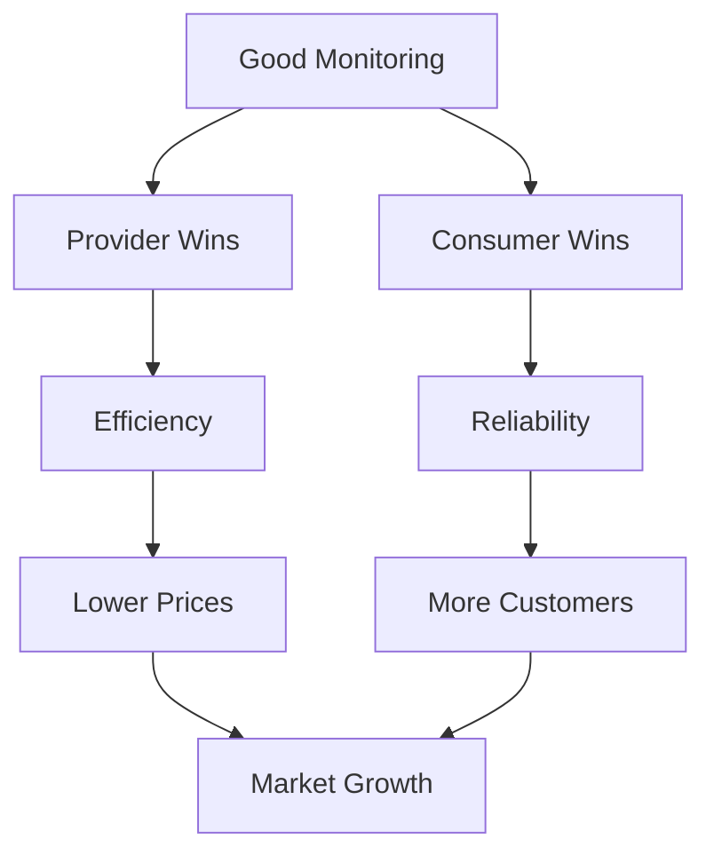

**Everyone benefits!**

---

## Learning Resources

### AWS Monitoring
- [AWS CloudWatch](https://docs.aws.amazon.com/cloudwatch/) - Official documentation
- [CloudWatch Tutorial](https://www.youtube.com/results?search_query=aws+cloudwatch+tutorial) - Video guides
- [AWS Observability Workshop](https://aws.amazon.com/solutions/implementations/observability/) - Hands-on

### Azure Monitoring
- [Azure Monitor](https://docs.microsoft.com/en-us/azure/azure-monitor/) - Documentation
- [Application Insights](https://docs.microsoft.com/en-us/azure/azure-monitor/app/app-insights-overview) - APM tool

### GCP Monitoring
- [Google Cloud Monitoring](https://cloud.google.com/monitoring/docs) - Official docs
- [Cloud Operations Suite](https://cloud.google.com/products/operations) - Full stack

### Best Practices
- [Monitoring Best Practices](https://www.datadoghq.com/blog/monitoring-101-collecting-data/) - Datadog guide
- [Observability Engineering](https://www.honeycomb.io/what-is-observability) - Concepts
