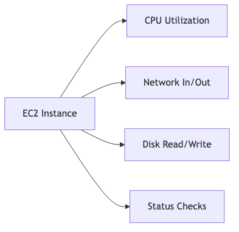

# Cloud Monitoring Tool Advantages: What benefits do cloud monitoring tools provide for both cloud providers and consumers?

## Introduction

Good morning everyone! Today I want to talk about cloud monitoring - imagine driving a car with no dashboard. No speedometer, no fuel gauge, no warning lights. You'd crash pretty quickly, right? That's exactly what running a cloud system without monitoring is like! Let me show you how monitoring tools create a win-win situation for BOTH cloud providers AND their customers.

## Understanding the Two-Way Value

Here's what's fascinating about cloud monitoring - it's not just good for one party. It benefits both the provider AND the consumer!

Providers use monitoring to optimize infrastructure, prevent outages, and plan capacity. Consumers use it for visibility, cost control, and performance optimization. Let me dive into each side!

## Benefits for Cloud PROVIDERS

First, let's see why cloud providers themselves love monitoring tools:

### Benefit #1: Infrastructure Optimization

**Real-World Example:**
Without Monitoring:
- Providers over-provision servers at 100% capacity "just in case"
- Result: 40% of resources sit unused
- Wasted Cost: $1 million per month

With Monitoring:
- Data shows average load is only 60%
- Action: Right-size to 70% capacity with buffer
- Savings: $400,000 per month!

This is how providers stay profitable while keeping costs competitive!

### Benefit #2: Proactive Issue Detection - Fix Before It Breaks

**AWS Real-World Example:**
- CloudWatch monitors EC2 instance health continuously
- Detects: Instance failing health checks
- Auto-Action: Replaces unhealthy instance automatically
- Result: ZERO downtime for the customer!

The customer never even knows there was a problem - that's proactive monitoring!

### Benefit #3: Capacity Planning - Stay Ahead of Demand

**Provider Strategy Example:**
Current Usage: 10,000 VMs in use
Growth Rate: +15% quarterly (from monitoring data)
Forecast: Will need 14,500 VMs next quarter

Proactive Actions:
- Order physical hardware 2 months in advance
- Negotiate volume discounts with suppliers
- Avoid expensive rush purchases
- Ensure smooth scaling for customers

Without monitoring data, they'd be scrambling to buy hardware at the last minute!

### Benefit #4: SLA Compliance and Trust

**The Financial Impact:**
Without Monitoring:
- Unknown actual uptime percentage
- Customer disputes about outages
- Reputational damage
- "He said, she said" arguments

With Monitoring:
- Proven: 99.99% uptime with data
- Automatic SLA reports for customers
- Transparency builds trust
- Automatic credits if SLA is missed

Monitoring protects both the provider's reputation AND their bottom line!

### Benefit #5: Security Threat Detection

**Identifying Attacks Before They Cause Damage:**

**Provider Protection Example:**
Normal Traffic: 10,000 requests/second
Sudden Spike: 1 MILLION requests/second from one IP
Alert: DDoS attack detected!
Automated Action: Block malicious IP, reroute traffic
Result: Infrastructure protected, legitimate customers unaffected

Without monitoring, the attack would have overwhelmed the servers!

### Benefit #6: Accurate Billing - Track Every Penny

**Ensuring Fair and Accurate Charges:**

**AWS CloudWatch Example - Tracking Everything:**
- Tracks every single API call made
- Measures every GB of data stored
- Counts every compute hour used
- Bills customers for EXACTLY what they consumed

This precision is only possible with comprehensive monitoring!

## Benefits for Cloud CONSUMERS

Now let's flip to the customer side - why monitoring is invaluable for cloud users:

### Benefit #1: Real-Time Visibility - Know What's Happening

**The Difference Monitoring Makes:**

Without Monitoring:
- Customer: "App is slow!"
- Developer: "Works fine for me?"
- Hours of blind guessing and frustration

With Monitoring (CloudWatch):
- Alert shows: API response time jumped from 200ms to 2000ms
- Dashboard shows: Database query is the bottleneck
- Fix: Add a database index
- Result: Back to 200ms in minutes!

No more guessing - you KNOW what's wrong!

### Benefit #2: Cost Optimization - Stop Wasting Money

**Real E-commerce Startup Example:**

Before Cost Monitoring:
- Monthly AWS Bill: $5,000
- No idea where money was going

After Implementing CloudWatch Cost Monitoring:
- Found: Dev/test instances running 24/7 (should only run during work hours)
- Found: 2-year-old snapshots never deleted ($300/month)
- Found: Data transfer going to wrong region (expensive cross-region fees)

Actions Taken:
- Automated dev instance shutdown nights/weekends
- Cleaned up old snapshots
- Optimized data transfer routes

Result: Bill reduced from $5,000 to $3,500 (-30% savings!)

That's $18,000 per year saved just from having visibility!

### Benefit #3: Performance Optimization - Make Apps Faster

**Web App Performance Example:**
Problem: Web pages loading in 5 seconds (way too slow!)
Monitoring Reveals: AWS Lambda functions experiencing "cold starts"
Solution: Implement Lambda warming to keep functions ready
Result: Page load time drops to 500ms!

10x improvement just from identifying the bottleneck!

### Benefit #4: Proactive Alerting - Fix Before Users Complain

**Smart Alert Examples:**
- CPU usage > 80%: Auto-scale up before slowdown
- Error rate > 1%: Page the on-call developer immediately
- Response time > 1 second: Investigate performance issue
- Disk space > 85%: Clean logs or expand storage

All of these catch problems BEFORE customers experience issues!

### Benefit #5: Troubleshooting and Debugging Made Easy

**Finding Root Causes Fast:**

**The Contrast:**

Without Monitoring:
1. User reports: "Can't log in"
2. Developer checks code: Looks fine locally
3. Restart server: Still broken
4. Hours of random guessing and frustration...

With Monitoring:
1. User reports: "Can't log in"
2. Check CloudWatch dashboard: DB connections maxed out!
3. Increase connection pool limit: Fixed in 2 minutes!
4. Root cause identified: Unexpected traffic spike

Monitoring turns hours of debugging into minutes!

### Benefit #6: Compliance and Auditing Requirements

**Meeting Regulatory Standards:**

**HIPAA Healthcare Example:**
Requirements:
- Must log all access to patient data
- Must retain logs for 6 years
- Must alert on unauthorized access attempts

CloudWatch Solution:
- CloudTrail logs every single API call automatically
- S3 stores logs long-term (immutable storage)
- CloudWatch Alarms alert on suspicious access patterns

Without monitoring tools, meeting these compliance requirements would be nearly impossible!

### Benefit #7: Business Intelligence and Insights

**Understanding Your Users:**

**Actionable Insights from Monitoring:**

Traffic Analysis Shows:
- Peak Hours: 2-4 PM EST (highest traffic)
- Feature Usage: Search used 10x more than browse
- Platform Split: 60% mobile, 40% desktop

Smart Business Decisions:
- Schedule maintenance during low-traffic hours (2-4 AM EST)
- Invest resources in improving search functionality
- Prioritize mobile optimization over desktop

Monitoring data drives business strategy!

## The Win-Win Comparison

Let me show you how monitoring benefits both sides:

| Benefit | Provider Impact | Consumer Impact |
|---------|----------------|-----------------|
| **Resource Optimization** | Lower costs, better margins | Lower bills, better performance |
| **Proactive Alerts** | Prevent infrastructure failures | Prevent app downtime |
| **Capacity Planning** | Smooth scaling, no shortage | Reliable service |
| **Security** | Protect multi-tenant infrastructure | Protect customer data |
| **Cost Tracking** | Accurate billing | Understand spending |
| **Performance** | Efficient resource use | Fast applications |
| **Compliance** | Meet regulations | Pass audits |

This table shows it's truly win-win - both parties benefit significantly!

## Popular Monitoring Tools

Let me quickly show you what tools are available on each platform:

### AWS Monitoring Tools

- **CloudWatch:** Metrics, logs, and alarms
- **CloudTrail:** API audit trail (who did what)
- **X-Ray:** Application tracing and debugging
- **Config:** Track configuration changes

### Azure Monitoring Tools

- **Azure Monitor:** Infrastructure monitoring
- **Application Insights:** Application performance monitoring
- **Log Analytics:** Centralized logs and queries

### Google Cloud Monitoring Tools

- **Cloud Monitoring:** Metrics and dashboards
- **Cloud Logging:** Centralized logging
- **Cloud Trace:** Request tracing and latency analysis

### Third-Party Multi-Cloud Tools

- **Datadog:** Comprehensive monitoring across all clouds
- **New Relic:** Application performance monitoring
- **Prometheus + Grafana:** Open-source monitoring stack
- **Splunk:** Enterprise log analysis and monitoring

These work across multiple cloud providers - great for hybrid setups!

## The Win-Win Scenario

Let me wrap this up by showing why everyone wins with good monitoring:

**Provider Success:**
- ✅ Runs infrastructure efficiently
- ✅ Keeps customers happy with reliability
- ✅ Increases profit margins through optimization
- ✅ Gains competitive advantage through better service

**Consumer Success:**
- ✅ Runs reliable applications
- ✅ Reduces costs significantly
- ✅ Achieves better performance
- ✅ Gets peace of mind

**The Cycle:**

Good monitoring creates a virtuous cycle - providers run better infrastructure, which attracts more customers, which allows them to invest more in optimization, which leads to better prices and service!

## Final Thoughts

Cloud monitoring tools aren't just nice to have - they're absolutely essential for both providers and consumers!

**Key Takeaways:**

1. **Providers benefit** through infrastructure optimization, proactive issue detection, accurate billing, and capacity planning
2. **Consumers benefit** through cost savings, performance optimization, proactive alerts, and better troubleshooting  
3. **It's truly win-win** - both parties gain significant value
4. **Modern cloud operations are impossible** without comprehensive monitoring
5. **The ROI is clear** - monitoring pays for itself many times over through cost savings and prevented outages

Whether you're AWS running millions of servers or a startup running a few instances, monitoring is what separates amateur operations from professional cloud infrastructure!

Thank you!
