# Why Cloud Monitoring is Essential: Why is cloud monitoring essential for maintaining cloud-based services and applications?

## Introduction

**Cloud without monitoring = Flying blind!** You wouldn't drive a car without a dashboard. You shouldn't run cloud services without monitoring. Here's why it's **non-negotiable**.

## The Core Reasons

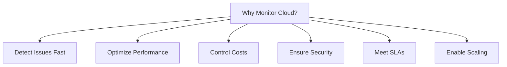

## 1. Detect Problems BEFORE Users Do

### The Nightmare Scenario

**Without Monitoring:**
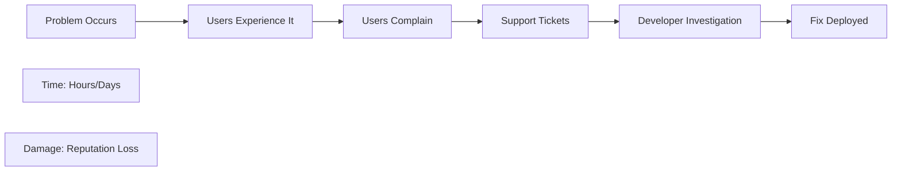

**With Monitoring:**
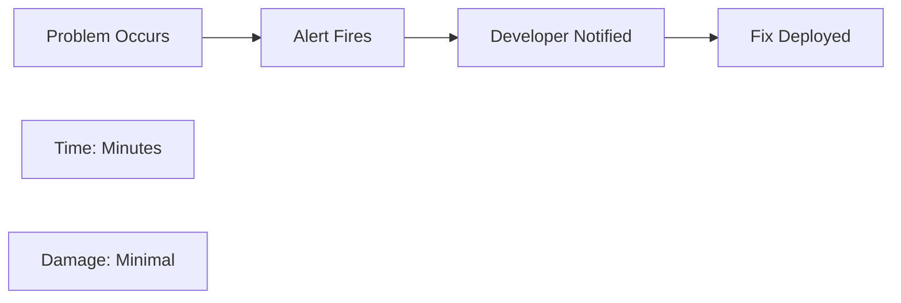

### Real Example

```
E-commerce Site Without Monitoring:
9:00 AM: Payment API fails
9:00 AM - 2:00 PM: Customers can't checkout
2:00 PM: Social media complaints
2:30 PM: Developer discovers issue
3:00 PM: Fixed

Lost Revenue: 5 hours × 100 orders/hour × $50 = $25,000
Lost Trust: Priceless

E-commerce Site With Monitoring:
9:00 AM: Payment API fails
9:00:30 AM: Alert: "Payment API Error Rate: 100%"
9:01 AM: Failover to backup
9:05 AM: Primary fixed

Lost Revenue: $0
Trust: Maintained
```

## 2. Optimize Performance

### Finding Bottlenecks

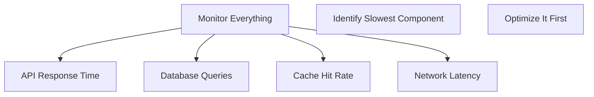

**Example:**
```javascript
// Monitored Metrics
{
    "api_response_time": 2000,  // 2 seconds (SLOW!)
    "db_query_time": 1800,      // 1.8 seconds
    "cache_hit_rate": 20%       // Low!
}

// Analysis: Cache not working effectively

// Action: Improve caching strategy
const cachedData = await redis.get(key);
if (cachedData) return cachedData;  // Now 90% hit rate

// New Metrics
{
    "api_response_time": 200,   // 10x faster!
    "db_query_time": 1800,      // Same
    "cache_hit_rate": 90%       // Much better!
}
```

### Without Monitoring = Blind Optimization

```
Developer: "Let's optimize the database!"
(Spends 2 weeks rewriting queries)

Reality: Database was fine, network was slow
Result: Wasted 2 weeks on wrong problem
```

## 3. Control Cloud Costs

### The Bill Shock Problem

**Without Cost Monitoring:**
```
Month 1: $1,000 bill (expected)
Month 2: $1,500 bill (didn't notice)
Month 3: $5,000 bill (WHAT?!)
Month 4: $15,000 bill (PANIC!)

Problem discovered too late!
```

**With Cost Monitoring:**
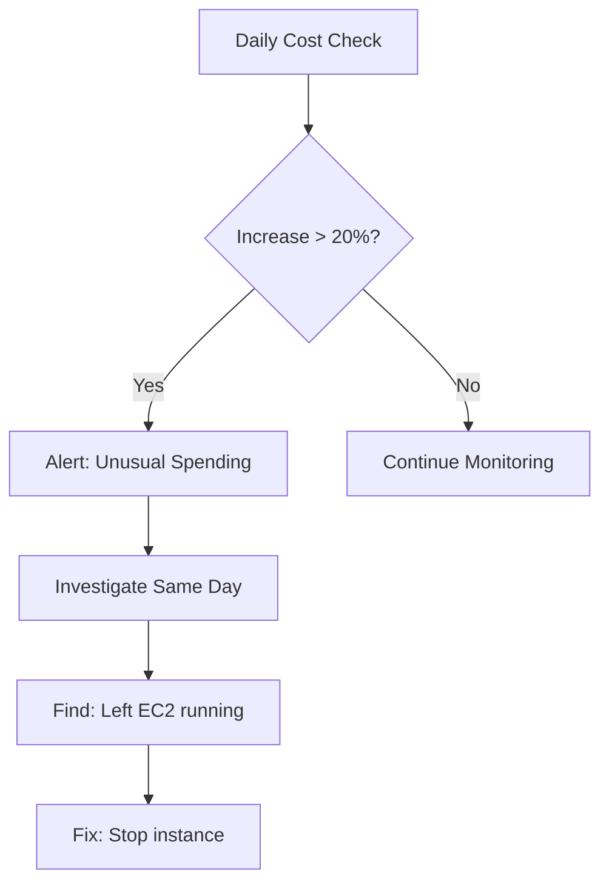

**Real Scenario:**
```
Startup Cost Disaster:

Without Monitoring:
- Developer tests S3 to EC2 transfer
- Forgets to stop
- 1TB/day transfer for 30 days
- Bill: $12,000 in data transfer!

With Monitoring:
- Day 1: Alert "Data transfer spike"
- Investigation: Test still running
- Action: Stop test
- Cost: $400 (1 day only)

Savings: $11,600
```

## 4. Enable Auto-Scaling

### The Modern Architecture Requirement

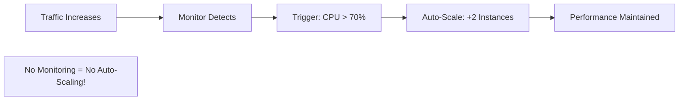

**Example:**
```yaml
# AWS Auto-Scaling (Requires CloudWatch!)
AutoScalingPolicy:
  Type: AWS::AutoScaling::ScalingPolicy
  Properties:
    # MUST have metrics from monitoring
    MetricName: CPUUtilization
    TargetValue: 70
    
    # Without monitoring, this doesn't work!
```

**Impact:**
```
Black Friday Traffic Spike:

Manual Scaling:
- Normal: 10 servers
- Black Friday: Need 100 servers
- Problem: Spike at 12 AM
- Reality: Admin asleep
- Result: Site crashes

Auto-Scaling with Monitoring:
- 12:00 AM: Traffic spike
- 12:00:01 AM: Monitoring detects
- 12:00:05 AM: Auto-scale to 100 servers
- Result: Site handles load perfectly
```

## 5. Security & Compliance

### Detecting Threats

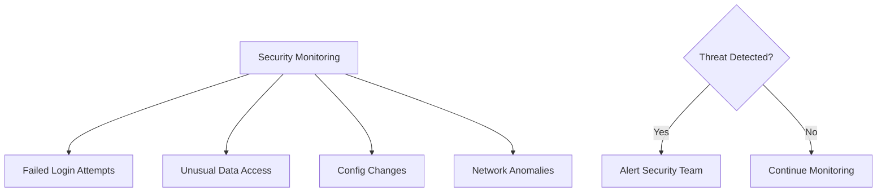

**Example Attack:**
```
Data Breach Attempt:

Without Monitoring:
- Attacker: 10,000 failed login attempts
- System: No alerts
- Attacker: Finds weak password
- Attacker: Downloads customer database
- Company: Discovers breach 6 months later
- Cost: $5M fine + reputation loss

With Monitoring:
- Attacker: 10 failed login attempts
- System: Alert "Brute force detected"
- Security: IP blocked automatically
- Attacker: Prevented
- Cost: $0
```

### Compliance Requirements

**Many regulations REQUIRE monitoring:**

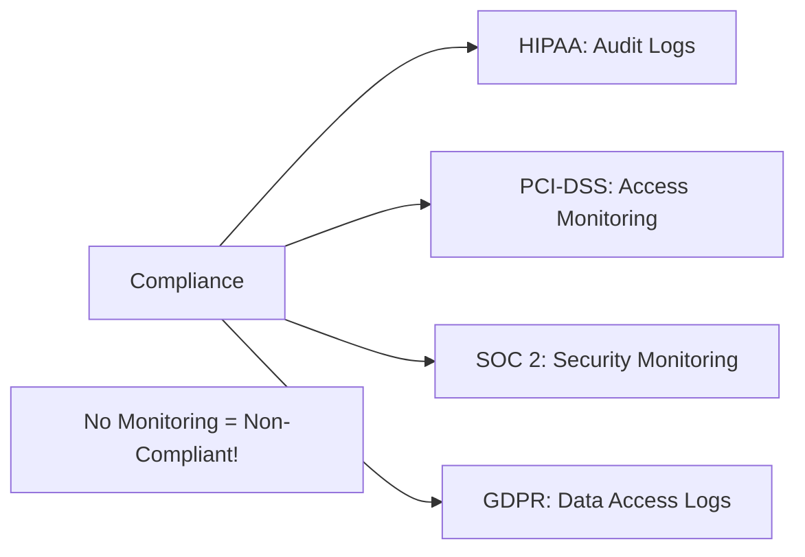

## 6. Meeting SLAs

### Proving Uptime

**Service Level Agreement:**
```
SLA: 99.9% uptime
= Maximum downtime: 43 minutes/month

Without Monitoring:
- Customer: "You had 2 hours downtime!"
- Provider: "No we didn't!"
- Customer: "Yes you did!"
- Provider: "Prove it!"
- Nobody can prove anything

With Monitoring:
- Actual uptime: 99.95% (log shows)
- Downtime: 21 minutes (automatically tracked)
- SLA: Met ✓
- Report: Auto-generated
- Disputes: None
```

### Proactive SLA Management

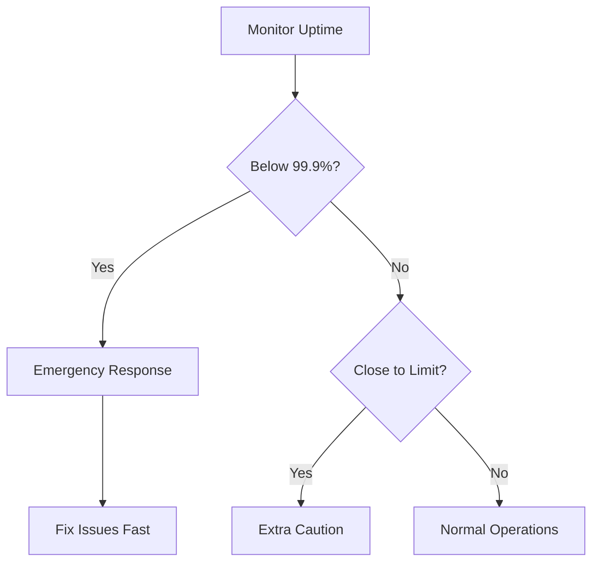

## 7. Capacity Planning

### Growing Smart, Not Crisis

**Without Monitoring:**
```
Company Growth Pattern:
- Month 1-10: Comfortable
- Month 11: Server at 95% capacity
- Month 12: Everything crashes
- Month 13: Emergency scaling (expensive!)
```

**With Monitoring:**
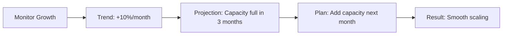

**Financial Impact:**
```
Crisis Scaling (No Monitoring):
- Emergency server purchase: $50K
- Rush shipping: +$5K
- Setup during outage: $10K downtime
- Total: $65K

Planned Scaling (With Monitoring):
- Scheduled purchase: $45K
- Standard shipping: $0
- Scheduled setup: $0 downtime
- Total: $45K

Savings: $20K + No downtime
```

## 8. Debugging & Root Cause Analysis

### The Detective Work

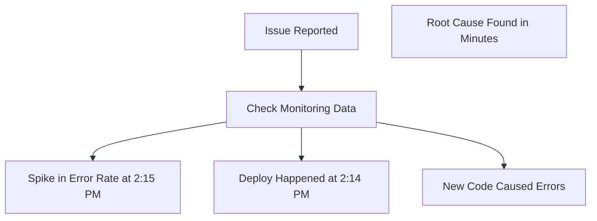

**Without Monitoring:**
```javascript
// Developer trying to debug
console.log("Is it this?");
// Restart server
console.log("Maybe this?");
// Change configuration
console.log("How about this?");
// Hours of guessing...
```

**With Monitoring:**
```javascript
// Check monitoring dashboard
// Error spike at: 2:15 PM
// Deployment at: 2:14 PM
// Error type: NullPointerException
// Line: newFeature.js:42

// Fix found in 5 minutes!
```

## 9. User Experience Optimization

### Understanding Real Users

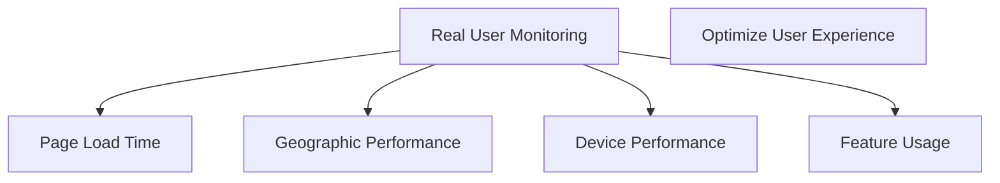

**Example:**
```
Monitoring Shows:
- US users: 500ms page load ✓
- EU users: 3000ms page load ✗
- Asia users: 5000ms page load ✗✗

Action:
- Deploy CDN to EU and Asia
- New load times: 500ms globally ✓

Result: +30% conversion from EU/Asia
```

## 10. Business Intelligence

### Data-Driven Decisions

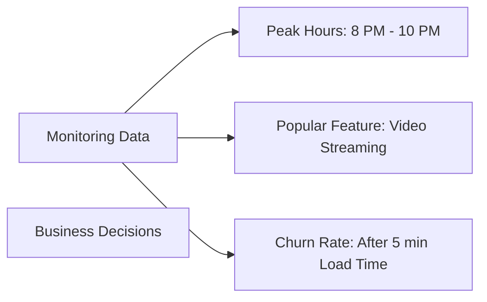

**Insights:**
```
E-commerce Monitoring:
- Cart abandonment: 70% when checkout > 3 seconds
- Action: Optimize checkout to < 1 second
- Result: Abandonment down to 20%
- Revenue impact: +$500K/year
```

## What Happens Without Monitoring?

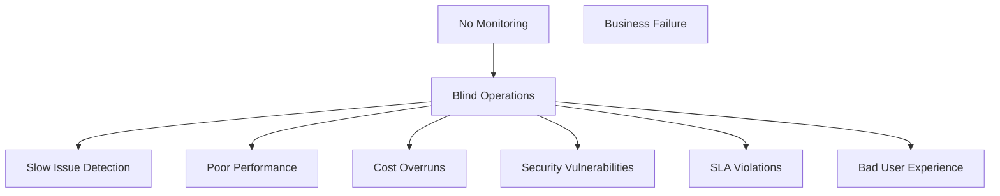

**Real Horror Stories:**
- **Code Spaces** (2014): No monitoring, lost AWS keys, entire business destroyed in hours
- **GitLab** (2017): Accidentally deleted database, monitoring showed replication wasn't working
- **AWS S3 Outage** (2017): Typo took down internet, monitoring showed impact within seconds

## Essential Monitoring Metrics

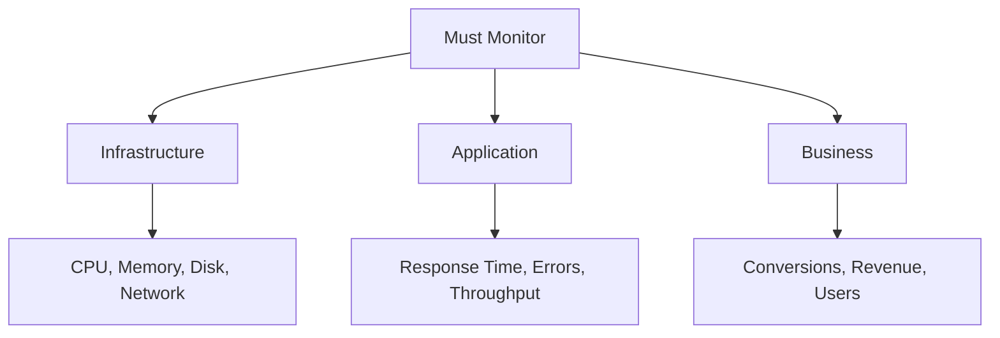

## Conclusion

**Cloud monitoring is not optional because:**

1. ⚠️ Problems happen (detect fast!)
2. 🚀 Performance matters (optimize!)
3. 💰 Costs spiral (control spending!)
4. 🔐 Security threats exist (detect attacks!)
5. 📊 SLAs must be met (prove uptime!)
6. 📈 Scaling is essential (auto-scale!)
7. 🐛 Bugs happen (debug quickly!)
8. 👥 Users demand quality (UX optimization!)
9. 📉 Planning prevents crises (grow smart!)
10. 💼 Business depends on it (data-driven!)

**Bottom line:** Cloud monitoring turns reactive firefighting into proactive management!

---

## Learning Resources

### Getting Started
- [Cloud Monitoring 101](https://www.datadoghq.com/blog/monitoring-101-collecting-data/) - Fundamentals
- [AWS Well-Architected](https://aws.amazon.com/architecture/well-architected/) - Best practices
- [Google SRE Book](https://sre.google/books/) - Free, comprehensive

### Tools & Platforms
- [AWS CloudWatch](https://docs.aws.amazon.com/cloudwatch/) - AWS monitoring
- [Azure Monitor](https://docs.microsoft.com/en-us/azure/azure-monitor/) - Azure monitoring
- [Prometheus](https://prometheus.io/docs/introduction/overview/) - Open source
- [Grafana](https://grafana.com/docs/) - Visualization

### Advanced Topics
- [Observability Engineering](https://www.oreilly.com/library/view/observability-engineering/9781492076438/) - O'Reilly book
- [Monitoring Distributed Systems](https://www.usenix.org/conference/srecon14/technical-sessions/presentation/wilkes) - Google SRE
