# CloudWatch Performance Metrics: How does AWS CloudWatch help track the performance of AWS resources like EC2, RDS, and Lambda?

## Introduction

**AWS CloudWatch** is AWS's eyes and ears - it watches everything happening in your cloud infrastructure. Let's see how it tracks performance across different AWS services!

## What is CloudWatch?

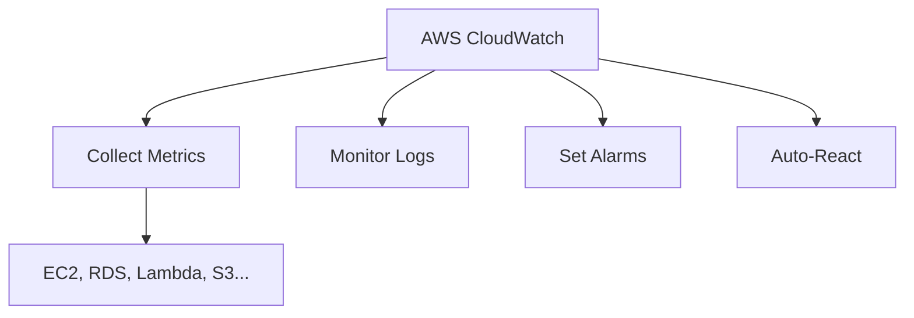

**Core Concept:**
- **Metrics**: Numerical data (CPU%, memory, requests/sec)
- **Logs**: Text data (application logs, error messages)
- **Alarms**: Triggers when thresholds crossed
- **Dashboards**: Visual representation

## CloudWatch for EC2 (Servers)

### Basic Metrics (Free, 5-minute intervals)

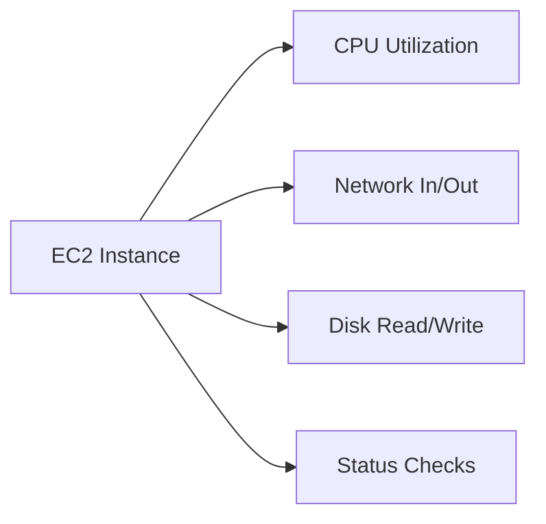

### Example Metrics

```javascript
// EC2 CPU Utilization
{
    "MetricName": "CPUUtilization",
    "Value": 75.5,  // 75.5% CPU usage
    "Unit": "Percent",
    "Timestamp": "2024-01-15T10:30:00Z"
}

// Network Traffic
{
    "MetricName": "NetworkIn",
    "Value": 1048576,  // 1 MB received
    "Unit": "Bytes"
}
```

### Detailed Monitoring (Paid, 1-minute intervals)

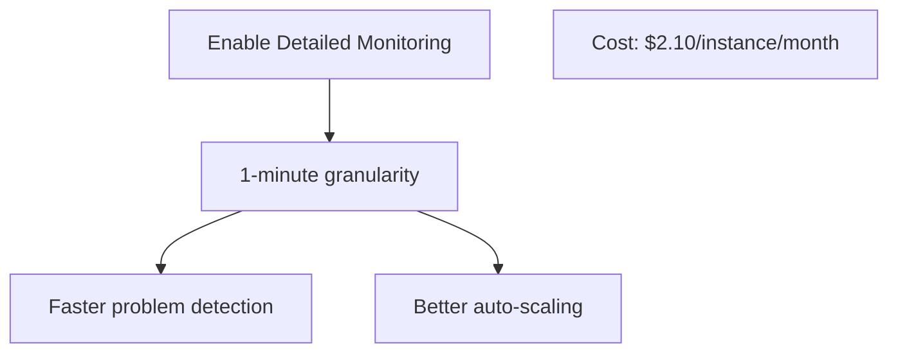

### Custom Metrics with CloudWatch Agent

**Memory & Disk Monitoring:**

```bash
# Install CloudWatch Agent on EC2
sudo yum install amazon-cloudwatch-agent

# Configure
{
  "metrics": {
    "namespace": "CustomEC2",
    "metrics_collected": {
      "mem": {
        "measurement": [
          {"name": "mem_used_percent", "rename": "MemoryUsage"}
        ]
      },
      "disk": {
        "measurement": [
          {"name": "disk_used_percent", "rename": "DiskUsage"}
        ]
      }
    }
  }
}
```

**Now you can track:**
- Memory usage (not available by default!)
- Disk usage per partition
- Process metrics
- Custom application metrics

### EC2 Alarms Example

```yaml
# Auto-scale when CPU high
CPUAlarm:
  Type: AWS::CloudWatch::Alarm
  Properties:
    AlarmName: HighCPU
    MetricName: CPUUtilization
    Namespace: AWS/EC2
    Statistic: Average
    Period: 300  # 5 minutes
    Threshold: 80
    ComparisonOperator: GreaterThanThreshold
    
    # Actions
    AlarmActions:
      - AutoScalingPolicy  # Add more instances
      - SNSTopic  # Send notification
```

**What happens:**
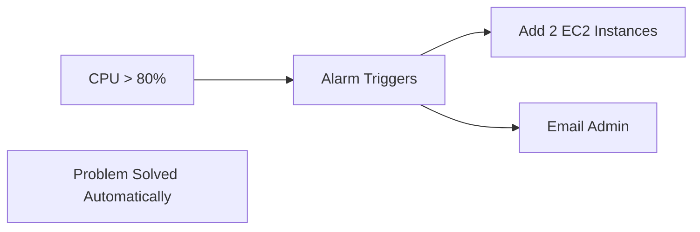

## CloudWatch for RDS (Databases)

### Key Database Metrics

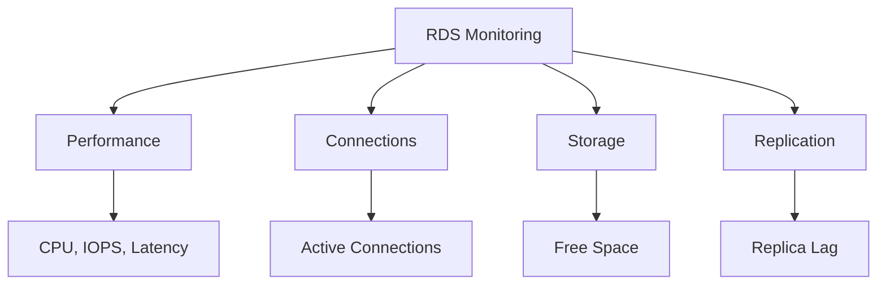

### Critical Metrics

**CPU & Memory:**
```javascript
// Database CPU
{
    "MetricName": "CPUUtilization",
    "Value": 65.3,
    "Namespace": "AWS/RDS"
}

// Freeable Memory
{
    "MetricName": "FreeableMemory",
    "Value": 2147483648,  // 2 GB free
    "Unit": "Bytes"
}
```

**Database Connections:**
```javascript
// Current connections
{
    "MetricName": "DatabaseConnections",
    "Value": 45  // 45 active connections
}

// Max allowed: 100 (for this instance type)
// Alert when > 80
```

**Storage & IOPS:**
```javascript
// Free storage
{
    "MetricName": "FreeStorageSpace",
    "Value": 10737418240,  // 10 GB free
    "Unit": "Bytes"
}

// Read/Write IOPS
{
    "MetricName": "ReadIOPS",
    "Value": 500  // 500 read operations/second
}
{
    "MetricName": "WriteIOPS",
    "Value": 150  // 150 write operations/second
}
```

**Query Performance:**
```javascript
// Read/Write Latency
{
    "MetricName": "ReadLatency",
    "Value": 0.005,  // 5ms
    "Unit": "Seconds"
}

{
    "MetricName": "WriteLatency",
    "Value": 0.015,  // 15ms
    "Unit": "Seconds"
}
```

### RDS Enhanced Monitoring

**Even more detailed (1-second granularity):**

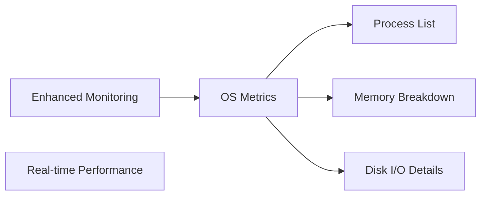

**What you see:**
```json
{
  "engine": "MySQL",
  "uptime": "5 days",
  "cpuUtilization": {
    "guest": 0.0,
    "irq": 0.0,
    "system": 2.3,
    "wait": 0.5,
    "idle": 95.2,
    "user": 2.0
  },
  "memory": {
    "total": 15718400,
    "free": 142936,
    "cached": 11426412
  },
  "processList": [
    {"name": "mysqld", "cpuUsedPc": 2.1, "memoryUsedPc": 45.5}
  ]
}
```

### RDS Alarms Example

```yaml
# Alert when storage low
StorageAlarm:
  Type: AWS::CloudWatch::Alarm
  Properties:
    MetricName: FreeStorageSpace
    Namespace: AWS/RDS
    Threshold: 10737418240  # 10 GB
    ComparisonOperator: LessThanThreshold
    AlarmActions:
      - SNS_Topic  # Email DBA
      
# Alert when connections high
ConnectionAlarm:
  Type: AWS::CloudWatch::Alarm
  Properties:
    MetricName: DatabaseConnections
    Threshold: 80  # 80% of max
    AlarmActions:
      - SNS_Topic
      - Lambda_ScaleUp  # Increase instance size
```

## CloudWatch for Lambda (Serverless)

### Lambda-Specific Metrics

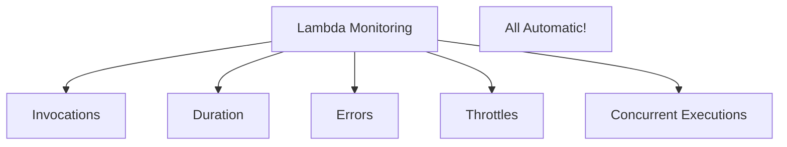

### Key Metrics

**Invocations:**
```javascript
// How many times function called
{
    "MetricName": "Invocations",
    "Value": 10000,  // 10K invocations
    "Namespace": "AWS/Lambda"
}

// Successful vs Failed
{
    "MetricName": "Errors",
    "Value": 50  // 50 errors out of 10K = 0.5%
}
```

**Duration:**
```javascript
// How long function runs
{
    "MetricName": "Duration",
    "Statistics": {
        "Average": 250,  // 250ms average
        "Maximum": 2000,  // 2s slowest
        "Minimum": 50    // 50ms fastest
    },
    "Unit": "Milliseconds"
}
```

**Throttles:**
```javascript
// Rejected due to concurrency limit
{
    "MetricName": "Throttles",
    "Value": 100  // 100 invocations rejected
}

// Concurrent executions
{
    "MetricName": "ConcurrentExecutions",
    "Value": 500  // 500 running simultaneously
}
```

**Cost Tracking:**
```javascript
// Billable invocations
{
    "MetricName": "Invocations",
    "Value": 1000000  // 1M invocations
}

// Total GB-seconds (memory × duration)
// 1GB memory × 200ms × 1M invocations
// = 200,000 GB-seconds
// Cost: ~$3.33
```

### Lambda Insights (Enhanced)

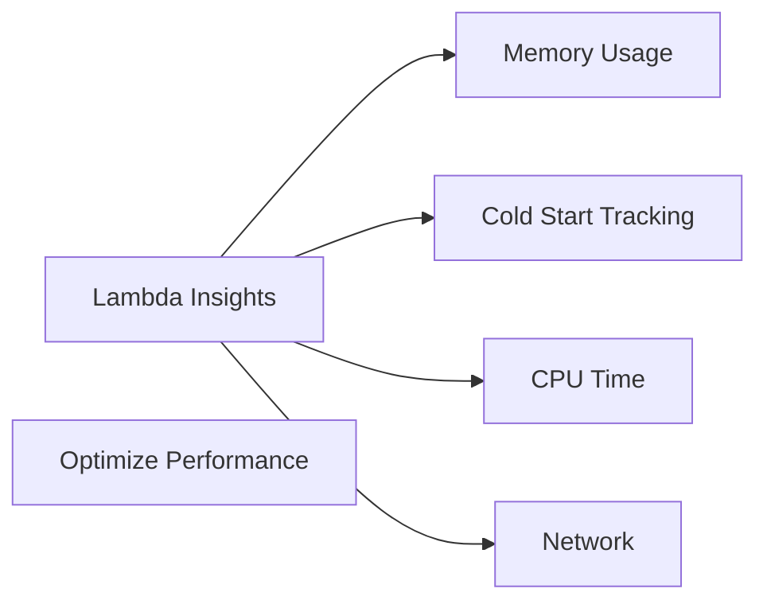

**Example Insights:**

```json
{
  "functionName": "ProcessOrders",
  "memoryAllocated": 1024,  // MB
  "memoryUsed": 256,        // Only using 25%!
  "duration": 180,          // ms
  "coldStart": false,
  "recommendation": "Reduce memory to 512 MB"
  // Save 50% on this function!
}
```

### Lambda Alarms Example

```yaml
# Alert on high error rate
ErrorAlarm:
  Type: AWS::CloudWatch::Alarm
  Properties:
    MetricName: Errors
    Namespace: AWS/Lambda
    Statistic: Sum
    Period: 60  # 1 minute
    Threshold: 10  # More than 10 errors/minute
    AlarmActions:
      - SNS_Topic
      
# Alert on throttling
ThrottleAlarm:
  Type: AWS::CloudWatch::Alarm
  Properties:
    MetricName: Throttles
    Threshold: 1  # Any throttling is bad
    AlarmActions:
      - Lambda_IncreaseReservedConcurrency
```

## CloudWatch Dashboards

### Creating Performance Overview

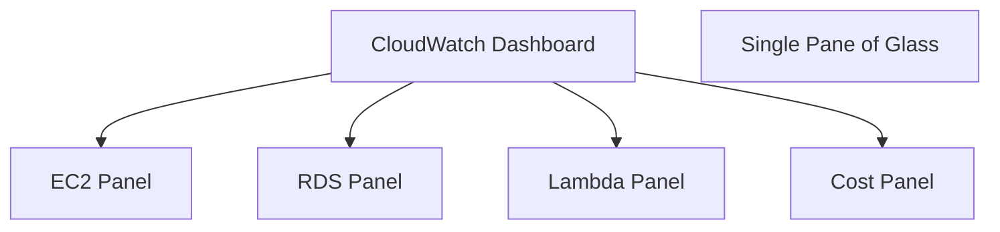

**Example Dashboard:**

```json
{
  "widgets": [
    {
      "type": "metric",
      "properties": {
        "title": "EC2 CPU Utilization",
        "metrics": [
          ["AWS/EC2", "CPUUtilization", {"stat": "Average"}]
        ]
      }
    },
    {
      "type": "metric",
      "properties": {
        "title": "RDS Connections",
        "metrics": [
          ["AWS/RDS", "DatabaseConnections"]
        ]
      }
    },
    {
      "type": "metric",
      "properties": {
        "title": "Lambda Error Rate",
        "metrics": [
          ["AWS/Lambda", "Errors", {"stat": "Sum"}]
        ]
      }
    }
  ]
}
```

## CloudWatch Logs

### Application Performance Tracking

```javascript
// Lambda function logging
exports.handler = async (event) => {
    console.log("Start processing order");
    const startTime = Date.now();
    
    // Process order
    await processOrder(event);
    
    const duration = Date.now() - startTime;
    console.log(`Order processed in ${duration}ms`);
    
    // CloudWatch automatically captures this!
    // Can query: "Order processed"
    // Can graph: duration over time
};
```

### Log Insights Queries

```sql
-- Find slow Lambda executions
fields @timestamp, @message
| filter @message like /Order processed/
| parse @message "Order processed in *ms" as duration
| filter duration > 1000
| sort duration desc

-- Result: All orders taking > 1 second
```

## CloudWatch Anomaly Detection

### AI-Powered Monitoring

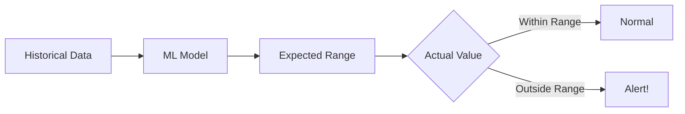

**Example:**
```yaml
# Anomaly detection alarm
AnomalyAlarm:
  Type: AWS::CloudWatch::Alarm
  Properties:
    MetricName: CPUUtilization
    # Instead of static threshold (e.g., 80%)
    # Use AI to detect unusual patterns
    ThresholdMetricId: anomaly_detection
    ComparisonOperator: GreaterThanUpperThreshold
```

**What it catches:**
- Normal CPU: 40-60% daily, 80% on deploy days
- Anomaly: 90% on a Tuesday (unusual!)
- Static threshold (80%) would miss this pattern

## Real-World Monitoring Setup

### E-commerce Application

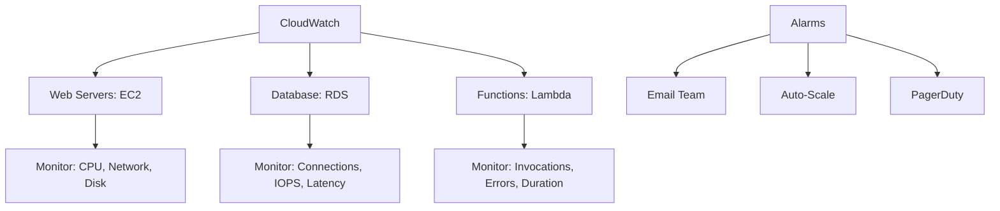

**Key Metrics to Watch:**

| Service | Metric | Threshold | Action |
|---------|--------|-----------|--------|
| **EC2** | CPU > 80% | 5 min | Scale out |
| **EC2** | Memory > 90% | 2 min | Alert |
| **RDS** | Connections > 80 | 1 min | Scale up |
| **RDS** | Free Storage < 10GB | - | Expand |
| **Lambda** | Errors > 1% | 1 min | Alert |
| **Lambda** | Duration > 2s | - | Optimize |

## CloudWatch Pricing

```
Metrics:
- First 10 custom metrics: Free
- Additional metrics: $0.30/month each

Alarms:
- Standard alarms: $0.10/month each
- High-resolution: $0.30/month each

Logs:
- Ingestion: $0.50/GB
- Storage: $0.03/GB/month

Dashboards:
- First 3: Free
- Additional: $3/month each
```

**Tip:** Start with free tier, add custom metrics as needed!

## Best Practices

1. **Monitor Everything**: EC2, RDS, Lambda, S3, API Gateway...
2. **Set Meaningful Alarms**: Not too sensitive (alert fatigue), not too lenient (miss issues)
3. **Use Dashboards**: Single view for quick health checks
4. **Enable Detailed Monitoring**: For production systems
5. **Leverage Logs**: Combine metrics + logs for debugging
6. **Use Anomaly Detection**: For complex patterns
7. **Tag Resources**: Organize metrics by environment/team
8. **Review Regularly**: Adjust thresholds based on experience

## Conclusion

**CloudWatch helps track AWS performance by:**

✅ **EC2**: CPU, network, disk, custom metrics (memory)  
✅ **RDS**: Connections, IOPS, latency, storage  
✅ **Lambda**: Invocations, duration, errors, throttles  
✅ **Alarms**: Auto-scale, notifications, remediation  
✅ **Logs**: Application insights, debugging  
✅ **Dashboards**: Unified view  
✅ **AI**: Anomaly detection

**Result:** Full visibility into AWS infrastructure performance!

---

## Learning Resources

### Official Documentation
- [AWS CloudWatch Docs](https://docs.aws.amazon.com/cloudwatch/) - Complete guide
- [CloudWatch Metrics](https://docs.aws.amazon.com/AmazonCloudWatch/latest/monitoring/working_with_metrics.html) - All metrics
- [CloudWatch Alarms](https://docs.aws.amazon.com/AmazonCloudWatch/latest/monitoring/AlarmThatSendsEmail.html) - Setup guide

### Tutorials
- [CloudWatch Getting Started](https://aws.amazon.com/cloudwatch/getting-started/) - Hands-on
- [EC2 Monitoring](https://docs.aws.amazon.com/AWSEC2/latest/UserGuide/monitoring_ec2.html) - EC2 specific
- [RDS Monitoring](https://docs.aws.amazon.com/AmazonRDS/latest/UserGuide/monitoring-cloudwatch.html) - RDS specific
- [Lambda Monitoring](https://docs.aws.amazon.com/lambda/latest/dg/monitoring-metrics.html) - Lambda specific

### Video Courses
- [AWS re:Invent CloudWatch](https://www.youtube.com/results?search_query=aws+reinvent+cloudwatch) - Deep dives
- [A Cloud Guru CloudWatch](https://acloudguru.com/) - Courses

### Tools
- [AWS CloudWatch Console](https://console.aws.amazon.com/cloudwatch/) - Web interface
- [AWS CLI](https://docs.aws.amazon.com/cli/latest/reference/cloudwatch/) - Command line
- [CloudWatch Agent](https://docs.aws.amazon.com/AmazonCloudWatch/latest/monitoring/Install-CloudWatch-Agent.html) - Custom metrics
