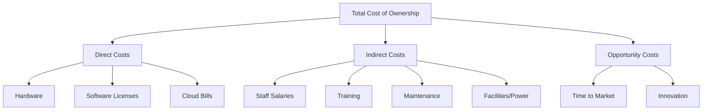
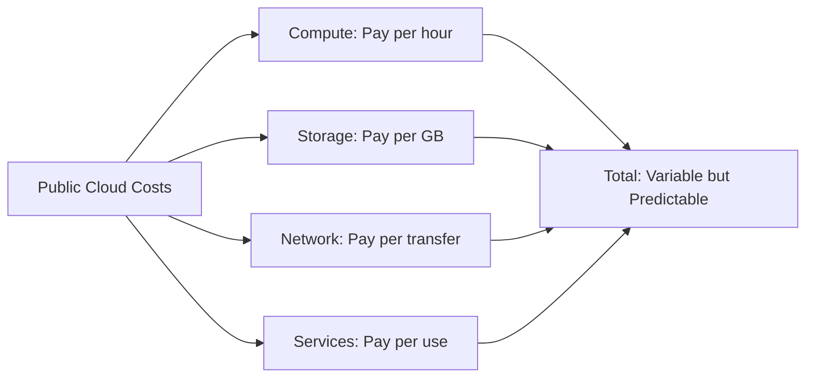
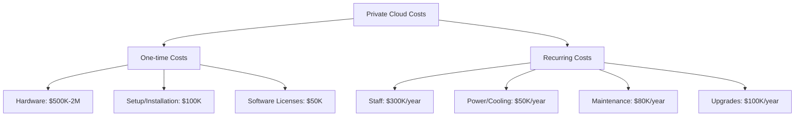
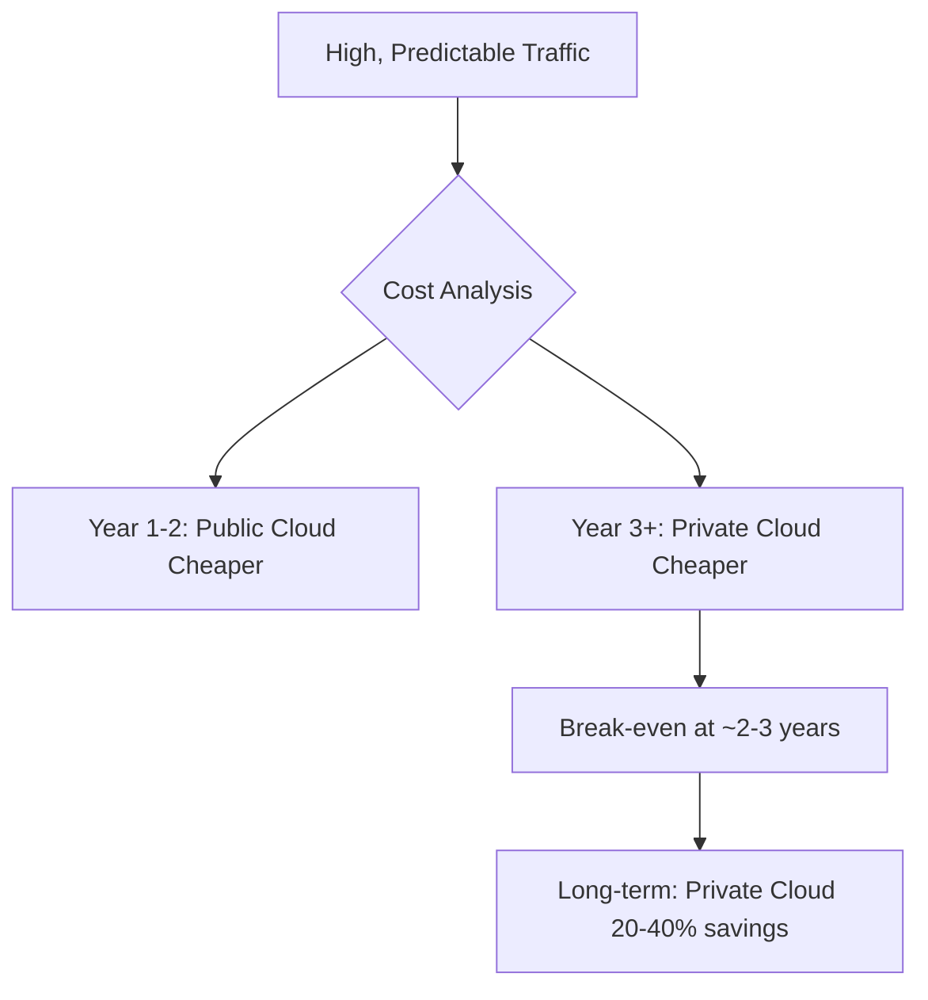

# Public Cloud vs. Private Cloud: Which model provides better long-term Total Cost of Ownership (TCO) for a company with predictable, high-volume traffic?

## Introduction

Good morning everyone! Today I'm tackling an interesting question: If your company has predictable, high-volume traffic, which cloud model saves you more money in the long run - public or private cloud? The answer might surprise you!

## Understanding Total Cost of Ownership

First, let's talk about what Total Cost of Ownership really means. It's not just about the monthly bill you pay. TCO includes everything - the obvious costs like servers and cloud bills, plus hidden costs like staff salaries, electricity, maintenance, and even the opportunity cost of time spent managing infrastructure instead of building features.

*This diagram breaks down TCO into three categories: direct costs (hardware, software, cloud bills), indirect costs (staff, training, maintenance, facilities), and opportunity costs (time to market, innovation). All of these together give you the true total cost.*

## The Key Factor: Predictable, High-Volume Traffic

Now here's what makes this question interesting - we're talking about predictable, high-volume traffic. This changes everything! Let me explain with an analogy.

Think of it like commuting to work. If you commute to the same office every single day for years, buying a car makes financial sense. But if you travel randomly and occasionally, Uber is cheaper. The same logic applies to cloud computing.

## Public Cloud: Flexibility at a Premium

With public cloud, you're essentially renting. Every hour, every gigabyte, every data transfer - you pay for it. The beauty is you can start with zero upfront investment and scale up or down as needed.

For predictable, high-volume traffic though, you're paying a premium for flexibility you don't really need. It's like paying for an all-you-can-eat buffet every single day when you know you only eat the same three dishes. You're paying for options you never use.

*This diagram shows how public cloud costs work: you pay separately for compute time, storage space, network transfer, and services used. These costs are variable, but when your traffic is predictable, you can forecast them accurately.*

## Private Cloud: High Upfront, Lower Long-term

Private cloud is like buying a house instead of renting. You pay a lot upfront, but then your ongoing costs are much lower. You buy servers once, set them up, and then just pay for maintenance and staff to manage them.

Here's the critical insight: When your traffic is predictable and high-volume, you're using those servers twenty-four seven, maximizing your investment. You're not wasting capacity.

*This diagram shows private cloud has two cost types: one-time costs (buying hardware, setup, initial licenses) and recurring costs (staff salaries, electricity, maintenance, upgrades). The one-time cost is high, but recurring costs are lower than public cloud at scale.*

## The Verdict: Private Cloud Wins Long-term

Here's the bottom line: For predictable, high-volume traffic, private cloud wins on TCO after about two to three years. Let me explain the math simply.

In year one, public cloud is cheaper because you have no upfront costs. But you're paying premium rental prices every month. With private cloud, year one is expensive because you're buying all the equipment, but then years two, three, four, and beyond become much cheaper.

Think of the break-even point happening around year two or three. After that, every year you stay on private cloud, you save money compared to public cloud.

*This diagram shows the cost trajectory: public cloud is cheaper initially due to no upfront costs, but private cloud becomes cheaper from year three onwards. The break-even typically happens at 2-3 years, and long-term savings with private cloud can be 20-40%.*

## Real Examples

Let me share a powerful real-world example. Dropbox was running on AWS and paying millions every year. They analyzed their usage - predictable, high-volume storage - and decided to build their own data centers. The result? They saved seventy-five million dollars over two years! That's the power of private cloud when you have the right conditions.

On the flip side, Netflix stays on public cloud despite massive scale. Why? Because their traffic isn't perfectly predictable - it varies by region, time, and content releases. They value the flexibility more than the cost savings.

## My Final Advice

So here's my recommendation: Private cloud offers better long-term TCO for predictable, high-volume traffic, but only if you meet certain conditions.

You need significant upfront capital to invest. You need skilled engineers to manage the infrastructure. Your traffic must be truly predictable - not just guesses, but real data showing consistent patterns. And you need commitment for at least three to five years.

If you meet all these conditions, private cloud will save you substantial money long-term. But if any of these conditions aren't met, stick with public cloud. The flexibility and lower operational burden might be worth paying a premium.

Remember, the cheapest option isn't always the best option. Consider your specific situation carefully. Thank you!

---

## Learning Resources

### TCO Calculators
- [AWS TCO Calculator](https://aws.amazon.com/tco-calculator/) - Compare cloud vs on-premise
- [Azure TCO Calculator](https://azure.microsoft.com/pricing/tco/calculator/) - Microsoft's tool
- [Google Cloud Pricing Calculator](https://cloud.google.com/products/calculator) - Estimate costs

### Case Studies
- [Dropbox Infrastructure](https://www.wired.com/2016/03/epic-story-dropboxs-exodus-amazon-cloud-empire/) - Why they left AWS
- [Netflix on AWS](https://aws.amazon.com/solutions/case-studies/netflix/) - Why they stayed
- [Apple's Cloud Strategy](https://www.theverge.com/2021/4/22/22396874/apple-icloud-cloud-infrastructure-amazon-google-azure-server) - Hybrid approach

### Articles & Guides
- [The Real Cost of Cloud](https://a16z.com/2021/05/27/cost-of-cloud-paradox-market-cap-cloud-lifecycle-scale-growth-repatriation-optimization/) - Andreessen Horowitz
- [Cloud vs On-Premise TCO](https://www.flexera.com/blog/cloud/cloud-computing-trends-2023/) - Industry analysis
- [When to Use Private Cloud](https://www.ibm.com/cloud/blog/public-cloud-vs-private-cloud) - IBM perspective

### Videos
- [Cloud Economics Explained](https://www.youtube.com/results?search_query=cloud+economics+tco) - YouTube tutorials
- [AWS re:Invent - Cloud Financial Management](https://www.youtube.com/results?search_query=aws+reinvent+finops) - Cost optimization

### Books & Whitepapers
- "Cloud FinOps" by J.R. Storment and Mike Fuller
- [Flexera State of the Cloud Report](https://www.flexera.com/blog/cloud/cloud-computing-trends-2023/) - Annual industry report
- "Economics of Cloud Computing" - Various whitepapers

### Research Papers
- [Berkeley View on Cloud Computing](https://www2.eecs.berkeley.edu/Pubs/TechRpts/2009/EECS-2009-28.pdf) - Academic perspective
- Gartner Cloud Research - Industry analysis (subscription required)

### Communities & Forums
- [r/cloudcomputing](https://www.reddit.com/r/cloudcomputing/) - Reddit discussions
- [Cloud Financial Management](https://www.finops.org/) - FinOps Foundation
