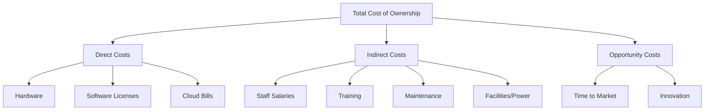
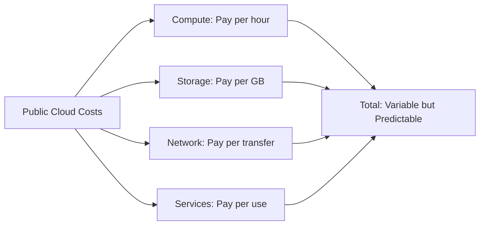
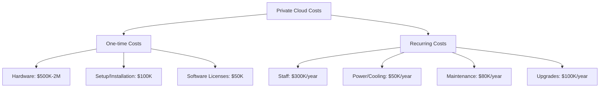
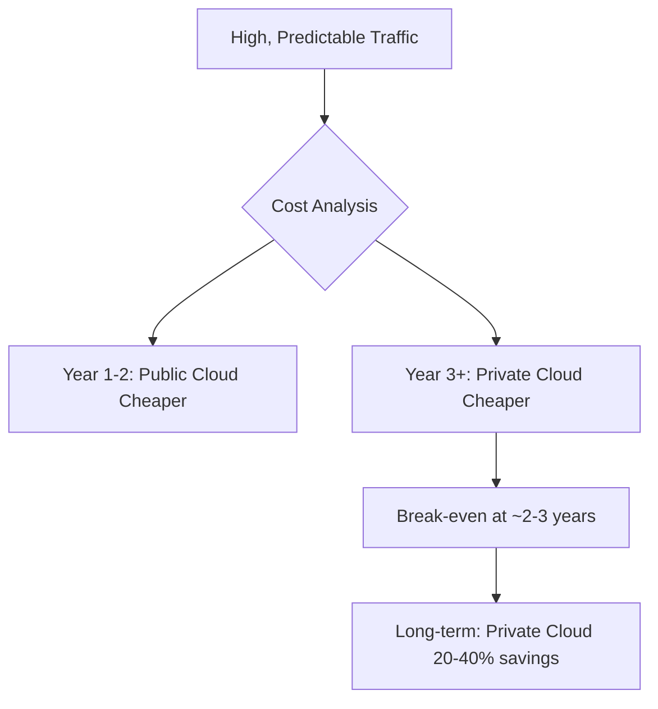
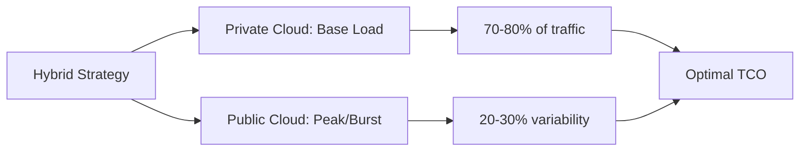

# Public Cloud vs. Private Cloud: Which model provides better long-term Total Cost of Ownership (TCO) for a company with predictable, high-volume traffic?

## Introduction

This is a fascinating question! When you have **predictable, high-volume traffic**, the TCO equation changes significantly. Let me break this down for you.

## Understanding Total Cost of Ownership (TCO)

TCO isn't just the price tag - it's EVERYTHING:

## The Key Factor: Predictable, High-Volume Traffic

This is CRUCIAL! When traffic is:
- **Predictable** - You know exactly what resources you need
- **High-Volume** - You're using significant resources constantly

The economics completely change!

## Cost Breakdown: Public Cloud

### Public Cloud TCO Example
Let's say you run a video streaming service with 1 million consistent users:

**Monthly Costs:**
- Compute (24/7 running): $15,000
- Storage (1 PB data): $23,000
- Data transfer: $12,000
- Databases: $8,000
- **Total: ~$58,000/month = $696,000/year**

### Advantages:
✅ No upfront investment  
✅ Elastic if traffic spikes  
✅ Global infrastructure  
✅ No maintenance overhead  

### Disadvantages:
❌ Paying a premium for flexibility you don't need  
❌ Costs never decrease (always paying)  
❌ Less negotiation power  

## Cost Breakdown: Private Cloud

### Private Cloud TCO Example
Same video streaming service, but on your own infrastructure:

**Initial Investment:**
- Servers & infrastructure: $1,000,000
- Setup & configuration: $150,000
- **Total upfront: $1,150,000**

**Annual Operating Costs:**
- Staff (4 engineers): $400,000
- Power & cooling: $60,000
- Maintenance contracts: $100,000
- Software licenses: $40,000
- **Total: $600,000/year**

**5-Year TCO:**
- Year 1: $1,150,000 + $600,000 = $1,750,000
- Years 2-5: $600,000 × 4 = $2,400,000
- **Total 5-year TCO: $4,150,000**

**Average annual cost: $830,000**

Compare to Public Cloud 5-year: **$3,480,000**

## The Verdict: Private Cloud Wins for Predictable High-Volume

### Why Private Cloud Wins:

**1. No "Idle Tax"**
With public cloud, you pay for resources every hour, even if you own them virtually. Private cloud = buy once, use forever.

**2. Economies of Scale**
High volume means you're maximizing hardware utilization. You're not wasting any capacity.

**3. Predictability = Optimization**
You can perfectly size your infrastructure since you know your needs.

### Real-World Examples:

**Dropbox** - Moved from AWS to private data centers, saved **$75 million over 2 years** with predictable storage needs.

**Apple iCloud** - Uses private infrastructure for core services due to predictable, massive scale.

**Netflix** - Uses PUBLIC cloud (AWS) despite high volume because traffic is NOT perfectly predictable (seasonal, regional variations).

## But There's a Catch!

Private Cloud is better ONLY if:

✅ Traffic truly is predictable  
✅ You have engineering expertise  
✅ Volume is high enough (usually >$50K/month cloud spend)  
✅ You plan for 3+ years  
✅ You have capital for upfront investment  

## The Hybrid Approach: Best of Both?

Many companies use:
- **Private cloud** for predictable baseline (80% of traffic)
- **Public cloud** for unpredictable bursts (20% overflow)

## Cost Comparison Table

| Factor | Public Cloud | Private Cloud |
|--------|--------------|---------------|
| **Year 1 TCO** | $696K | $1,750K |
| **Year 3 TCO** | $2,088K | $2,950K |
| **Year 5 TCO** | $3,480K | $4,150K |
| **Year 10 TCO** | $6,960K | $5,150K |
| **Break-even** | - | ~Year 2-3 |

*Note: Numbers are illustrative, actual costs vary*

## My Recommendation

**For predictable, high-volume traffic:**

🏆 **Private Cloud wins on TCO after 2-3 years**

But consider:
- Do you have $1M+ upfront capital?
- Can you hire/retain infrastructure engineers?
- Is your traffic TRULY predictable (>90% confidence)?
- Are you committed for 3+ years?

**If YES to all → Private Cloud**  
**If NO to any → Stick with Public Cloud**

The flexibility and reduced operational burden of public cloud might be worth the premium!

---

## Learning Resources

### TCO Calculators
- [AWS TCO Calculator](https://aws.amazon.com/tco-calculator/) - Compare cloud vs on-premise
- [Azure TCO Calculator](https://azure.microsoft.com/pricing/tco/calculator/) - Microsoft's tool
- [Google Cloud Pricing Calculator](https://cloud.google.com/products/calculator) - Estimate costs

### Case Studies
- [Dropbox Infrastructure](https://www.wired.com/2016/03/epic-story-dropboxs-exodus-amazon-cloud-empire/) - Why they left AWS
- [Netflix on AWS](https://aws.amazon.com/solutions/case-studies/netflix/) - Why they stayed
- [Apple's Cloud Strategy](https://www.theverge.com/2021/4/22/22396874/apple-icloud-cloud-infrastructure-amazon-google-azure-server) - Hybrid approach

### Articles & Guides
- [The Real Cost of Cloud](https://a16z.com/2021/05/27/cost-of-cloud-paradox-market-cap-cloud-lifecycle-scale-growth-repatriation-optimization/) - Andreessen Horowitz
- [Cloud vs On-Premise TCO](https://www.flexera.com/blog/cloud/cloud-computing-trends-2023/) - Industry analysis
- [When to Use Private Cloud](https://www.ibm.com/cloud/blog/public-cloud-vs-private-cloud) - IBM perspective

### Videos
- [Cloud Economics Explained](https://www.youtube.com/results?search_query=cloud+economics+tco) - YouTube tutorials
- [AWS re:Invent - Cloud Financial Management](https://www.youtube.com/results?search_query=aws+reinvent+finops) - Cost optimization

### Books & Whitepapers
- "Cloud FinOps" by J.R. Storment and Mike Fuller
- [Flexera State of the Cloud Report](https://www.flexera.com/blog/cloud/cloud-computing-trends-2023/) - Annual industry report
- "Economics of Cloud Computing" - Various whitepapers

### Research Papers
- [Berkeley View on Cloud Computing](https://www2.eecs.berkeley.edu/Pubs/TechRpts/2009/EECS-2009-28.pdf) - Academic perspective
- Gartner Cloud Research - Industry analysis (subscription required)

### Communities & Forums
- [r/cloudcomputing](https://www.reddit.com/r/cloudcomputing/) - Reddit discussions
- [Cloud Financial Management](https://www.finops.org/) - FinOps Foundation
