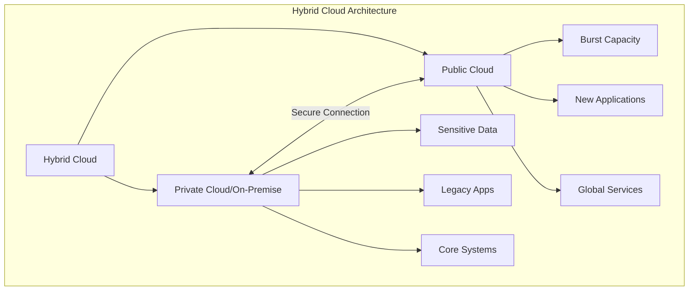
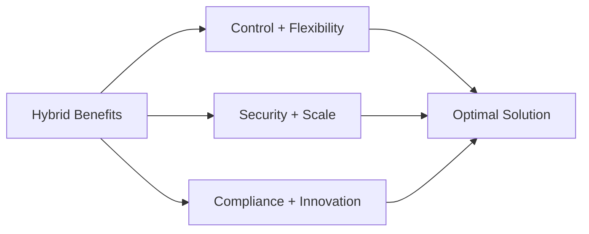
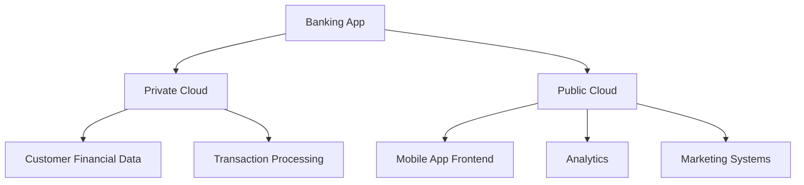
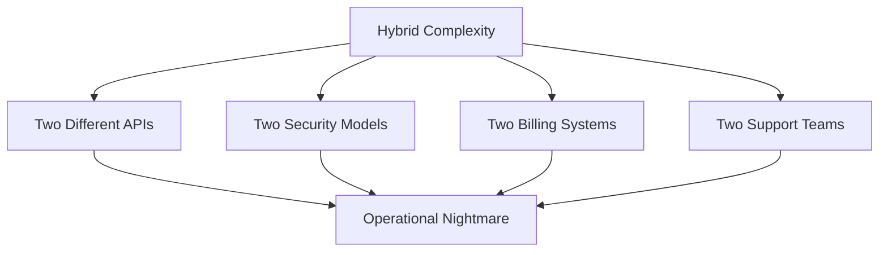
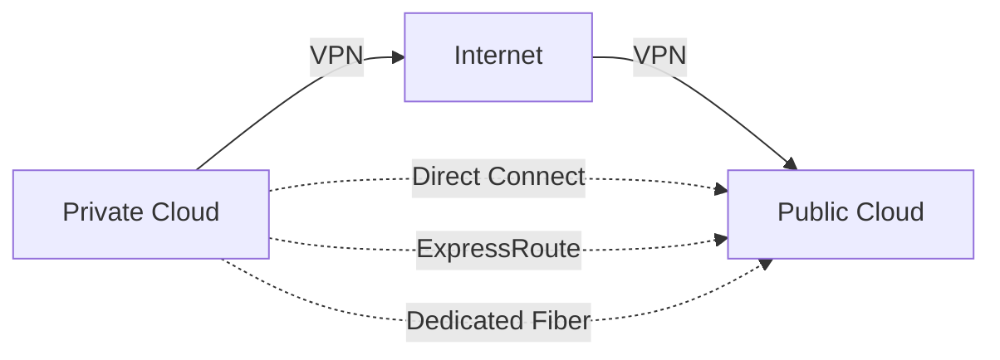
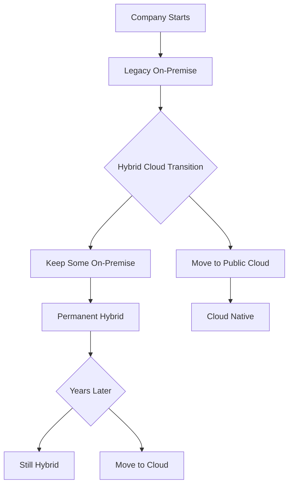
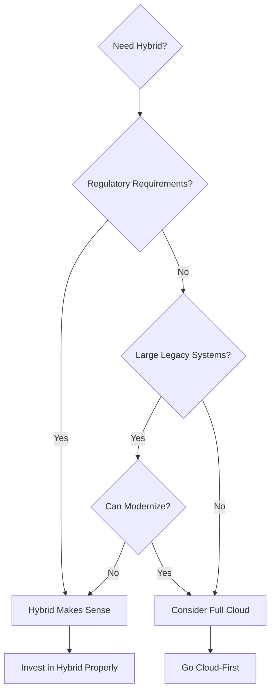

# The Hybrid Cloud Dilemma: Is Hybrid Cloud an optimal, flexible solution or a temporary, complex compromise between two environments?

## Introduction

This is one of the most debated questions in cloud computing! Is hybrid cloud the best of both worlds, or the worst of both? Let's dive deep into this.

## What is Hybrid Cloud?

Hybrid cloud means combining **private cloud** (or on-premise) infrastructure with **public cloud** services, working together as one integrated system.

## The "Optimal Solution" Perspective

### Why Companies Love Hybrid Cloud

**1. Best of Both Worlds**

Think of it like owning a car AND using Uber:
- **Private cloud** = Your car (always there, you control it)
- **Public cloud** = Uber (use when needed, pay per ride)

**2. Cloud Bursting**

Imagine a retail website:
- **Normal days:** 10,000 users → Private cloud handles it
- **Black Friday:** 500,000 users → Burst to AWS/Azure
- **After sale:** Back to private cloud

**Real Example:** Target runs core systems on-premise but bursts to cloud during holiday shopping season.

**3. Regulatory Compliance**

Some data MUST stay on-premise:
- Healthcare data (HIPAA)
- Financial records (PCI-DSS)
- Government data (FedRAMP)

**Example:** A bank keeps customer account data on-premise (regulation) but runs their mobile app on AWS (scale & features).

**4. Data Sovereignty**

Some countries require data to stay within borders.

**Example:** A European company might keep EU customer data in private cloud (GDPR) but use public cloud for global operations.

**5. Legacy System Integration**

You have a 10-year-old mainframe that:
- Works perfectly
- Costs millions to replace
- Has dependencies everywhere

**Solution:** Keep mainframe on-premise, build new services in public cloud!

## The "Complex Compromise" Perspective

### The Dark Side of Hybrid Cloud

**1. Managing Two Environments**

You need expertise in:
- ❌ Your private infrastructure
- ❌ Public cloud (AWS/Azure/GCP)
- ❌ Networking between them
- ❌ Security for both
- ❌ Different management tools

**2. Network Complexity**

Connecting private and public clouds securely is HARD:

- Setting up VPNs
- Managing latency
- Data transfer costs ($$$)
- Security vulnerabilities

**3. Data Transfer Costs**

Moving data between clouds is EXPENSIVE!

**Example:** Moving 10TB between your datacenter and AWS:
- Transfer out: 10TB × $0.09/GB = **$900**
- Do this daily = **$27,000/month** just for data transfer!

**4. Inconsistent Experience**

Your developers struggle with:
- Different deployment processes
- Different monitoring tools
- Different logging systems
- Different security policies

**5. Vendor Lock-in (Still!)**

You're not avoiding lock-in, you're getting locked into TWO vendors:
- Your private infrastructure vendor
- Your public cloud provider

## Real-World Examples

### Success Stories ✅

**Netflix** (Kind of hybrid):
- Content delivery on AWS
- Content production tools on-premise
- But they're migrating everything to cloud

**JPMorgan Chase**:
- Core banking on private cloud
- Customer-facing apps on public cloud
- Clear separation of concerns

**NASA**:
- Sensitive research data on-premise
- Public datasets and compute on AWS
- Mission-critical systems isolated

### Failure Stories ❌

**General Electric**:
- Tried complex hybrid cloud strategy
- Too complicated, too expensive
- Simplified to mostly public cloud

**Many enterprises**:
- Built hybrid "for the future"
- Ended up with "hybrid mess"
- Eventually chose one primary platform

## Is It Temporary or Permanent?

### It's Temporary If:
- You're transitioning to full cloud
- You have legacy systems to retire
- Regulations might change
- You're testing cloud before committing

### It's Permanent If:
- Strict data sovereignty requirements
- Massive predictable workloads (cheaper private)
- Edge computing requirements
- True need for both environments

## My Honest Take

**Hybrid cloud is like a long-distance relationship:**

Some make it work beautifully because they have:
- ✅ Clear communication (well-defined boundaries)
- ✅ Strong commitment (long-term investment)
- ✅ Good reasons (compliance, cost, performance)

Others end up complicated because:
- ❌ Trying to avoid making a decision
- ❌ "Best of both worlds" sounds good but is hard
- ❌ Underestimating complexity

## Decision Framework

**Go Hybrid If:**
1. Legal/compliance REQUIRES it
2. Economics favor it (large predictable workloads)
3. You have the team to manage it
4. Clear long-term strategy (not just indecision)

**Avoid Hybrid If:**
1. You're just scared of public cloud
2. "Keeping options open" (expensive options!)
3. Small team (< 20 engineers)
4. Hoping it's "easier" (it's not!)

## The Verdict

**Hybrid cloud is BOTH:**
- ✅ An optimal solution **for specific use cases**
- ❌ A complex compromise **if done without clear purpose**

It's not temporary, it's not permanent - it's **situational**.

For most companies, I believe:
- **2020s:** Hybrid is a transition phase
- **2030s:** Most will be cloud-native
- **Exceptions:** Highly regulated industries, massive scale companies

---

## Learning Resources

### Official Guides
- [AWS Hybrid Cloud](https://aws.amazon.com/hybrid/) - Amazon's hybrid solutions
- [Azure Hybrid Cloud](https://azure.microsoft.com/en-us/solutions/hybrid-cloud-app/) - Microsoft approach
- [Google Anthos](https://cloud.google.com/anthos) - Google's hybrid platform

### Architecture Patterns
- [Hybrid Cloud Architecture](https://docs.microsoft.com/en-us/azure/architecture/solution-ideas/articles/hybrid-cloud-architecture) - Microsoft architecture guide
- [AWS Hybrid Architecture](https://aws.amazon.com/architecture/hybrid/) - Reference architectures
- [NIST Hybrid Cloud Guide](https://www.nist.gov/publications/nist-cloud-computing-reference-architecture) - Standards

### Case Studies
- [Netflix Hybrid Strategy](https://netflixtechblog.com/) - Tech blog with infrastructure posts
- [Capital One Cloud Journey](https://www.capitalone.com/tech/cloud/) - Banking hybrid cloud
- [GE Digital Transformation](https://www.ge.com/digital/iiot-cloud) - Lessons learned

### Videos & Webinars
- [Hybrid Cloud Explained](https://www.youtube.com/results?search_query=hybrid+cloud+explained) - YouTube tutorials
- [AWS re:Invent Hybrid Sessions](https://www.youtube.com/results?search_query=aws+reinvent+hybrid+cloud) - Deep dives
- [Microsoft Ignite Hybrid Cloud](https://www.youtube.com/results?search_query=microsoft+ignite+hybrid+cloud) - Azure perspectives

### Articles & Analysis
- [Hybrid Cloud: The Good, Bad, and Ugly](https://www.infoworld.com/article/3429006/hybrid-cloud-the-good-the-bad-and-the-ugly.html) - Honest assessment
- [The Hybrid Cloud Paradox](https://www.forrester.com/blogs/) - Forrester research
- [Is Hybrid Cloud Dead?](https://www.theregister.com/2023/01/09/hybrid_cloud_debate/) - Debate articles

### Tools & Platforms
- [VMware Cloud](https://www.vmware.com/products/cloud-infrastructure.html) - Hybrid infrastructure
- [Red Hat OpenShift](https://www.redhat.com/en/technologies/cloud-computing/openshift) - Hybrid platform
- [HashiCorp Terraform](https://www.terraform.io/) - Multi-cloud infrastructure as code

### Books
- "Hybrid Cloud For Dummies" by Judith Hurwitz
- "Multi-Cloud Architecture and Governance" by Jeroen Mulder
- "Cloud Strategy" by Gregor Hohpe

### Research & Reports
- [Gartner Hybrid Cloud Research](https://www.gartner.com/en/information-technology/glossary/hybrid-cloud-computing) - Market analysis
- [IDC Hybrid Cloud Survey](https://www.idc.com/) - Industry trends
- [Flexera State of Cloud](https://www.flexera.com/blog/cloud/cloud-computing-trends-2023/) - Annual report
