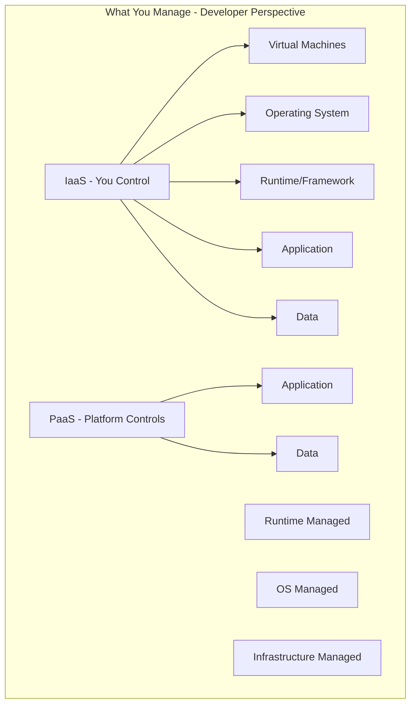
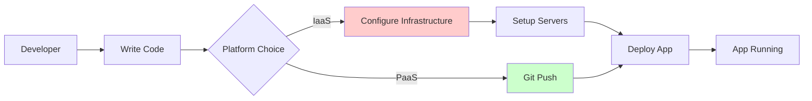
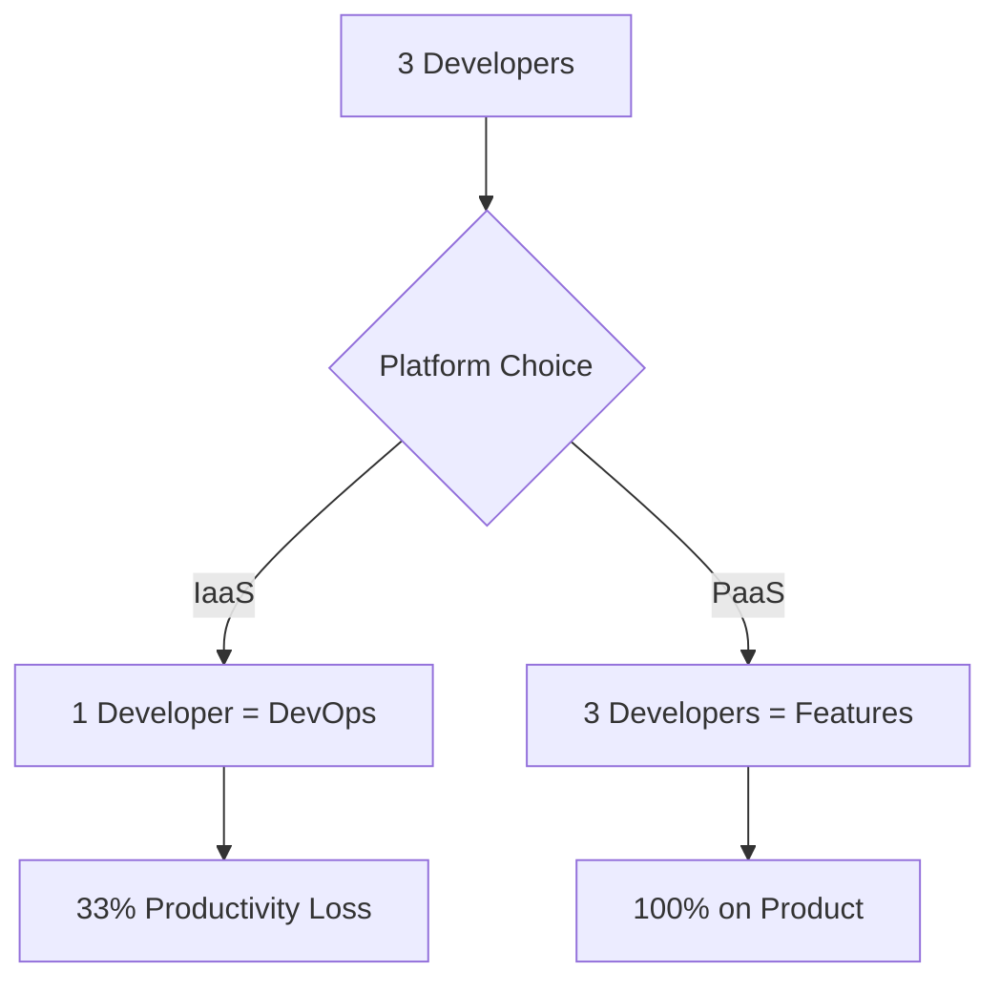
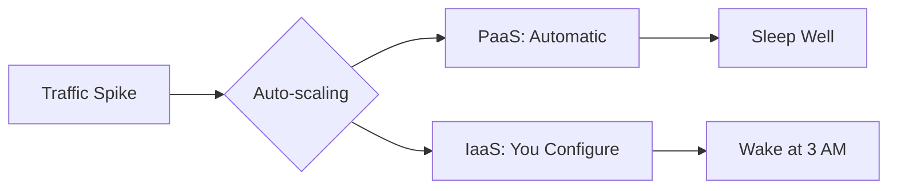
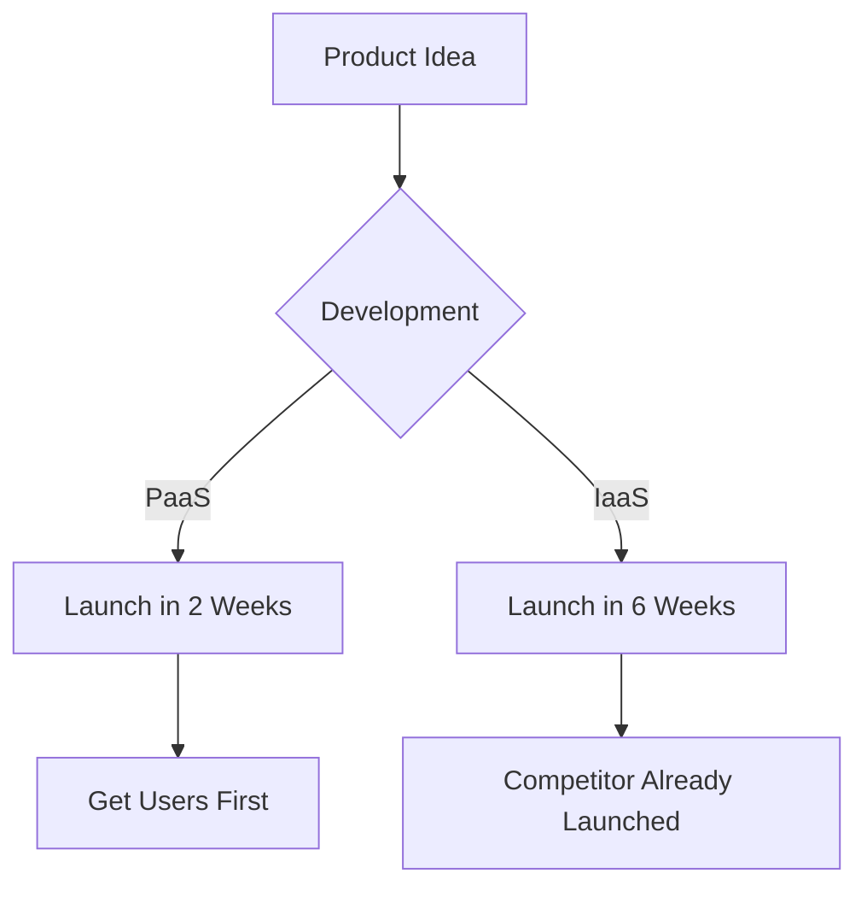
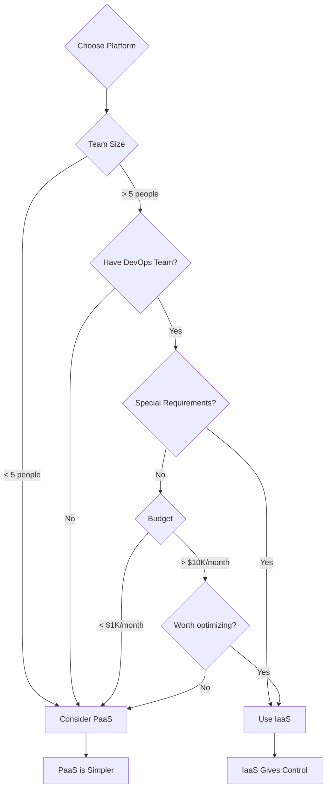
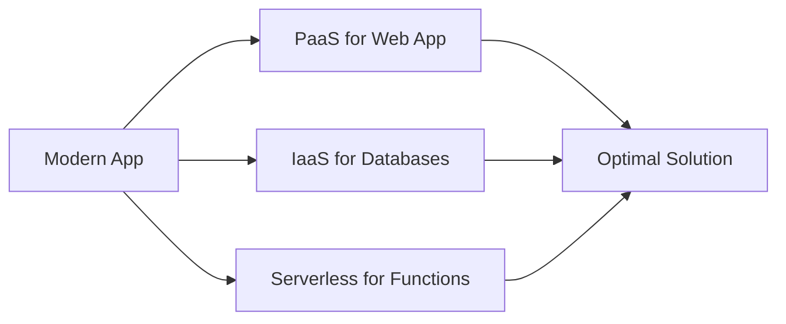

# IaaS vs. PaaS: When does the simplicity of Platform as a Service (PaaS) outweigh the granular control offered by Infrastructure as a Service (IaaS)? Discuss this from a developer's perspective.

## Introduction

As a developer, this is a question you'll face constantly: Do I want **control** or do I want **simplicity**? Let's explore when PaaS's simplicity wins over IaaS's control.

## Understanding the Difference



### IaaS Examples:
- AWS EC2
- Azure Virtual Machines
- Google Compute Engine
- DigitalOcean Droplets

### PaaS Examples:
- Heroku
- Google App Engine
- Azure App Service
- AWS Elastic Beanstalk
- Railway, Render, Fly.io

## The Developer's Perspective: A Day in the Life

### Scenario 1: Building a Web Application

**With IaaS (EC2):**
```bash
# Day 1: Setup hell
1. Launch EC2 instance
2. SSH into server
3. Install Node.js
4. Install nginx
5. Configure nginx as reverse proxy
6. Setup SSL certificates
7. Configure security groups
8. Setup auto-scaling groups
9. Configure load balancer
10. Setup monitoring
11. Configure backups
12. FINALLY deploy your app

Time: 2-3 days of DevOps work
```

**With PaaS (Heroku):**
```bash
# Day 1: Ship it!
git push heroku main

Time: 5 minutes
```



## When PaaS Simplicity Wins

### 1. **Rapid Prototyping & MVPs**

**Scenario:** You have a startup idea, need to validate it in 2 weeks.

**PaaS Wins** ✅
- Launch in hours, not days
- Focus on features, not infrastructure
- Cheap initially

**Example:** Building a task management app
- **With PaaS:** 2 weeks building features
- **With IaaS:** 3 days on infrastructure, 1.5 weeks on features

### 2. **Small Development Teams**

**Scenario:** 3-person startup, everyone codes the product.

**PaaS Wins** ✅



**Reality Check:**
- IaaS: Someone becomes the "infrastructure person" (not building product!)
- PaaS: Everyone focuses on user value

### 3. **Standard Tech Stacks**

**Scenario:** Building with popular frameworks (Node.js, Python Django, Ruby on Rails, Java Spring)

**PaaS Wins** ✅

PaaS is optimized for common patterns:
- Node.js + PostgreSQL
- Python + Redis
- Ruby + Sidekiq

**Example:** A blog platform with Node.js
- PaaS has buildpacks that detect your framework
- Auto-configures everything
- Just works™

### 4. **Variable/Unpredictable Traffic**

**Scenario:** Your app might get viral or might be quiet.

**PaaS Wins** ✅



- PaaS auto-scales seamlessly
- With IaaS, YOU setup auto-scaling (complex!)

### 5. **Junior/Mid-Level Developers**

**Scenario:** You're learning web development, don't know DevOps yet.

**PaaS Wins** ✅

**Learning Path:**
1. **Start:** PaaS (focus on coding)
2. **Later:** Learn IaaS (understand infrastructure)

Don't try to learn everything at once!

### 6. **Time-to-Market is Critical**

**Scenario:** Competitive market, first mover advantage matters.

**PaaS Wins** ✅



**Real Example:** Instagram started on AWS (IaaS) but early version was built FAST using simple stacks.

## When IaaS Control Wins

### 1. **Custom Infrastructure Requirements**

**Scenario:** You need specific OS configurations, custom kernels, or unusual setups.

**IaaS Wins** ✅

**Examples:**
- Machine learning with custom GPU drivers
- Real-time trading systems with microsecond latency
- Gaming servers with specific network configurations

### 2. **Cost Optimization at Scale**

**Scenario:** Your app is successful, spending $10K+/month.

**IaaS Wins** ✅

**Cost Comparison:**

| Users | PaaS (Heroku) | IaaS (EC2) | Savings |
|-------|---------------|------------|---------|
| 10K | $200/month | $150/month | 25% |
| 100K | $2,000/month | $800/month | 60% |
| 1M | $20,000/month | $5,000/month | 75% |

At scale, IaaS control lets you optimize costs significantly.

### 3. **Specific Compliance Needs**

**Scenario:** Healthcare app with HIPAA requirements for specific server configurations.

**IaaS Wins** ✅

You might need:
- Specific encryption methods
- Custom audit logging
- Dedicated hardware
- Special network isolation

### 4. **Legacy Systems Integration**

**Scenario:** Need to connect to old mainframes or specific protocols.

**IaaS Wins** ✅

PaaS is opinionated, might not support your specific needs.

### 5. **Performance-Critical Applications**

**Scenario:** High-frequency trading, real-time gaming, video processing.

**IaaS Wins** ✅

You need to:
- Tune kernel parameters
- Optimize network settings
- Control exact hardware
- Minimize overhead

## The Decision Framework



## My Developer Recommendation

**Use PaaS When:**
- ✅ Starting a new project
- ✅ Team < 10 developers
- ✅ Standard web application
- ✅ Budget < $5K/month
- ✅ Want to focus on product
- ✅ Need to ship fast
- ✅ Learning/junior developers

**Use IaaS When:**
- ✅ Specific technical requirements
- ✅ Scale justifies cost optimization
- ✅ Have dedicated DevOps team
- ✅ Performance is critical
- ✅ Compliance needs control
- ✅ Custom infrastructure needed

## The Modern Hybrid Approach

Many developers use BOTH:



**Example Architecture:**
- **Web app:** Heroku (PaaS) - simplicity
- **Database:** AWS RDS (managed IaaS) - performance
- **Background jobs:** AWS Lambda (Serverless) - cost-effective
- **CDN:** Cloudflare - global distribution

## Real-World Developer Journey

**Typical Evolution:**

1. **Month 1:** Deploy on Heroku (PaaS) - Get users!
2. **Month 6:** Still on Heroku - Growing, affordable
3. **Year 1:** $2K/month on Heroku - Consider optimization
4. **Year 2:** Move database to managed service, keep app on PaaS
5. **Year 3:** $10K/month - Finally migrate to IaaS
6. **Year 5:** Fully on IaaS, optimized infrastructure

**Lesson:** PaaS helped you focus on product when it mattered most!

## Conclusion

**PaaS simplicity outweighs IaaS control when:**

🎯 **Speed > Control**  
🎯 **Product > Infrastructure**  
🎯 **Simplicity > Optimization**  
🎯 **Learning > Expertise**  

As a developer, your job is to create value for users, not to become a server admin (unless you want to!). PaaS lets you focus on what matters: **building great software**.

Start with PaaS, graduate to IaaS when you've proven product-market fit and have the scale to justify it!

---

## Learning Resources

### Getting Started with PaaS
- [Heroku Dev Center](https://devcenter.heroku.com/) - Best PaaS documentation
- [Railway Docs](https://docs.railway.app/) - Modern PaaS platform
- [Render Documentation](https://render.com/docs) - Simple deployment platform
- [Fly.io Guides](https://fly.io/docs/) - Edge-focused PaaS

### IaaS Fundamentals
- [AWS EC2 Getting Started](https://aws.amazon.com/ec2/getting-started/) - IaaS basics
- [DigitalOcean Tutorials](https://www.digitalocean.com/community/tutorials) - Beginner-friendly IaaS
- [Linode Guides](https://www.linode.com/docs/) - Server configuration guides

### Comparison & Decision Making
- [IaaS vs PaaS: Developer Guide](https://www.cloudflare.com/learning/cloud/what-is-paas/) - Cloudflare explanation
- [Choosing Cloud Services](https://www.youtube.com/results?search_query=iaas+vs+paas+developer) - Video comparisons
- [When to Use What](https://www.redhat.com/en/topics/cloud-computing/iaas-vs-paas-vs-saas) - RedHat guide

### Hands-On Tutorials
- [Deploy Node.js on Heroku](https://devcenter.heroku.com/articles/getting-started-with-nodejs) - PaaS tutorial
- [Deploy on AWS EC2](https://aws.amazon.com/getting-started/hands-on/deploy-nodejs-web-app/) - IaaS tutorial
- [Full Stack Deployment Guide](https://www.freecodecamp.org/news/deployment-guide/) - Compare both approaches

### Cost Calculators
- [Heroku Pricing](https://www.heroku.com/pricing) - PaaS costs
- [AWS Pricing Calculator](https://calculator.aws/) - IaaS estimation
- [Cloud Cost Comparison](https://www.cloudorado.com/) - Compare providers

### Developer Communities
- [r/webdev](https://www.reddit.com/r/webdev/) - Deployment discussions
- [DEV Community](https://dev.to/t/deployment) - Developer experiences
- [Stack Overflow](https://stackoverflow.com/questions/tagged/deployment) - Practical questions

### Books
- "The Twelve-Factor App" by Heroku - PaaS best practices
- "Site Reliability Engineering" by Google - IaaS operations
- "Cloud Native DevOps with Kubernetes" - Modern approaches

### Blogs & Case Studies
- [Heroku Engineering Blog](https://blog.heroku.com/engineering) - PaaS insights
- [AWS Startups Blog](https://aws.amazon.com/blogs/startups/) - IaaS journeys
- [High Scalability](http://highscalability.com/) - Architecture decisions

### Free Tiers to Try
- [Heroku Free Tier](https://www.heroku.com/free) - Try PaaS
- [AWS Free Tier](https://aws.amazon.com/free/) - Try IaaS (12 months)
- [Railway Free Trial](https://railway.app/pricing) - Modern PaaS
- [DigitalOcean Credits](https://www.digitalocean.com/try/free-trial-offer) - Simple IaaS
