# The Race for Cloud Dominance: AWS vs. Azure vs. Google Cloud

## Introduction

Good morning everyone! Today I want to talk about the epic battle happening in the cloud computing world. Three tech giants - Amazon, Microsoft, and Google - are fighting for dominance. Let me tell you who's winning and which one you should choose.

## Understanding the Big Three

Let me introduce you to the three major players in this cloud race.

**First, we have AWS - Amazon Web Services.** Think of AWS as the pioneer who started it all back in 2006. They're like the first smartphone manufacturer - they had a massive head start and built the biggest ecosystem. AWS has the most services, the most customers, and the largest market share at around thirty-two percent.

**Second is Microsoft Azure.** They entered the game in 2010, and they had a smart strategy - target businesses already using Microsoft products. If your company uses Windows, Office 365, or Active Directory, Azure feels like home. They've captured about twenty-three percent of the market.

**Third is Google Cloud Platform, or GCP.** They launched in 2011 and took a different approach - focus on what Google does best: data analytics, machine learning, and innovation. They have about eleven percent market share but are growing fast.


*This diagram shows the current cloud market distribution: AWS leads with 32%, Azure follows with 23%, Google Cloud has 11%, and various other providers share the remaining 34%. This shows AWS's dominant position but also indicates healthy competition.*
- 🏆 Advanced networking

**Think of GCP as:** The cutting-edge boutique with the latest tech.

## Head-to-Head Comparison


### 1. **Compute Services**

**AWS EC2:**
- Most instance types
- Most regions
- Mature spot instances

**Azure VMs:**
- Easy Windows integration
- Hybrid benefits (use existing licenses)
- Good for .NET apps

**GCP Compute Engine:**
- Live migration (no downtime!)
- Sustained use discounts (automatic!)
- Custom machine types

**Winner:** AWS (maturity), GCP (innovation)

### 2. **AI & Machine Learning**

**AWS SageMaker:**
- Comprehensive ML platform
- Good integration with AWS services
- Large marketplace

**Azure ML:**
- Great for .NET developers
- Integration with Power BI
- Azure Cognitive Services

**Google Cloud AI:**
- 🏆 **CLEAR WINNER**
- TensorFlow native
- Best pre-trained models
- AutoML capabilities
- Google's AI expertise

**Example:** If you're building an image recognition app, GCP's Vision API is unmatched.

### 3. **Data Analytics**

**AWS:**
- Redshift (data warehouse)
- Athena (query S3 data)
- EMR (big data processing)

**Azure:**
- Synapse Analytics
- Data Lake
- Power BI integration

**Google Cloud:**
- 🏆 **WINNER**
- BigQuery (lightning fast!)
- Dataflow
- Built on Google's data infrastructure

**Example:** Analyzing petabytes of data? BigQuery is incredibly fast and cost-effective.

### 4. **Kubernetes & Containers**

**AWS EKS:**
- Solid Kubernetes service
- Good AWS integration

**Azure AKS:**
- Good Windows container support
- Integrated with Azure DevOps

**Google Cloud GKE:**
- 🏆 **WINNER**
- Kubernetes was born at Google!
- Best features, most mature
- Autopilot mode (managed completely)

### 5. **Pricing**

```mermaid
graph LR
    A[Pricing Models] --> B[AWS: Complex but flexible]
    A --> C[Azure: Enterprise discounts]
    A --> D[GCP: Automatic discounts]
    B --> E[Reserved instances]
    C --> F[Hybrid benefits]
    D --> G[Sustained use ⭐]
```

## Who's Best at What?

Now let me tell you where each cloud provider shines. This is important because there's no single "best" cloud - it depends on what you're building.

### AWS: The Jack of All Trades

AWS is like the massive department store that has everything. They have over two hundred services covering every possible use case. If you need something obscure or cutting-edge, AWS probably has it. Their biggest strength is maturity and breadth.

They also have the most global infrastructure - data centers in more regions than anyone else. So if you need to serve customers worldwide, AWS gives you the most options.

### Azure: The Enterprise Champion

Here's where Azure dominates - if your company already uses Microsoft products, Azure is a no-brainer. You get seamless integration with Windows Server, Active Directory, Office 365, and everything Microsoft. Plus, you can reuse your existing Windows licenses in the cloud, which saves massive amounts of money.

Azure also leads in hybrid cloud - connecting your on-premise systems with the cloud. Many large enterprises love this because they can't move everything to the cloud overnight.

### Google Cloud: The Innovation Leader

Google Cloud's superpower is data and AI. Think about it - Google processes more data than almost anyone on earth. They built amazing internal tools for search, maps, YouTube, and then made those available to us.

Their BigQuery service for analyzing huge datasets is incredibly fast. Their AI and machine learning services are the best in the industry. And Kubernetes, which everyone uses now, was created by Google.



*This diagram compares pricing approaches: AWS offers complex but flexible pricing with reserved instances for savings, Azure provides enterprise discounts and hybrid benefits for existing Microsoft customers, and Google Cloud stands out with automatic sustained use discounts that require no upfront commitment.*

## So Which One Should You Choose?

Here's my practical advice based on different scenarios.

**Choose AWS if you're a startup or building general applications.** Why? Because AWS has the biggest ecosystem - the most tutorials, the most developers who know it, the most third-party tools. When you're starting out, this community support is invaluable. Plus, AWS has services for everything you might need as you grow.

**Choose Azure if your company already uses Microsoft products.** This is straightforward - if you're using Windows Server, Office 365, or Active Directory, Azure integrates seamlessly. You'll save money with hybrid benefits and your IT team already knows the Microsoft way of doing things. Many large enterprises choose Azure for exactly this reason.

**Choose Google Cloud if you're working with data and AI.** If you're building machine learning models, analyzing big data, or running lots of containers, Google Cloud is the best. Their BigQuery can analyze terabytes of data in seconds. Their AI services are the most advanced. And since they invented Kubernetes, their container services are top-notch.


*This decision tree for AWS shows the ideal scenarios: startups benefit from the ecosystem, projects needing diverse services appreciate the breadth, and the large community means abundant learning resources and developer talent.*


*This Azure decision tree highlights when Microsoft's cloud makes sense: existing Microsoft infrastructure, enterprise environments, hybrid cloud requirements, and .NET development teams all point to Azure.*


*This Google Cloud decision tree shows its sweet spots: AI and machine learning projects, data-intensive analytics, Kubernetes-based architectures, and situations where simpler, more predictable pricing is valued.*  
✅ You need advanced data analytics  
✅ You're heavily using Kubernetes  
✅ You want cutting-edge technology  
✅ You prefer simpler pricing  

**Example Companies:** Spotify, Twitter, Snapchat

## The Emerging Multi-Cloud Reality


**Smart companies use:**
- Primary cloud for most services (80%)
- Other clouds for specific strengths (20%)

**Example:**
- Main infrastructure: AWS
- Machine learning: Google Cloud
- Enterprise apps: Azure

## My Prediction: Who Will Win?

**Short Term (2025-2027):**
- AWS maintains lead
- Azure grows in enterprise
- GCP grows in AI/data

**Long Term (2030+):**
- All three will coexist
- Specialization over domination
- Multi-cloud becomes normal

```mermaid
graph LR
    A[Future] --> B[AWS: General Purpose Leader]
    A --> C[Azure: Enterprise Cloud]
*This Google Cloud decision tree shows its sweet spots: AI and machine learning projects, data-intensive analytics, Kubernetes-based architectures, and situations where simpler, more predictable pricing is valued.*

## My Final Advice

Here's the truth - there's no single winner in this race. Each cloud provider excels in different areas, and the "best" choice depends entirely on your specific situation.

For most people just starting out, I'd recommend AWS simply because of the ecosystem. More tutorials, more jobs, more community support. It's the safe, default choice.

But remember this important point: the fundamental concepts are the same across all clouds. Virtual machines work the same whether you call them EC2, Azure VMs, or Compute Engine. Object storage is similar whether it's S3, Blob Storage, or Cloud Storage.

So don't stress too much about choosing "the perfect cloud." Pick one, learn it well, and understand the core concepts. Those skills transfer easily between platforms. Many companies actually use multiple clouds anyway - maybe AWS for most things, but Google Cloud for their data analytics.

The cloud wars benefit us - competition drives innovation and keeps prices down. So regardless of who wins the race, we all win. Thank you!

---

## Learning Resources

### Platform Comparisons
- [AWS vs Azure vs GCP Comparison](https://cloud.google.com/docs/compare/aws) - Google's official comparison
- [Azure vs AWS](https://docs.microsoft.com/en-us/azure/architecture/aws-professional/) - Microsoft's guide for AWS users
- [Cloud Services Comparison](https://comparecloud.in/) - Side-by-side comparison

### Getting Started Guides
- [AWS Getting Started](https://aws.amazon.com/getting-started/) - Official AWS tutorials
- [Azure Learn](https://docs.microsoft.com/en-us/learn/azure/) - Microsoft learning paths
- [Google Cloud Skills Boost](https://www.cloudskillsboost.google/) - GCP hands-on labs

### Free Tiers & Credits
- [AWS Free Tier](https://aws.amazon.com/free/) - 12 months free services
- [Azure Free Account](https://azure.microsoft.com/en-us/free/) - $200 credit
- [Google Cloud Free Tier](https://cloud.google.com/free) - $300 credit

### Certifications
- [AWS Certified Solutions Architect](https://aws.amazon.com/certification/certified-solutions-architect-associate/) - Industry standard
- [Azure Fundamentals](https://docs.microsoft.com/en-us/learn/certifications/azure-fundamentals/) - Entry level
- [Google Cloud Associate](https://cloud.google.com/certification/cloud-engineer) - Cloud Engineer

### YouTube Channels
- [AWS Online Tech Talks](https://www.youtube.com/user/AmazonWebServices) - Official AWS
- [Microsoft Azure](https://www.youtube.com/c/MicrosoftAzure) - Official Azure
- [Google Cloud Tech](https://www.youtube.com/user/googlecloudplatform) - Official GCP
- [A Cloud Guru](https://www.youtube.com/c/AcloudGuru) - Multi-cloud tutorials

### Pricing Calculators
- [AWS Pricing Calculator](https://calculator.aws/) - Estimate AWS costs
- [Azure Pricing Calculator](https://azure.microsoft.com/en-us/pricing/calculator/) - Estimate Azure costs
- [Google Cloud Pricing Calculator](https://cloud.google.com/products/calculator) - Estimate GCP costs

### Market Research
- [Gartner Magic Quadrant for Cloud](https://www.gartner.com/en/documents/4010391) - Industry analysis
- [Synergy Research](https://www.srgresearch.com/) - Market share data
- [Flexera State of Cloud Report](https://www.flexera.com/blog/cloud/cloud-computing-trends-2023/) - Annual trends

### Hands-On Practice
- [AWS Workshops](https://workshops.aws/) - Free hands-on workshops
- [Azure Sandbox](https://docs.microsoft.com/en-us/learn/modules/introduction-to-azure-virtual-machines/3-create-a-vm) - Interactive learning
- [Google Cloud Codelabs](https://codelabs.developers.google.com/cloud) - Step-by-step tutorials

### Books
- "AWS Certified Solutions Architect Study Guide" by Ben Piper
- "Microsoft Azure Architect Technologies and Design" by Exam Ref
- "Google Cloud Platform for Architects" by Vitthal Srinivasan

### Community & Forums
- [r/aws](https://www.reddit.com/r/aws/) - AWS community
- [r/AZURE](https://www.reddit.com/r/AZURE/) - Azure community
- [r/googlecloud](https://www.reddit.com/r/googlecloud/) - GCP community
- [Stack Overflow Cloud Tags](https://stackoverflow.com/questions/tagged/cloud) - Technical Q&A

### News & Blogs
- [AWS News Blog](https://aws.amazon.com/blogs/aws/) - Latest AWS updates
- [Azure Blog](https://azure.microsoft.com/en-us/blog/) - Azure announcements
- [Google Cloud Blog](https://cloud.google.com/blog) - GCP news
- [The Register Cloud](https://www.theregister.com/infrastructure/cloud/) - Independent analysis
