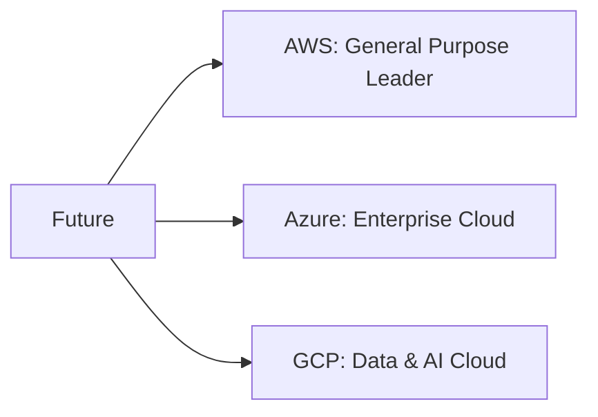

# The Race for Cloud Dominance: AWS vs. Azure vs. Google Cloud

## Introduction

Welcome to the ultimate cloud showdown! Three tech giants are battling for cloud supremacy. Let's break down who's winning, who's best for what, and what this means for you.

## The Current Market Landscape

## Meet the Contenders

### Amazon Web Services (AWS) - The Pioneer

**Launched:** 2006 (First major cloud provider!)

**Strengths:**
- 🏆 Most mature platform
- 🏆 Widest service catalog (200+ services)
- 🏆 Largest global infrastructure
- 🏆 Biggest ecosystem & community

**Think of AWS as:** The established supermarket with everything you could possibly need.

### Microsoft Azure - The Enterprise Favorite

**Launched:** 2010

**Strengths:**
- 🏆 Best Windows/.NET integration
- 🏆 Seamless Microsoft 365 integration
- 🏆 Hybrid cloud leader
- 🏆 Enterprise relationships

**Think of Azure as:** The business-friendly store with great corporate discounts.

### Google Cloud Platform (GCP) - The Innovator

**Launched:** 2011

**Strengths:**
- 🏆 Best AI/ML services
- 🏆 Superior data analytics
- 🏆 Kubernetes originated here
- 🏆 Advanced networking

**Think of GCP as:** The cutting-edge boutique with the latest tech.

## Head-to-Head Comparison

### 1. **Compute Services**

**AWS EC2:**
- Most instance types
- Most regions
- Mature spot instances

**Azure VMs:**
- Easy Windows integration
- Hybrid benefits (use existing licenses)
- Good for .NET apps

**GCP Compute Engine:**
- Live migration (no downtime!)
- Sustained use discounts (automatic!)
- Custom machine types

**Winner:** AWS (maturity), GCP (innovation)

### 2. **AI & Machine Learning**

**AWS SageMaker:**
- Comprehensive ML platform
- Good integration with AWS services
- Large marketplace

**Azure ML:**
- Great for .NET developers
- Integration with Power BI
- Azure Cognitive Services

**Google Cloud AI:**
- 🏆 **CLEAR WINNER**
- TensorFlow native
- Best pre-trained models
- AutoML capabilities
- Google's AI expertise

**Example:** If you're building an image recognition app, GCP's Vision API is unmatched.

### 3. **Data Analytics**

**AWS:**
- Redshift (data warehouse)
- Athena (query S3 data)
- EMR (big data processing)

**Azure:**
- Synapse Analytics
- Data Lake
- Power BI integration

**Google Cloud:**
- 🏆 **WINNER**
- BigQuery (lightning fast!)
- Dataflow
- Built on Google's data infrastructure

**Example:** Analyzing petabytes of data? BigQuery is incredibly fast and cost-effective.

### 4. **Kubernetes & Containers**

**AWS EKS:**
- Solid Kubernetes service
- Good AWS integration

**Azure AKS:**
- Good Windows container support
- Integrated with Azure DevOps

**Google Cloud GKE:**
- 🏆 **WINNER**
- Kubernetes was born at Google!
- Best features, most mature
- Autopilot mode (managed completely)

### 5. **Pricing**

```mermaid
graph LR
    A[Pricing Models] --> B[AWS: Complex but flexible]
    A --> C[Azure: Enterprise discounts]
    A --> D[GCP: Automatic discounts]
    B --> E[Reserved instances]
    C --> F[Hybrid benefits]
    D --> G[Sustained use ⭐]
```

**AWS:**
- Most complex pricing
- Reserved instances save up to 75%
- Spot instances for batch work

**Azure:**
- Enterprise Agreement discounts
- Hybrid benefit (huge savings for Windows!)
- Similar to AWS pricing

**Google Cloud:**
- 🏆 Simpler pricing
- Automatic sustained use discounts
- Committed use discounts
- Per-second billing

**Example:** Running a VM 24/7 on GCP automatically gets cheaper after first month (no setup needed!).

### 6. **Global Infrastructure**

**AWS:**
- 🏆 **WINNER** - 31 regions, 99 AZs
- Most countries covered
- Best CDN (CloudFront)

**Azure:**
- 60+ regions
- More regions than AWS
- Great for specific countries

**GCP:**
- 37 regions
- Best network performance
- Fewer regions but high quality

**Example:** Need presence in South America? AWS has more regions. Need blazing fast networking? GCP.

## Who Should Choose What?

### Choose AWS If:

✅ You're a startup (most tutorials assume AWS)  
✅ You need the widest range of services  
✅ You want the largest talent pool  
✅ You're building general-purpose applications  
✅ Global presence is critical  

**Example Companies:** Netflix, Airbnb, NASA

### Choose Azure If:

✅ You use Microsoft products (Office 365, Active Directory)  
✅ You're an enterprise with Microsoft licensing  
✅ You need hybrid cloud (on-premise + cloud)  
✅ You're a .NET shop  
✅ You want one vendor for everything  

**Example Companies:** BMW, Adobe, Samsung

### Choose Google Cloud If:

✅ You're building AI/ML applications  
✅ You need advanced data analytics  
✅ You're heavily using Kubernetes  
✅ You want cutting-edge technology  
✅ You prefer simpler pricing  

**Example Companies:** Spotify, Twitter, Snapchat

## The Emerging Multi-Cloud Reality

**Smart companies use:**
- Primary cloud for most services (80%)
- Other clouds for specific strengths (20%)

**Example:**
- Main infrastructure: AWS
- Machine learning: Google Cloud
- Enterprise apps: Azure

## My Prediction: Who Will Win?

**Short Term (2025-2027):**
- AWS maintains lead
- Azure grows in enterprise
- GCP grows in AI/data

**Long Term (2030+):**
- All three will coexist
- Specialization over domination
- Multi-cloud becomes normal

## My Recommendation

**For Beginners:** Start with AWS
- Most resources to learn
- Widest job market
- Default choice

**For Enterprises:** Azure
- Better licensing deals
- Hybrid cloud strength
- Microsoft integration

**For Data/AI:** Google Cloud
- Superior tools
- Simpler experience
- Innovation

**For Everyone:** Learn the concepts, not just one platform!
- Cloud principles are universal
- You'll likely use multiple clouds in your career
- Core services are similar across all three

---

## Learning Resources

### Platform Comparisons
- [AWS vs Azure vs GCP Comparison](https://cloud.google.com/docs/compare/aws) - Google's official comparison
- [Azure vs AWS](https://docs.microsoft.com/en-us/azure/architecture/aws-professional/) - Microsoft's guide for AWS users
- [Cloud Services Comparison](https://comparecloud.in/) - Side-by-side comparison

### Getting Started Guides
- [AWS Getting Started](https://aws.amazon.com/getting-started/) - Official AWS tutorials
- [Azure Learn](https://docs.microsoft.com/en-us/learn/azure/) - Microsoft learning paths
- [Google Cloud Skills Boost](https://www.cloudskillsboost.google/) - GCP hands-on labs

### Free Tiers & Credits
- [AWS Free Tier](https://aws.amazon.com/free/) - 12 months free services
- [Azure Free Account](https://azure.microsoft.com/en-us/free/) - $200 credit
- [Google Cloud Free Tier](https://cloud.google.com/free) - $300 credit

### Certifications
- [AWS Certified Solutions Architect](https://aws.amazon.com/certification/certified-solutions-architect-associate/) - Industry standard
- [Azure Fundamentals](https://docs.microsoft.com/en-us/learn/certifications/azure-fundamentals/) - Entry level
- [Google Cloud Associate](https://cloud.google.com/certification/cloud-engineer) - Cloud Engineer

### YouTube Channels
- [AWS Online Tech Talks](https://www.youtube.com/user/AmazonWebServices) - Official AWS
- [Microsoft Azure](https://www.youtube.com/c/MicrosoftAzure) - Official Azure
- [Google Cloud Tech](https://www.youtube.com/user/googlecloudplatform) - Official GCP
- [A Cloud Guru](https://www.youtube.com/c/AcloudGuru) - Multi-cloud tutorials

### Pricing Calculators
- [AWS Pricing Calculator](https://calculator.aws/) - Estimate AWS costs
- [Azure Pricing Calculator](https://azure.microsoft.com/en-us/pricing/calculator/) - Estimate Azure costs
- [Google Cloud Pricing Calculator](https://cloud.google.com/products/calculator) - Estimate GCP costs

### Market Research
- [Gartner Magic Quadrant for Cloud](https://www.gartner.com/en/documents/4010391) - Industry analysis
- [Synergy Research](https://www.srgresearch.com/) - Market share data
- [Flexera State of Cloud Report](https://www.flexera.com/blog/cloud/cloud-computing-trends-2023/) - Annual trends

### Hands-On Practice
- [AWS Workshops](https://workshops.aws/) - Free hands-on workshops
- [Azure Sandbox](https://docs.microsoft.com/en-us/learn/modules/introduction-to-azure-virtual-machines/3-create-a-vm) - Interactive learning
- [Google Cloud Codelabs](https://codelabs.developers.google.com/cloud) - Step-by-step tutorials

### Books
- "AWS Certified Solutions Architect Study Guide" by Ben Piper
- "Microsoft Azure Architect Technologies and Design" by Exam Ref
- "Google Cloud Platform for Architects" by Vitthal Srinivasan

### Community & Forums
- [r/aws](https://www.reddit.com/r/aws/) - AWS community
- [r/AZURE](https://www.reddit.com/r/AZURE/) - Azure community
- [r/googlecloud](https://www.reddit.com/r/googlecloud/) - GCP community
- [Stack Overflow Cloud Tags](https://stackoverflow.com/questions/tagged/cloud) - Technical Q&A

### News & Blogs
- [AWS News Blog](https://aws.amazon.com/blogs/aws/) - Latest AWS updates
- [Azure Blog](https://azure.microsoft.com/en-us/blog/) - Azure announcements
- [Google Cloud Blog](https://cloud.google.com/blog) - GCP news
- [The Register Cloud](https://www.theregister.com/infrastructure/cloud/) - Independent analysis
