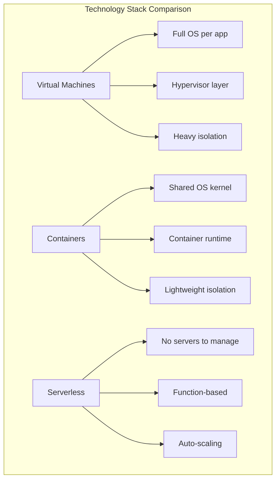
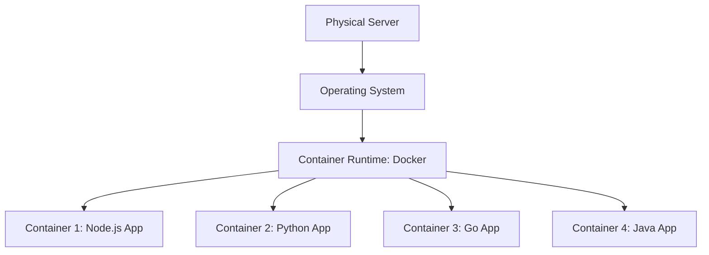
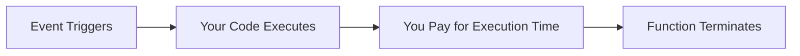

# Virtual Machines vs. Containers vs. Serverless: The definitive choice for modern applications

## Introduction

Good morning everyone! Today I want to answer one of the most common questions in modern application development: Should I use virtual machines, containers, or serverless? Let me help you understand when to use each one.

## Understanding the Three Technologies

Think of these three technologies as different ways to run your application, each with its own trade-offs.

**Virtual Machines** are like renting entire apartments. Each apartment has its own kitchen, bathroom, utilities - everything is separate and isolated. You get complete control, but it's heavy and resource-intensive.

**Containers** are like staying in a hostel. Everyone shares the building's infrastructure and utilities, but you still have your own private room. It's lighter, more efficient, and you can fit more people in the same building.

**Serverless** is like ordering room service. You don't think about the building, the rooms, or the infrastructure. You just say what you want, it gets done, and you pay only for what you consume.

*This diagram compares the three technologies: VMs run a full operating system per application with a hypervisor layer providing heavy isolation; Containers share the OS kernel with a container runtime providing lighter isolation; Serverless abstracts away all infrastructure, is function-based, and auto-scales automatically.*

*This diagram compares the three technologies: VMs run a full operating system per application with a hypervisor layer providing heavy isolation; Containers share the OS kernel with a container runtime providing lighter isolation; Serverless abstracts away all infrastructure, is function-based, and auto-scales automatically.*

## When to Use Each Technology

Let me give you clear guidance on when each technology makes sense.

**Use Virtual Machines when you need complete control** - like when you're running legacy software that requires a specific operating system version, or when you have strict security requirements that demand total isolation. Banks often use VMs for their core systems because they need that ironclad separation.

**Use Containers when you're building modern applications** - especially if you're doing microservices. Containers are perfect when you want your app to run exactly the same way on your laptop, test server, and production. Companies like Netflix use containers because they can deploy updates rapidly and scale individual services independently.

**Use Serverless when you have unpredictable or event-driven workloads** - like processing uploaded images, sending emails, or handling API requests that come in bursts. You pay only when your code runs, so if nothing's happening, you pay nothing. Startups love this because it's incredibly cost-effective when you're starting out.

*This diagram shows how containers work: a single physical server runs one operating system, which hosts Docker (the container runtime). On top of that, you can run multiple containers - Node.js, Python, Go, Java apps - all sharing the same OS kernel but completely isolated from each other. This is much more efficient than running separate VMs.*

*This diagram illustrates the serverless model: an event (like a file upload) triggers your code, your function executes, you pay only for that execution time, and then the function terminates. No servers running when idle, no wasted resources.*

## The Modern Reality

Here's the truth most companies don't use just one - they use all three! You might run your database on a VM for stability, your main application in containers for flexibility, and your background jobs as serverless functions for cost efficiency.

For example, a typical e-commerce site might use VMs for their database that runs twenty-four seven, containers for their web application that needs to scale up and down, and serverless functions to process order confirmations and send emails.

## My Final Advice

If I had to give you a simple recommendation: Start with containers for most modern applications. They're the sweet spot between control and convenience. You get portability, efficiency, and they work great for most use cases.

Use serverless for specific tasks that are event-driven or unpredictable. Use VMs only when you truly need that level of control or isolation.

But remember, there's no single "definitive choice" - the best technology depends on what you're building. Understanding when to use each one is what makes you a skilled architect. Thank you!

---

## Learning Resources

### Virtual Machines
- [Virtualization Basics](https://www.vmware.com/topics/glossary/content/virtual-machine.html) - VMware guide
- [AWS EC2 Tutorial](https://aws.amazon.com/ec2/getting-started/) - VM basics
- [KVM Virtualization](https://www.linux-kvm.org/page/Documents) - Open-source hypervisor

### Containers & Docker
- [Docker Getting Started](https://docs.docker.com/get-started/) - Official Docker tutorial
- [Play with Docker](https://labs.play-with-docker.com/) - Free hands-on lab
- [Docker Curriculum](https://docker-curriculum.com/) - Beginner-friendly guide
- [Kubernetes Basics](https://kubernetes.io/docs/tutorials/kubernetes-basics/) - Official K8s tutorial

### Serverless
- [AWS Lambda Getting Started](https://aws.amazon.com/lambda/getting-started/) - Serverless basics
- [Serverless Framework](https://www.serverless.com/framework/docs/) - Multi-cloud serverless
- [Azure Functions Tutorial](https://docs.microsoft.com/en-us/azure/azure-functions/) - Microsoft serverless
- [Serverless Patterns](https://serverlessland.com/patterns) - Real-world patterns

### Comparison Resources
- [VMs vs Containers vs Serverless](https://www.youtube.com/results?search_query=vms+vs+containers+vs+serverless) - Video explanations
- [Cloud Native Computing Foundation](https://www.cncf.io/) - Container ecosystem
- [Serverless Computing Study](https://www2.eecs.berkeley.edu/Pubs/TechRpts/2019/EECS-2019-3.pdf) - Academic paper

### Hands-On Practice
- [Docker Labs](https://dockerlabs.collabnix.com/) - Free Docker exercises
- [Kubernetes by Example](http://kubernetesbyexample.com/) - Learn by doing
- [AWS Serverless Workshops](https://aws.amazon.com/serverless/workshops/) - Build serverless apps
- [Katacoda](https://www.katacoda.com/) - Interactive scenarios (all three!)

### Books
- "Docker Deep Dive" by Nigel Poulton
- "Kubernetes in Action" by Marko Lukša
- "Serverless Architectures on AWS" by Peter Sbarski
- "The Docker Book" by James Turnbull

### YouTube Channels
- [TechWorld with Nana](https://www.youtube.com/c/TechWorldwithNana) - DevOps & containers
- [Fireship](https://www.youtube.com/c/Fireship) - Quick tech comparisons
- [AWS Online Tech Talks](https://www.youtube.com/user/AmazonWebServices) - Serverless sessions

### Community & Forums
- [r/docker](https://www.reddit.com/r/docker/) - Docker community
- [r/kubernetes](https://www.reddit.com/r/kubernetes/) - K8s discussions
- [Serverless Stack](https://serverless-stack.com/) - Serverless community
- [CNCF Slack](https://cloud-native.slack.com/) - Cloud-native community

### Certifications
- [Docker Certified Associate](https://training.mirantis.com/certification/dca-certification-exam/) - Docker certification
- [CKA: Certified Kubernetes Administrator](https://www.cncf.io/certification/cka/) - K8s cert
- [AWS Certified Developer](https://aws.amazon.com/certification/certified-developer-associate/) - Includes serverless

### Architecture Patterns
- [Microservices Patterns](https://microservices.io/patterns/index.html) - Container patterns
- [AWS Serverless Patterns](https://serverlessland.com/) - Event-driven architectures
- [12-Factor App](https://12factor.net/) - Cloud-native principles

### Cost Calculators
- [Container vs VM Cost](https://www.cloudzero.com/blog/kubernetes-cost) - Cost comparison
- [Serverless Cost Calculator](https://dashbird.io/lambda-cost-calculator/) - Lambda pricing
- [VM Pricing](https://instances.vantage.sh/) - Compare VM costs
