# Virtual Machines vs. Containers vs. Serverless: The definitive choice for modern applications

## Introduction

This is THE debate in modern application architecture! Are VMs outdated? Are containers the answer? Is serverless the future? Let's break it all down.

## Understanding Each Technology

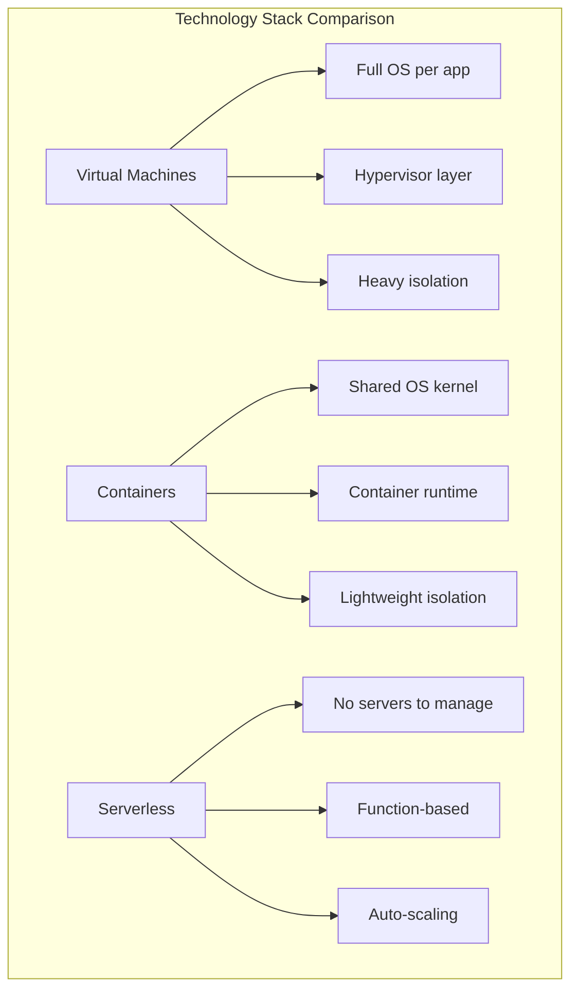

## Visual Comparison

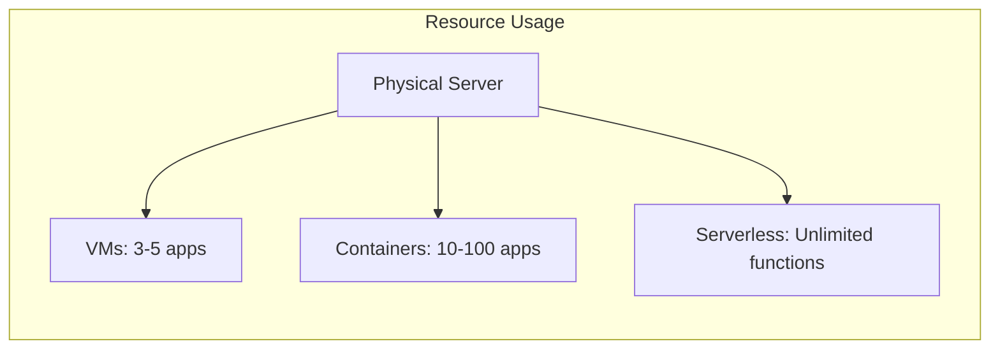

## Virtual Machines: The Traditional Approach

### What Are VMs?

Think of VMs like **separate apartments in a building**. Each apartment has:
- Its own utilities
- Own furniture
- Complete privacy
- Own operating system

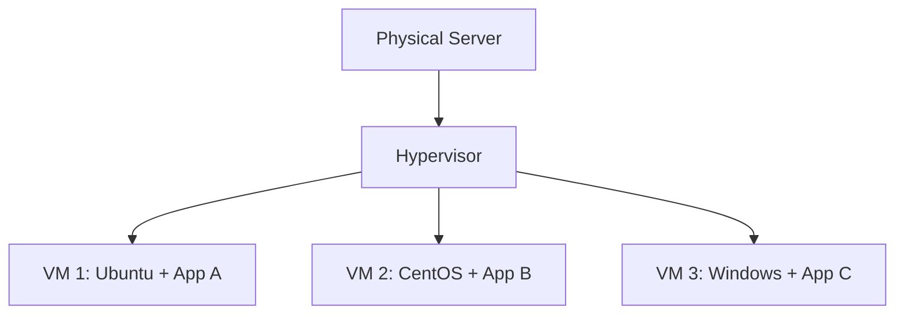

### When to Use VMs

✅ **Legacy applications** that need specific OS versions  
✅ **Strong isolation** requirements (security-critical)  
✅ **Mixed operating systems** (Windows + Linux)  
✅ **Long-running applications** (always on)  
✅ **Lift-and-shift migrations** from physical servers  

### VM Examples

**AWS:** EC2 instances  
**Azure:** Virtual Machines  
**GCP:** Compute Engine  

**Real-World Example:** A bank running a legacy Java application requiring specific Linux kernel version.

### Pros & Cons

**Pros:**
- 🟢 Strong isolation
- 🟢 Complete OS control
- 🟢 Run any software
- 🟢 Proven, stable technology

**Cons:**
- 🔴 Heavy resource usage (GB of RAM per VM)
- 🔴 Slow startup (minutes)
- 🔴 Manual scaling
- 🔴 OS maintenance overhead

## Containers: The Modern Standard

### What Are Containers?

Containers are like **rooms in a hostel**. Everyone shares:
- The building infrastructure
- Utilities
- But has their own private space

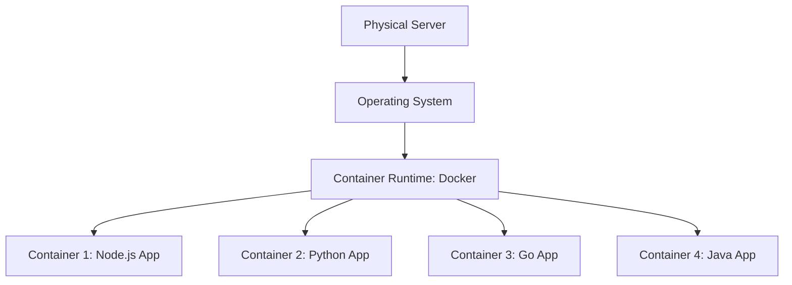

### When to Use Containers

✅ **Microservices architecture**  
✅ **Consistent dev-to-prod environments**  
✅ **Need portability** (run anywhere)  
✅ **Rapid scaling** required  
✅ **CI/CD pipelines**  
✅ **Cloud-native applications**  

### Container Examples

**Docker:** Container runtime  
**Kubernetes:** Container orchestration  
**AWS ECS/EKS:** Managed container services  

**Real-World Example:** Netflix runs 1000+ microservices in containers, allowing rapid deployment and scaling.

### The Container Advantage

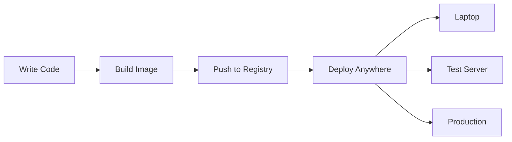

**"It works on my machine" → "Then we'll ship your machine!"**

### Pros & Cons

**Pros:**
- 🟢 Lightweight (MB, not GB)
- 🟢 Fast startup (seconds)
- 🟢 Portable across environments
- 🟢 Efficient resource usage
- 🟢 Perfect for microservices
- 🟢 Easy scaling

**Cons:**
- 🔴 Learning curve (Docker, Kubernetes)
- 🔴 Same OS kernel (all Linux or all Windows)
- 🔴 Security concerns (shared kernel)
- 🔴 Requires orchestration at scale

## Serverless: The Future?

### What Is Serverless?

Serverless is like **ordering food delivery**. You don't care about:
- The kitchen
- The chef's tools
- How it's cooked

You just get **your function executed**!

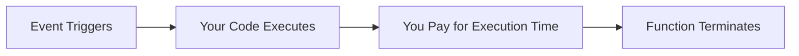

### When to Use Serverless

✅ **Event-driven applications** (file upload, API call)  
✅ **Unpredictable traffic** (0 to 1000 users randomly)  
✅ **Background jobs** (image processing, email sending)  
✅ **APIs with variable load**  
✅ **Cost optimization** (pay per use)  
✅ **Rapid prototyping**  

### Serverless Examples

**AWS Lambda:** Run code without servers  
**Azure Functions:** Microsoft's serverless  
**Google Cloud Functions:** GCP serverless  
**Vercel/Netlify:** Frontend serverless  

**Real-World Example:** Airbnb uses Lambda to process images uploaded by hosts - runs only when needed, scales automatically.

### Serverless Architecture

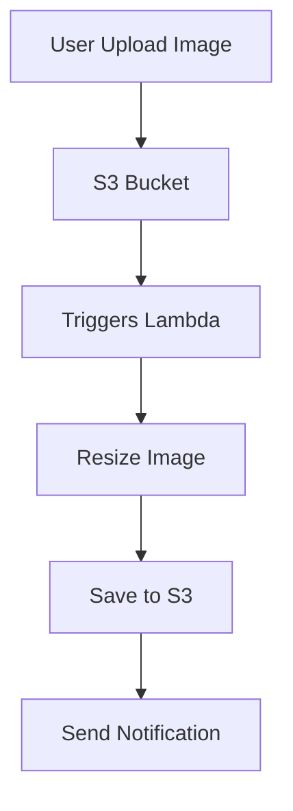

### Pros & Cons

**Pros:**
- 🟢 Zero server management
- 🟢 Auto-scaling (infinite!)
- 🟢 Pay only for execution
- 🟢 Perfect for sporadic workloads
- 🟢 Fastest time-to-market
- 🟢 Built-in high availability

**Cons:**
- 🔴 Cold starts (latency)
- 🔴 Execution time limits (15 min on Lambda)
- 🔴 Vendor lock-in
- 🔴 Debugging is harder
- 🔴 Not good for long-running tasks
- 🔴 Can be expensive at high scale

## The Definitive Comparison

| Factor | VMs | Containers | Serverless |
|--------|-----|------------|------------|
| **Startup Time** | Minutes | Seconds | Milliseconds |
| **Resource Usage** | GBs | MBs | KBs |
| **Scaling** | Manual | Auto (with setup) | Instant Auto |
| **Cost** | Always running | Running containers | Per execution |
| **Management** | You manage all | You manage apps | Provider manages |
| **Isolation** | ⭐⭐⭐⭐⭐ | ⭐⭐⭐ | ⭐⭐⭐⭐ |
| **Portability** | ⭐⭐ | ⭐⭐⭐⭐⭐ | ⭐⭐ |
| **Best For** | Legacy apps | Microservices | Event-driven |

## Real-World Use Cases

### Use VMs When:

🏦 **Banking System**
- Needs specific OS version
- Strong isolation required
- Predictable, always-on workload
- Compliance requirements

### Use Containers When:

🛒 **E-commerce Platform**
- Microservices architecture
- Need rapid deployments
- Scale different services independently
- Development team uses CI/CD

**Example Architecture:**
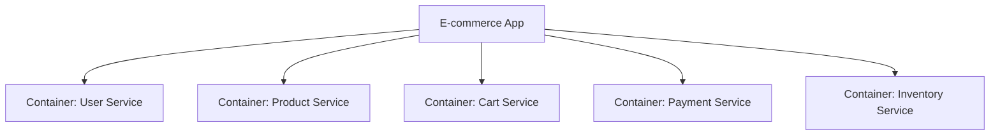

### Use Serverless When:

📸 **Photo Sharing App**
- Image processing on upload
- Unpredictable traffic
- Background tasks
- Cost optimization critical

**Example Flow:**
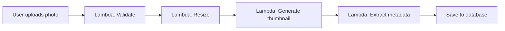

## The Modern Hybrid Approach

**Most companies don't choose ONE - they use ALL THREE!**

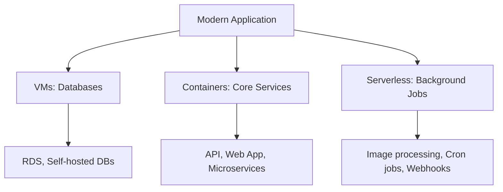

### Example: A Social Media Platform

**Virtual Machines:**
- Primary PostgreSQL database
- Redis cache cluster
- Legacy admin panel

**Containers (Kubernetes):**
- User service (authentication)
- Post service (create/read posts)
- Feed service (generate timeline)
- Notification service
- API gateway

**Serverless (Lambda):**
- Image resizing on upload
- Video transcoding
- Email notifications
- Analytics processing
- Scheduled cleanup jobs

## My Recommendation: The Decision Tree

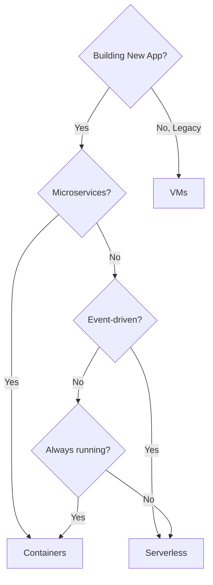

**Quick Decision Guide:**

1. **Migrating legacy?** → VMs
2. **Building new microservices?** → Containers
3. **Event-driven/Background jobs?** → Serverless
4. **Startup/MVP?** → Serverless (fastest)
5. **Scaling enterprise app?** → Containers
6. **Need OS-level control?** → VMs

## The Future: Where Are We Heading?

**My Prediction:**

📊 **2024-2025:**
- Containers dominate new applications (60%)
- Serverless grows rapidly (25%)
- VMs for legacy/specialized (15%)

📊 **2028-2030:**
- Containers remain standard (50%)
- Serverless becomes default for new apps (40%)
- VMs for niche use cases (10%)

**Emerging trend:** **WebAssembly (Wasm)** might disrupt all three!

## Conclusion: The Definitive Choice?

**There is NO single "definitive choice"!**

The right choice depends on:
- ✅ Your application architecture
- ✅ Team expertise
- ✅ Scalability requirements
- ✅ Budget constraints
- ✅ Time-to-market needs

**For MOST modern applications:**
🏆 **Containers are the sweet spot** - flexibility + efficiency + portability

**But smart architects use all three where each makes sense!**

---

## Learning Resources

### Virtual Machines
- [Virtualization Basics](https://www.vmware.com/topics/glossary/content/virtual-machine.html) - VMware guide
- [AWS EC2 Tutorial](https://aws.amazon.com/ec2/getting-started/) - VM basics
- [KVM Virtualization](https://www.linux-kvm.org/page/Documents) - Open-source hypervisor

### Containers & Docker
- [Docker Getting Started](https://docs.docker.com/get-started/) - Official Docker tutorial
- [Play with Docker](https://labs.play-with-docker.com/) - Free hands-on lab
- [Docker Curriculum](https://docker-curriculum.com/) - Beginner-friendly guide
- [Kubernetes Basics](https://kubernetes.io/docs/tutorials/kubernetes-basics/) - Official K8s tutorial

### Serverless
- [AWS Lambda Getting Started](https://aws.amazon.com/lambda/getting-started/) - Serverless basics
- [Serverless Framework](https://www.serverless.com/framework/docs/) - Multi-cloud serverless
- [Azure Functions Tutorial](https://docs.microsoft.com/en-us/azure/azure-functions/) - Microsoft serverless
- [Serverless Patterns](https://serverlessland.com/patterns) - Real-world patterns

### Comparison Resources
- [VMs vs Containers vs Serverless](https://www.youtube.com/results?search_query=vms+vs+containers+vs+serverless) - Video explanations
- [Cloud Native Computing Foundation](https://www.cncf.io/) - Container ecosystem
- [Serverless Computing Study](https://www2.eecs.berkeley.edu/Pubs/TechRpts/2019/EECS-2019-3.pdf) - Academic paper

### Hands-On Practice
- [Docker Labs](https://dockerlabs.collabnix.com/) - Free Docker exercises
- [Kubernetes by Example](http://kubernetesbyexample.com/) - Learn by doing
- [AWS Serverless Workshops](https://aws.amazon.com/serverless/workshops/) - Build serverless apps
- [Katacoda](https://www.katacoda.com/) - Interactive scenarios (all three!)

### Books
- "Docker Deep Dive" by Nigel Poulton
- "Kubernetes in Action" by Marko Lukša
- "Serverless Architectures on AWS" by Peter Sbarski
- "The Docker Book" by James Turnbull

### YouTube Channels
- [TechWorld with Nana](https://www.youtube.com/c/TechWorldwithNana) - DevOps & containers
- [Fireship](https://www.youtube.com/c/Fireship) - Quick tech comparisons
- [AWS Online Tech Talks](https://www.youtube.com/user/AmazonWebServices) - Serverless sessions

### Community & Forums
- [r/docker](https://www.reddit.com/r/docker/) - Docker community
- [r/kubernetes](https://www.reddit.com/r/kubernetes/) - K8s discussions
- [Serverless Stack](https://serverless-stack.com/) - Serverless community
- [CNCF Slack](https://cloud-native.slack.com/) - Cloud-native community

### Certifications
- [Docker Certified Associate](https://training.mirantis.com/certification/dca-certification-exam/) - Docker certification
- [CKA: Certified Kubernetes Administrator](https://www.cncf.io/certification/cka/) - K8s cert
- [AWS Certified Developer](https://aws.amazon.com/certification/certified-developer-associate/) - Includes serverless

### Architecture Patterns
- [Microservices Patterns](https://microservices.io/patterns/index.html) - Container patterns
- [AWS Serverless Patterns](https://serverlessland.com/) - Event-driven architectures
- [12-Factor App](https://12factor.net/) - Cloud-native principles

### Cost Calculators
- [Container vs VM Cost](https://www.cloudzero.com/blog/kubernetes-cost) - Cost comparison
- [Serverless Cost Calculator](https://dashbird.io/lambda-cost-calculator/) - Lambda pricing
- [VM Pricing](https://instances.vantage.sh/) - Compare VM costs
