# The Importance of a Content Delivery Network (CDN) in Global E-commerce

## Introduction

Imagine you're running an online store in Mumbai, and a customer in New York tries to browse your products. Without a CDN, they might wait 5 seconds for each page to load. With a CDN? Less than 1 second! Let's explore why CDNs are essential for e-commerce.

## What is a Content Delivery Network (CDN)?

A CDN is a network of servers distributed globally that cache and deliver your content from the location closest to your users.

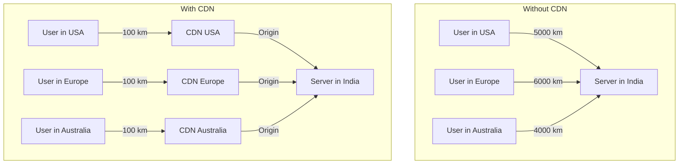

## How CDN Works: The Pizza Delivery Analogy

**Without CDN:**
- You have ONE pizza shop in Mumbai
- Customer in New York orders pizza
- Pizza travels 12,000+ km (cold pizza, long wait!)

**With CDN:**
- You have pizza shops in EVERY city
- Customer in New York orders
- Nearest shop (100m away) delivers
- Hot, fresh pizza in minutes!

## Cloud Networking Components for E-commerce

### 1. Virtual Private Cloud (VPC)

Your **private network** in the cloud. Like having your own gated community!

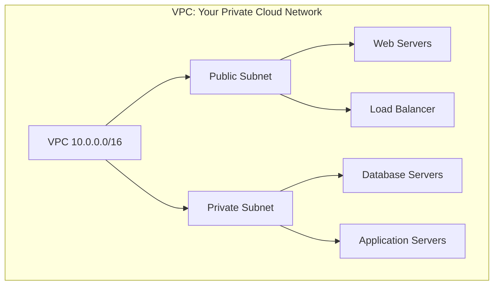

**E-commerce Use:**
- Isolate your infrastructure
- Control network traffic
- Secure sensitive data

**Example:** Your payment processing servers in private subnet (hidden from internet), web servers in public subnet (accessible to users).

### 2. Load Balancers

Distribute traffic across multiple servers. Think of it as **multiple checkout counters** in a supermarket!

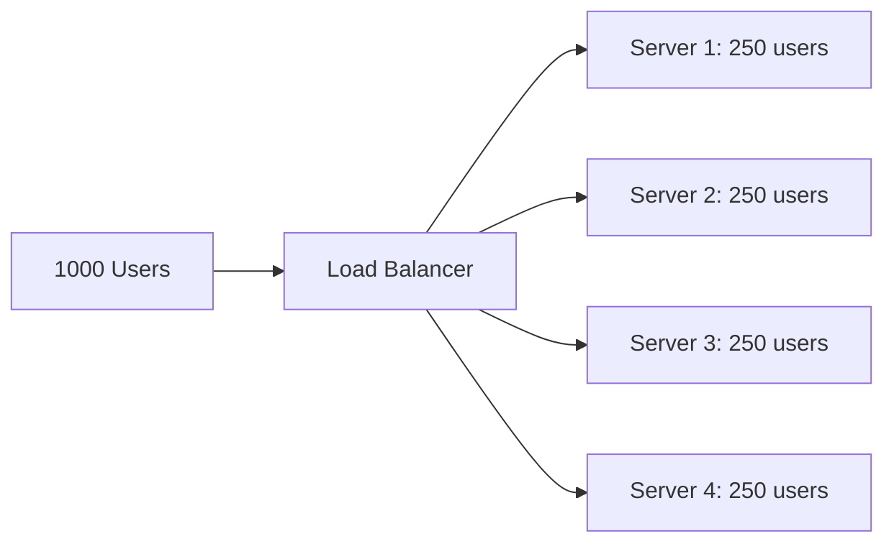

**Types:**
- **Application Load Balancer (ALB):** HTTP/HTTPS traffic
- **Network Load Balancer (NLB):** Ultra-high performance
- **Global Load Balancer:** Route users to nearest region

**E-commerce Scenario:**
- Black Friday: 100,000 concurrent users
- Load balancer distributes across 50 servers
- Each handles 2,000 users
- No single point of failure!

### 3. DNS (Domain Name System)

The **phonebook of the internet**. Translates `amazon.com` to `52.94.236.248`.

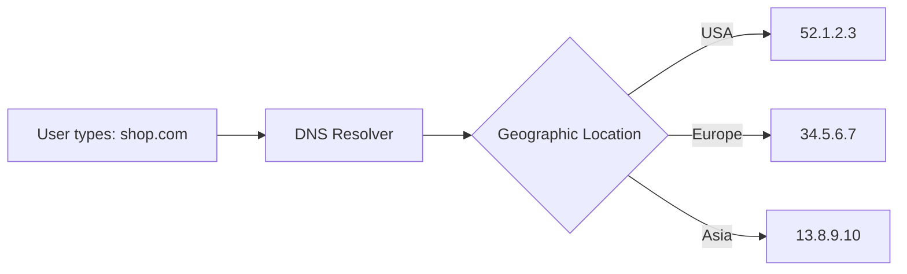

**Smart DNS for E-commerce:**
- **Geolocation routing:** Send users to nearest server
- **Failover routing:** Switch to backup if main fails
- **Weighted routing:** A/B testing different versions

**Example:** Amazon uses Route 53 to route millions of users to optimal endpoints every second.

### 4. CDN (Content Delivery Network)

Now, let's dive deep into CDN!

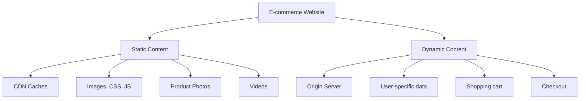

## Why CDN is CRITICAL for E-commerce

### 1. Speed = Revenue

**The Data:**
- 1 second delay = 7% reduction in conversions
- 100ms faster = 1% more revenue
- 53% of mobile users abandon sites that take > 3 seconds

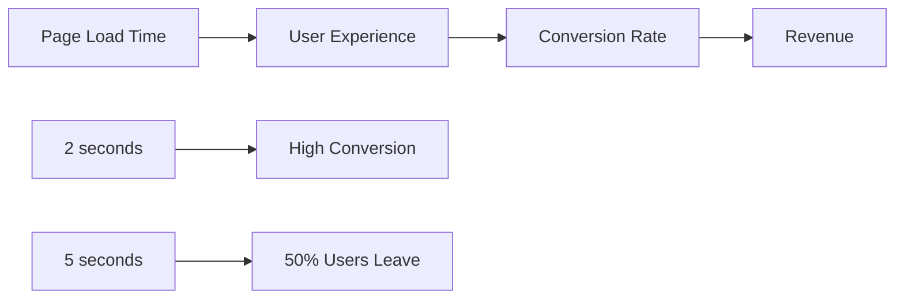

**Real Example:**
- Walmart: 1 second improvement = 2% increase in conversions
- Amazon: 100ms faster = $1.6B in annual sales

### 2. Global Reach

Without CDN, customers far from your servers suffer!

**Latency Comparison:**

| User Location | Without CDN | With CDN | Improvement |
|---------------|-------------|----------|-------------|
| Same Country | 50ms | 50ms | 0% |
| Neighboring Country | 200ms | 80ms | 60% faster |
| Different Continent | 500ms | 100ms | 80% faster |
| Remote Region | 1000ms | 150ms | 85% faster |

### 3. Reduced Server Load

CDN caches static content (images, CSS, JS), reducing load on your servers by 60-80%!

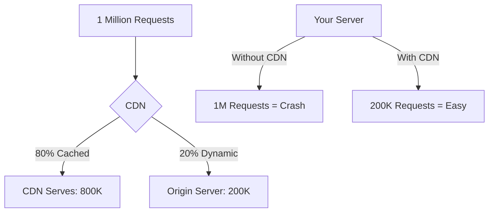

**Cost Savings:**
- Serve 5x more users with same infrastructure
- Reduce server costs by 60%

### 4. Security & DDoS Protection

CDNs like Cloudflare protect against attacks!

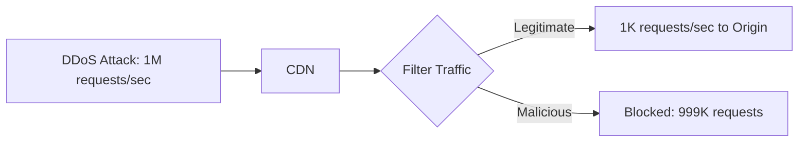

**Security Features:**
- DDoS mitigation
- Web Application Firewall (WAF)
- SSL/TLS encryption
- Bot protection

### 5. Reliability & Uptime

If your origin server goes down, CDN can serve cached content!

**Example:** Your server crashes during Black Friday, but product pages still load from CDN (just can't checkout temporarily).

## Real E-commerce CDN Architecture

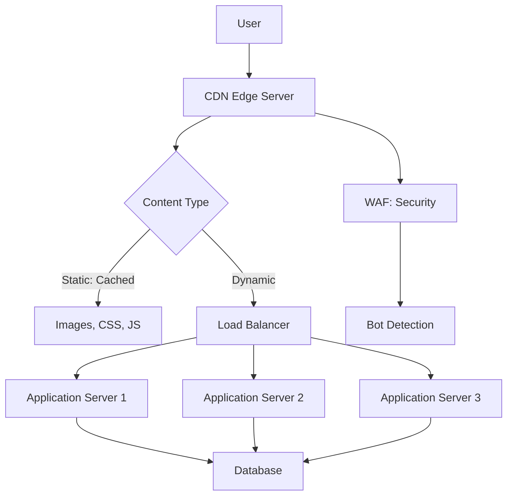

## Popular CDN Providers

### Cloudflare
- ✅ Free tier available
- ✅ Best DDoS protection
- ✅ Easy setup
- ✅ 200+ locations
- **Best for:** Small to medium e-commerce

### AWS CloudFront
- ✅ Integrates with AWS services
- ✅ Pay-as-you-go
- ✅ 450+ edge locations
- **Best for:** AWS-based infrastructure

### Akamai
- ✅ Enterprise-grade
- ✅ Most mature CDN
- ✅ Used by giants (Apple, Microsoft)
- **Best for:** Large enterprises

### Fastly
- ✅ Real-time purging
- ✅ Instant configuration updates
- ✅ Developer-friendly
- **Best for:** Tech-savvy teams

## Complete E-commerce Network Architecture

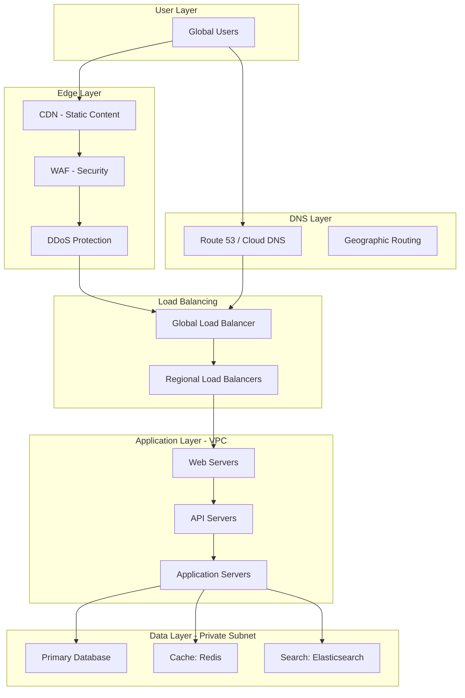

## CDN Best Practices for E-commerce

### 1. Cache Everything Possible

**Cache:**
- ✅ Product images
- ✅ CSS/JavaScript files
- ✅ Product catalog pages
- ✅ Static HTML
- ✅ Videos

**Don't Cache:**
- ❌ Shopping cart
- ❌ Checkout pages
- ❌ User account data
- ❌ Inventory status (real-time)

### 2. Set Appropriate TTL (Time To Live)

```
Product Images: 1 year (rarely change)
CSS/JS: 1 week (version in filename)
Product Pages: 1 hour (prices may change)
Homepage: 5 minutes (frequently updated)
```

### 3. Use Smart Invalidation

When you update product price, invalidate only that product's cache!

### 4. Implement Image Optimization

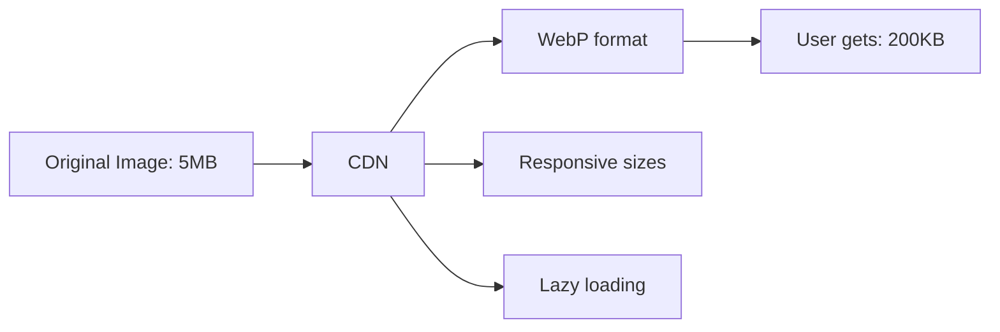

## Measuring CDN Impact

### Key Metrics:

**Cache Hit Ratio:**
- Good: > 80%
- Excellent: > 90%
- Means 90% of requests served from CDN (not origin)

**Time to First Byte (TTFB):**
- Without CDN: 500ms
- With CDN: 50ms
- **90% improvement!**

**Bandwidth Savings:**
- Typical: 60-70% reduction in origin bandwidth

## Real-World Example: Shopify

**Shopify's CDN Strategy:**
- Uses Fastly CDN
- 200+ edge locations
- Serves billions of requests/day
- 99.99% uptime
- Average page load: 1.2 seconds globally

**Result:** Merchants can sell globally without worrying about speed!

## Cost-Benefit Analysis

**Small Store (10K visitors/month):**
- CDN Cost: $20/month
- Speed improvement: 3x faster
- Conversion increase: 15%
- Revenue increase: $500/month
- **ROI: 2,400%**

**Large Store (1M visitors/month):**
- CDN Cost: $500/month
- Server cost saved: $2,000/month
- Revenue from better UX: $10,000/month
- **Net benefit: $11,500/month**

## My Recommendation

**For ANY e-commerce site:**

🎯 **CDN is NOT optional - it's ESSENTIAL!**

**Minimum Setup:**
1. Use Cloudflare (free tier to start)
2. Enable CDN for static assets
3. Configure DNS for performance
4. Setup basic WAF rules
5. Monitor cache hit ratio

**Advanced Setup:**
1. Multi-CDN strategy (primary + backup)
2. Image optimization pipeline
3. Edge computing for personalization
4. Real-time analytics

---

## Learning Resources

### CDN Fundamentals
- [What is a CDN?](https://www.cloudflare.com/learning/cdn/what-is-a-cdn/) - Cloudflare learning center
- [CDN Explained](https://www.youtube.com/results?search_query=cdn+explained) - Video tutorials
- [AWS CloudFront Docs](https://docs.aws.amazon.com/cloudfront/) - Official documentation

### Networking Basics
- [VPC Tutorial](https://docs.aws.amazon.com/vpc/latest/userguide/what-is-amazon-vpc.html) - AWS VPC guide
- [Load Balancing Explained](https://www.nginx.com/resources/glossary/load-balancing/) - NGINX guide
- [DNS and CDN](https://www.cloudflare.com/learning/dns/what-is-dns/) - DNS fundamentals

### E-commerce Performance
- [Web Performance Optimization](https://web.dev/performance/) - Google's guide
- [E-commerce Speed Guide](https://www.shopify.com/blog/how-to-speed-up-your-website) - Shopify blog
- [Page Speed Insights](https://pagespeed.web.dev/) - Test your site

### Hands-On Tutorials
- [Cloudflare Setup](https://support.cloudflare.com/hc/en-us/articles/201720164-Creating-a-Cloudflare-account-and-adding-a-website) - Quick start
- [AWS CloudFront Workshop](https://catalog.workshops.aws/cloudfront/) - Interactive lab
- [Azure CDN Tutorial](https://docs.microsoft.com/en-us/azure/cdn/) - Microsoft guide

### Tools & Testing
- [GTmetrix](https://gtmetrix.com/) - Performance testing
- [WebPageTest](https://www.webpagetest.org/) - Global speed test
- [CDN Performance Test](https://www.cdnperf.com/) - Compare CDN providers
- [KeyCDN Tools](https://tools.keycdn.com/) - Free testing tools

### Case Studies
- [Shopify's CDN Strategy](https://shopify.engineering/performance-at-shopify) - Engineering blog
- [Netflix CDN](https://netflixtechblog.com/distributing-content-to-open-connect-3e3e391d4dc9) - Open Connect
- [Amazon CloudFront Case Studies](https://aws.amazon.com/cloudfront/case-studies/) - Real examples

### Books & Guides
- "High Performance Browser Networking" by Ilya Grigorik
- "Web Performance in Action" by Jeremy Wagner
- [Google's Web Fundamentals](https://developers.google.com/web/fundamentals/performance) - Performance guide

### Monitoring & Analytics
- [CloudWatch](https://aws.amazon.com/cloudwatch/) - AWS monitoring
- [Datadog](https://www.datadoghq.com/) - Application monitoring
- [New Relic](https://newrelic.com/) - Performance monitoring
- [Cloudflare Analytics](https://www.cloudflare.com/analytics/) - CDN insights

### Security & DDoS
- [CDN Security](https://www.cloudflare.com/learning/security/what-is-web-application-security/) - Security basics
- [DDoS Protection](https://aws.amazon.com/shield/) - AWS Shield
- [WAF Best Practices](https://docs.aws.amazon.com/waf/latest/developerguide/waf-chapter.html) - AWS WAF

### Communities
- [r/webdev](https://www.reddit.com/r/webdev/) - Web development discussions
- [WebPerf Slack](https://webperformance.slack.com/) - Performance community
- [Cloudflare Community](https://community.cloudflare.com/) - CDN help

### CDN Providers
- [Cloudflare](https://www.cloudflare.com/)
- [AWS CloudFront](https://aws.amazon.com/cloudfront/)
- [Fastly](https://www.fastly.com/)
- [Akamai](https://www.akamai.com/)
- [Azure CDN](https://azure.microsoft.com/en-us/services/cdn/)
- [Google Cloud CDN](https://cloud.google.com/cdn)
