# Choosing the Right Storage Solution: Object, Block, or File?

## Introduction

Storage is like choosing between a filing cabinet, a warehouse, or a library. Each has its purpose! Let's decode when to use Object Storage, Block Storage, or File Storage.

## Understanding the Three Storage Types

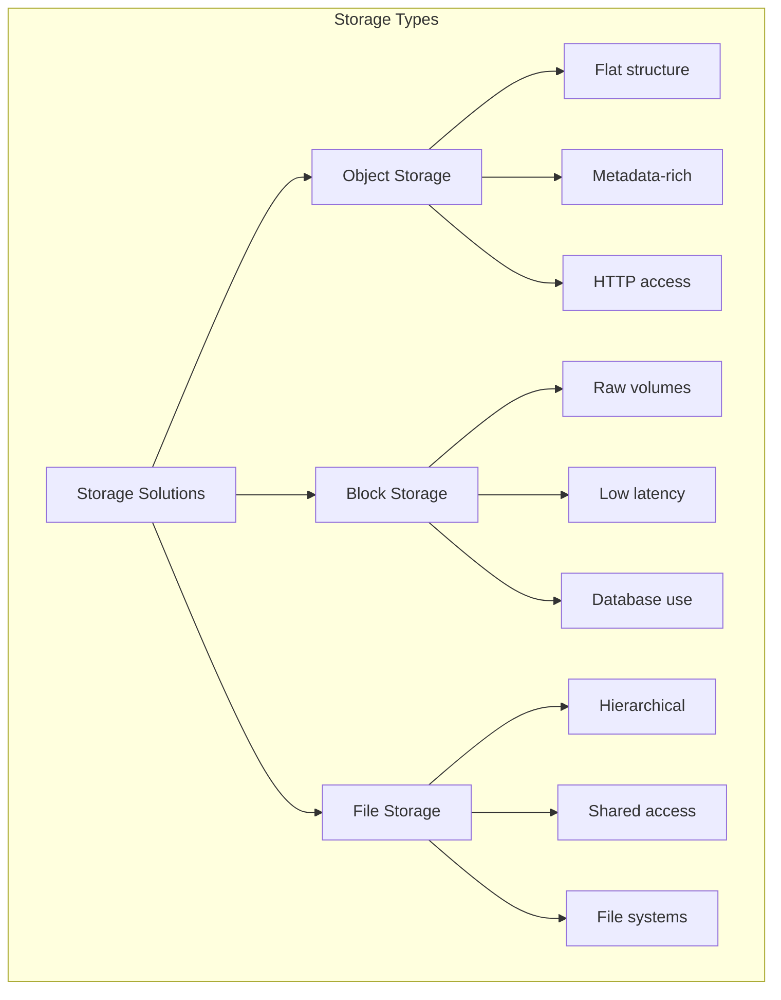

## Object Storage: The Warehouse

### What is it?

Think of **object storage** as a massive warehouse where each item has a unique barcode!

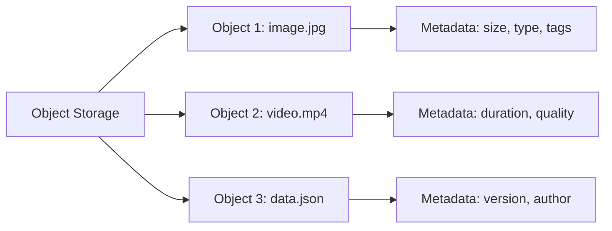

### Characteristics:

- **Flat namespace:** No folders, just buckets and objects
- **Unique ID:** Each object has a unique identifier
- **Metadata:** Rich metadata attached to each object
- **HTTP/REST access:** Access via URLs
- **Durability:** 99.999999999% (11 nines!)

### Real-World Examples:

**AWS S3** (Simple Storage Service)  
**Azure Blob Storage**  
**Google Cloud Storage**  
**MinIO** (open-source)

### Perfect Use Cases:

✅ **Media storage:** Netflix stores all movies/shows  
✅ **Backups:** Long-term archival  
✅ **Data lakes:** Big data analytics  
✅ **Static websites:** Host HTML/CSS/JS  
✅ **Mobile app assets:** Images, videos for apps  
✅ **Log files:** Application logs, analytics  

### How It Works:

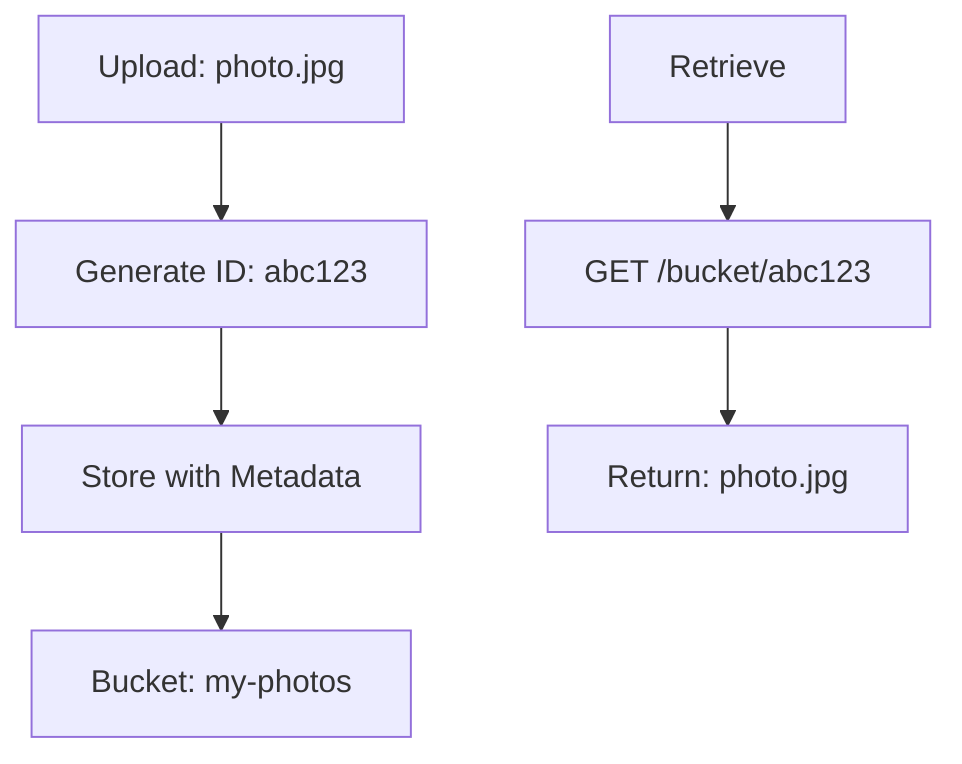

### Example: Photo Sharing App

```
Store:
PUT https://s3.amazonaws.com/my-app/users/123/photo.jpg

Retrieve:
GET https://s3.amazonaws.com/my-app/users/123/photo.jpg

Metadata:
- Size: 2.5 MB
- Uploaded: 2024-10-25
- User: 123
- Tags: vacation, beach
```

### Pros & Cons:

**Pros:**
- 🟢 Unlimited scalability
- 🟢 Extremely durable
- 🟢 Cost-effective for large data
- 🟢 Built-in redundancy
- 🟢 Global accessibility (URLs)
- 🟢 Versioning support

**Cons:**
- 🔴 Can't modify in place (must replace whole object)
- 🔴 Higher latency than block storage
- 🔴 Not suitable for databases
- 🔴 No POSIX file system

## Block Storage: The High-Performance Disk

### What is it?

Think of **block storage** as a raw hard drive attached directly to your computer!

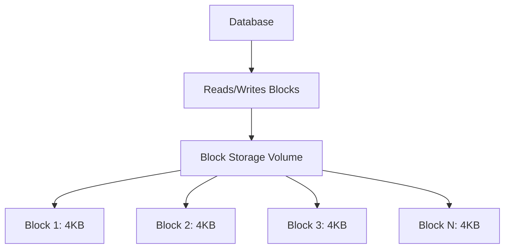

### Characteristics:

- **Raw volumes:** Like a physical hard drive
- **Fixed-size blocks:** Typically 4KB, 8KB, or 16KB
- **Low latency:** Microseconds
- **Single attachment:** Usually one VM at a time
- **File system:** Format with ext4, NTFS, etc.

### Real-World Examples:

**AWS EBS** (Elastic Block Store)  
**Azure Disk Storage**  
**Google Persistent Disks**  
**iSCSI, SAN storage**

### Perfect Use Cases:

✅ **Databases:** MySQL, PostgreSQL, MongoDB  
✅ **Operating systems:** Boot drives for VMs  
✅ **High-performance applications:** Real-time processing  
✅ **Transactional workloads:** E-commerce checkout  
✅ **Virtual machine disks:** VMware, Hyper-V  

### How It Works:

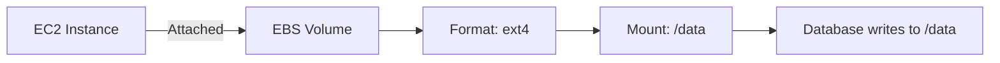

### Example: Database Server

```bash
# Attach EBS volume to EC2
aws ec2 attach-volume --volume-id vol-123 --instance-id i-456

# Format volume
mkfs.ext4 /dev/xvdf

# Mount volume
mount /dev/xvdf /var/lib/mysql

# Database now uses block storage for data
```

### Performance Tiers:

| Type | IOPS | Use Case |
|------|------|----------|
| **HDD** | 500 | Backups, logs |
| **SSD** | 16,000 | General purpose |
| **Provisioned IOPS** | 64,000 | High-performance DBs |
| **NVMe** | 250,000+ | Ultra-low latency |

### Pros & Cons:

**Pros:**
- 🟢 Low latency (microseconds)
- 🟢 High IOPS for databases
- 🟢 Can modify in place
- 🟢 Supports any file system
- 🟢 Snapshot capability

**Cons:**
- 🔴 Limited scalability (max size limits)
- 🔴 Single VM attachment (usually)
- 🔴 More expensive than object storage
- 🔴 Manual management
- 🔴 Not accessible via HTTP

## File Storage: The Shared Network Drive

### What is it?

Think of **file storage** as a shared network folder that multiple people can access!

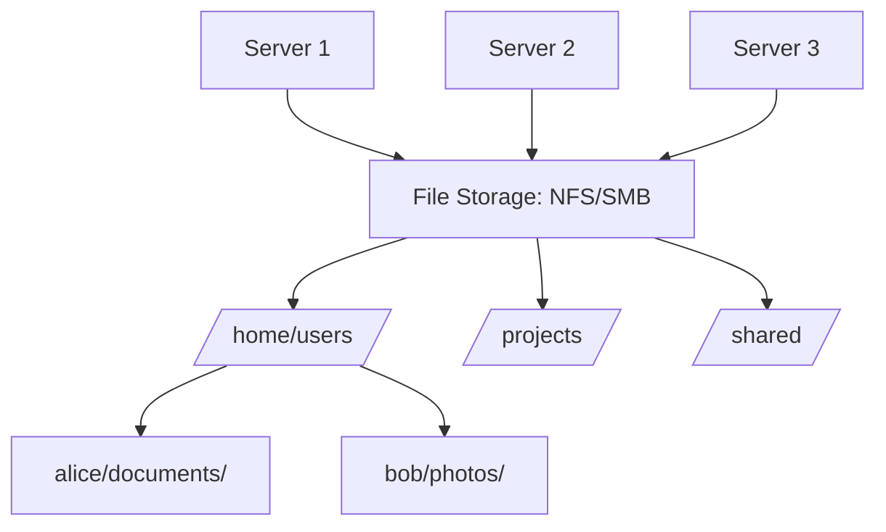

### Characteristics:

- **Hierarchical structure:** Folders and subfolders
- **Shared access:** Multiple servers simultaneously
- **File locking:** Prevents conflicts
- **Protocols:** NFS (Linux), SMB/CIFS (Windows)
- **Permissions:** User/group access control

### Real-World Examples:

**AWS EFS** (Elastic File System)  
**Azure Files**  
**Google Filestore**  
**NetApp, NAS devices**

### Perfect Use Cases:

✅ **Shared application data:** CMS, web apps  
✅ **Home directories:** User files  
✅ **Content management:** WordPress, Drupal  
✅ **Development environments:** Shared code  
✅ **Media workflows:** Video editing teams  
✅ **Container storage:** Shared volumes for Kubernetes  

### How It Works:

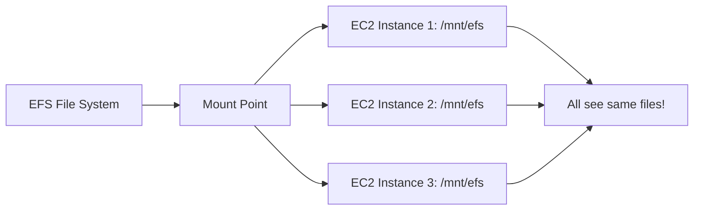

### Example: WordPress Site

```bash
# Multiple web servers share WordPress files
Server 1: mount -t nfs4 fs-123.efs.aws.com:/ /var/www/html
Server 2: mount -t nfs4 fs-123.efs.aws.com:/ /var/www/html
Server 3: mount -t nfs4 fs-123.efs.aws.com:/ /var/www/html

# All servers serve the same content
# Upload plugin on Server 1 → visible on all servers
```

### Performance Classes:

**General Purpose:**
- 1-3 GB/s throughput
- Good for most use cases

**Max I/O:**
- 10+ GB/s throughput
- Big data, media processing

**Bursting:**
- Scales with file system size

### Pros & Cons:

**Pros:**
- 🟢 Multiple simultaneous access
- 🟢 Familiar file/folder structure
- 🟢 POSIX-compliant
- 🟢 Works with existing apps
- 🟢 Auto-scaling

**Cons:**
- 🔴 Higher latency than block storage
- 🔴 More expensive than object storage
- 🔴 Complexity in management
- 🔴 Performance bottlenecks possible

## The Comparison Matrix

| Feature | Object Storage | Block Storage | File Storage |
|---------|----------------|---------------|--------------|
| **Structure** | Flat | Raw blocks | Hierarchical |
| **Access** | HTTP/REST | Block-level | File-level |
| **Latency** | Milliseconds | Microseconds | Milliseconds |
| **Scalability** | Unlimited | Limited | Medium |
| **Cost** | Lowest | Highest | Medium |
| **Use Case** | Archives, media | Databases | Shared apps |
| **Sharing** | Via URL | Single VM | Multi-server |
| **Modify** | Replace whole | In-place | In-place |
| **Durability** | 11 nines | Manual backup | Auto-backup |

## Decision Tree: Which Storage to Choose?

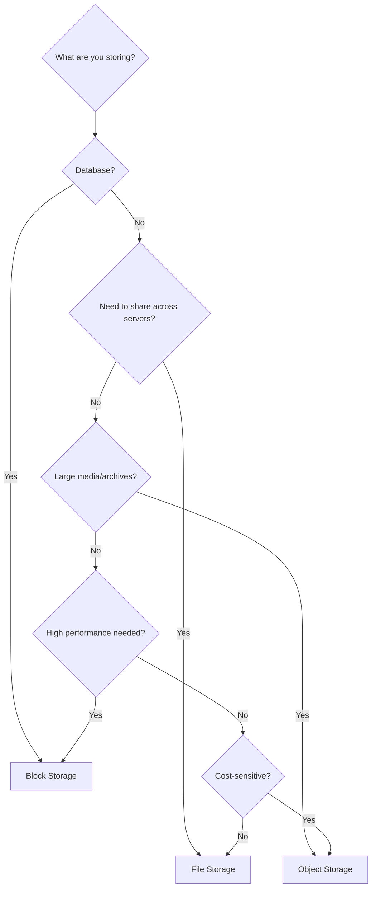

## Real-World Architecture Example

### E-commerce Platform:

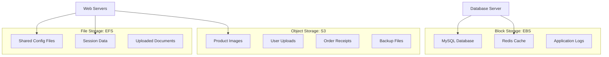

### Why Each Choice?

**Object Storage (S3):**
- Product images: Millions of files, serve via CDN
- Receipts: Archive, rarely accessed
- Backups: Long-term retention

**Block Storage (EBS):**
- MySQL: Needs low latency, high IOPS
- Redis: In-memory cache needs fast disk

**File Storage (EFS):**
- Config: Multiple web servers need same config
- Sessions: Share user sessions across servers

## Cost Comparison Example

**Storing 10 TB for 1 month:**

| Storage Type | AWS Service | Cost/Month |
|--------------|-------------|------------|
| Object | S3 Standard | $230 |
| Object | S3 Infrequent Access | $125 |
| Object | S3 Glacier | $40 |
| Block | EBS gp3 | $800 |
| Block | EBS io2 | $6,500 |
| File | EFS Standard | $3,000 |
| File | EFS Infrequent | $250 |

**Lesson:** Object storage is MUCH cheaper for large datasets!

## Storage Classes Within Object Storage

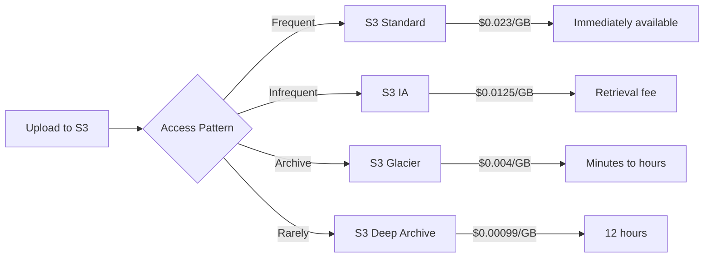

## My Recommendations

### For Startups:

**Default Setup:**
1. **Object Storage (S3)** for:
   - Static assets, media, backups
   - 80% of your data

2. **Block Storage (EBS)** for:
   - Database volumes
   - Application servers

3. **Skip File Storage initially**
   - Add only if you need shared access

### For Specific Scenarios:

**Building a video streaming platform?**
→ Object Storage (S3 + CloudFront CDN)

**Running a high-traffic database?**
→ Block Storage (Provisioned IOPS SSD)

**WordPress site with multiple servers?**
→ File Storage (EFS) for wp-content

**Mobile app backend?**
→ Object Storage (S3) for user uploads

**Real-time analytics?**
→ Block Storage (NVMe) for speed

## Modern Hybrid Approach

Most applications use **all three**!

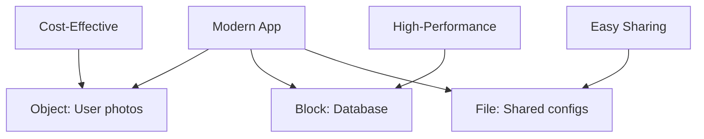

---

## Learning Resources

### Object Storage
- [AWS S3 Documentation](https://docs.aws.amazon.com/s3/) - Complete S3 guide
- [S3 Best Practices](https://docs.aws.amazon.com/AmazonS3/latest/userguide/best-practices.html) - Optimization
- [Google Cloud Storage](https://cloud.google.com/storage/docs) - GCS documentation
- [Object Storage Explained](https://www.youtube.com/results?search_query=object+storage+explained) - Video tutorials

### Block Storage
- [AWS EBS](https://docs.aws.amazon.com/ebs/) - Block storage guide
- [Azure Disk Storage](https://docs.microsoft.com/en-us/azure/virtual-machines/managed-disks-overview) - Microsoft docs
- [Block vs Object Storage](https://www.redhat.com/en/topics/data-storage/file-block-object-storage) - RedHat comparison

### File Storage
- [AWS EFS](https://docs.aws.amazon.com/efs/) - File storage documentation
- [Azure Files](https://docs.microsoft.com/en-us/azure/storage/files/) - Shared file storage
- [NFS Protocol](https://www.cloudflare.com/learning/cdn/glossary/nfs/) - Understanding NFS

### Hands-On Tutorials
- [S3 Getting Started](https://aws.amazon.com/s3/getting-started/) - Create first bucket
- [EBS Workshop](https://catalog.workshops.aws/ebs/) - Interactive lab
- [EFS Tutorial](https://docs.aws.amazon.com/efs/latest/ug/gs-step-one-create-ec2-resources.html) - Step-by-step

### Storage Architecture
- [AWS Storage Services Overview](https://aws.amazon.com/products/storage/) - All storage options
- [Storage Best Practices](https://docs.aws.amazon.com/wellarchitected/latest/framework/a-storage.html) - Well-architected
- [Data Storage Patterns](https://docs.microsoft.com/en-us/azure/architecture/guide/technology-choices/data-store-overview) - Azure patterns

### Cost Optimization
- [S3 Storage Classes](https://aws.amazon.com/s3/storage-classes/) - Choose wisely
- [EBS Pricing](https://aws.amazon.com/ebs/pricing/) - Calculate costs
- [Storage Cost Optimization](https://aws.amazon.com/blogs/storage/cost-optimization/) - Save money

### Performance Tuning
- [EBS Performance](https://docs.aws.amazon.com/AWSEC2/latest/UserGuide/ebs-io-characteristics.html) - IOPS optimization
- [S3 Performance](https://docs.aws.amazon.com/AmazonS3/latest/userguide/optimizing-performance.html) - Scale S3
- [EFS Performance](https://docs.aws.amazon.com/efs/latest/ug/performance.html) - Tune file storage

### Tools & Utilities
- [AWS CLI](https://aws.amazon.com/cli/) - Command-line interface
- [s3cmd](https://s3tools.org/s3cmd) - S3 command line
- [rclone](https://rclone.org/) - Cloud storage sync
- [CloudBerry](https://www.cloudberrylab.com/) - Storage management

### Comparison Guides
- [Storage Types Compared](https://www.youtube.com/results?search_query=block+object+file+storage) - Visual explanations
- [When to Use What](https://cloud.google.com/blog/topics/developers-practitioners/map-storage-options-google-cloud) - Google's guide

### Books
- "AWS Certified Solutions Architect Study Guide" - Covers all storage
- "Cloud Storage Forensics" by Darren Quick
- "Designing Data-Intensive Applications" by Martin Kleppmann

### Communities
- [r/aws](https://www.reddit.com/r/aws/) - AWS discussions
- [AWS Storage Forum](https://repost.aws/topics/storage) - Official forum
- [Stack Overflow](https://stackoverflow.com/questions/tagged/amazon-s3) - Technical Q&A
